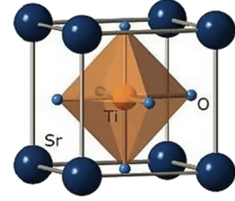
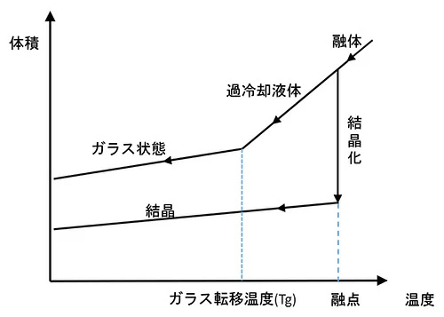
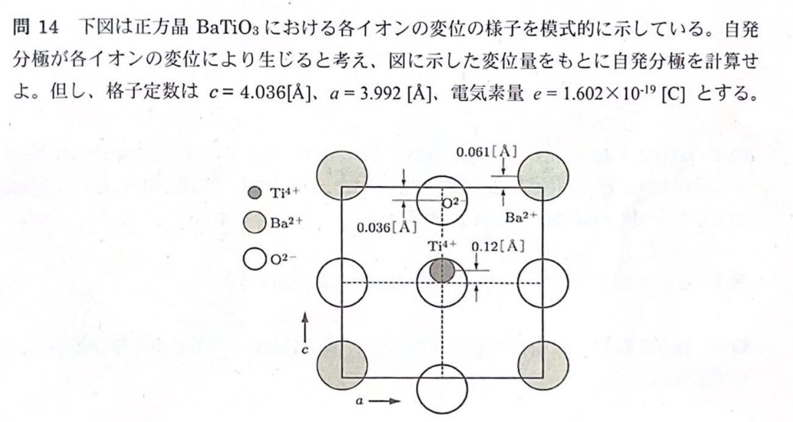

$$
\require{physics}
\require{mhchem}
\require{ams}
$$

結晶構造から欠陥・焼結・破壊、ガラス、機能性セラミックスへ進む順に演習する。各問題は、まず自力で考え、必要なときだけ「理論」を開き、最後に「解答」で確認する。

## 結晶構造とイオン結晶

#### 問題1　FCC の八面体・四面体間隙

半径 $r_0$ の剛体球1種類が面心立方（FCC）構造をとっている。

1. 八面体間隙へ入る、周囲の球を押し広げない最大球の半径 $r$ を求めよ。
2. 四面体間隙へ入る最大球の半径 $r$ を求めよ。

::: {.callout-note collapse="true"}
##### 理論1：接触している球の中心間距離を使う

間隙の大きさは、球の表面ではなく**中心間の幾何**で決める。FCC の格子定数を $a$ とすると、面対角線上で母相の球が接するため

$$
\sqrt{2}a=4r_0,\qquad a=2\sqrt{2}r_0
$$

である。

八面体間隙は立方体中心にあり、最近接の面心までの距離は $a/2$ である。四面体間隙では、辺長 $2r_0$ の正四面体の中心から頂点までの距離 $\sqrt{6}(2r_0)/4$ を使う。どちらも、その距離が $r_0+r$ になる。
:::

::: {.callout-tip collapse="true"}
##### 解答1

八面体間隙では

$$
r_0+r=\frac{a}{2}=\sqrt{2}r_0
$$

より

$$
\boxed{\frac{r}{r_0}=\sqrt{2}-1\simeq0.414}.
$$

四面体間隙では

$$
r_0+r=\frac{\sqrt{6}}{4}(2r_0)
$$

より

$$
\boxed{\frac{r}{r_0}=\frac{\sqrt{6}}{2}-1\simeq0.225}.
$$
:::

#### 問題2　理想 HCP の軸比

同じ大きさの剛体球が最密充填した理想六方最密充填（HCP）構造について、

$$
\frac{c}{a}=1.633
$$

となることを示せ。

::: {.callout-note collapse="true"}
##### 理論2：正四面体の高さが層間隔になる

底面の3球と、そのくぼみに載る1球の中心は正四面体をつくる。正四面体の一辺は、接触球の中心間距離 $a=2r_0$ である。

底面の正三角形の重心から頂点までの水平距離は $a/\sqrt{3}$ である。層間隔を $h$ とすれば

$$
h^2+\qty(\frac{a}{\sqrt{3}})^2=a^2
$$

である。HCP の単位胞の高さ $c$ には、この層間隔が2つ含まれる。
:::

::: {.callout-tip collapse="true"}
##### 解答2

$$
h=a\sqrt{1-\frac13}=a\sqrt{\frac23}
$$

かつ $c=2h$ なので、

$$
\boxed{\frac{c}{a}=2\sqrt{\frac23}=\sqrt{\frac83}=1.633}.
$$
:::

#### 問題3　一次元イオン結晶のマーデルング定数

正負のイオンが最近接距離 $r_0$ で交互に並ぶ、無限に長い一次元イオン結晶を考える。基準イオンから見たクーロン相互作用の和を求め、マーデルング定数 $\alpha$ を示せ。

::: {.callout-note collapse="true"}
##### 理論3：左右2個ずつの交代級数をつくる

基準の陽イオンから距離 $nr_0$ の位置には、左右に2個のイオンがある。奇数番目は異符号で引力、偶数番目は同符号で斥力となる。結晶のクーロンエネルギーを負にする約束で $\alpha>0$ と定義すると、

$$
\alpha=2\qty(1-\frac12+\frac13-\frac14+\cdots)
$$

となる。括弧内は $\ln 2$ の級数である。イオン結晶の静電エネルギーについては、[固体物性学](../3S/固体物性学.qmd)の結晶結合も参照できる。
:::

::: {.callout-tip collapse="true"}
##### 解答3

$$
\alpha
=2\sum_{n=1}^{\infty}\frac{(-1)^{n+1}}{n}
=2\ln 2
$$

したがって

$$
\boxed{\alpha=2\ln 2\simeq1.386}.
$$
:::

#### 問題4　ペロブスカイト型 $\ce{SrTiO3}$

$\ce{SrTiO3}$ の結晶構造を描け。また、イオン半径

$$
r_{\ce{Sr^{2+}}}=1.16\ \text{\AA},\quad
r_{\ce{Ti^{4+}}}=0.68\ \text{\AA},\quad
r_{\ce{O^{2-}}}=1.40\ \text{\AA}
$$

を用い、Pauling の規則と比較して構造の妥当性を論じよ。

::: {.callout-note collapse="true"}
##### 理論4：配位数・結合強度・許容因子を分けて見る

理想立方晶ペロブスカイト $\ce{ABO3}$ では、A イオンは立方体の頂点、B イオンは体心、酸素は面心を占める。B は6個の酸素に囲まれた $\ce{BO6}$ 八面体、A は12配位である。

Pauling の第1則では半径比から配位を見積もる。Ti/O の半径比は $0.486$ で、6配位の範囲 $0.414\sim0.732$ に入る。一方、単純な半径比則だけでは大きな A サイトの12配位を十分に表せないので、ペロブスカイトでは Goldschmidt の許容因子

$$
t=\frac{r_A+r_O}{\sqrt{2}(r_B+r_O)}
$$

も使う。$t=1$ が理想立方晶、概ね $0.8\lesssim t\lesssim1$ なら八面体の傾きを伴うペロブスカイトをとりやすい。

第2則の静電原子価では、各結合の強度を「陽イオン価数/配位数」で数え、陰イオンに届く和が陰イオン価数と一致するか調べる。

{fig-alt="立方体頂点にSr、体心にTi、面心にOを置いたペロブスカイト構造と、Tiを囲む酸素八面体の模式図"}
:::

::: {.callout-tip collapse="true"}
##### 解答4

$\ce{Sr^{2+}}$ は立方体頂点、$\ce{Ti^{4+}}$ は体心、$\ce{O^{2-}}$ は面心に位置する。Ti は6配位、Sr は12配位であり、$\ce{TiO6}$ 八面体が頂点共有する。

$$
\frac{r_{\ce{Ti^{4+}}}}{r_{\ce{O^{2-}}}}=\frac{0.68}{1.40}=0.486
$$

は Ti の6配位と整合する。また、

$$
t=\frac{1.16+1.40}{\sqrt{2}(0.68+1.40)}=0.870
$$

であり、理想立方晶からの歪みはあり得るがペロブスカイトの範囲にある。

Sr–O 結合強度は $2/12=1/6$、Ti–O は $4/6=2/3$ である。1個の O は Sr 4個、Ti 2個に配位するため

$$
4\qty(\frac16)+2\qty(\frac23)=2
$$

となり、$\ce{O^{2-}}$ の価数を満たす。
:::

## 欠陥と粒界

#### 問題5　$\ce{Y2O3}$ を添加した $\ce{ZrO2}$ の欠陥反応

$\ce{ZrO2}$ に $\ce{Y2O3}$ を添加する。次の各場合の欠陥生成反応を Kröger–Vink 記法で示せ。

1. $\ce{Y^{3+}}$ が $\ce{Zr^{4+}}$ サイトを置換する。
2. $\ce{Y^{3+}}$ が格子間位置へ入る。

また、どちらの反応が起きたかを実験で判別する方法を説明せよ。

::: {.callout-note collapse="true"}
##### 理論5：有効電荷の帳尻を合わせる

上付きの $x$ は基準格子に対して中性、$\prime$ は有効負電荷1個、$\bullet$ は有効正電荷1個を表す。

$\ce{Y^{3+}}$ が $\ce{Zr^{4+}}$ を置換すると $Y_{\mathrm{Zr}}^\prime$ となる。この負電荷2個を、正の有効電荷2個をもつ酸素空孔 $V_{\mathrm O}^{\bullet\bullet}$ で補償できる。格子間 $\ce{Y^{3+}}$ は $Y_i^{\bullet\bullet\bullet}$ であり、電子 $e^\prime$ による補償が必要になる。

反応式だけでは実在位置を断定できない。置換型なら酸素空孔に由来する酸化物イオン伝導、格子間型なら電子伝導が現れるため、導電率の温度・酸素分圧依存性で区別できる。中性子回折や X 線吸収微細構造で占有位置を直接調べれば、さらに確実である。
:::

::: {.callout-tip collapse="true"}
##### 解答5

置換型では

$$
\boxed{
\ce{Y2O3}
\rightarrow
2Y_{\mathrm{Zr}}^\prime
+V_{\mathrm O}^{\bullet\bullet}
+3O_{\mathrm O}^{\times}
}.
$$

格子間型を電子補償で表すと

$$
\boxed{
\ce{Y2O3}
\rightarrow
2Y_i^{\bullet\bullet\bullet}
+3O_{\mathrm O}^{\times}
+6e^\prime
}.
$$

交流インピーダンス測定と酸素分圧依存性から酸化物イオン伝導と電子伝導を分離し、必要なら中性子回折・EXAFS で Y の占有サイトと酸素空孔を確認する。酸素空孔と高い酸化物イオン伝導が観測されれば置換型を支持する。
:::

#### 問題6　セラミックス中の転位

金属と比較しながら、セラミックス中の転位の特徴を説明せよ。

::: {.callout-note collapse="true"}
##### 理論6：すべるには結合と電荷の制約を同時に越える

金属結合は方向性が弱く、原子面がずれても結合を組み替えやすい。イオン結晶では同符号イオンが向き合うすべりを避け、局所的な電気的中性も保つ必要がある。共有結合性の強い結晶では結合方向そのものがすべりを制限する。

そのためセラミックスでは、転位の格子抵抗が大きく、室温で活動できるすべり系が少ない。転位芯が帯電し、点欠陥や不純物を引き寄せることもある。高温では熱活性化によって転位運動やクリープが可能になる。転位の応力場と運動の基礎は[材料強度学](../3S/材料強度学.qmd)へつながる。
:::

::: {.callout-tip collapse="true"}
##### 解答6

セラミックスはイオン結合・共有結合の方向性と電荷中性条件のため、転位移動の格子抵抗が大きく、室温で活動できるすべり系が少ない。転位芯は帯電して点欠陥を伴う場合もある。したがって金属より塑性変形しにくく脆性破壊しやすいが、高温では熱活性化により転位すべりやクリープが起こる。
:::

#### 問題7　対応粒界とセラミックス設計

対応粒界（coincidence-site lattice grain boundary）を説明し、セラミックス開発で粒界が重要になる理由を述べよ。

::: {.callout-note collapse="true"}
##### 理論7：方位差が特別なとき、両結晶の格子点が周期的に重なる

2つの結晶粒を特定の軸まわりに回転すると、両者の格子点の一部が周期的に一致する場合がある。この共通格子が coincidence-site lattice（CSL）である。全格子点に対する一致点の逆数を $\Sigma$ 値で表し、一般に低い $\Sigma$ の特殊粒界は乱れが小さく、粒界エネルギーも低い。

セラミックスでは粒界が、焼結時の拡散路と粒成長、亀裂進展、クリープ、イオン・電子の伝導、絶縁破壊を左右する。したがって粒径だけでなく、粒界方位、偏析、第二相を制御することが材料設計になる。
:::

::: {.callout-tip collapse="true"}
##### 解答7

対応粒界とは、特定の方位関係にある隣接結晶の格子点の一部が周期的に一致し、共通格子をつくる粒界である。一致点密度は $\Sigma$ 値で表され、低 $\Sigma$ 粒界は一般粒界より低エネルギーになりやすい。粒界は焼結・粒成長、破壊、クリープ、伝導、偏析を支配するため、粒界性格と化学組成の制御がセラミックスの強度・機能・信頼性を決める。
:::

## 焼結と組織形成

#### 問題8　焼結段階と気孔の消滅

焼結を初期・中期・終期に分け、それぞれで支配的な物質移動、ネック、密度、開気孔・閉気孔、粒成長の関係を説明せよ。最終密度を高めるための温度制御にも触れよ。

::: {.callout-note collapse="true"}
##### 理論8：表面積を減らす経路と、緻密化する経路を区別する

焼結の駆動力は表面・界面エネルギーの低下である。初期には粒子接触部へ原子が移動してネックができる。表面拡散はネックを成長させるが、粒子中心を近づけないため、それだけでは十分に緻密化しない。

中期には粒界拡散や格子拡散で粒子間距離が縮み、密度が大きく増す。気孔は初期・中期には外部へつながる開気孔だが、やがて孤立した閉気孔となり終期へ入る。

閉気孔が粒内へ取り残されると、消滅には遅い格子拡散が必要になる。粒成長を先行させず、気孔を粒界に保ったまま外へ排出する温度履歴が重要である。拡散と反応速度の考え方は[材料反応工学](../3S/材料反応工学.qmd)、組織発達との競合は[組織生成論](../3S/組織生成論.qmd)にもつながる。
:::

::: {.callout-tip collapse="true"}
##### 解答8

- 初期：主に表面拡散で粒子接触部にネックが形成される。気孔は開気孔で、緻密化は小さい。
- 中期：粒界拡散または格子拡散により粒子中心が接近し、密度が最も増加する。気孔は次第に細くなるが、なお外部へ連結する。
- 終期：気孔が閉気孔となり、収縮・消滅する。粒内気孔の除去には遅い格子拡散が必要になる。

したがって、粒成長で気孔を粒内へ取り込む前に緻密化を進め、気孔を粒界上に保って排出できるよう、過度な高温保持を避けた焼成温度・時間を選ぶ。
:::

## 破壊と高靱化

#### 問題9　微構造による高靱化

セラミックスの破壊靱性を微構造制御によって高める方法を3つ挙げ、それぞれの機構を説明せよ。

::: {.callout-note collapse="true"}
##### 理論9：亀裂先端を遮蔽し、進展に余分な仕事を使わせる

脆性材料の亀裂は、先端の応力拡大が破壊抵抗に達すると進む。高靱化では、亀裂先端に実際に届く駆動力を下げるか、亀裂が進む経路を長くしてエネルギーを消費させる。

代表例は次の3つである。

1. **相変態強化**：正方晶 $\ce{ZrO2}$ 粒子が亀裂先端で単斜晶へ変態し、体積膨張による圧縮応力で亀裂を閉じる。
2. **亀裂偏向・マイクロクラック強化**：粒界や第二相で亀裂を曲げたり分岐させたりし、必要な破面面積を増やす。
3. **架橋・引抜き**：繊維やウィスカーが亀裂面をまたぎ、引抜き摩擦と破断にエネルギーを消費する。

破壊力学の $K$、欠陥寸法、信頼性との関係は[材料強度学](../3S/材料強度学.qmd)と[信頼性学](信頼性学.qmd)で扱う。
:::

::: {.callout-tip collapse="true"}
##### 解答9

1. 相変態強化：分散した正方晶 $\ce{ZrO2}$ が亀裂先端で単斜晶化し、体積膨張による圧縮応力で亀裂を遮蔽する。
2. 亀裂偏向：粒界・第二相で亀裂を屈曲・分岐させ、破面形成に必要なエネルギーを増す。
3. 繊維・ウィスカー架橋：補強相が亀裂面を橋渡しし、引抜き摩擦と破断によって進展エネルギーを消費する。
:::

#### 問題10　R カーブ

セラミックスの R カーブを簡潔に説明せよ。

::: {.callout-note collapse="true"}
##### 理論10：材料の破壊抵抗が亀裂長さとともに変わる

R カーブは、亀裂進展量 $\Delta a$ に対して材料の亀裂進展抵抗 $K_R$ または $G_R$ を描いた曲線である。均質な理想脆性材ではほぼ一定だが、亀裂後方の架橋、相変態、マイクロクラックなどの遮蔽域が発達すると上昇型になる。

外力側の駆動力曲線と R カーブの交点が進展条件となり、接線条件を越えると不安定破壊する。「初期靱性」と「十分進展した後の靱性」を区別する点が重要である。
:::

::: {.callout-tip collapse="true"}
##### 解答10

R カーブは、亀裂進展量に対する破壊抵抗 $K_R$ または $G_R$ の変化を表す。架橋・相変態などの亀裂遮蔽が発達する材料では、亀裂の成長とともに抵抗が増す上昇型 R カーブとなり、安定亀裂成長が可能になる。
:::

## ガラス

#### 問題11　工業ガラスの組成

工業ガラスに $\ce{SiO2}$ が多く含まれる理由を説明せよ。また、窓ガラスに $\ce{SiO2}$ 以外の成分が必要な理由を述べよ。

::: {.callout-note collapse="true"}
##### 理論11：網目をつくる成分と、加工温度を下げる成分が必要

$\ce{SiO2}$ は $\ce{SiO4}$ 四面体が頂点共有して三次元網目をつくる代表的な網目形成酸化物である。透明性、化学耐久性、耐熱性に優れ、原料も豊富である。

ただし純粋な石英ガラスは軟化温度が高く、溶融粘度も非常に大きいため、通常の窓材として溶融・成形するには多大なエネルギーが要る。$\ce{Na2O}$ などの網目修飾酸化物は Si–O–Si 結合を切って非架橋酸素をつくり、粘度と融点を下げる。$\ce{CaO}$ は、水に弱くなったアルカリケイ酸塩網目を安定化する。
:::

::: {.callout-tip collapse="true"}
##### 解答11

$\ce{SiO2}$ は安定な三次元網目を形成し、透明性・化学耐久性・耐熱性に優れ、資源も豊富なので工業ガラスの主成分となる。一方、純 $\ce{SiO2}$ は軟化温度と溶融粘度が高く成形しにくい。窓ガラスでは $\ce{Na2O}$ で融点・粘度を下げ、$\ce{CaO}$ で化学耐久性を補うため、他成分が必要である。
:::

#### 問題12　ガラス転移温度と冷却速度

ガラス転移温度 $T_g$ と冷却速度の関係を説明せよ。

::: {.callout-note collapse="true"}
##### 理論12：構造緩和が観測時間に追いつかなくなる温度

液体を冷却すると原子配置の緩和時間は急増する。緩和時間が実験の観測時間より長くなると、構造が平衡液体を追えずガラスとして凍結する。この折れ曲がりを示す温度が見かけの $T_g$ であり、熱力学的に一意な相転移温度ではない。

冷却が速いほど構造が緩和する時間が短く、より高温で平衡から外れるため、見かけの $T_g$ は高くなる。ゆっくり冷却すれば低温まで緩和できるため $T_g$ は低くなる。
:::

::: {.callout-tip collapse="true"}
##### 解答12

ガラス転移は構造緩和時間と観測時間の競合で決まる。冷却速度が大きいほど構造が高温で凍結するので、測定される $T_g$ は高くなる。徐冷では低温まで平衡構造を追えるため、$T_g$ は低くなる。

{fig-alt="縦軸に体積、横軸に温度をとり、液体からガラスへ折れ曲がる線、結晶化する線、ガラス転移温度と融点を示したグラフ"}
:::

#### 問題13　ガラスの熱伝導率

ガラスの熱伝導率が結晶性固体より大幅に低くなる理由を説明せよ。

::: {.callout-note collapse="true"}
##### 理論13：無秩序が格子振動の伝搬距離を短くする

絶縁体の熱は主に格子振動が運ぶ。気体分子運動論に似た近似では

$$
\kappa\simeq\frac13 C_v v\ell
$$

と書ける。ここで $C_v$ は単位体積当たりの熱容量、$v$ は振動の伝搬速度、$\ell$ は平均自由行程である。

結晶には長距離の周期性があり、低散乱のフォノンが比較的長く進める。ガラスでは結合長・結合角・局所構造が不規則で、振動が強く散乱され、一部は局在するため $\ell$ が短い。その結果、同程度の熱容量でも $\kappa$ が小さくなる。
:::

::: {.callout-tip collapse="true"}
##### 解答13

ガラスには長距離周期性がなく、結合長・結合角の乱れが格子振動を強く散乱・局在化させる。したがって

$$
\kappa\simeq\frac13 C_vv\ell
$$

における平均自由行程 $\ell$ が結晶より短くなり、熱伝導率が低下する。
:::

## 機能性セラミックス

#### 問題14　代表的な電子セラミックス

次の材料・素子を、それぞれ簡潔に説明せよ。

1. 積層セラミックコンデンサ
2. 圧電セラミックス
3. バリスタ

::: {.callout-note collapse="true"}
##### 理論14：誘電・圧電・非線形伝導を使い分ける

コンデンサの静電容量は $C=\epsilon A/d$ であり、誘電率 $\epsilon$ と電極面積 $A$ を大きく、誘電体厚さ $d$ を小さくすると増える。薄い誘電体層と内部電極を交互に積み、各層を並列接続すれば小型で大容量になる。

圧電体では、力による分極変化から電圧が生じる直接圧電効果と、電場により歪む逆圧電効果がある。分極方向を揃えるポーリング処理が必要である。

ZnO バリスタでは、半導体粒子間の粒界障壁が低電圧で電流を抑え、高電圧で急激に伝導する。粒界が機能そのものを担う例である。
:::

::: {.callout-tip collapse="true"}
##### 解答14

1. 積層セラミックコンデンサ：$\ce{BaTiO3}$ などの薄い誘電体層と内部電極を交互に積層・並列接続し、小体積で大容量を得る素子。
2. 圧電セラミックス：応力を電荷へ変換する直接効果と、電場を歪みへ変換する逆効果を示し、センサ・アクチュエータに用いる材料。
3. バリスタ：ZnO 粒界などの電位障壁による非線形電流–電圧特性を利用し、過電圧時だけ電流を流して回路を保護する素子。
:::

#### 問題15　$\ce{BaTiO3}$ の PTC 効果

$\ce{BaTiO3}$ セラミックスで、キュリー温度付近から抵抗率が急増する PTC（positive temperature coefficient）効果の機構を説明せよ。

::: {.callout-note collapse="true"}
##### 理論15：半導体粒内と絶縁性粒界の組合せ

PTC 材料では、ドナー添加や還元で粒内を半導体化し、粒界にはアクセプタ準位をもつ高抵抗層を形成する。粒界に捕獲された電荷は空乏層と Schottky 障壁をつくり、粒界を越える電流を制限する。

強誘電相では $\ce{BaTiO3}$ の誘電率が非常に大きく、空間電荷が遮蔽されて障壁は比較的低い。キュリー温度を越えて常誘電相になると誘電率が急減し、粒界障壁が高くなるため抵抗率が急増する。
:::

::: {.callout-tip collapse="true"}
##### 解答15

半導体化した $\ce{BaTiO3}$ 粒子の粒界には、捕獲電荷による空乏層と Schottky 障壁が形成される。キュリー温度以上で強誘電相から常誘電相へ移ると誘電率が急減し、粒界障壁が高くなる。そのため粒界伝導が抑えられ、抵抗率が急増して PTC 特性を示す。
:::

#### 問題16　正方晶 $\ce{BaTiO3}$ の自発分極

図に示す正方晶 $\ce{BaTiO3}$ のイオン変位から、自発分極 $P_s$ を求めよ。格子定数は

$$
c=4.036\ \text{\AA},\qquad a=3.992\ \text{\AA}
$$

とし、電気素量は $e=1.602\times10^{-19}\ \mathrm{C}$ とする。

{fig-alt="BaTiO3の単位胞内でTi4+が0.12オングストローム、Ba2+が0.061オングストローム上向き、O2-が0.036オングストローム下向きに変位する模式図"}

::: {.callout-note collapse="true"}
##### 理論16：単位胞の双極子モーメントを体積で割る

分極は単位体積当たりの電気双極子モーメントである。

$$
P_s=\frac{p}{V},\qquad p=\sum_i q_i\Delta z_i
$$

正方晶ペロブスカイトの単位胞には、実効的に Ba が1個、Ti が1個、O が3個含まれる。図の変位を上向き正とすると、負電荷の O が下向きに動く寄与も、双極子モーメントには正に加わる。

一様に原点をずらしても、単位胞の全電荷が0なので $p$ は変わらない。Å を m に直し、単位胞体積 $V=a^2c$ を使う。
:::

::: {.callout-tip collapse="true"}
##### 解答16

図の変位量が3個の O に共通するとして、単位胞の双極子モーメントは

$$
\begin{aligned}
p
&=e\qty[
4(0.12)+2(0.061)+3(-2)(-0.036)
]\times10^{-10}\\
&=0.818e\times10^{-10}\\
&=1.310\times10^{-29}\ \mathrm{C\,m}.
\end{aligned}
$$

単位胞体積は

$$
V=(3.992\times10^{-10})^2(4.036\times10^{-10})
=6.431\times10^{-29}\ \mathrm{m^3}.
$$

したがって

$$
\boxed{
P_s=\frac{p}{V}
=2.04\times10^{-1}\ \mathrm{C\,m^{-2}}
}.
$$
:::

## 総合設計

#### 問題17　曜変天目の再現

国宝の曜変天目茶碗を、現代のセラミックス科学を用いて再現するには、どのような方針で研究すべきか論じよ。

::: {.callout-note collapse="true"}
##### 理論17：組成・熱履歴・雰囲気・微構造を逆問題として解く

外観だけを模倣しても、同じ発色機構を再現したことにはならない。釉薬の元素組成、結晶相、酸化状態、気孔、表面のナノ構造を非破壊・微小領域分析で調べ、それらを生んだ焼成条件を推定する必要がある。

国宝そのものには、蛍光 X 線、ラマン分光、反射分光、X 線回折などの非破壊分析を優先する。侵襲的な断面観察が必要なら、同系統の陶片や再現試料を使う。Fe・Ti を含む釉の酸化還元、相分離、微結晶析出、薄膜干渉は、温度、保持時間、酸素分圧、冷却速度に敏感である。

そこで組成と焼成条件を実験計画法で振り、色・構造・再現性を対応づける。単発の成功ではなく、同じ結果が得られる工程窓を決めることが工学的な再現である。
:::

::: {.callout-tip collapse="true"}
##### 解答17

まず蛍光 X 線、ラマン分光、反射分光、X 線回折などで国宝を非破壊分析し、釉の元素組成、Fe の酸化状態、結晶相、光学応答を特定する。断面観察は関連陶片または再現試料に限定する。次に原料組成、施釉厚さ、最高温度、保持時間、酸素分圧、冷却速度を系統的に変え、相分離・微結晶析出・薄膜干渉と発色の対応を SEM-EDS、XRD、分光測定で評価する。得られた因果関係から、曜変を再現可能な組成範囲と焼成工程窓を確立する。
:::
