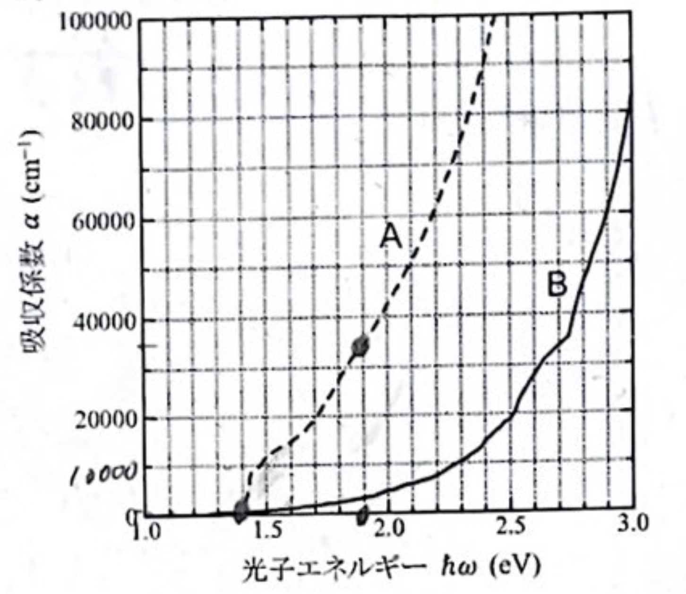
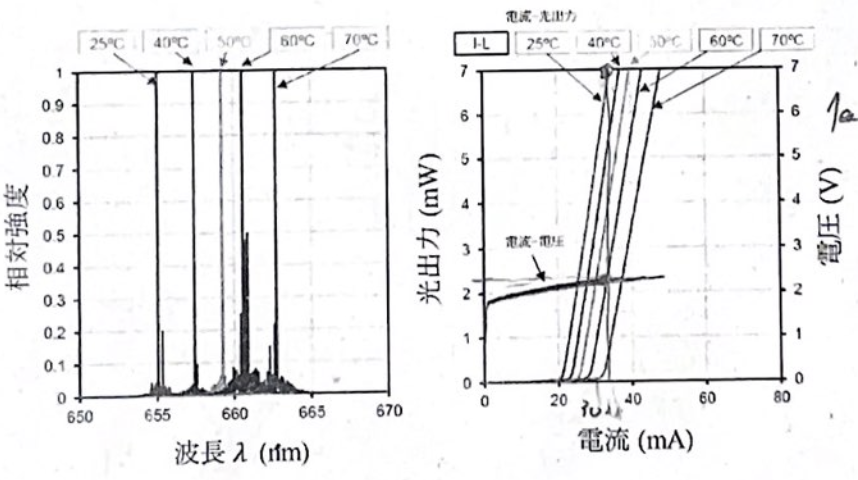
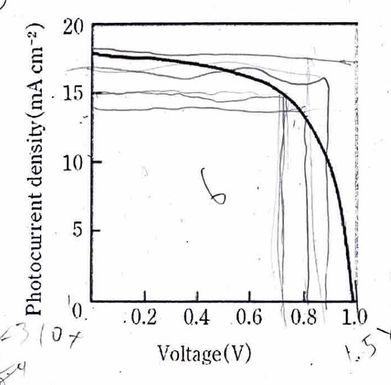

$$
\require{physics}
$$

この記事では、キャリア統計から光吸収・発光・太陽電池へ進む。各問題を先に考え、必要な理論を開き、最後に模範解答を確認する。

## 半導体のキャリア

#### 問題1　真性キャリア密度とフェルミ準位 {#prob-intrinsic-carrier}

1. 非縮退半導体の真性キャリア密度 $n_i$ を式で表し、禁制帯幅 $E_g$ への依存性を述べよ。
2. キャリア密度の温度依存性から $E_g$ を測定する方法を説明せよ。
3. $N_V=4N_C$ のとき、真性フェルミ準位は禁制帯中央からどちらへ、どれだけずれるか。$T=300\ \mathrm{K}$ とせよ。

::: {.callout-note collapse="true"}
##### 理論1：状態数と占有確率を掛ける

伝導帯の電子濃度は、状態密度とFermi–Dirac分布の積を積分して得る。$E_C-E_F\gg k_BT$ の非縮退近似では

$$
n=N_C\exp\left(-\frac{E_C-E_F}{k_BT}\right),\qquad
p=N_V\exp\left(-\frac{E_F-E_V}{k_BT}\right).
$$

両式を掛けるとFermi準位が消え、質量作用則

$$
np=N_CN_V\exp\left(-\frac{E_g}{k_BT}\right)=n_i^2
$$

を得る。真性半導体では $n=p=n_i$ である。なお $N_C,N_V\propto T^{3/2}$ なので、Arrheniusプロットで高精度に $E_g$ を求めるときはこの温度依存性も除く。
:::

::: {.callout-tip collapse="true"}
##### 解答1

1.

   $$
   n_i=\sqrt{N_CN_V}\exp\left(-\frac{E_g}{2k_BT}\right).
   $$

   同温度なら $E_g$ が大きいほど $n_i$ は指数関数的に小さくなる。

2.

   $$
   \ln\left(\frac{n_i}{T^{3/2}}\right)
   =\text{const.}-\frac{E_g}{2k_B}\frac1T
   $$

   を用い、$\ln(n_i/T^{3/2})$ を $1/T$ に対してプロットする。直線の傾き $m$ から $E_g=-2k_Bm$ を得る。

3. 真性Fermi準位は

   $$
   E_i=\frac{E_C+E_V}{2}+\frac{k_BT}{2}\ln\left(\frac{N_V}{N_C}\right)
   $$

   なので、$N_V=4N_C$ では中央より伝導帯側へ

   $$
   \Delta E=k_BT\ln2=1.79\times10^{-2}\ \mathrm{eV}
   $$

   ずれる。
:::

#### 問題2　ドナーの不完全イオン化 {#prob-donor-ionization}

$T=300\ \mathrm{K}$ のSiへ、ドナーを $N_D=1.00\times10^{16}\ \mathrm{cm^{-3}}$ 添加した。中性ドナー密度は

$$
n_d=\frac{N_D}{1+\frac12\exp\left(\frac{E_D-E_F}{k_BT}\right)}
$$

で与えられる。$N_C=2.80\times10^{19}\ \mathrm{cm^{-3}}$、$E_C-E_D=45\ \mathrm{meV}$ とし、正孔を無視して、中性のまま残るドナーの割合を求めよ。

::: {.callout-note collapse="true"}
##### 理論2：電荷中性条件でFermi準位を決める

「ドナーを入れたから電子濃度は必ず $N_D$」ではない。中性ドナーは電子を束縛しており、イオン化したドナーだけが伝導電子を供給する。正孔とアクセプターを無視すれば

$$
n=N_D^+=N_D-n_d
$$

が電荷中性条件である。これと

$$
n=N_C\exp\left(-\frac{E_C-E_F}{k_BT}\right)
$$

を連立する。
:::

::: {.callout-tip collapse="true"}
##### 解答2

$y=\exp[(E_F-E_D)/(k_BT)]$、$A=N_C\exp[-(E_C-E_D)/(k_BT)]$ と置くと

$$
n=Ay,\qquad \frac{n_d}{N_D}=\frac{y}{y+1/2}.
$$

電荷中性条件 $Ay=N_D/[2(y+1/2)]$ を解く。$k_BT=25.85\ \mathrm{meV}$ より $A=4.91\times10^{18}\ \mathrm{cm^{-3}}$、したがって

$$
\frac{n_d}{N_D}\\\simeq4.1\times10^{-3}.
$$

中性ドナーは約 $0.41\%$、すなわち約 $99.6\%$ がイオン化している。
:::

#### 問題3　導電率とドーピング後のキャリア密度 {#prob-conductivity}

1. キャリア密度 $n,p$、移動度 $\mu_n,\mu_p$ を用いて半導体の導電率を表せ。
2. ドナー濃度 $N_D$、アクセプター濃度 $N_A$ の非縮退半導体について、完全イオン化を仮定して電子濃度 $n$ を求めよ。真性キャリア密度を $n_i$ とする。

::: {.callout-note collapse="true"}
##### 理論3：輸送式と電荷の帳簿を分ける

電場 $E$ に対するドリフト速度は $v_d=\mu E$ であり、電子と正孔の電流密度を足すと

$$
j=q(n\mu_n+p\mu_p)E.
$$

一方、平衡キャリア密度は、電荷中性条件

$$
n+N_A^-=p+N_D^+
$$

と質量作用則 $np=n_i^2$ で決める。完全イオン化なら $N_D^+=N_D$、$N_A^-=N_A$ である。
:::

::: {.callout-tip collapse="true"}
##### 解答3

1.

   $$
   \sigma=q(n\mu_n+p\mu_p),\qquad \rho=\sigma^{-1}.
   $$

2. $p=n_i^2/n$ を $n+N_A=p+N_D$ へ代入すると

   $$
   n^2-(N_D-N_A)n-n_i^2=0.
   $$

   物理的な正根を選び、

   $$
   n=\frac{(N_D-N_A)+\sqrt{(N_D-N_A)^2+4n_i^2}}{2},
   \qquad p=\frac{n_i^2}{n}.
   $$
:::

## 光吸収

#### 問題4　結合状態密度と直接・間接遷移 {#prob-jdos}

放物線バンド

$$
E_c(k)=E_g+\frac{\hbar^2k^2}{2m_e^*},\qquad
E_v(k)=-\frac{\hbar^2k^2}{2m_h^*}
$$

をもつ半導体を考える。

1. 光学遷移で、ほぼ同じ波数をもつ価電子帯状態と伝導帯状態の組合せを考えればよい理由を述べよ。
2. 単位体積当たりの結合状態密度

   $$
   J_{cv}(E)=\frac1V\sum_{\boldsymbol{k}}\delta\left(E_c(\boldsymbol{k})-E_v(\boldsymbol{k})-E\right)
   $$

   を求めよ。
3. 図の吸収曲線A、BをGaAs、Siへ対応させ、吸収端の違いを説明せよ。
4. 各材料について、$E_g+0.5\ \mathrm{eV}$ の光を99%吸収するために必要な厚さを図から概算せよ。

{fig-alt="吸収係数を縦軸、光子エネルギーを横軸としたグラフ。Aは約1.4 eVから急増し、Bは約1.1 eVから緩やかに増加する。"}

::: {.callout-note collapse="true"}
##### 理論4：光子はエネルギーを運ぶが運動量は小さい

可視光の波数はBrillouin zoneの尺度に比べて小さいため、光子だけの遷移では結晶運動量がほぼ保存され、$\boldsymbol{k}_c\\\simeq\boldsymbol{k}_v$ となる。伝導帯底と価電子帯頂上が同じ波数にある直接遷移型では光子だけで遷移できる。異なる波数にある間接遷移型ではフォノンも必要になる。

二つの放物線の差は

$$
E_c-E_v=E_g+\frac{\hbar^2k^2}{2\mu},\qquad
\frac1\mu=\frac1{m_e^*}+\frac1{m_h^*}
$$

である。三次元 $k$ 空間の殻の状態数 $4\pi k^2\dd k$ をエネルギーへ変数変換すると、吸収端上の平方根依存性が現れる。
:::

::: {.callout-tip collapse="true"}
##### 解答4

1. 光子の運動量 $\hbar K$ は結晶電子の結晶運動量に比べて小さいため、光子吸収では $\boldsymbol{k}_c=\boldsymbol{k}_v+\boldsymbol{K}\\\simeq\boldsymbol{k}_v$ となる。

2. スピン縮退を含めると

   $$
   J_{cv}(E)=\frac1{2\pi^2}\left(\frac{2\mu}{\hbar^2}\right)^{3/2}\sqrt{E-E_g}\,\Theta(E-E_g).
   $$

3. Aは吸収端が急峻な直接遷移型GaAs、Bはフォノンを必要とし立ち上がりが緩やかな間接遷移型Siである。

4. Beer–Lambert則 $I/I_0=e^{-\alpha x}$ より

   $$
   x=\frac{\ln100}{\alpha}.
   $$

   図から、Siでは $E\\\simeq1.6\ \mathrm{eV}$ で $\alpha\\\simeq10^3\ \mathrm{cm^{-1}}$、GaAsでは $E\\\simeq1.9\ \mathrm{eV}$ で $\alpha\\\simeq3\times10^4\ \mathrm{cm^{-1}}$ と読める。したがって

   $$
   x_{\mathrm{Si}}\\\simeq4.6\times10^{-3}\ \mathrm{cm}=46\ \mathrm{\mu m},
   $$

   $$
   x_{\mathrm{GaAs}}\\\simeq1.5\times10^{-4}\ \mathrm{cm}=1.5\ \mathrm{\mu m}.
   $$
:::

## 発光デバイス

#### 問題5　再結合寿命と内部量子効率 {#prob-internal-qe}

1. 間接遷移型半導体が発光デバイスに不向きな理由を説明せよ。
2. Siの発光再結合寿命を $\tau_r=10^{-3}\ \mathrm{s}$、非発光再結合寿命を $\tau_{nr}=10^{-6}\ \mathrm{s}$ とする。GaAsではそれぞれ $10^{-9}\ \mathrm{s}$、$10^{-7}\ \mathrm{s}$ とする。内部量子効率を求めよ。

::: {.callout-note collapse="true"}
##### 理論5：競争する再結合速度の比を取る

過剰キャリアは発光再結合と非発光再結合の並列経路で減衰する。

$$
\dv{\Delta n}{t}
=-\frac{\Delta n}{\tau_r}-\frac{\Delta n}{\tau_{nr}}.
$$

単位時間当たりの発光再結合の割合は、発光速度を全再結合速度で割って

$$
\eta_{int}=\frac{1/\tau_r}{1/\tau_r+1/\tau_{nr}}
=\frac{\tau_{nr}}{\tau_r+\tau_{nr}}
$$

となる。
:::

::: {.callout-tip collapse="true"}
##### 解答5

1. 間接遷移では、電子と正孔の再結合に光子だけでなく運動量を補うフォノンも必要である。遷移確率が小さく発光寿命が長いため、その間に欠陥などを介した非発光再結合が起こりやすい。

2.

   $$
   \eta_{int}^{\mathrm{Si}}=\frac{10^{-6}}{10^{-3}+10^{-6}}\\simeq9.99\times10^{-4},
   $$

   $$
   \eta_{int}^{\mathrm{GaAs}}=\frac{10^{-7}}{10^{-9}+10^{-7}}\\simeq0.990.
   $$
:::

#### 問題6　発光デバイスの効率 {#prob-led-efficiency}

図の赤色発光デバイスについて、$25\,\mathrm{^\circ C}$、電流 $I=33\ \mathrm{mA}$ における次の量をグラフから概算せよ。

1. パワー変換効率 $P_{out}/(VI)$
2. スロープ効率 $\dv{P_{out}}{I}$
3. 外部微分量子効率

{fig-alt="左に650から670 nmの発光スペクトル、右に温度別の電流光出力曲線と電流電圧曲線を示す。"}

::: {.callout-note collapse="true"}
##### 理論6：電力の比と粒子数の比を区別する

パワー変換効率はエネルギー流の比、外部量子効率は電子数と光子数の比である。

$$
\eta_P=\frac{P_{out}}{VI},\qquad
\eta_{ext,d}=\frac{q}{h\nu}\dv{P_{out}}{I}
=\frac{q\lambda}{hc}\dv{P_{out}}{I}.
$$

グラフ読み取りでは、値の精度を曲線の太さ以上に細かくしない。
:::

::: {.callout-tip collapse="true"}
##### 解答6

図から $I=33\ \mathrm{mA}$ で、およそ $P_{out}=6\text{〜}6.5\ \mathrm{mW}$、$V\\\simeq2.2\ \mathrm{V}$ と読める。したがって

$$
\eta_P\\\simeq\frac{6.3\ \mathrm{mW}}{(2.2\ \mathrm{V})(33\ \mathrm{mA})}\\\simeq0.087
$$

で、約9%である。直線部の傾きはおよそ

$$
\dv{P_{out}}{I}\\\simeq0.4\text{〜}0.5\ \mathrm{W\,A^{-1}}.
$$

$\lambda\\\simeq655\ \mathrm{nm}$ を用いると

$$
\eta_{ext,d}\\\simeq\frac{q\lambda}{hc}(0.45)\\\simeq0.24.
$$

よって外部微分量子効率は約24%である。いずれも図からの概算値である。
:::

## 太陽電池

#### 問題7　J–V特性から性能指標を読む {#prob-solar-cell}

図の太陽電池について、開放電圧 $V_{oc}$、短絡電流密度 $J_{sc}$、最大出力点、曲線因子 $FF$ を求めよ。また、入射光強度を $100\ \mathrm{mW\,cm^{-2}}$ として電力変換効率を概算せよ。

{fig-alt="光電流密度を縦軸、電圧を横軸とした太陽電池のJ-V曲線。最大出力点を読む補助線が残されている。"}

::: {.callout-note collapse="true"}
##### 理論7：切片と最大長方形を読む

$V=0$ の縦軸切片が $J_{sc}$、$J=0$ の横軸切片が $V_{oc}$ である。曲線上の点 $(V_m,J_m)$ が作る長方形 $V_mJ_m$ が最大になる点を最大出力点と呼び、

$$
FF=\frac{V_mJ_m}{V_{oc}J_{sc}},\qquad
\eta=\frac{V_mJ_m}{P_{in}}
$$

である。
:::

::: {.callout-tip collapse="true"}
##### 解答7

図から

$$
V_{oc}\\\simeq1.0\ \mathrm{V},\qquad
J_{sc}\\\simeq18\ \mathrm{mA\,cm^{-2}}
$$

と読める。最大出力点はおよそ

$$
V_m\\\simeq0.80\ \mathrm{V},\qquad
J_m\\\simeq13\ \mathrm{mA\,cm^{-2}}
$$

なので、

$$
FF\\\simeq\frac{0.80\times13}{1.0\times18}\\\simeq0.58,
$$

$$
\eta\\\simeq\frac{0.80\times13\ \mathrm{mW\,cm^{-2}}}{100\ \mathrm{mW\,cm^{-2}}}
\\\simeq0.10.
$$

したがって変換効率は約10%である。元図の線幅に合わせた概算値である。
:::

## 関連記事

- Fermi–Dirac統計と状態密度の導出は[材料統計力学](../2A/材料統計力学.qmd)を参照。
- 結晶中のバンド、Brillouin zone、有効質量は[固体物性学](../3S/固体物性学.qmd)を参照。
- 半導体のバンドギャップとキャリア統計は[半導体物性学](../3S/半導体物性学.qmd)も参照。
