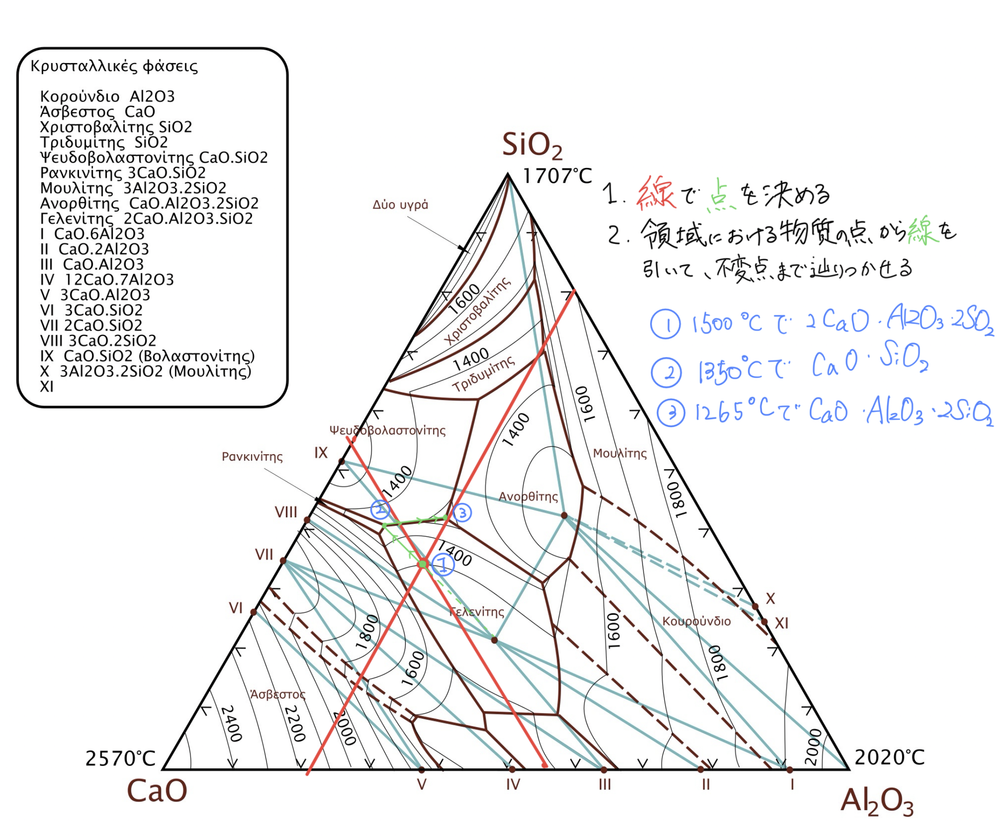
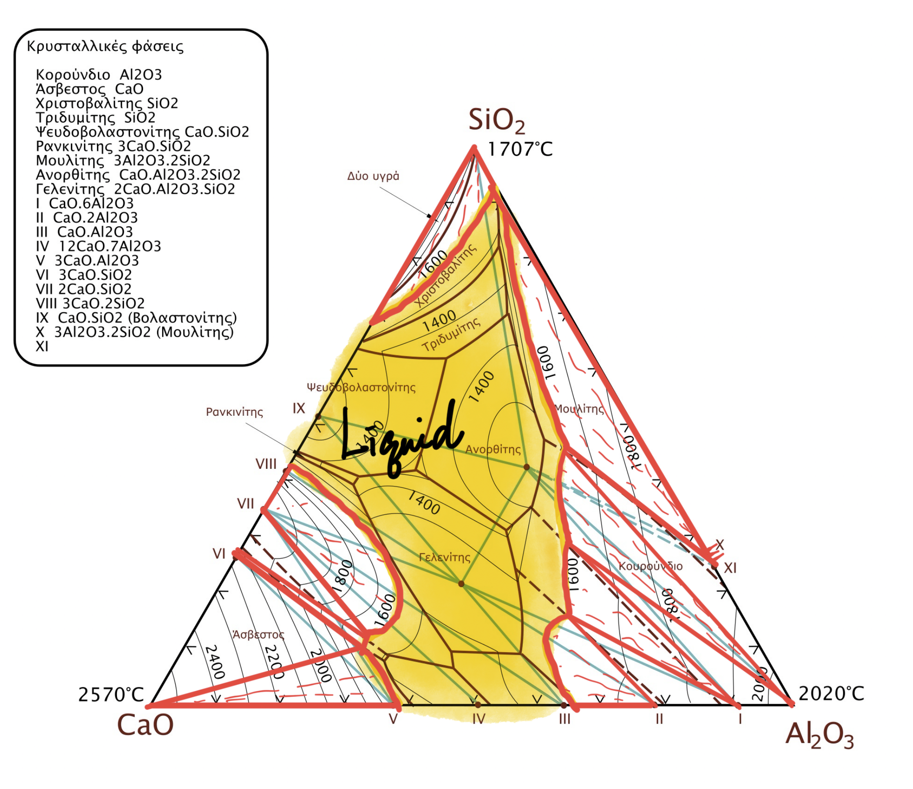

$$
\require{physics}
\require{mhchem}
\require{ams}
$$

この記事では、鉄鋼製錬を「原料から鉄を取り出す」「不純物をスラグへ移す」「溶鋼の成分と温度を整える」という流れで学ぶ。各節は、問題を先に考え、必要なら理論を開き、最後に解答を確認する構成である。

## 製錬と精錬

#### 問題1　製錬と精錬の違い {#prob-smelting-refining}

「製錬」と「精錬」の違いが分かるように、それぞれの用語の意味を説明せよ。

::: {.callout-note collapse="true"}
##### 理論1：金属を得る工程と純度を上げる工程

鉱石中の金属は、多くの場合、酸化物や硫化物として存在する。まず化学反応を用いて金属を取り出し、その後、得られた粗金属から炭素・リン・硫黄などを除く、と工程を分けて考える。
:::

::: {.callout-tip collapse="true"}
##### 解答1

- **製錬**：鉱石中に化合物として存在する目的元素を、還元・溶融などによって金属として取り出す工程。
- **精錬**：製錬で得た粗金属から不純物を除き、目的の組成・純度へ調整する工程。
:::

#### 問題2　鉄鋼業のカーボンニュートラル {#prob-carbon-neutral}

カーボンニュートラル実現を目指して、日本の鉄鋼業はどのような取り組みを行っているか。今後のあり方に対する自身の考えも含めて、300〜500字程度で述べよ。

::: {.callout-note collapse="true"}
##### 理論2：排出源を還元材・熱源・電力に分ける

高炉ではコークスが還元材、熱源、炉内の通気を保つ骨格という複数の役割を担う。このため、燃料だけを置き換えても全排出はなくならない。対策は、(i) 高炉で炭素還元の一部を水素還元へ置き換える、(ii) 水素直接還元鉄と電炉を組み合わせる、(iii) スクラップ利用を増やし電炉を高度化する、(iv) 高炉ガスから $ce{CO2}$ を分離・回収する、という複線で考える。

[資源エネルギー庁の解説](https://www.enecho.meti.go.jp/about/special/johoteikyo/suiso_seitetu.html)では、COURSE50・外部水素を用いる高炉還元・直接還元と電炉の組合せが整理されている。技術だけでなく、低炭素電力・水素の量、スクラップ中の不純物、設備更新費、製品品質まで同時に考える必要がある。
:::

::: {.callout-tip collapse="true"}
##### 解答2

日本の鉄鋼業は、既存高炉では水素を含むガスを吹き込んでコークス由来の還元を一部代替し、高炉ガスから二酸化炭素を分離・回収するCOURSE50系技術を開発している。並行して、外部水素による直接還元鉄の製造、大型電炉による高級鋼製造、スクラップ利用の拡大、省エネルギー、CCUSも進めている。今後は一つの方式に絞らず、品質要求や地域の電力・水素供給に応じて、高炉・直接還元・電炉を組み合わせるべきである。ただし、電炉化しても電力が化石燃料由来なら排出は残る。再生可能電力と低炭素水素の安定供給、スクラップの選別・循環、移行期の設備投資を一体で進め、製品単位の排出量で効果を評価する必要がある。
:::

## 高炉製銑とスラグ

#### 問題3　高炉の原料と鉄鉱石の還元 {#prob-blast-furnace}

1. 代表的な高炉装入原料を3つ挙げ、高炉内で鉄鉱石から鉄が生成する機構を化学反応式で説明せよ。
2. 従来型の高炉に還元剤として100%水素ガスを吹き込むだけでは鉄を得られない理由を簡潔に説明せよ。
3. 廃棄プラスチックを高炉製銑プロセスで有効利用する二つの方法を、それぞれ説明せよ。

::: {.callout-note collapse="true"}
##### 理論3：高炉は反応器であると同時に充填層である

鉄鉱石は炉上部から下降し、下部から上昇する $ce{CO}$ と接触して段階的に還元される。炉下部ではコークスとの直接還元も起こる。コークスは還元ガスを作るだけでなく、荷重を支えてガスと溶銑の通路を保つため、単純なガス置換ではその機械的役割を代替できない。
:::

::: {.callout-tip collapse="true"}
##### 解答3

1. 代表原料は**鉄鉱石、コークス、石灰石**である。主な間接還元は

   $$
   \ce{3Fe2O3 + CO -> 2Fe3O4 + CO2},
   $$

   $$
   \ce{Fe3O4 + CO -> 3FeO + CO2},\qquad
   \ce{FeO + CO -> Fe + CO2}
   $$

   と進み、炉下部では

   $$
   \ce{FeO + C -> Fe + CO}
   $$

   の直接還元も起こる。

2. 水素還元は条件によって吸熱的で炉内の熱収支を悪化させる。また、水素だけではコークスが担う炉内通気性の維持、熱源、溶銑への浸炭を代替できない。

3. 高炉羽口から微粉化した廃プラスチックを吹き込み、熱分解で生じる $ce{CO}$・$ce{H2}$ を還元材・燃料として利用する方法と、コークス炉の原料へ混合して炭化水素油・コークス炉ガス・コークスとして回収する方法がある。
:::

#### 問題4　三元系状態図と高炉スラグ {#prob-ternary-slag}

高炉スラグの代表成分を $ce{CaO-Al2O3-SiO2}$ 三元系状態図で考える。状態図中のムライト固溶体は無視する。

1. 高炉スラグを冷却方法によって二種類に大別し、それぞれの特徴と代表的な用途を述べよ。
2. $ce{CaO}:ce{Al2O3}=2:1$ の組成線と、$ce{SiO2}=30\ \mathrm{mass\%}$ の組成線を三元図に描け。
3. $45\ \mathrm{mass\%\ CaO}$–$20\ \mathrm{mass\%\ Al2O3}$–$35\ \mathrm{mass\%\ SiO2}$ の溶融スラグを平衡を保って冷却する。液相が消失する温度と、凝固後に存在する相を状態図から求めよ。
4. $1600\,\mathrm{^\circ C}$ の等温断面図を描き、共役線と平衡相を明記せよ。

::: {.callout-note collapse="true"}
##### 理論4：三元図では平行線とタイラインを読む

三角形の各頂点は一成分100%を表し、頂点の対辺に平行な線上ではその頂点成分の濃度が一定である。二成分の比が一定の組成線は、残りの成分の頂点と、その比を満たす対辺上の点を結ぶ。

冷却経路は組成点から温度を下げて液相面を追う。液相面に達したところで初晶が生じ、境界を通って不変点へ至る。三相域では、組成点を囲む三角形の三頂点が平衡相である。
:::

::: {.callout-tip collapse="true"}
##### 解答4

1. **徐冷スラグ**は自然放冷した結晶質スラグで、砕石として道路路盤材やコンクリート骨材に用いる。**水砕スラグ**は溶融スラグを水で急冷したガラス質・粒状のスラグで、潜在水硬性を利用して高炉セメント原料などに用いる。

2. 赤線が $ce{CaO}:ce{Al2O3}=2:1$、青緑線が $ce{SiO2}=30\ \mathrm{mass\%}$ を示す。元の図へ引いた組成線をそのまま残す。

   {fig-alt="CaO-Al2O3-SiO2三元状態図。赤と青緑の組成線、冷却経路、相の読み取りが書き込まれている。"}

3. 図から読む近似値では、約 $1265\,\mathrm{^\circ C}$ で液相が消失する。最終的な平衡相は、ゲーレナイト $ce{2CaO.Al2O3.SiO2}$、アノーサイト $ce{CaO.Al2O3.2SiO2}$、ウォラストナイト $ce{CaO.SiO2}$ の三相である。図の解像度に基づく読み取り値なので、温度に過剰な有効数字は付けない。

4. $1600\,\mathrm{^\circ C}$ の液相域と固相を区分し、二相域では液相組成と固相組成を共役線で結ぶ。図へ直接記入した等温断面の解答を残す。

   {fig-alt="CaO-Al2O3-SiO2三元状態図に1600℃の液相域、相境界、共役線を書き込んだ図。"}
:::

## スラグ精錬の熱力学

#### 問題5　脱リン反応と分配比 {#prob-dephosphorization}

転炉脱炭に先立つ溶銑予備処理で、スラグを用いてリンを除去する。

1. 脱リンのイオン反応式を示し、反応を促進する条件を三つ挙げよ。
2. 炭素がリンの活量係数へ及ぼす一次相互作用助係数 $e_{\ce{P}}^{\ce{C}}$ の定義を示せ。$e_{\ce{P}}^{\ce{C}}=0.079$、$[\%\ce{C}]=4.5$ として、1 mass% Henrian基準のリンの活量係数 $f_{\ce{P}}$ を求めよ。
3. 反応

   $$
   \ce{1/2P2(g) = P(1 mass\%)}
   $$

   の標準Gibbsエネルギー変化が

   $$
   \Delta G_1^\circ=-122200-19.25T\ \mathrm{J\,mol^{-1}}
   $$

   であるとき、平衡定数 $K_1$ を $T$ の関数として表せ。
4. $1300\,\mathrm{^\circ C}$、$p_{\ce{O2}}=10^{-15}\ \mathrm{atm}$ でリン分配比を $L_{\ce{P}}=5.00\times10^2$ とする。関係式

   $$
   L_{\ce{P}}=rac{0.326 f_{\ce{P}}C_{\ce{PO4^{3-}}}p_{\ce{O2}}^{5/4}}{K_1}
   $$

   から、必要なフォスフェイトキャパシティー $C_{\ce{PO4^{3-}}}$ を求めよ。気体定数は $R=8.314\ \mathrm{J\,mol^{-1}K^{-1}}$ とする。

::: {.callout-note collapse="true"}
##### 理論5：化学ポテンシャルを分配比へつなぐ

脱リンでは、溶銑中のリンを酸化し、塩基性スラグ中でリン酸イオンとして安定化する。したがって高酸素ポテンシャル、高塩基度、低温が有利である。活量は濃度と活量係数の積であり、Wagnerの一次近似では希薄溶質 $i$ について

$$
\log_{10}f_i=\sum_j e_i^j[\%j]
$$

と書く。標準Gibbsエネルギーと平衡定数の関係は

$$
\Delta G^\circ=-RT\ln K
$$

である。
:::

::: {.callout-tip collapse="true"}
##### 解答5

1. 反応は

   $$
   \ce{P + 5/4O2 + 3/2O^{2-} -> PO4^{3-}}
   $$

   である。促進条件は、**高酸素分圧、高塩基度（高い酸化物イオン活量）、低温**である。

2. 定義は

   $$
   e_{\ce{P}}^{\ce{C}}
   =\left(\pdv{\log_{10}f_{\ce{P}}}{[\%\ce{C}]}\right)_{[\%\ce{C}]\to0}
   $$

   である。一次項だけを用いると

   $$
   \log_{10}f_{\ce{P}}=0.079\times4.5=0.3555,
   \qquad f_{\ce{P}}=10^{0.3555}=2.27.
   $$

3. 

   $$
   K_1=\exp\left(-\frac{\Delta G_1^\circ}{RT}\right)
   =\exp\left(\frac{122200+19.25T}{RT}\right).
   $$

4. $T=1573\ \mathrm{K}$ では $K_1=1.16\times10^5$ なので、

   $$
   C_{\ce{PO4^{3-}}}
   =\frac{L_{\ce{P}}K_1}{0.326f_{\ce{P}}p_{\ce{O2}}^{5/4}}
   =4.40\times10^{26}.
   $$
:::

#### 問題6　転炉精錬と二次精錬 {#prob-steelmaking}

1. 転炉精錬の主目的と、溶銑中の元素が示す反応挙動を100〜200字程度で述べよ。
2. 溶鋼中のガス成分を除去する代表的な二つの方法を、対象ガスと原理とともに示せ。
3. ステンレス鋼を溶製するとき、高炭素フェロクロムの添加後にどのような方法で脱炭するか。クロムの酸化損失を抑える原理とともに説明せよ。

::: {.callout-note collapse="true"}
##### 理論6：分圧を下げれば溶解ガスは抜ける

転炉では酸素吹錬によって炭素を $ce{CO}$ として除去する。Si、Mn、Pも酸化されてスラグへ移る。二次精錬では、真空によって気相側分圧を下げる、または不活性ガスで希釈・攪拌して、溶鋼中のH、N、COを気相へ移す。

ステンレス鋼では、低い $p_{\ce{CO}}$ ほど同じ酸素ポテンシャルで脱炭が進み、Crの酸化を抑えやすい。この考えをAr希釈で使うのがAOD、真空で使うのがVODである。
:::

::: {.callout-tip collapse="true"}
##### 解答6

1. 主目的は酸素吹錬による脱炭である。初期にはSi、Mnが優先酸化され、中期に脱炭が活発化し、塩基性スラグと高い酸素ポテンシャルの下でPも除去される。反応熱で外部加熱なしに溶鋼温度を上げ、所定の炭素濃度と温度へ調整する。

2. **RH法**ではArガスリフトで溶鋼を真空槽へ循環させ、H、Nおよび脱酸で生じたCOを除く。**VD法**では取鍋全体を真空下に置き、Ar攪拌で界面更新を促して主にH、Nを除去する。

3. AODでは酸素をAr（またはAr–$ce{N2}$）で希釈して $p_{\ce{CO}}$ を下げ、VODでは真空下で酸素吹錬して $p_{\ce{CO}}$ を下げる。いずれも脱炭平衡を生成物側へ移し、CrよりCを優先的に酸化する。
:::

## Ellingham図

#### 問題7　酸化物の安定性と還元可能性 {#prob-ellingham}

酸化物の標準生成Gibbsエネルギー－温度線図（Ellingham図）について答えよ。

1. 縦軸の標準生成Gibbsエネルギーは、酸素分圧とどのように関係するか。図から平衡酸素分圧を読む方法も説明せよ。
2. 各直線の傾きと $0\ \mathrm{K}$ における切片は何を意味するか。多くの酸化反応の傾きがほぼ同じ理由も述べよ。
3. $1600\ \mathrm{K}$ で $ce{SiO2}$ をCOガスによって容易に還元できるか、理由を付けて答えよ。

::: {.callout-note collapse="true"}
##### 理論7：下にある酸化物ほど安定

反応を酸素1 mol消費する形にそろえると、平衡では

$$
\Delta G^\circ=-RT\ln K=RT\ln p_{\ce{O2}}
$$

と対応づけられる。線が下にある酸化反応ほど標準生成Gibbsエネルギーが低く、その酸化物は安定である。別の物質で還元できるかは、還元剤の酸化線が対象酸化物の生成線より下にあるかで判断する。
:::

::: {.callout-tip collapse="true"}
##### 解答7

1. 酸素1 mol基準の酸化反応なら、縦軸は平衡時の $RT\ln p_{\ce{O2}}$ に対応する。所定温度で酸化物生成線の値を読み、$p_{\ce{O2}}=\exp(\Delta G^\circ/RT)$ として平衡酸素分圧を得る。

2. 

   $$
   \Delta G^\circ=\Delta H^\circ-T\Delta S^\circ
   $$

   より、傾きは $-\Delta S^\circ$、$0\ \mathrm{K}$ の切片は $\Delta H^\circ$ である。多くの反応では酸素1 molを消費し、固体同士のエントロピー差は気体酸素の消失に比べて小さいため、$\Delta S^\circ$ が似た値となる。

3. 容易ではない。$1600\ \mathrm{K}$ では $ce{SiO2}$ の生成線が $ce{CO/CO2}$ の酸化線より下にあり、$ce{SiO2}$ の方が熱力学的に安定だからである。
:::

## 関連記事

- 化学ポテンシャル、活量、平衡定数の基礎は[材料電気化学](../3S/材料電気化学.qmd)を参照。
- 相図の読み方と相平衡は[組織生成論](../3S/組織生成論.qmd)を参照。

## 参考資料

- [資源エネルギー庁「水素を活用した製鉄技術、今どこまで進んでる？」](https://www.enecho.meti.go.jp/about/special/johoteikyo/suiso_seitetu.html)
- [経済産業省「鉄鋼業のカーボンニュートラルに向けた国内外の動向等について」](https://www.meti.go.jp/shingikai/sankoshin/green_innovation/energy_structure/pdf/028_03_00.pdf)
