$$
\require{physics}
\require{mhchem}
\require{ams}
$$

逐次重合から連鎖重合、共重合、結晶化、開環重合、生分解へ進む。各問題は、まず自力で考え、必要なときだけ「理論」を開き、最後に「解答」で確認する。

## 重合様式と逐次重合

#### 問題1　逐次重合か連鎖重合か

あるモノマー溶液へ開始剤を加えると、粘度は時間とともに増加した。この反応液には、高分子量ポリマーと未反応モノマーが共存していた。逐次重合と連鎖重合のどちらか。理由も述べよ。

::: {.callout-note collapse="true"}
##### 理論1：分子量が増える時期を見る

逐次重合では、モノマー、二量体、オリゴマーのどの官能基同士も反応できる。反応初期にモノマーは減るが、高分子量体を得るには反応率をほぼ100%まで上げる必要がある。

連鎖重合では、開始によって生じた活性末端へモノマーが次々に付加する。反応初期から高分子量鎖が生じ、その鎖と未反応モノマーが共存する。開始剤が必要であることも連鎖重合を支持する。
:::

::: {.callout-tip collapse="true"}
##### 解答1

連鎖重合である。開始剤を必要とし、反応初期から高分子量ポリマーが生じる一方で未反応モノマーが残ることは、活性末端だけが高速に成長する連鎖重合の特徴である。

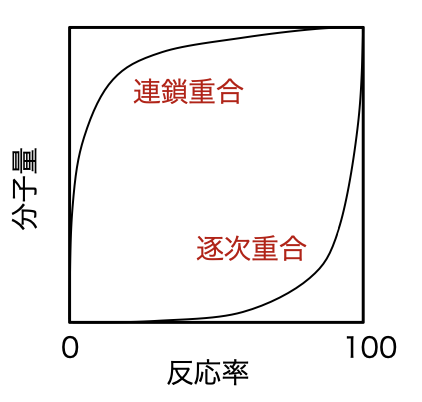{fig-alt="連鎖重合では低反応率から高分子量となり、逐次重合では高反応率域で急増するグラフ"}
:::

#### 問題2　ポリビニルアルコールのホルマール化

ポリビニルアルコールをホルマリン処理してビニロンを得る反応式を書け。

::: {.callout-note collapse="true"}
##### 理論2：隣接する2個のヒドロキシ基で環状アセタールをつくる

ポリビニルアルコール（PVA）の隣接するヒドロキシ基は、酸触媒下でホルムアルデヒドと反応する。2本の O–H 結合から水が除かれ、ホルムアルデヒド由来の炭素を2個の酸素が共有する環状ホルマール（アセタール）になる。

すべてのヒドロキシ基を反応させるのではなく、未反応 OH を残すことで親水性、染色性、繊維性能の釣合いをとる。
:::

::: {.callout-tip collapse="true"}
##### 解答2

酸触媒下で、PVA 鎖中の1,3-ジオール部分と $\ce{HCHO}$ を脱水縮合させ、六員環のホルマール構造をつくる。

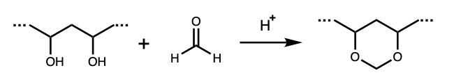{fig-alt="PVA鎖の二つのOH基がホルムアルデヒドと酸触媒下で反応し、環状アセタールとなる構造式"}
:::

#### 問題3　ホルムアルデヒドと二酸化炭素の重合熱

ホルムアルデヒドは重合してポリオキシメチレンになるが、二酸化炭素は単独では重合しにくい。次の結合エネルギーから理由を説明せよ。

$$
\begin{array}{c|c}
\text{結合} & E/\mathrm{kJ\,mol^{-1}}\\ \hline
\ce{C=O}\ (\ce{CO2}) & 803\\
\ce{C=O}\ (\ce{HCHO}) & 694\\
\ce{C-O} & 359
\end{array}
$$

::: {.callout-note collapse="true"}
##### 理論3：切る結合から作る結合を引く

結合エネルギーによる概算では

$$
\Delta H\simeq\sum E(\text{切断する結合})-\sum E(\text{生成する結合})
$$

とする。ホルムアルデヒドの1本の $\ce{C=O}$ は、重合によって2本の $\ce{C-O}$ になる。二酸化炭素から仮想的な鎖をつくる場合は、1単位当たり2本ある $\ce{C=O}$ のうち1本を残し、もう1本を2本の $\ce{C-O}$ へ変える。
:::

::: {.callout-tip collapse="true"}
##### 解答3

ホルムアルデヒドでは

$$
\Delta H=694-2(359)=-24\ \mathrm{kJ\,mol^{-1}}
$$

となり発熱である。一方、二酸化炭素では

$$
\Delta H=803-2(359)=+85\ \mathrm{kJ\,mol^{-1}}
$$

となり吸熱である。したがって $\ce{CO2}$ 単独重合は熱力学的に不利である。
:::

#### 問題4　Carothers 式と官能基量の不均衡

1. グリコール酸の重縮合で、ヒドロキシ基の反応率が $p=0.99$ のとき、数平均重合度 $\bar X_n$ を求めよ。
2. アジピン酸 $1.02\ \mathrm{mol}$ とエチレングリコール $1.00\ \mathrm{mol}$ を用い、エチレングリコールのヒドロキシ基の反応率が $0.99$ のとき、生成ポリエチレンアジペートの $\bar X_n$ を求めよ。

::: {.callout-note collapse="true"}
##### 理論4：反応1回につき分子数が1個減る

等量の AB 型モノマーでは、初期分子数を $N_0$、生成した結合数を $pN_0$ とすれば、残る分子数は $N=N_0(1-p)$ である。したがって

$$
\bar X_n=\frac{N_0}{N}=\frac{1}{1-p}
$$

を得る。AA+BB 型で官能基量が不均衡なら、「初期分子数－生成結合数」を数えるとよい。
:::

::: {.callout-tip collapse="true"}
##### 解答4

1.

$$
\boxed{\bar X_n=\frac{1}{1-0.99}=100}.
$$

2. 初期分子数は $2.02\ \mathrm{mol}$、生成エステル結合は $2.00(0.99)=1.98\ \mathrm{mol}$ である。反応後の分子数は $0.04\ \mathrm{mol}$ なので

$$
\boxed{\bar X_n=\frac{2.02}{0.04}=50.5}.
$$
:::

#### 問題5　重縮合の重合度と時間

等モルの A–A 型モノマーと B–B 型モノマーが不可逆に反応する。両官能基の初濃度を $C_0$、速度定数を $k_1$ として、数平均重合度 $\bar X_n$ と時間 $t$ の関係を示せ。

::: {.callout-note collapse="true"}
##### 理論5：二次反応を積分して Carothers 式へつなぐ

時刻 $t$ の未反応官能基濃度を $C$ とすると

$$
-\dv{C}{t}=k_1C^2.
$$

初期条件 $C(0)=C_0$ で積分すると

$$
\frac{1}{C}-\frac{1}{C_0}=k_1t.
$$

未反応割合は $1-p=C/C_0$ だから $\bar X_n=C_0/C$ である。この積分は[材料速度論](../2A/材料速度論.qmd)の道具と同じである。
:::

::: {.callout-tip collapse="true"}
##### 解答5

$$
C=\frac{C_0}{1+k_1C_0t}
$$

より

$$
\boxed{\bar X_n=\frac{C_0}{C}=1+k_1C_0t}.
$$
:::

#### 問題6　平衡に制限される重付加

等モルの二官能性モノマーを初濃度 $C_0$ で反応させる。生成結合の割合を $p$、平衡定数を $K=2000$ とし、

$$
K=\frac{p}{C_0(1-p)^2}
$$

が成り立つとする。$C_0=0.1\ \mathrm{mol\,L^{-1}}$ と $5.0\ \mathrm{mol\,L^{-1}}$ について $\bar X_n$ を求めよ。

::: {.callout-note collapse="true"}
##### 理論6：平衡式を重合度へ直接変換する

$\bar X_n=1/(1-p)$ とおくと

$$
KC_0=\bar X_n^2-\bar X_n
$$

となる。正の解だけを採用する。
:::

::: {.callout-tip collapse="true"}
##### 解答6

$$
\bar X_n=\frac{1+\sqrt{1+4KC_0}}{2}.
$$

したがって

$$
\boxed{
\bar X_n=14.7\ (C_0=0.1),\qquad
\bar X_n=100.5\ (C_0=5.0)
}.
$$
:::

## 熱硬化性樹脂とポリウレタン

#### 問題7　フェノール–ホルムアルデヒド樹脂

フェノールとホルムアルデヒドの付加縮合について、付加反応と縮合反応、酸性・塩基性条件で得られる構造の違い、熱可塑性・熱硬化性の別を答えよ。

::: {.callout-note collapse="true"}
##### 理論7：メチロール化と架橋可能性を区別する

まずフェノール環の ortho または para 位へ $\ce{CH2OH}$ が導入される。次にメチロール基と別のフェノール環が脱水縮合し、メチレン架橋をつくる。

酸触媒・ホルムアルデヒド不足では主に直鎖状ノボラックになる。塩基触媒・ホルムアルデヒド過剰では多官能のメチロール基をもつレゾールができ、加熱により自己架橋する。
:::

::: {.callout-tip collapse="true"}
##### 解答7

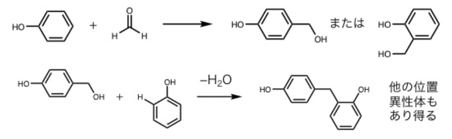{fig-alt="フェノールへのヒドロキシメチル基の付加と、二つのフェノール環をメチレン基で結ぶ縮合反応式"}

酸性条件ではメチロール基が少ない直鎖状ノボラックを生じ、硬化剤添加前は熱可塑性である。塩基性条件ではメチロール基の多いレゾールを生じ、加熱で三次元架橋する熱硬化性樹脂となる。
:::

#### 問題8　尿素–ホルムアルデヒド樹脂

尿素とホルムアルデヒドの付加縮合について、モノメチロール尿素の生成、尿素との縮合、1～4個のメチロール基をもつ尿素、水に不溶なポリメチレン尿素の構造を示せ。

::: {.callout-note collapse="true"}
##### 理論8：尿素の4個の N–H が多官能点になる

尿素の窒素がホルムアルデヒドへ求核付加すると $\ce{N-CH2OH}$ をもつメチロール尿素になる。尿素には N–H が合計4個あるので、モノからテトラメチロール体まで生じる。メチロール基と別の N–H が脱水すると $\ce{N-CH2-N}$ 架橋を形成する。
:::

::: {.callout-tip collapse="true"}
##### 解答8

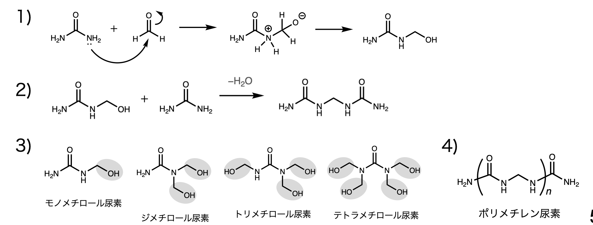{fig-alt="尿素へホルムアルデヒドが付加し、脱水縮合してメチレン架橋を形成する一連の反応式"}

付加で $\ce{NH2CONHCH2OH}$ を生じ、これが尿素の N–H と脱水縮合して $\ce{N-CH2-N}$ 結合をつくる。塩基性では1～4置換メチロール尿素、酸性では縮合の進んだ不溶性ポリメチレン尿素を与える。

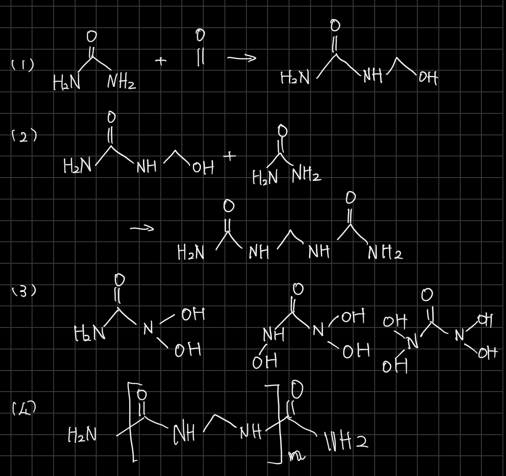{fig-alt="尿素とホルムアルデヒドの付加、縮合、多数のメチロール基をもつ尿素、ポリメチレン尿素を描いた手書き構造式"}
:::

#### 問題9　ポリウレタンの生成と発泡

アルコールがイソシアネートへ求核付加してウレタン結合を与える機構を示せ。また、合成時に少量の水を加えると発泡する理由を説明せよ。

::: {.callout-note collapse="true"}
##### 理論9：アルコールはウレタン、水はアミンと二酸化炭素を与える

イソシアネート $\ce{R-N=C=O}$ の炭素は電子不足であり、アルコールの酸素が攻撃する。プロトン移動後に $\ce{R-NH-CO-OR'}$ を生じる。

水が攻撃すると不安定なカルバミン酸 $\ce{R-NH-COOH}$ が生じ、アミンと $\ce{CO2}$ に分解する。$\ce{CO2}$ は気泡をつくり、生成アミンはさらにイソシアネートと反応する。
:::

::: {.callout-tip collapse="true"}
##### 解答9

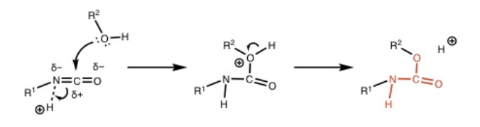{fig-alt="アルコール酸素のイソシアネート炭素への求核攻撃とプロトン移動でウレタンを生じる反応機構"}

$$
\ce{R-NCO + H2O -> R-NH-COOH -> R-NH2 + CO2 ^}
$$

で発生した $\ce{CO2}$ が硬化中の樹脂内に気泡をつくる。

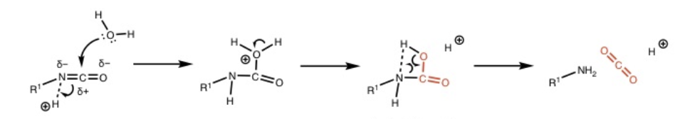{fig-alt="水がイソシアネートへ付加し、カルバミン酸を経て脱炭酸する反応機構"}
:::

## ラジカル重合

#### 問題10　定常状態近似による重合速度 {#prob-radical-rate}

ラジカル単独重合の生長速度が、開始剤濃度とモノマー濃度へどのように依存するか、定常状態近似から導け。

::: {.callout-note collapse="true"}
##### 理論10：ラジカルの生成速度と消滅速度を等置する

$$
R_i=2fk_d[\ce I],\qquad
R_t=2k_t[\ce{P^.}]^2.
$$

定常状態 $R_i=R_t$ から全ラジカル濃度を求め、

$$
R_p=-\dv{[\ce M]}{t}=k_p[\ce M][\ce{P^.}]
$$

へ代入する。
:::

::: {.callout-tip collapse="true"}
##### 解答10

$$
[\ce{P^.}]=\sqrt{\frac{fk_d[\ce I]}{k_t}}
$$

なので

$$
\boxed{
R_p=k_p\sqrt{\frac{fk_d}{k_t}}\,[\ce M][\ce I]^{1/2}
}.
$$

重合速度はモノマー濃度の1次、開始剤濃度の $1/2$ 次に比例する。
:::

#### 問題11　開始剤の半減期と開始剤効率

1. BPO の分解が Arrhenius 式に従う。$E_a=139.0\ \mathrm{kJ\,mol^{-1}}$、$A=9.34\times10^{15}\ \mathrm{s^{-1}}$ として、$60,\ 80,\ 100\,^\circ\mathrm C$ における半減期を求めよ。
2. AIBN の開始剤効率が $0.5\sim0.7$、BPO が $0.9\sim1.0$ となる理由を、かご効果から説明せよ。

::: {.callout-note collapse="true"}
##### 理論11：一次分解とラジカル対の脱出を分ける

$$
k_d=A\exp\qty(-\frac{E_a}{RT}),\qquad
t_{1/2}=\frac{\ln2}{k_d}.
$$

開始剤効率 $f$ は、生成一次ラジカルのうち実際にモノマーへ付加した割合である。同じ溶媒かご内のラジカル対は、拡散して離れる前に再結合できる。AIBN 由来ラジカルの再結合は安定な共有結合生成物を与えて不可逆な損失になる。一方、BPO 由来のベンゾイルオキシラジカルが再結合すれば BPO へ戻り、再び分解できる。付加や脱炭酸によるかごからの脱出も起こる。
:::

::: {.callout-tip collapse="true"}
##### 解答11

$$
\begin{array}{c|c|c}
T/^\circ\mathrm C & t_{1/2}/\mathrm s & t_{1/2}/\mathrm h\\ \hline
60 & 4.62\times10^5 & 128\\
80 & 2.70\times10^4 & 7.49\\
100 & 2.13\times10^3 & 0.592
\end{array}
$$

AIBN では溶媒かご内の一次ラジカル対が不可逆に再結合し、開始に使われない割合が大きい。BPO のかご内再結合は元の BPO を再生して再分解でき、付加・脱炭酸による脱出も起こるため、開始剤効率が高い。
:::

#### 問題12　ラジカル重合の反応場

次の空欄を埋めよ。

ラジカル重合は（ア）重合、溶液重合、（イ）重合、（ウ）重合、沈殿重合に分類される。（イ）と（ウ）は水中に水不溶性モノマーを分散させるが、（イ）では油溶性開始剤、（ウ）では水溶性開始剤を用いる。（イ）の重合速度は開始剤濃度の（エ）次、モノマー濃度の（オ）次に比例する。

::: {.callout-note collapse="true"}
##### 理論12：液滴を反応器にするか、ミセルを反応器にするか

懸濁重合ではモノマー液滴を水中に分散し、油溶性開始剤によって各液滴内でバルク重合に近い反応が進む。乳化重合では界面活性剤ミセルと水溶性開始剤を使う。したがって懸濁重合の理想速度式は[問題10](#prob-radical-rate)と同じ次数になる。
:::

::: {.callout-tip collapse="true"}
##### 解答12

$$
\boxed{
\text{（ア）バルク,\quad
（イ）懸濁,\quad
（ウ）乳化,\quad
（エ）}0.5,\quad
\text{（オ）}1
}
$$
:::

## ラジカル共重合

#### 問題13　Mayo–Lewis 式 {#prob-mayo-lewis}

モノマー $\ce{M1}$ と $\ce{M2}$ の仕込み組成を $f_1,f_2$、生成直後の共重合体組成を $F_1,F_2$ とする。

1. 反応性比 $r_1=k_{11}/k_{12}$、$r_2=k_{22}/k_{21}$ を用いて $F_1$ を導け。
2. $r_1=0.75,\ r_2=0.18,\ f_1=0.20$ のとき $F_1$ を求めよ。

::: {.callout-note collapse="true"}
##### 理論13：末端が入れ替わる速度を等置する

末端モデルでは、定常状態で

$$
k_{12}[\ce{P1^.}][\ce{M2}]
=k_{21}[\ce{P2^.}][\ce{M1}]
$$

が成り立つ。この関係を各モノマーの消費速度へ代入し、$f_2=1-f_1$ として瞬間共重合組成へ直す。
:::

::: {.callout-tip collapse="true"}
##### 解答13

$$
\boxed{
F_1=
\frac{r_1f_1^2+f_1f_2}
{r_1f_1^2+2f_1f_2+r_2f_2^2}
}.
$$

$f_1=0.20,\ f_2=0.80$ を代入すると

$$
\boxed{F_1=0.413}.
$$
:::

#### 問題14　反応性比と共重合組成曲線

1. Alfrey–Price の $Q$–$e$ 式を用い、スチレン $(Q_1,e_1)=(1.0,-0.8)$ とアクリル酸メチル $(Q_2,e_2)=(0.45,0.64)$ の反応性比を求めよ。
2. スチレン、メタクリル酸メチル、アクリル酸メチル、アクリロニトリルを $e$ 値 $-0.8,\ 0.4,\ 0.6,\ 1.2$ の小さい順に並べよ。
3. 次の4系の瞬間共重合組成曲線を描け。

$$
\begin{array}{c|c|c}
\ce{M1}/\ce{M2} & r_1&r_2\\ \hline
\text{スチレン/無水マレイン酸}&0.04&0\\
\text{スチレン/メタクリル酸メチル}&0.52&0.46\\
\text{スチレン/ブタジエン}&0.78&1.3\\
\text{酢酸ビニル/アクリロニトリル}&0.1&9.0
\end{array}
$$

::: {.callout-note collapse="true"}
##### 理論14：$Q$ は共鳴、$e$ は極性を表す

$$
r_1=\frac{Q_1}{Q_2}\exp[-e_1(e_1-e_2)],\qquad
r_2=\frac{Q_2}{Q_1}\exp[-e_2(e_2-e_1)].
$$

組成曲線は[問題13](#prob-mayo-lewis)の式へ $r_1,r_2$ を代入して描く。$r_1r_2\ll1$ なら交互共重合性が強く、片方が極端に大きいとそのモノマーへ偏る。
:::

::: {.callout-tip collapse="true"}
##### 解答14

$$
\boxed{r_1=0.703,\qquad r_2=0.179}.
$$

$$
\boxed{
\text{スチレン}
<\text{メタクリル酸メチル}
<\text{アクリル酸メチル}
<\text{アクリロニトリル}
}
$$

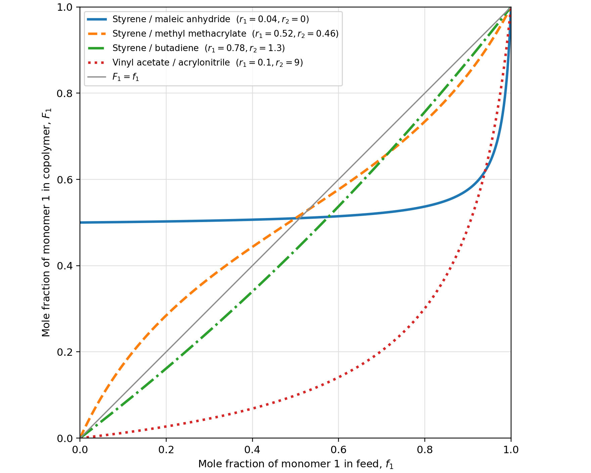{fig-alt="横軸を仕込み中M1モル分率、縦軸を共重合体中M1モル分率とし、4組の反応性比について描いた曲線"}

$r_2=0$ の系は $\ce{M2}$ 単独仕込みでは共重合体組成が定義できないため、$f_1=0$ の点を描いていない。図は polymer_figures.py で再生成できる。
:::

#### 問題15　開始機構による共重合曲線

過酸化ベンゾイル、四塩化スズ、ブチルリチウムを開始剤として、スチレンとメタクリル酸メチルを共重合した。図の (a)～(c) をラジカル、カチオン、アニオン重合に対応させよ。

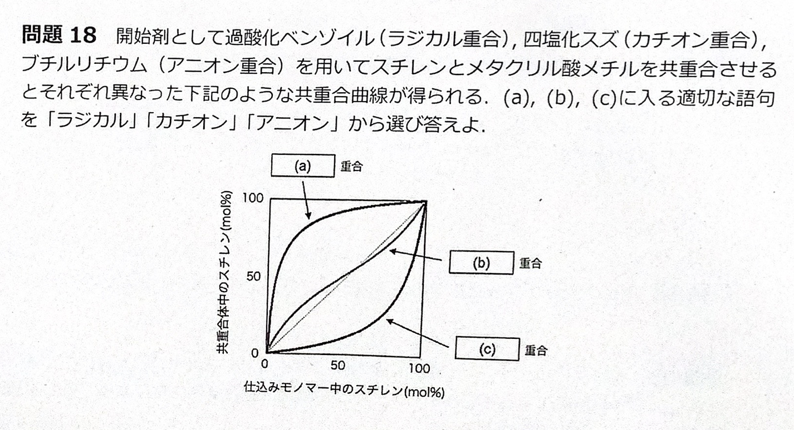{fig-alt="横軸が仕込み中スチレン、縦軸が共重合体中スチレンのモル百分率で、上に凸、対角線付近、下に凸の三曲線を示す問題図"}

::: {.callout-note collapse="true"}
##### 理論15：どちらのモノマーが各活性種を安定化するか

スチレンはベンジル位でラジカルとカチオンを安定化する。メタクリル酸メチルのカルボニル基はアニオンを安定化する一方、カチオン重合には不利である。ラジカル共重合では両者が比較的近い反応性を示す。
:::

::: {.callout-tip collapse="true"}
##### 解答15

$$
\boxed{
(a)\ \text{カチオン},\qquad
(b)\ \text{ラジカル},\qquad
(c)\ \text{アニオン}
}
$$
:::

## アニオン重合とカチオン重合

#### 問題16　リビングアニオン重合

1. n-ブチルリチウムおよびナトリウム–ナフタレンを開始剤とするスチレンの開始反応を示せ。
2. リビング重合となる条件と、それを確認する実験方法を答えよ。

::: {.callout-note collapse="true"}
##### 理論16：失活しない活性末端を数える

n-ブチルリチウムはスチレンへ求核付加してベンジルアニオン末端をつくる。ナトリウム–ナフタレンは一電子を渡してスチレンラジカルアニオンを生じ、二量化により両端アニオンの二官能性開始種になる。

水、酸素、二酸化炭素を除き、停止・連鎖移動が起こらなければ活性鎖数は一定に保たれる。このとき数平均分子量は転化率に比例し、モノマーを追加すると同じ鎖が再び伸びる。
:::

::: {.callout-tip collapse="true"}
##### 解答16

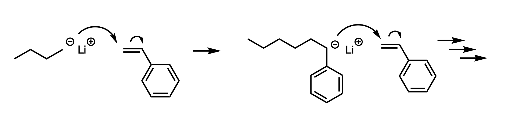{fig-alt="ブチルリチウムがスチレン二重結合へ付加し、リチウム対イオンをもつ成長末端を与える構造式"}

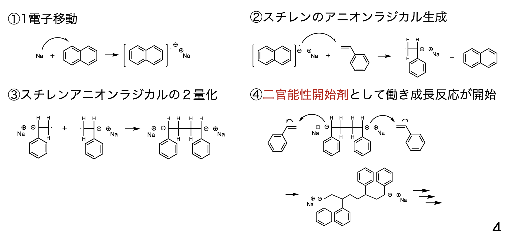{fig-alt="ナフタレンラジカルアニオンからスチレンへ電子移動し、二量化後に両端からポリスチレンが成長する反応機構"}

条件は停止反応・連鎖移動反応がなく、活性末端が保存されることである。確認には、$\bar M_n$ が転化率に比例すること、分散度が狭いこと、重合完了後のモノマー追加で分子量がさらに増すことを調べる。
:::

#### 問題17　アニオン重合のモノマー選択性

1. スチレン、$\alpha$-メチルスチレン、アクリル酸メチル、メタクリル酸メチルを、アニオン重合しやすい順に並べよ。
2. スチレンとメタクリル酸メチルの1:1混合物へ $\ce{C6H5MgBr}$ を加えると何が得られるか。
3. スチレンと $p$-シアノスチレンのブロック共重合では、どちらを先に加えるべきか。
4. イソプレンのアニオン重合で生じ得る4種類の繰返し構造を示せ。

::: {.callout-note collapse="true"}
##### 理論17：電子求引基はアニオンを安定化する

カルボニル基やシアノ基は負電荷を安定化し、アニオン付加を受けやすくする。アルキル置換は電子供与性と立体障害により反応性を下げる。Grignard 試薬はメタクリル酸エステルを開始できてもスチレンには不十分である。

ブロック共重合では、強い求核性の末端から、より反応しやすいモノマーへ進む順序を選ぶ。共役ジエンでは 1,4-付加の cis/trans と、1,2-・3,4-付加が可能である。
:::

::: {.callout-tip collapse="true"}
##### 解答17

$$
\boxed{
\text{アクリル酸メチル}
>\text{メタクリル酸メチル}
>\text{スチレン}
>\alpha\text{-メチルスチレン}
}
$$

$\ce{C6H5MgBr}$ では主に PMMA が生成し、スチレンはほぼ未反応で残る。ブロック共重合ではスチレンを先に重合し、その生長末端へ $p$-シアノスチレンを加える。

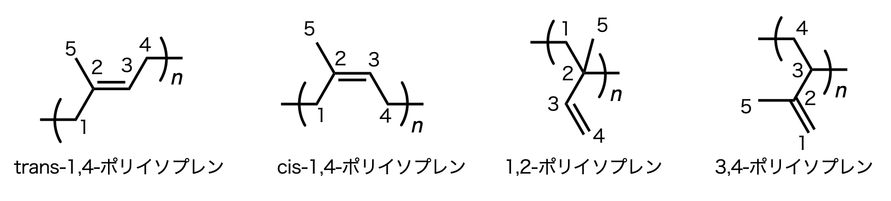{fig-alt="イソプレンの四つの付加様式と炭素番号を示した繰返し単位"}
:::

#### 問題18　カチオン重合と異性化

1. カチオン重合しやすい代表的モノマーを3種類挙げ、その理由を説明せよ。
2. 3-メチル-1-ブテンのカチオン重合では A、B 2種類の繰返し単位が生じる。A:B は $-100\,^\circ\mathrm C$ で $30:70$、$-130\,^\circ\mathrm C$ で $0:100$ となる。構造と温度依存性の理由を示せ。

::: {.callout-note collapse="true"}
##### 理論18：電子豊富な二重結合とカルボカチオン転位

アルコキシ基、アルキル基、フェニル基は二重結合の電子密度を高め、生成カルボカチオンを安定化する。

3-メチル-1-ブテンへ付加すると第二級カルボカチオン末端ができ、水素移動によって第三級カルボカチオンへ異性化できる。低温ほどモノマー付加が遅くなり、付加前に異性化する割合が増える。

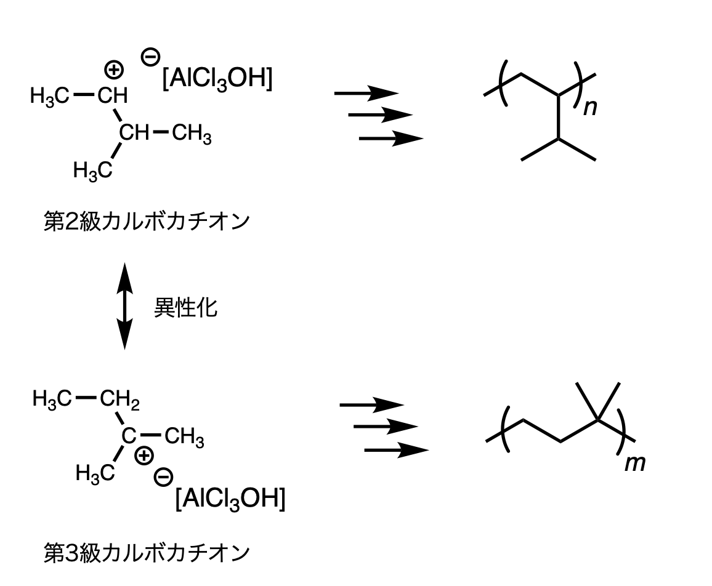{fig-alt="3-メチル-1-ブテンの第二級カルボカチオンと第三級カルボカチオンの異性化、および各末端からできる構造"}
:::

::: {.callout-tip collapse="true"}
##### 解答18

代表例は n-ブチルビニルエーテル、スチレン、イソブテンである。置換基が二重結合を電子豊富にし、生成カチオンを安定化する。

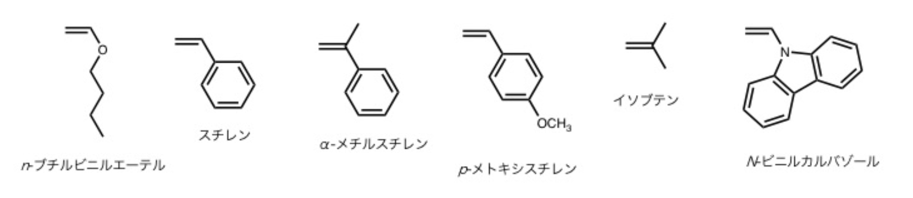{fig-alt="n-ブチルビニルエーテル、スチレン、アルキルスチレン、イソブテン等の構造式"}

A は転位しない第二級末端からの直接付加構造、B は水素移動で生じた第三級末端からの構造である。低温では付加が遅く異性化時間が相対的に長くなるため B が増える。

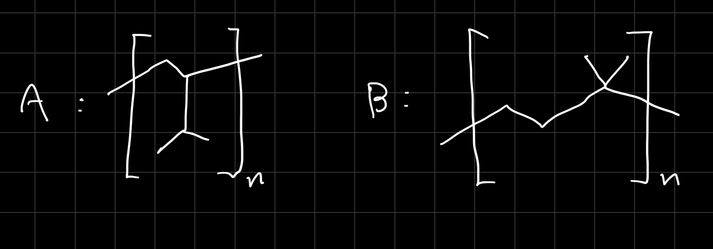{fig-alt="3-メチル-1-ブテンの直接付加由来A構造と転位由来B構造を描いた手書き構造式"}
:::

## 配位重合と高分子固体

#### 問題19　Ziegler–Natta 重合とポリエチレン

1. $\ce{TiCl4-AlEt3}$ によるエチレンの重合機構を示せ。
2. 高圧ラジカル重合ポリエチレンと低圧 Ziegler–Natta 重合ポリエチレンの構造・密度・結晶性を比較せよ。
3. 次の DSC 曲線 (i)、(ii) をそれぞれに対応させよ。

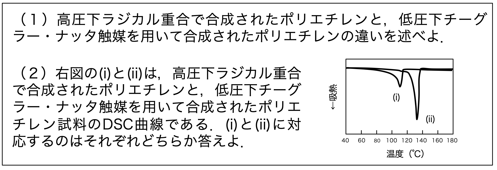{fig-alt="約110度の幅広いピークiと、約135度の鋭いピークiiを示すDSC曲線"}

::: {.callout-note collapse="true"}
##### 理論19：配位挿入は分岐を抑える

Ziegler–Natta 触媒では Ti–C 結合へエチレンが配位し、四中心遷移状態を経て挿入する。高圧ラジカル法の LDPE は分岐が多く、低密度・低結晶化度・低融点となる。低圧配位重合の HDPE はほぼ直鎖で、密に充填して高密度・高結晶化度・高融点となる。
:::

::: {.callout-tip collapse="true"}
##### 解答19

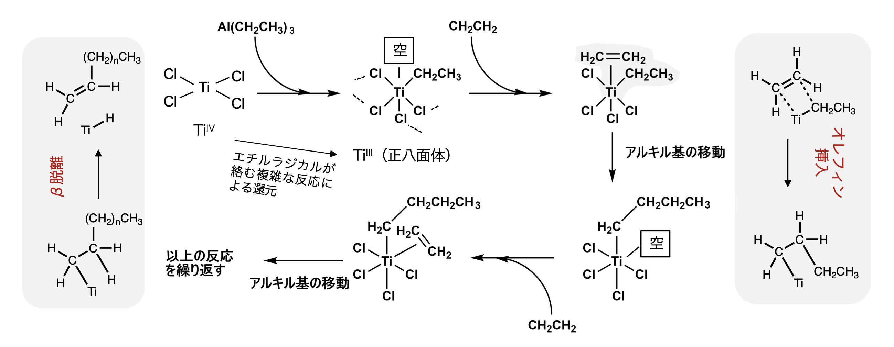{fig-alt="チタンアルキル結合へエチレンが配位し、挿入して鎖が成長するZiegler-Natta機構"}

高圧ラジカル法は分岐の多い LDPE、低圧 Ziegler–Natta 法は直鎖状 HDPE を与える。HDPE の方が密度・結晶化度・結晶サイズ・融点が高い。したがって (i) が LDPE、(ii) が HDPE である。
:::

#### 問題20　ガラス転移・融解と結晶化速度

1. 結晶性高分子と非晶性高分子を溶融状態から冷却したときの比体積–温度曲線を描け。
2. アイソタクチックポリスチレンの $T_g=100\,^\circ\mathrm C$、$T_m=240\,^\circ\mathrm C$ とする。結晶化速度の温度依存性を描き、理由を説明せよ。

::: {.callout-note collapse="true"}
##### 理論20：核生成の駆動力と鎖運動性が逆向きに変わる

非晶性高分子は $T_g$ で熱膨張係数が変わる。結晶性高分子では $T_m$ で融解による体積の不連続があり、非晶部分には $T_g$ も現れる。

$T_m$ 近傍では過冷却度が小さく核ができにくい。$T_g$ 近傍では分子鎖運動が遅い。したがって中間温度で結晶化速度が最大になる。この競合は[組織生成論](../3S/組織生成論.qmd)と同じ考え方である。
:::

::: {.callout-tip collapse="true"}
##### 解答20

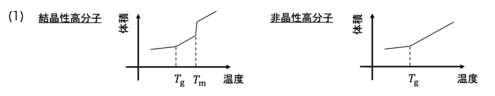{fig-alt="結晶性高分子はTgの折れ曲がりとTmの体積跳び、非晶性高分子はTgの折れ曲がりを示し、結晶化速度はTgとTmの間で最大となる図"}

$T_m$ 直下では核生成の駆動力が小さく、$T_g$ 付近では分子鎖運動が凍結するため、結晶化速度は両温度の間に最大をもつ。
:::

## 開環重合

#### 問題21　環状モノマーの重合熱力学

次表から、$25\,^\circ\mathrm C$ でほとんど重合しないラクトンを予想せよ。

$$
\begin{array}{c|r|r}
\text{モノマー}
&\Delta H/\mathrm{kJ\,mol^{-1}}
&\Delta S/\mathrm{J\,mol^{-1}K^{-1}}\\ \hline
\beta\text{-プロピオラクトン}&-75&-54\\
\gamma\text{-ブチロラクトン}&5&-30\\
\delta\text{-バレロラクトン}&-11&-15\\
\epsilon\text{-カプロラクトン}&-17&-4
\end{array}
$$

::: {.callout-note collapse="true"}
##### 理論21：重合自由エネルギーの符号で判定する

$$
\Delta G=\Delta H-T\Delta S
$$

であり、$\Delta G<0$ なら重合側が熱力学的に有利である。環ひずみの解放は負の $\Delta H$ を与える一方、鎖形成により一般に $\Delta S<0$ となる。この判定は[材料相平衡論](../2A/材料相平衡論.qmd)の自由エネルギー最小原理と同じである。
:::

::: {.callout-tip collapse="true"}
##### 解答21

$T=298\ \mathrm K$ として

$$
\Delta G=
-58.9,\ +13.9,\ -6.53,\ -15.8\ \mathrm{kJ\,mol^{-1}}
$$

の順になる。したがって

$$
\boxed{\gamma\text{-ブチロラクトン}}
$$

が最も重合しにくい。
:::

#### 問題22　アニオン開環重合

エチレンオキシド、$\beta$-プロピオラクトン、$\epsilon$-カプロラクタムのアニオン開環重合機構を示せ。

::: {.callout-note collapse="true"}
##### 理論22：求核攻撃する位置と脱離可能性を見分ける

エチレンオキシドではアルコキシドが炭素を攻撃し、新しいアルコキシド末端をつくる。ラクトンではカルボニル炭素への求核攻撃後、アシル–酸素結合が開裂する。ラクタムではラクタムアニオンと N-アシルラクタムを経る活性化モノマー機構で成長する。
:::

::: {.callout-tip collapse="true"}
##### 解答22

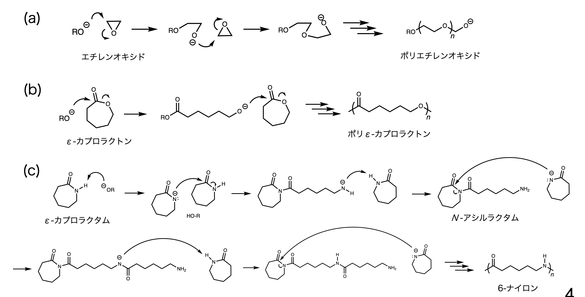{fig-alt="三員環エーテルの求核開環、ラクトンのアシル置換、ラクタムの活性化モノマー機構を示す反応式"}
:::

#### 問題23　ノルボルネンの ROMP

金属カルベン錯体 $\ce{L_mRu=CHR}$ を開始剤とするノルボルネンの開環メタセシス重合（ROMP）機構を示せ。

::: {.callout-note collapse="true"}
##### 理論23：メタラシクロブタンをつくって別方向へ開く

金属カルベンとノルボルネンの二重結合が [2+2] 付加し、メタラシクロブタン中間体をつくる。これが逆向きに開裂すると、開環した単位と新しい金属カルベン末端が生じる。環ひずみが開放されるため反応が進み、主鎖には二重結合が残る。
:::

::: {.callout-tip collapse="true"}
##### 解答23

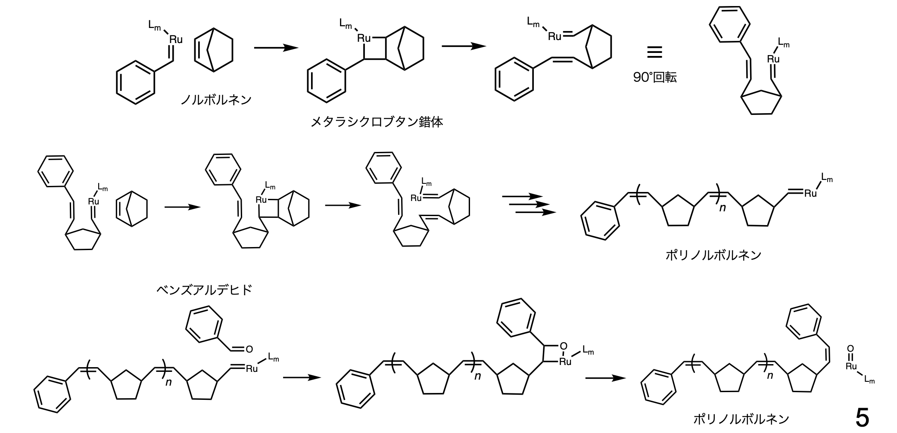{fig-alt="ルテニウムカルベンとノルボルネンからメタラシクロブタンを経てポリノルボルネンが成長する機構"}
:::

## 生体・環境高分子

#### 問題24　グルコースのアノマー平衡

水溶液中のグルコースは約63%が $\beta$ 体、約36%が $\alpha$ 体として存在する。$\beta$ 体が多い理由を説明せよ。

::: {.callout-note collapse="true"}
##### 理論24：いす形配座で置換基の向きを比べる

D-グルコピラノースの安定ないす形では、かさ高い置換基がアキシアル位にあると 1,3-ジアキシアル反発を受ける。$\alpha$ 体では C1 の OH がアキシアル、$\beta$ 体ではエクアトリアルである。
:::

::: {.callout-tip collapse="true"}
##### 解答24

$\beta$-D-グルコピラノースでは C1 の OH を含む主要置換基がすべてエクアトリアル位となり、1,3-ジアキシアル反発が小さい。したがって $\beta$ 体の方が熱力学的に安定で割合が多い。
:::

#### 問題25　PLA の生分解度

ポリ乳酸 $1.0\ \mathrm g$ を活性汚泥中で30日間分解させると、二酸化炭素が $0.72\ \mathrm g$ 発生した。ポリ乳酸を含まない対照では $0.08\ \mathrm g$ 発生した。完全酸化を基準とする生分解度を求めよ。

::: {.callout-note collapse="true"}
##### 理論25：対照を引き、繰返し単位の完全酸化量で割る

PLA の繰返し単位は $\ce{C3H4O2}$、モル質量は $72\ \mathrm{g\,mol^{-1}}$ である。

$$
\ce{C3H4O2 + 3O2 -> 3CO2 + 2H2O}
$$

活性汚泥自身の呼吸による $\ce{CO2}$ は対照値として差し引く。
:::

::: {.callout-tip collapse="true"}
##### 解答25

完全酸化で生じる $\ce{CO2}$ は

$$
\frac{1.0}{72}\times3\times44=1.83\ \mathrm g.
$$

PLA 由来の実測量は $0.72-0.08=0.64\ \mathrm g$ なので

$$
\boxed{
\text{生分解度}
=\frac{0.64}{1.83}
=0.35\simeq35\%
}.
$$
:::
