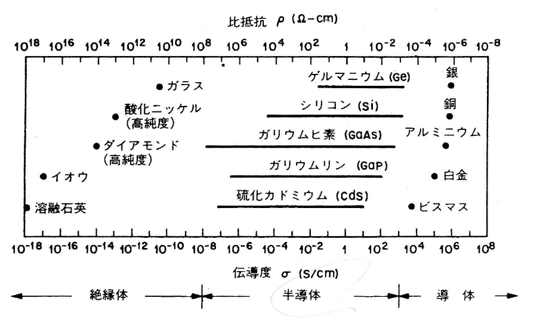
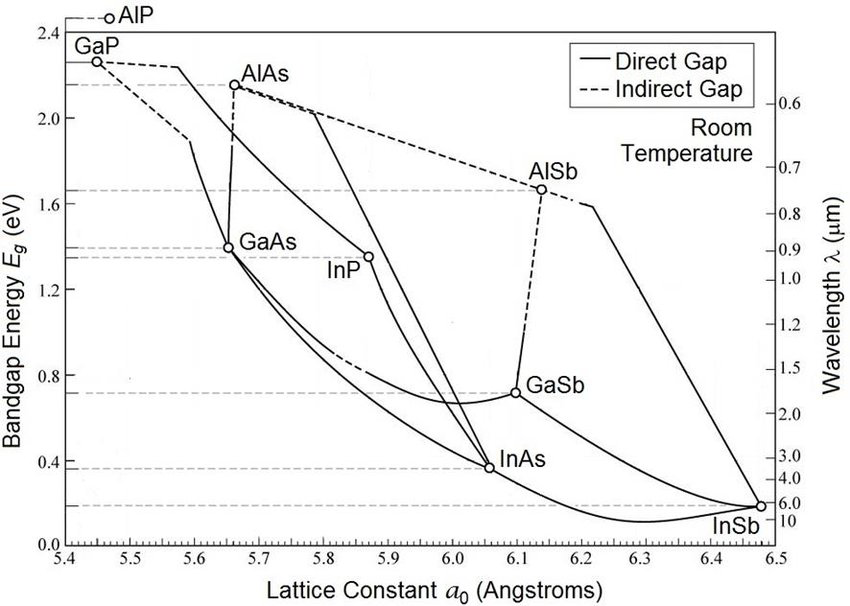

$$
\require{physics}
\require{mhchem}
$$

## このノートの読み方 {#semiconductor-reading-guide}

このノートは、過去問を元の並びのまま写したものではない。**初めて半導体を学ぶ人が、必要な道具を一つずつ増やせる順**に、重複する問題を一つへ統合した対策ノートである。

各問題は、次の順に読む。

1. まず問題文だけを読み、「何を説明すべきか」「何を求めるか」を自分の言葉で確認する。
2. 分からなければ「理論」を開き、式だけでなく「なぜその式になるか」を追う。
3. 理論を閉じ、白紙に図と式を再現する。
4. 最後に「解答」を開き、試験答案として必要な要素が過不足なく入っているかを比べる。

理論欄は初学者向けに長くしているが、解答欄はそのまま答案の骨格にできるよう簡潔にした。証明や導出では、途中式を暗記するよりも、**出発点・近似・境界条件・捨てた解**の四つを説明できることを目標にする。

::: {.callout-warning title="OCR過去問の扱い"}
文字起こし資料には数式コマンドの崩れや誤植があるため、本文では元PDFの問題文・式番号・記号を優先して数式を正規化した。空欄（あ）〜（し）は元PDFから復元し、末尾の総合問題に原文の論理順でまとめている。
:::

### 記号と単位

講義資料では電子密度・正孔密度を $N_e,N_h$ と書く場合がある。このノートでは半導体分野で一般的な

$$
n=N_e,\qquad p=N_h
$$

を主に使う。過剰キャリヤは平衡値との差

$$
\Delta n=n-n_0,\qquad \Delta p=p-p_0
$$

で表す。特に断らない限り、濃度は $\mathrm{cm^{-3}}$、移動度は $\mathrm{cm^2/(V\,s)}$、拡散係数は $\mathrm{cm^2/s}$、伝導度は $\mathrm{S/cm}$、比抵抗は $\Omega\,\mathrm{cm}$ で統一する。

::: {.callout-important}
### 答案で最初に書くこと

計算を始める前に、非縮退近似、完全電離、低注入、定常状態、電界なし、一次元など、使う近似を一行で宣言する。半導体の式は、同じ形でも成立条件が違えば意味が変わる。
:::

## 出題の全体地図 {#semiconductor-exam-map}

過去問は、一見すると多く見える。しかし、中心にあるのは「電子がどこにいるか」「何個いるか」「どう動くか」「接合すると何が起こるか」の四つである。

| 部 | 中心となる問い | 身につける道具 |
|---|---|---|
| 第1部 半導体をバンドで見る | なぜ物質によって電気の流れやすさが違うか | 伝導度、バンド、バンドギャップ、直接・間接遷移 |
| 第2部 電子の居場所を数える | 利用できる状態と電子の占有確率はいくつか | 状態密度、Fermi 分布、Boltzmann 近似、$n_i$ |
| 第3部 不純物でキャリヤを作る | ドーピングで何が変わるか | Bohr 模型、ドナー・アクセプタ、Fermi 準位、温度依存性 |
| 第4部 キャリヤはどう動くか | 電界・濃度差・再結合で流れはどう決まるか | 移動度、ドリフト、拡散、連続の式、拡散長 |
| 第5部 pn接合 | 接合した瞬間と電圧印加後に何が起こるか | 拡散電位、空乏層、Poisson 方程式、I--V、C--V |
| 第6部 金属・半導体接合 | 整流接触と低抵抗接触は何で決まるか | 仕事関数、Schottky 障壁、Ohmic 接触 |
| 第7部 異種半導体デバイス | 材料を組み合わせると何が良くなるか | 格子整合、バンドオフセット、光閉じ込め |
| 第8部 集積回路素子 | トランジスタとメモリはどう働くか | BJT、HEMT、MOSFET、CMOS、DRAM、微細化 |

この表で場所を確認したら、本文は第1部から順に読む。試験直前には、各問題を見て式と図を白紙から再現できるか点検する。

## 第1部 半導体をバンドで見る

この部では、半導体を「金属より少し電気を通しにくい物質」としてではなく、**電子が入れるエネルギーの構造を外から操作できる物質**として捉える。第2部以降の式は、ここで作るバンド図を数式にしたものである。

### 伝導度の図を読む {#semiconductor-conductivity-chart}

#### 問題A1 伝導度・比抵抗から物質を分類する

物質の伝導度 $\sigma$ と比抵抗 $\rho$ を横軸に取った図を考え、次の問いに答えよ。

1. $\sigma$ と $\rho$ の関係を示せ。
2. $\rho=1.0\times10^3\,\Omega\,\mathrm{cm}$ の試料について $\sigma$ を求め、図のどの領域に入るか答えよ。
3. 金属の点が狭い範囲に集まる一方、Si、Ge、GaAs などの半導体が広い範囲を占め得る理由を説明せよ。

{#fig-conductivity-source fig-alt="下側の対数軸に伝導度、上側の逆向き対数軸に比抵抗を取り、石英、ダイヤモンド、Si、Ge、GaAs、金属などの範囲を示す日本語の資料図。" width="95%"}

::: {.callout-note collapse="true"}
##### 理論A1：一つの電子ではなく、断面全体の流れを測る

上図は問題文に添付された資料である。次のPython図は、逆数軸と三分類の読み方を見失わないよう、同じ関係を模式的に再構成したもの。

```{python}
#| label: fig-conductivity-classification
#| fig-cap: '伝導度と比抵抗による物質の分類。境界値は厳密な物性定数ではなく、桁をつかむための目安である。'
#| fig-alt: '横軸の伝導度が右へ行くほど大きくなり、絶縁体、半導体、導体の順に並ぶ対数グラフ。上側には逆向きの比抵抗軸がある。'
#| warning: false

import numpy as np
import matplotlib.pyplot as plt

plt.rcParams.update({
    "font.family": "sans-serif",
    "font.sans-serif": [
        "Noto Sans JP", "Hiragino Sans", "Hiragino Kaku Gothic ProN", "DejaVu Sans"
    ],
    "axes.unicode_minus": False,
})

fig, ax = plt.subplots(figsize=(10, 4.8))
ax.set_xscale("log")
ax.set_xlim(1e-18, 1e8)
ax.set_ylim(0, 1)
ax.set_yticks([])
ax.set_xlabel(r"伝導度 $\sigma$ (S/cm)")

# 分類境界は慣用的な目安。半導体の可変性を強調する模式図である。
regions = [
    (1e-18, 1e-8, "絶縁体", "#5B8FF9"),
    (1e-8, 1e4, "半導体", "#F6BD16"),
    (1e4, 1e8, "導体", "#E8684A"),
]
for left, right, label, color in regions:
    ax.axvspan(left, right, color=color, alpha=0.18)
    ax.text(np.sqrt(left * right), 0.90, label, ha="center", va="center",
            fontsize=13, weight="bold", color=color)

examples = {
    "溶融石英": 1e-17,
    "高純度ダイヤモンド": 1e-13,
    "半導体\n（温度・光・ドーピングで移動）": 1e-1,
    "白金": 1e5,
    "銅・銀": 6e5,
}
ys = [0.26, 0.44, 0.58, 0.34, 0.56]
for (name, sigma), y in zip(examples.items(), ys):
    ax.scatter(sigma, y, s=48, color="#222222", zorder=3)
    ax.annotate(name, (sigma, y), xytext=(5, 7), textcoords="offset points",
                fontsize=9, ha="left")

# 上軸は同じ位置に逆数の値を表示する。左ほど比抵抗が大きい。
sec = ax.twiny()
sec.set_xscale("log")
sec.set_xlim(ax.get_xlim())
rho_tick_exponents = np.array([-18, -14, -10, -6, -2, 2, 6, 8])
sec.set_xticks(10.0 ** rho_tick_exponents)
sec.set_xticklabels([rf"$10^{{{-exponent}}}$" for exponent in rho_tick_exponents])
sec.set_xlabel(r"比抵抗 $\rho=1/\sigma$ ($\Omega$ cm)")

ax.grid(axis="x", which="both", alpha=0.18)
fig.patch.set_facecolor("white")
ax.set_facecolor("white")
plt.tight_layout()
plt.show()
```

**電流と電流密度。** 電流 $I$ は、断面を単位時間に通過する電荷である。通過電荷を $Q$、断面に垂直な電流密度成分を $J_\perp$ とすれば

$$
I=\dv{Q}{t}=\int_A J_\perp\,\dd A.
$$

電流密度が断面内で一様なら、断面積 $A$ で割った

$$
J=\frac{I}{A}
$$

を電流密度という。試料へ電界 $E$ をかけたとき、多くの物質では電界が強すぎない範囲で

$$
J=\sigma E
$$

が成り立つ。比例係数 $\sigma$ が**電気伝導度**であり、大きいほど同じ電界で大きな電流が流れる。

同じ関係を「流れにくさ」で書いた量が**比抵抗**である。

$$
E=\rho J,\qquad \boxed{\rho=\frac{1}{\sigma}}.
$$

$\sigma$ の単位を $\mathrm{S/cm}$ とすれば、$\rho$ の単位は $\Omega\,\mathrm{cm}$ になる。したがって伝導度の軸を右へ進むと、比抵抗の軸では左へ進む。二つは別の現象ではなく、同じ流れやすさを逆数で見ている。

**なぜ対数軸を使うのか。** 絶縁体から金属までの $\sigma$ は二十桁以上にわたる。一目盛を同じ「差」ではなく同じ「倍率」にする対数軸なら、$10^{-12}$ から $10^{-10}$ への変化と、$10^2$ から $10^4$ への変化を、どちらも百倍として同じ距離で描ける。

**分類境界は壁ではない。** 「ここから半導体」という唯一の厳密な伝導度はない。特に半導体では、温度、光、不純物濃度によってキャリヤ数が大きく変わるため、同じ材料でも図の上を何桁も移動する。金属では自由に動ける電子が初めから多数いるので、通常の条件ではキャリヤ数が桁違いには変わらず、比較的狭い範囲に集まる。

直感的には、金属は「初めから人で満たされた広い道路」、絶縁体は「道路へ上がるまでに高い壁がある土地」、半導体は「温度・光・不純物で道路へ人を補充できる土地」である。道路の有無と壁の高さは [問題A2](#semiconductor-band-classification) でバンドとして定式化する。
:::

::: {.callout-tip collapse="true"}
##### 解答A1

1. $J=\sigma E=E/\rho$ より
   $$
   \boxed{\rho=\frac1\sigma}.
   $$
2.
   $$
   \sigma=\frac{1}{1.0\times10^3}
   =1.0\times10^{-3}\,\mathrm{S/cm}.
   $$
   図では半導体領域に入る。
3. 金属では可動電子がもともと多く、通常の温度・光・不純物変化でその数は桁違いには変わらない。一方、半導体では熱励起、光励起、ドーピングによりキャリヤ密度が何桁も変化するため、$\sigma=q(n\mu_n+p\mu_p)$ も広範囲に変わる。
:::

### バンド構造による分類 {#semiconductor-band-classification}

#### 問題A2 導体・半導体・絶縁体をエネルギーバンドで説明する

1. 導体と半導体の電気伝導性の違いを、占有されたバンドと空いた状態の位置に注目して説明せよ。
2. 半導体と絶縁体の違いを、エネルギーギャップ $E_g$ と熱励起に注目して説明せよ。
3. 真性半導体の価電子帯から伝導帯へ電子が一つ励起されたとき、電流を運ぶものを二つ答えよ。

::: {.callout-note collapse="true"}
##### 理論A2：満席の列では動けない

```{python}
#| label: fig-band-classification
#| fig-cap: '導体・半導体・絶縁体の模式的なバンド図。灰色は電子で占有された状態、白色は空いた状態を表す。'
#| fig-alt: '導体ではフェルミ準位がバンド内にあり、半導体では小さい禁制帯、絶縁体では大きい禁制帯が価電子帯と伝導帯を隔てる三つの模式図。'
#| warning: false

import matplotlib.pyplot as plt
from matplotlib.patches import Rectangle

plt.rcParams.update({
    "font.family": "sans-serif",
    "font.sans-serif": [
        "Noto Sans JP", "Hiragino Sans", "Hiragino Kaku Gothic ProN", "DejaVu Sans"
    ],
    "axes.unicode_minus": False,
})

fig, axes = plt.subplots(1, 3, figsize=(10, 4.8), sharey=True)
titles = ["導体", "半導体", "絶縁体"]
gaps = [0.0, 0.9, 2.0]

for ax, title, gap in zip(axes, titles, gaps):
    ax.set_xlim(0, 1)
    ax.set_ylim(0, 5)
    ax.set_xticks([])
    ax.set_yticks([])
    ax.set_title(title, fontsize=14, weight="bold")
    for spine in ax.spines.values():
        spine.set_visible(False)

    if title == "導体":
        # 一つのバンドが部分的に占有され、直上に空状態がある。
        ax.add_patch(Rectangle((0.14, 1.1), 0.72, 2.8,
                               facecolor="#D9D9D9", edgecolor="#333333"))
        ax.add_patch(Rectangle((0.14, 2.55), 0.72, 1.35,
                               facecolor="white", edgecolor="none"))
        ef = 2.55
        ax.text(0.50, 1.75, "占有状態", ha="center", va="center")
        ax.text(0.50, 3.20, "空状態", ha="center", va="center")
        ax.annotate("すぐ上へ移れる", xy=(0.50, 2.72), xytext=(0.50, 4.35),
                    ha="center", arrowprops=dict(arrowstyle="->", color="#E8684A"),
                    color="#E8684A")
    else:
        ev_top = 2.1 - gap / 2
        ec_bottom = 2.1 + gap / 2
        ax.add_patch(Rectangle((0.14, 0.55), 0.72, ev_top - 0.55,
                               facecolor="#D9D9D9", edgecolor="#333333"))
        ax.add_patch(Rectangle((0.14, ec_bottom), 0.72, 4.45 - ec_bottom,
                               facecolor="white", edgecolor="#333333"))
        ef = (ev_top + ec_bottom) / 2
        ax.text(0.50, max(0.82, ev_top - 0.35), "価電子帯", ha="center")
        ax.text(0.50, ec_bottom + 0.28, "伝導帯", ha="center")
        ax.annotate("", xy=(0.50, ec_bottom + 0.03), xytext=(0.50, ev_top - 0.03),
                    arrowprops=dict(arrowstyle="<->", color="#5B8FF9", lw=2))
        ax.text(0.57, ef, r"$E_g$", va="center", color="#5B8FF9", fontsize=13)

    ax.axhline(ef, ls="--", lw=1.4, color="#7A5195")
    ax.text(0.03, ef + 0.08, r"$E_F$", color="#7A5195", fontsize=11)

axes[0].set_ylabel("電子のエネルギー  $E$  ↑", fontsize=12)
fig.patch.set_facecolor("white")
for ax in axes:
    ax.set_facecolor("white")
plt.tight_layout()
plt.show()
```

**孤立原子からバンドへ。** 原子が一個だけなら、電子が取れるエネルギーは飛び飛びである。多数の原子を結晶として近づけると、同じ原子準位が原子数だけ細かく分裂し、ほぼ連続に見える**許容帯（バンド）**を作る。バンドとバンドの間の、電子が存在できない範囲が**禁制帯**である。

半導体では、0 K で電子が入っている最上部のバンドを価電子帯、その上の空いたバンドを伝導帯と呼ぶ。価電子帯上端を $E_v$、伝導帯下端を $E_c$ とすれば、バンドギャップは

$$
\boxed{E_g=E_c-E_v}
$$

である。

**電流には「すぐ移れる空席」が必要。** 電界をかけると、電子はエネルギーと運動状態を少し変える。しかし、Pauli の排他原理により、既に別の電子が入っている状態へは移れない。満席の映画館で全員が一席ずつ右へ動こうとしても、空席がなければ誰も動けないのと同じである。

- **導体：** Fermi 準位 $E_F$ がバンドの途中にあり、占有状態のすぐ上に空状態がある。または二つのバンドが重なっている。小さな電界でも電子が近くの空状態へ移れる。
- **半導体：** 0 K では価電子帯がほぼ満杯、伝導帯が空で、その間に比較的小さな $E_g$ がある。有限温度、光、不純物によって一部の電子を伝導帯へ上げられる。
- **絶縁体：** 0 K の占有の仕方は半導体と同じだが、通常は $E_g$ が大きく、室温や可視光程度では十分な数の電子を伝導帯へ上げにくい。

半導体と絶縁体の境界は、伝導度の境界と同様に厳密な一本線ではない。温度、欠陥、測定時間、必要とする電流量によって実用上の分類は変わる。

**電子を上げると、穴も残る。** 価電子帯の電子が伝導帯へ移ると、伝導帯には動ける電子が一個増える。同時に価電子帯には空席が一個残る。周囲の価電子がその空席へ次々に移る様子は、正電荷を持つ粒子が逆向きに動くように見える。この空席を**正孔**と呼ぶ。したがって真性半導体では、熱励起一回につき電子と正孔が一対ずつ生じる。

後で導く真性キャリヤ密度は、おおまかに

$$
n_i\propto \exp\left(-\frac{E_g}{2kT}\right)
$$

と変化する。$E_g$ の差が少しでもキャリヤ密度には指数関数的な差となるため、半導体と絶縁体の電気伝導性は大きく異なる。
:::

::: {.callout-tip collapse="true"}
##### 解答A2

1. 導体では Fermi 準位がバンド内にあり、占有状態の直上に空状態があるため、小さな電界で電子が状態を変えて電流を運べる。半導体では 0 K で価電子帯が満たされ、伝導帯との間に禁制帯があるため、伝導帯へ励起された電子がない限り電流は流れにくい。
2. 半導体と絶縁体はいずれも満たされた価電子帯と空の伝導帯を持つが、絶縁体は一般に $E_g$ が大きい。したがって室温で伝導帯へ熱励起される電子・正孔対が半導体より著しく少ない。
3. 伝導帯の**電子**と、価電子帯に残った**正孔**が電流を運ぶ。
:::

### Si・Geと直接遷移・間接遷移 {#semiconductor-si-ge-transition}

#### 問題A3 SiとGeを比較し、光る半導体の条件を説明する

1. 直接遷移型半導体と間接遷移型半導体の違いを、$E$--$k$ 図と運動量保存に基づいて説明せよ。
2. Si と Ge の共通点・相違点を、バンドギャップ、移動度、酸化膜、熱的性質の観点からまとめよ。
3. 現在 Si が集積回路の主材料である理由と、Ge の利用が期待される分野を説明せよ。

::: {.callout-note collapse="true"}
##### 理論A3：エネルギーだけでなく、結晶運動量も受け渡す

```{python}
#| label: fig-direct-indirect-gap
#| fig-cap: '直接遷移型と間接遷移型の模式的な $E$--$k$ 図。光子の運動量は結晶中の電子の運動量尺度に比べて小さいため、間接遷移にはフォノンが必要になる。'
#| fig-alt: '左は価電子帯上端と伝導帯下端が同じ波数にある直接遷移、右は異なる波数にある間接遷移。左には垂直な光学遷移、右には光子とフォノンを組み合わせた遷移の矢印がある。'
#| warning: false

import numpy as np
import matplotlib.pyplot as plt

plt.rcParams.update({
    "font.family": "sans-serif",
    "font.sans-serif": [
        "Noto Sans JP", "Hiragino Sans", "Hiragino Kaku Gothic ProN", "DejaVu Sans"
    ],
    "axes.unicode_minus": False,
})

k = np.linspace(-1.3, 1.3, 500)
fig, axes = plt.subplots(1, 2, figsize=(10, 4.7), sharey=True)

# 直接遷移：CBMとVBMが同じk=0。
ev_direct = -0.70 * k**2
ec_direct = 1.10 + 0.85 * k**2
axes[0].plot(k, ec_direct, color="#E8684A", lw=2.5, label="伝導帯")
axes[0].plot(k, ev_direct, color="#5B8FF9", lw=2.5, label="価電子帯")
axes[0].annotate("光子", xy=(0, 1.08), xytext=(0, 0.08), ha="center",
                 arrowprops=dict(arrowstyle="->", lw=2.2, color="#54A24B"),
                 color="#54A24B", weight="bold")
axes[0].set_title("直接遷移型（例：GaAs）", weight="bold")

# 間接遷移：CBMをk0へずらす。
k0 = 0.72
ev_indirect = -0.70 * k**2
ec_indirect = 1.10 + 0.85 * (k - k0)**2
axes[1].plot(k, ec_indirect, color="#E8684A", lw=2.5)
axes[1].plot(k, ev_indirect, color="#5B8FF9", lw=2.5)
axes[1].annotate("光子", xy=(0, 1.10 + 0.85 * k0**2), xytext=(0, 0.08), ha="center",
                 arrowprops=dict(arrowstyle="->", lw=1.8, color="#54A24B"),
                 color="#54A24B")
axes[1].annotate("フォノン", xy=(k0, 1.10),
                 xytext=(0.06, 1.10 + 0.85 * k0**2 + 0.08),
                 arrowprops=dict(arrowstyle="->", lw=1.8, color="#7A5195"),
                 color="#7A5195", ha="left")
axes[1].set_title("間接遷移型（例：Si、Ge）", weight="bold")

for ax in axes:
    ax.axvline(0, color="#888888", lw=0.8, alpha=0.5)
    ax.axhline(0, color="#888888", lw=0.8, alpha=0.5)
    ax.set_xlim(-1.25, 1.25)
    ax.set_ylim(-1.25, 2.3)
    ax.set_xlabel(r"波数 $k$")
    ax.set_xticks([0])
    ax.set_xticklabels([r"$0$"])
    ax.set_yticks([])
    ax.set_facecolor("white")
    for spine in ("top", "right"):
        ax.spines[spine].set_visible(False)

axes[0].set_ylabel(r"エネルギー $E$")
axes[0].legend(frameon=False, loc="upper left")
fig.patch.set_facecolor("white")
plt.tight_layout()
plt.show()
```

**バンドには場所と傾きがある。** バンド図には、縦軸をエネルギー $E$、横軸を波数 $k$ とした $E$--$k$ 図がある。$k$ は結晶中の電子の波の進み方を表し、結晶運動量 $\hbar k$ に対応する。

電子と正孔が再結合して光子を出すには、エネルギー保存だけでなく結晶運動量保存も満たさなければならない。

- **直接遷移型：** 伝導帯の最低点と価電子帯の最高点が同じ $k$ にある。光子の運動量は小さいので、図ではほぼ垂直に遷移できる。二粒子だけで条件を満たしやすく、放射再結合が起こりやすい。
- **間接遷移型：** 二つの点が異なる $k$ にある。光子だけでは横方向の運動量差を埋められず、格子振動の量子である**フォノン**の吸収または放出も必要になる。三者が同時に関わるため、放射再結合の確率は低い。

ボールを同じ階の真上へ投げるのが直接遷移、別の階の横にずれた窓へ届けるために壁へ一度当てるのが間接遷移、と考えるとよい。壁に相当するものがフォノンである。

Si と Ge はともにダイヤモンド構造を持つ間接遷移型半導体である。代表的な室温物性を比較すると次のようになる。数値は結晶品質、方位、不純物濃度によって変化するので、桁と大小関係を使う。

| 性質（約300 K） | Si | Ge | 設計上の意味 |
|---|---:|---:|---|
| 間接バンドギャップ | 約 $1.12\,\mathrm{eV}$ | 約 $0.66\,\mathrm{eV}$ | Ge は熱励起キャリヤと漏れ電流が増えやすい |
| 格子定数 | 約 $5.43\,\text{Å}$ | 約 $5.66\,\text{Å}$ | 直接積層すると格子不整合ひずみを考える必要がある |
| 電子移動度の代表値 | 約 $1.4\times10^3\,\mathrm{cm^2/(V\,s)}$ | 約 $3.9\times10^3\,\mathrm{cm^2/(V\,s)}$ | Ge は高速チャネル材料として有望 |
| 正孔移動度の代表値 | 約 $4.5\times10^2\,\mathrm{cm^2/(V\,s)}$ | 約 $1.9\times10^3\,\mathrm{cm^2/(V\,s)}$ | 特に p チャネルで Ge の利点が大きい |
| 表面酸化膜 | 高品質な $\ce{SiO2}$ を形成しやすい | 自然酸化膜と界面の制御が難しい | Si は MOS 技術を作りやすい |
| 融点・熱的余裕 | Ge より高い | Si より低い | Si は高温プロセスへ適合しやすい |

表の代表値は、Ioffe Institute の NSM Archive に掲載された [Si の基本物性](https://www.ioffe.ru/SVA/NSM/Semicond/Si/basic.html)、[Si のバンド物性](https://www.ioffe.ru/SVA/NSM/Semicond/Si/bandstr.html)、[Si の電気物性](https://www.ioffe.ru/SVA/NSM/Semicond/Si/electric.html)、および [Ge の物性データ](https://www.ioffe.ru/SVA/NSM/Semicond/Ge/) と照合した。直接・間接遷移とフォノンによる運動量保存は [MIT OpenCourseWare, Lecture 18](https://ocw.mit.edu/courses/3-024-electronic-optical-and-magnetic-properties-of-materials-spring-2013/833afa926e598523708318bdf7d6a4ed_MIT3_024S13_2012lec18.pdf) も参照できる。

**なぜ Si が主流か。** Si の強さは移動度が最大だからではない。地殻中に豊富で、大口径・高純度結晶を作りやすく、比較的大きい $E_g$ で室温漏れ電流を抑えやすい。さらに、表面に安定で絶縁性に優れた $\ce{SiO2}$ を形成できることが、MOSFET と集積回路の発展を決定的に支えた。長年蓄積された製造設備、欠陥制御、設計資産も含めた**工程全体の強さ**である。

**Ge の将来性。** Ge は電子・正孔移動度が高く、赤外光に応答しやすい。そこで Si 基板上の高移動度チャネル、Si フォトニクス用の受光器、SiGe 合金によるひずみ・バンド制御などに価値がある。一方、狭い $E_g$ による漏れ電流、界面準位、熱工程、Si との格子不整合を同時に解く必要がある。

::: {.callout-warning}
##### 「バンドギャップが小さいほど発光しやすい」ではない

発光波長は主に $E_g$ で決まるが、発光効率は直接遷移か間接遷移かに強く依存する。Si や Ge の $E_g$ が小さくても、間接遷移なので通常のバルク結晶は効率のよい発光材料にはなりにくい。
:::
:::

::: {.callout-tip collapse="true"}
##### 解答A3

1. 直接遷移型では伝導帯最低点と価電子帯最高点が同じ $k$ にあり、運動量の小さい光子だけでほぼ垂直遷移できる。間接遷移型では両者の $k$ が異なるため、運動量保存にフォノンも必要であり、放射再結合確率が低い。
2. Si と Ge はともにダイヤモンド構造の間接遷移型半導体である。Ge は $E_g$ が小さく電子・正孔移動度が高いが、熱励起キャリヤと漏れ電流が増えやすく、絶縁膜界面の形成も難しい。Si は $E_g$ がより大きく、熱的に扱いやすく、高品質な $\ce{SiO2}$ を形成できる。
3. Si は資源量、結晶・プロセス技術、低い漏れ電流、良好な $\ce{Si/SiO2}$ 界面を総合的に備えるため集積回路の主材料である。Ge は高移動度チャネル、SiGe ひずみ技術、赤外受光器などで有望である。
:::

## 第2部 電子の「席」と「座っている確率」を数える

### 状態密度とフェルミ分布 {#semiconductor-density-of-states}

#### 問題B1 状態密度とキャリヤ密度を導出する

三次元の放物線型伝導帯

$$
E(k)=E_\mathrm{c}+\frac{\hbar^2k^2}{2m_\mathrm{n}^*}
$$

を考える。

1. 単位体積・単位エネルギー当たりの電子状態密度 $g_\mathrm{c}(E)$ を導出せよ。
2. フェルミ分布 $f(E)$ を記し、電子濃度 $n$ を積分で表せ。
3. 非縮退条件でボルツマン近似し、$n=N_\mathrm{c}\exp[-(E_\mathrm{c}-E_\mathrm{F})/(k_\mathrm{B}T)]$ を導け。正孔濃度 $p$ も示せ。

::: {.callout-note collapse="true"}
##### 理論B1：席の数 × 着席確率

**最初に役割を分ける。** 状態密度 $g(E)$ は「そのエネルギー付近に電子用の席がいくつあるか」、フェルミ分布 $f(E)$ は「各席が電子に占有される確率」である。したがって、実際の電子数は

$$
\text{電子濃度}=\int \text{席の密度}\times\text{着席確率}\,\dd E
$$

で数えられる。

一辺 $L$、体積 $V=L^3$ の結晶に周期境界条件を課すと、$k$ 空間で一状態が占める体積は $(2\pi/L)^3$ である。半径 $k$ の球内にある状態を、スピンの二重縮退も含めて数えると

$$
\frac{N(k)}{V}
=2\frac{(4\pi/3)k^3}{(2\pi)^3}
=\frac{k^3}{3\pi^2}.
$$

伝導帯底からのエネルギーを $\varepsilon=E-E_\mathrm{c}$ とすれば

$$
k=\frac{\sqrt{2m_\mathrm{n}^*\varepsilon}}{\hbar}.
$$

よって、単位エネルギー当たりの状態数は

$$
\begin{aligned}
g_\mathrm{c}(E)
&=\dv{}{E}\left(\frac{N}{V}\right)\\
&=\frac{1}{2\pi^2}
\left(\frac{2m_\mathrm{n}^*}{\hbar^2}\right)^{3/2}
\sqrt{E-E_\mathrm{c}}
\qquad(E\ge E_\mathrm{c}).
\end{aligned}
$$

三次元では、バンド端から離れるほど半径の大きい $k$ 球を使えるため、席の数が $\sqrt{E-E_\mathrm{c}}$ で増える。

フェルミ分布は

$$
f(E)=\frac{1}{1+\exp[(E-E_\mathrm{F})/(k_\mathrm{B}T)]}.
$$

$E=E_\mathrm{F}$ なら常に $f=1/2$ である。$E_\mathrm{c}-E_\mathrm{F}$ が数 $k_\mathrm{B}T$ 以上離れた**非縮退半導体**では、伝導帯中で $\exp[(E-E_\mathrm{F})/(k_\mathrm{B}T)]\gg1$ なので

$$
f(E)\simeq\exp\left(-\frac{E-E_\mathrm{F}}{k_\mathrm{B}T}\right).
$$

したがって

$$
\begin{aligned}
n
&=\int_{E_\mathrm{c}}^\infty g_\mathrm{c}(E)f(E)\,\dd E\\
&=\frac{1}{2\pi^2}\left(\frac{2m_\mathrm{n}^*}{\hbar^2}\right)^{3/2}
e^{-(E_\mathrm{c}-E_\mathrm{F})/(k_\mathrm{B}T)}
\int_0^\infty \sqrt{\varepsilon}\,e^{-\varepsilon/(k_\mathrm{B}T)}\,\dd\varepsilon.
\end{aligned}
$$

ここで

$$
\int_0^\infty \sqrt{\varepsilon}\,e^{-\varepsilon/(k_\mathrm{B}T)}\,\dd\varepsilon
=\frac{\sqrt\pi}{2}(k_\mathrm{B}T)^{3/2}
$$

を使うと

$$
n=N_\mathrm{c}\exp\left(-\frac{E_\mathrm{c}-E_\mathrm{F}}{k_\mathrm{B}T}\right),
\qquad
N_\mathrm{c}=2\left(\frac{2\pi m_\mathrm{n}^*k_\mathrm{B}T}{h^2}\right)^{3/2}.
$$

価電子帯では「電子がいない席」を正孔として数える。全く同様に

$$
p=N_\mathrm{v}\exp\left(-\frac{E_\mathrm{F}-E_\mathrm{v}}{k_\mathrm{B}T}\right),
\qquad
N_\mathrm{v}=2\left(\frac{2\pi m_\mathrm{p}^*k_\mathrm{B}T}{h^2}\right)^{3/2}.
$$

```{python}
#| label: fig-dos-fermi-product
#| fig-cap: '状態密度（席）、フェルミ分布（着席確率）、その積（実際の電子分布）の関係。横軸は $k_\mathrm{B}T$ で規格化した伝導帯端からのエネルギー。'
#| fig-alt: '状態密度はバンド端から平方根で増え、占有確率は指数的に減り、その積は伝導帯端の少し上に山を持つ。'
#| warning: false

import numpy as np
import matplotlib.pyplot as plt

x = np.linspace(0, 8, 500)               # (E-Ec)/kT
eta = -3.0                               # (EF-Ec)/kT: nondegenerate
dos = np.sqrt(x)
fermi = 1 / (1 + np.exp(x - eta))
occupied = dos * fermi

fig, axes = plt.subplots(1, 3, figsize=(11, 3.2), sharex=True)
for ax in axes:
    ax.grid(alpha=0.22)
    ax.set_xlabel(r"$(E-E_c)/k_BT$")

axes[0].plot(x, dos, color="#2563eb", lw=2.5)
axes[0].fill_between(x, dos, color="#2563eb", alpha=0.18)
axes[0].set_title("Available states")
axes[0].set_ylabel("relative value")

axes[1].plot(x, fermi, color="#dc2626", lw=2.5)
axes[1].set_title("Occupation probability")
axes[1].set_ylim(bottom=0)

axes[2].plot(x, occupied, color="#059669", lw=2.5)
axes[2].fill_between(x, occupied, color="#059669", alpha=0.2)
axes[2].set_title("Electrons = product")
axes[2].set_ylim(bottom=0)

plt.tight_layout()
plt.show()
```

::: {.callout-warning}
##### ボルツマン近似を使えない場合

$E_\mathrm{F}$ がバンド端へ近づく高濃度ドープ（縮退）では近似が崩れる。その場合はフェルミ分布を残してフェルミ積分を使う。「いつでも $n=N_\mathrm{c}e^{-(E_\mathrm{c}-E_\mathrm{F})/kT}$」ではない。
:::
:::

::: {.callout-tip collapse="true"}
##### 解答B1

$$
\boxed{
g_\mathrm{c}(E)=\frac{1}{2\pi^2}
\left(\frac{2m_\mathrm{n}^*}{\hbar^2}\right)^{3/2}
\sqrt{E-E_\mathrm{c}}
}
$$

$$
f(E)=\frac{1}{1+e^{(E-E_\mathrm{F})/(k_\mathrm{B}T)}},
\qquad
n=\int_{E_\mathrm{c}}^\infty g_\mathrm{c}(E)f(E)\,\dd E.
$$

$E-E_\mathrm{F}\gg k_\mathrm{B}T$ なら $f(E)\simeq e^{-(E-E_\mathrm{F})/(k_\mathrm{B}T)}$ であり、積分すると

$$
\boxed{n=N_\mathrm{c}e^{-(E_\mathrm{c}-E_\mathrm{F})/(k_\mathrm{B}T)}},
\qquad
\boxed{p=N_\mathrm{v}e^{-(E_\mathrm{F}-E_\mathrm{v})/(k_\mathrm{B}T)}}.
$$
:::

### 真性半導体と質量作用則 {#semiconductor-intrinsic}

#### 問題B2 真性キャリヤ密度と真性フェルミ準位を求める

1. $np=n_\mathrm{i}^2$ と $n_\mathrm{i}$ の式を導け。
2. 真性フェルミ準位 $E_\mathrm{i}$ を求め、$N_\mathrm{c}=2.86\times10^{19}$、$N_\mathrm{v}=2.66\times10^{19}\ \mathrm{cm^{-3}}$ を用いて、300 K の Si で禁制帯中央からどれだけずれるか計算せよ。
3. バンドギャップ $E_\mathrm{g}$ が大きいほど、真性キャリヤ密度と電気伝導度がどうなるか述べよ。

::: {.callout-note collapse="true"}
##### 理論B2：電子を一つ作ると正孔も一つできる

真性半導体では、価電子帯から伝導帯へ電子が一つ励起されるたびに、価電子帯へ正孔が一つ残る。したがって

$$
n=p=n_\mathrm{i}.
$$

一方、問題B1の二式を掛けるとフェルミ準位が消えて

$$
\begin{aligned}
np
&=N_\mathrm{c}N_\mathrm{v}
\exp\left[-\frac{(E_\mathrm{c}-E_\mathrm{F})+(E_\mathrm{F}-E_\mathrm{v})}{k_\mathrm{B}T}\right]\\
&=N_\mathrm{c}N_\mathrm{v}\exp\left(-\frac{E_\mathrm{g}}{k_\mathrm{B}T}\right)
=n_\mathrm{i}^2.
\end{aligned}
$$

よって

$$
\boxed{
n_\mathrm{i}=\sqrt{N_\mathrm{c}N_\mathrm{v}}
\exp\left(-\frac{E_\mathrm{g}}{2k_\mathrm{B}T}\right)
}.
$$

指数関数の意味が重要である。$E_\mathrm{g}$ は「電子を価電子帯から伝導帯へ持ち上げる壁の高さ」なので、壁が少し高くなるだけでも、熱で越えられる電子は急激に減る。

真性条件 $n=p$ を二式へ代入して比を取れば

$$
\boxed{
E_\mathrm{i}=\frac{E_\mathrm{c}+E_\mathrm{v}}{2}
+\frac{k_\mathrm{B}T}{2}\ln\left(\frac{N_\mathrm{v}}{N_\mathrm{c}}\right)
}.
$$

この式は、価電子帯側と伝導帯側で利用できる状態数が違うと、$n=p$ にするためのフェルミ準位が中央から少し動くことを表す。したがって空欄問題の

$$
(\text{お})\quad
n_\mathrm{i}=\sqrt{N_\mathrm{c}N_\mathrm{v}}
\exp\left(-\frac{E_\mathrm{g}}{2k_\mathrm{B}T}\right),
$$

$$
(\text{か})\quad
\frac{k_\mathrm{B}T}{2}\ln\left(\frac{N_\mathrm{v}}{N_\mathrm{c}}\right)
$$

が得られる。300 K で $k_\mathrm{B}T=0.025875\ \mathrm{eV}$ とすれば、中央からのずれは

$$
\frac{0.025875}{2}\ln\frac{2.66}{2.86}
=-9.38\times10^{-4}\ \mathrm{eV}
$$

であり、価電子帯側へ約 $0.94\ \mathrm{meV}$ ずれる。

:::

::: {.callout-tip collapse="true"}
##### 解答B2

$$
\boxed{np=n_\mathrm{i}^2},
\qquad
\boxed{
n_\mathrm{i}=\sqrt{N_\mathrm{c}N_\mathrm{v}}
e^{-E_\mathrm{g}/(2k_\mathrm{B}T)}
}.
$$

真性フェルミ準位は

$$
\boxed{
E_\mathrm{i}
=\frac{E_\mathrm{c}+E_\mathrm{v}}{2}
+\frac{k_\mathrm{B}T}{2}\ln\frac{N_\mathrm{v}}{N_\mathrm{c}}
}.
$$

したがって

$$
E_\mathrm{i}-\frac{E_\mathrm{c}+E_\mathrm{v}}2
=\frac{0.025875}{2}\ln\frac{2.66}{2.86}
=\boxed{-9.38\times10^{-4}\ \mathrm{eV}}.
$$

$E_\mathrm{g}$ が大きいほど $n_\mathrm{i}$ は指数関数的に小さくなり、移動度が同程度なら $\sigma=q(n\mu_\mathrm{n}+p\mu_\mathrm{p})$ も小さくなる。
:::

## 第3部 不純物でキャリヤを作る

### 水素原子模型からドナー準位へ {#semiconductor-donor-bohr}

#### 問題C1 水素の準位とSi中Asドナーの束縛を求める

1. ボーア模型から水素原子のエネルギー準位とリュードベリ定数を導け。
2. 水素様模型を半導体中のドナーへ写し、Si中Asの束縛エネルギー $E_\mathrm{B}$ と有効ボーア半径 $a_\mathrm{B}^*$ を概算せよ。$\varepsilon_\mathrm{r}=11.9$、$m_\mathrm{n}^*=0.26m_0$ とする。

::: {.callout-note collapse="true"}
##### 理論C1：クーロン力を弱め、電子を軽くする

ボーア模型では、円運動の向心力をクーロン力が与え、角運動量が $n\hbar$ に量子化されると仮定する。

$$
\frac{mv_n^2}{r_n}=\frac{q^2}{4\pi\varepsilon_0r_n^2},
\qquad
mv_nr_n=n\hbar.
$$

二式から

$$
r_n=\frac{4\pi\varepsilon_0\hbar^2}{mq^2}n^2=a_0n^2
$$

を得る。運動エネルギーと位置エネルギーの和は

$$
E_n=-\frac{mq^4}{2(4\pi\varepsilon_0)^2\hbar^2}\frac1{n^2}
=-\frac{13.6\ \mathrm{eV}}{n^2}.
$$

$m>n$ の準位から $n$ の準位へ落ちるとき

$$
\frac{hc}{\lambda}=E_m-E_n
$$

なので

$$
\frac1\lambda=R\left(\frac1{n^2}-\frac1{m^2}\right),
\qquad
R=\frac{m_0q^4}{8\varepsilon_0^2h^3c}.
$$

半導体中のドナーは、「正に帯電したドナー核の周りへ余分な電子がゆるく束縛された水素」と見なせる。ただし、結晶は電場を $\varepsilon_\mathrm{r}$ 倍遮蔽し、電子の慣性は有効質量 $m_\mathrm{n}^*$ で表す。水素式で

$$
\varepsilon_0\to\varepsilon_\mathrm{r}\varepsilon_0,
\qquad
m_0\to m_\mathrm{n}^*
$$

と置き換えれば

$$
\boxed{E_\mathrm{B}=13.6\ \mathrm{eV}\,
\frac{m_\mathrm{n}^*}{m_0}\frac1{\varepsilon_\mathrm{r}^2}},
\qquad
\boxed{a_\mathrm{B}^*=a_0\varepsilon_\mathrm{r}\frac{m_0}{m_\mathrm{n}^*}}.
$$

真空中の水素より「引力が遮蔽され、電子も軽い」ので、軌道は大きく、束縛は浅い。これが室温でドナーがほぼ電離できる理由である。

::: {.callout-warning}
##### これは概算模型

実在するSi中Asでは、谷の異方性やドナー中心近傍の原子スケールのポテンシャル（central-cell correction）が効く。問題が「ボーア模型に基づき概算」と指定する限り、ここでは水素様の値を答える。
:::
:::

::: {.callout-tip collapse="true"}
##### 解答C1

$$
E_n=-\frac{m_0q^4}{2(4\pi\varepsilon_0)^2\hbar^2}\frac1{n^2},
\qquad
R=\frac{m_0q^4}{8\varepsilon_0^2h^3c}
\simeq\boxed{1.09\times10^7\ \mathrm{m^{-1}}}.
$$

Si中Asの水素様概算は

$$
E_\mathrm{B}=13.6\frac{0.26}{11.9^2}
=\boxed{2.50\times10^{-2}\ \mathrm{eV}},
$$

$$
a_\mathrm{B}^*=0.0529\times11.9\times\frac1{0.26}
=\boxed{2.42\ \mathrm{nm}}.
$$

したがってドナー準位は $E_\mathrm{D}\simeq E_\mathrm{c}-0.025\ \mathrm{eV}$ にある。
:::

### n型・p型半導体 {#semiconductor-doping}

#### 問題C2 キャリヤ密度とフェルミ準位を計算する

300 K の Si で $n_\mathrm{i}=9.65\times10^9\ \mathrm{cm^{-3}}$、$N_\mathrm{c}=2.86\times10^{19}\ \mathrm{cm^{-3}}$、$N_\mathrm{v}=2.66\times10^{19}\ \mathrm{cm^{-3}}$ とする。完全電離・非縮退を仮定する。

1. As を $N_\mathrm{D}=10^{17}\ \mathrm{cm^{-3}}$ 添加した n 型 Si と、B を $N_\mathrm{A}=10^{18}\ \mathrm{cm^{-3}}$ 添加した p 型 Si について $n,p$ を求めよ。
2. n 型では $E_\mathrm{c}-E_\mathrm{F}$、p 型では $E_\mathrm{F}-E_\mathrm{v}$ を求めよ。
3. $N_\mathrm{D}=10^{16},10^{17},10^{18}\ \mathrm{cm^{-3}}$ の濃度違いも一つの表にまとめよ。

::: {.callout-note collapse="true"}
##### 理論C2：全体の電荷をゼロに保つ

Siの一原子をV族Asで置き換えると、共有結合に使った後の電子が一つ余り、Asは**ドナー**になる。III族Bなら結合電子が一つ不足し、電子を受け取る**アクセプター**になる。

電荷中性条件は

$$
n+N_\mathrm{A}^-=p+N_\mathrm{D}^+.
$$

室温で完全電離し、補償がないn型なら $N_\mathrm{D}^+\simeq N_\mathrm{D}$、$N_\mathrm{A}^-=0$ である。さらに $N_\mathrm{D}\gg n_\mathrm{i}$ なら

$$
n\simeq N_\mathrm{D},
\qquad
p=\frac{n_\mathrm{i}^2}{n}\simeq\frac{n_\mathrm{i}^2}{N_\mathrm{D}}.
$$

p型では

$$
p\simeq N_\mathrm{A},
\qquad
n\simeq\frac{n_\mathrm{i}^2}{N_\mathrm{A}}.
$$

近似せず完全電離だけを仮定するn型（補償濃度差 $N_\mathrm{D}-N_\mathrm{A}$）では、$np=n_\mathrm{i}^2$ と中性条件から

$$
n=\frac{(N_\mathrm{D}-N_\mathrm{A})+
\sqrt{(N_\mathrm{D}-N_\mathrm{A})^2+4n_\mathrm{i}^2}}{2}.
$$

フェルミ準位は「どちらのバンドに電子が入りやすいか」を表す水位だと考える。n型化すると水位は伝導帯へ、p型化すると価電子帯へ近づく。

$$
\boxed{E_\mathrm{c}-E_\mathrm{F}=k_\mathrm{B}T\ln\frac{N_\mathrm{c}}n},
\qquad
\boxed{E_\mathrm{F}-E_\mathrm{v}=k_\mathrm{B}T\ln\frac{N_\mathrm{v}}p}.
$$

真性準位を基準にすれば

$$
E_\mathrm{F}=E_\mathrm{i}+k_\mathrm{B}T\ln\frac{n}{n_\mathrm{i}}
=E_\mathrm{i}-k_\mathrm{B}T\ln\frac{p}{n_\mathrm{i}}.
$$

```{python}
#| label: fig-fermi-level-doping
#| fig-cap: '真性・n型・p型でのフェルミ準位の模式図。ドーピングはバンドギャップそのものを動かすのではなく、非縮退範囲では主にフェルミ準位を動かす。'
#| fig-alt: '真性ではフェルミ準位がほぼ中央、n型では伝導帯寄り、p型では価電子帯寄りにある三つのバンド図。'
#| warning: false

import matplotlib.pyplot as plt

fig, axes = plt.subplots(1, 3, figsize=(9.5, 3.4), sharey=True)
states = [("Intrinsic", 0.50), ("n-type", 0.83), ("p-type", 0.18)]
for ax, (title, ef) in zip(axes, states):
    ax.axhspan(0.0, 0.12, color="#f59e0b", alpha=0.28)
    ax.axhspan(0.88, 1.0, color="#2563eb", alpha=0.25)
    ax.axhline(0.12, color="#b45309", lw=2)
    ax.axhline(0.88, color="#1d4ed8", lw=2)
    ax.axhline(ef, color="#dc2626", lw=2.2, ls="--")
    ax.text(0.05, 0.91, r"$E_c$", transform=ax.transAxes)
    ax.text(0.05, 0.06, r"$E_v$", transform=ax.transAxes)
    ax.text(0.68, ef + 0.02, r"$E_F$", color="#dc2626")
    ax.set_title(title)
    ax.set_xlim(0, 1)
    ax.set_xticks([])
    ax.set_ylim(0, 1)
    ax.grid(False)

axes[0].set_ylabel("Energy")
plt.tight_layout()
plt.show()
```
:::

::: {.callout-tip collapse="true"}
##### 解答C2

$n_\mathrm{i}^2=(9.65\times10^9)^2=9.31\times10^{19}\ \mathrm{cm^{-6}}$ である。

- n 型（$N_\mathrm{D}=10^{17}$）：

  $$
  n\simeq\boxed{1.00\times10^{17}},
  \qquad
  p=\frac{n_\mathrm{i}^2}{n}
  =\boxed{9.31\times10^2}\ \mathrm{cm^{-3}},
  $$

  $$
  E_\mathrm{c}-E_\mathrm{F}
  =k_\mathrm{B}T\ln\frac{N_\mathrm{c}}{N_\mathrm{D}}
  =\boxed{0.146\ \mathrm{eV}}.
  $$

- p 型（$N_\mathrm{A}=10^{18}$）：

  $$
  p\simeq\boxed{1.00\times10^{18}},
  \qquad
  n=\frac{n_\mathrm{i}^2}{p}
  =\boxed{9.31\times10^1}\ \mathrm{cm^{-3}},
  $$

  $$
  E_\mathrm{F}-E_\mathrm{v}
  =k_\mathrm{B}T\ln\frac{N_\mathrm{v}}{N_\mathrm{A}}
  =\boxed{0.0849\ \mathrm{eV}}.
  $$

| $N_\mathrm{D}$ ($\mathrm{cm^{-3}}$) | $n\simeq N_\mathrm{D}$ | $p=n_\mathrm{i}^2/N_\mathrm{D}$ ($\mathrm{cm^{-3}}$) | $E_\mathrm{c}-E_\mathrm{F}$ (eV) |
|---:|---:|---:|---:|
| $10^{16}$ | $10^{16}$ | $9.31\times10^3$ | 0.206 |
| $10^{17}$ | $10^{17}$ | $9.31\times10^2$ | 0.146 |
| $10^{18}$ | $10^{18}$ | $9.31\times10^1$ | 0.0868 |
:::

### キャリヤ密度の温度依存性 {#semiconductor-temperature-regions}

#### 問題C3 n型半導体を三つの温度領域に分ける

n型半導体の電子濃度 $n(T)$ を、低温・中温・高温の三領域に分けて説明せよ。各領域で電子を供給するものと、フェルミ準位のおおよその位置も述べよ。

::: {.callout-note collapse="true"}
##### 理論C3：氷を溶かし、蛇口を使い切り、最後に床そのものを壊す

温度を上げる過程は次の三段階で覚える。

1. **凍結（freeze-out）領域：** 電子はまだドナーへ束縛されている。温度上昇により浅いドナー準位から伝導帯へ励起され、$n$ は急増する。$E_\mathrm{F}$ は低温極限でドナー準位付近にある。
2. **外因性（extrinsic、飽和）領域：** ほぼ全ドナーが電離し、しかも価電子帯からの真性励起はまだ少ない。したがって $n\simeq N_\mathrm{D}$ でほぼ一定。通常の室温計算はここを仮定する。
3. **真性（intrinsic）領域：** 価電子帯から伝導帯への熱励起が不純物供給を上回り、$n\simeq p\simeq n_\mathrm{i}$ として再び急増する。$E_\mathrm{F}$ は $E_\mathrm{i}$ へ近づく。

「キャリヤ濃度が増える」と「伝導度が必ず増える」は同義ではない。$\sigma=q(n\mu_\mathrm{n}+p\mu_\mathrm{p})$ では移動度も温度で変わり、高温では格子振動散乱により $\mu$ が低下するからである。

```{python}
#| label: fig-carrier-temperature-regions
#| fig-cap: 'n型半導体の電子濃度の温度依存性（模式計算）。低温の凍結、中央の外因性、右の真性領域を示す。'
#| fig-alt: '電子濃度は低温で急増し、ドナー濃度付近で平坦になり、高温で真性励起により再び増える。'
#| warning: false

import numpy as np
import matplotlib.pyplot as plt

T = np.logspace(np.log10(25), np.log10(1200), 600)
k_ev = 8.617333262e-5
ND = 1e16
EB = 0.025
Eg = 1.12
Nc = 2.86e19 * (T / 300) ** 1.5
Nv = 2.66e19 * (T / 300) ** 1.5

n_freeze = np.sqrt(ND * Nc / 2) * np.exp(-EB / (2 * k_ev * T))
n_intrinsic = np.sqrt(Nc * Nv) * np.exp(-Eg / (2 * k_ev * T))
n_schematic = np.maximum(np.minimum(n_freeze, ND), n_intrinsic)

fig, ax = plt.subplots(figsize=(8.2, 4.2))
ax.loglog(T, n_schematic, color="#7c3aed", lw=3, label=r"$n(T)$")
ax.axhline(ND, color="#475569", ls="--", lw=1.5, label=r"$N_D$")
ax.axvspan(25, 120, color="#60a5fa", alpha=0.13)
ax.axvspan(120, 620, color="#34d399", alpha=0.12)
ax.axvspan(620, 1200, color="#fb7185", alpha=0.12)
ax.text(45, 2e14, "freeze-out", rotation=20)
ax.text(230, 1.6e16, "extrinsic")
ax.text(760, 2e17, "intrinsic", rotation=38)
ax.set_xlabel("Temperature (K)")
ax.set_ylabel(r"electron density (cm$^{-3}$)")
ax.grid(which="both", alpha=0.22)
ax.legend()
plt.tight_layout()
plt.show()
```
:::

::: {.callout-tip collapse="true"}
##### 解答C3

- 低温の**凍結領域**ではドナーの多くが中性で、熱電離により $n$ が急増する。$E_\mathrm{F}$ はドナー準位近傍。
- 中温の**外因性領域**ではドナーがほぼ完全電離し、$n\simeq N_\mathrm{D}$。真性励起は無視できる。
- 高温の**真性領域**では価電子帯からの励起が支配し、$n\simeq p\simeq n_\mathrm{i}$ として増加する。$E_\mathrm{F}\to E_\mathrm{i}$。
:::

## 第4部 キャリヤはどう動くか

第2部・第3部で「何個の電子と正孔がいるか」を求めた後は、その粒子がどれだけ速く、どちらへ動くかを考える。電界が作る**ドリフト**、濃度差が作る**拡散**、途中で粒子が消える**再結合**の三つを分けると、輸送問題の見通しがよくなる。

### 電気伝導度を決める要因 {#semiconductor-conductivity-factors}

#### 問題D1 キャリヤ密度と移動度から伝導度を説明する

1. 電子密度 $n$、正孔密度 $p$、電子移動度 $\mu_n$、正孔移動度 $\mu_p$ を用いて半導体の伝導度を表せ。
2. 半導体の伝導度を変える代表的な要因を三つ挙げ、「キャリヤ密度」と「移動度」という語を用いて影響を説明せよ。
3. 300 K の n 型半導体で $n=1.0\times10^{16}\,\mathrm{cm^{-3}}$、$p$ は無視でき、$\mu_n=1.35\times10^3\,\mathrm{cm^2/(V\,s)}$ とする。$q=1.60\times10^{-19}\,\mathrm{C}$ として $\sigma$ と $\rho$ を求めよ。
4. ドナー濃度を十倍にした結果、$n$ は十倍、イオン化不純物散乱により $\mu_n$ は $9.0\times10^2\,\mathrm{cm^2/(V\,s)}$ になった。伝導度は元の何倍か。

::: {.callout-note collapse="true"}
##### 理論D1：人数と歩きやすさの積で決まる

**移動度とは何か。** 熱運動中の電子はあらゆる方向へ動いているため、電界がないと平均速度は $0$ である。電界 $E$ をかけると速度分布がわずかに偏り、平均として一定方向へ進む。この平均速度の大きさをドリフト速度 $v_d$ といい、低電界では

$$
v_{d,n}=\mu_n E,\qquad v_{d,p}=\mu_p E
$$

と書ける。比例係数 $\mu$ が**移動度**である。電子は負電荷なので電界と反対へ動くが、電子電流は慣用的な正電流の向きに定義するため、電流密度への寄与は正になる。

電子と正孔のドリフト電流密度は

$$
J_n=qn\mu_nE,\qquad J_p=qp\mu_pE.
$$

したがって全電流密度は

$$
J=J_n+J_p=q(n\mu_n+p\mu_p)E.
$$

$J=\sigma E$ と比べると

$$
\boxed{\sigma=q(n\mu_n+p\mu_p)},\qquad
\boxed{\rho=\frac1\sigma}
$$

を得る。伝導度は、道路を進む「人数」$n,p$ と、一人あたりの「歩きやすさ」$\mu_n,\mu_p$ の積で決まる。

**代表的な三つの操作。** 試験では、次の三つを挙げれば説明しやすい。

1. **温度：** 温度上昇は価電子帯や不純物準位からキャリヤを励起し、$n,p$ を増やす。一方、格子振動が強くなるとフォノン散乱が増え、移動度を下げる。したがって $\sigma$ の変化は温度領域によって異なる。
2. **不純物添加（ドーピング）：** ドナーやアクセプタは多数キャリヤ密度を大きく増やすため、通常は $\sigma$ を上げる。ただし濃度を上げすぎるとイオン化不純物散乱が増え、$\mu$ は下がる。増加率はキャリヤ密度だけでは決められない。
3. **光照射：** $h\nu\ge E_g$ の光を吸収すると電子・正孔対が生成され、$n,p$ が増える。これが光伝導である。照射を止めると過剰キャリヤは再結合し、寿命に応じて元へ戻る。

圧力・ひずみ・磁場・強電界・欠陥も伝導度を変え得るが、まず $\sigma=q(n\mu_n+p\mu_p)$ のどの量を変えるかに翻訳して説明する。

**計算手順。** 単位を $\mathrm{cm}$ 系に統一している限り、

$$
(\mathrm C)(\mathrm{cm^{-3}})
(\mathrm{cm^2/(V\,s)})
=\mathrm{A/(V\,cm)}=\mathrm{S/cm}
$$

となる。n 型だからといって自動的に正孔項を捨てず、$n\mu_n\gg p\mu_p$ を確認してから無視する。
:::

::: {.callout-tip collapse="true"}
##### 解答D1

1.
   $$
   \boxed{\sigma=q(n\mu_n+p\mu_p)},\qquad \rho=\frac1\sigma.
   $$
2. 温度は熱励起により $n,p$ を増やす一方、フォノン散乱により $\mu$ を下げる。不純物添加は多数キャリヤ密度を増やすが、イオン化不純物散乱で $\mu$ を下げ得る。光照射は電子・正孔対を生成して $n,p$ を増やす。したがって各要因はキャリヤ密度と移動度の両方を通じて $\sigma$ を変える。
3.
   $$
   \sigma=qn\mu_n
   =(1.60\times10^{-19})(1.0\times10^{16})(1.35\times10^3)
   =2.16\,\mathrm{S/cm},
   $$
   $$
   \rho=\frac1\sigma=0.463\,\Omega\,\mathrm{cm}.
   $$
4.
   $$
   \frac{\sigma'}{\sigma}
   =\frac{(10n)(9.0\times10^2)}{n(1.35\times10^3)}
   =\boxed{6.67}.
   $$
:::

### 拡散・再結合・連続の式 {#semiconductor-excess-carrier-diffusion}

#### 問題D2 表面で生成した過剰正孔の分布を求める

n 型半導体の表面 $x=0$ に光を照射し、光の侵入長は無視できるほど短いとする。$x>0$ の内部には光生成がなく、半導体は $x\ge0$ の半無限領域とみなせる。正孔の拡散係数を $D_p$、寿命を $\tau_p$、平衡正孔密度を $p_0$ とする。

1. 電界がなく、一次元、定常状態であるとき、過剰正孔 $\Delta p=p-p_0$ が従う連続の式を書け。
2. 境界条件
   $$
   p(0)=p_s,\qquad p(\infty)=p_0
   $$
   の下で $p(x)$ を求めよ。
3. $D_p=10\,\mathrm{cm^2/s}$、$\tau_p=1.0\,\mu\mathrm{s}$ のとき、正孔拡散長 $L_p$ を $\mu\mathrm m$ 単位で求めよ。また $x=L_p$ で過剰正孔密度は表面値の何倍か。

::: {.callout-note collapse="true"}
##### 理論D2：広がろうとする拡散と、消そうとする再結合の綱引き

```{python}
#| label: fig-excess-hole-diffusion
#| fig-cap: '表面で生成された過剰正孔の定常分布。拡散長 $L_p$ だけ進むごとに過剰分は $1/e$ 倍になる。'
#| fig-alt: '横軸が表面からの距離を拡散長で割った値、縦軸が規格化過剰正孔密度の指数減衰グラフ。xイコールLpの位置で1/eとなることを示す。'
#| warning: false

import numpy as np
import matplotlib.pyplot as plt

plt.rcParams.update({
    "font.family": "sans-serif",
    "font.sans-serif": [
        "Noto Sans JP", "Hiragino Sans", "Hiragino Kaku Gothic ProN", "DejaVu Sans"
    ],
    "axes.unicode_minus": False,
})

xi = np.linspace(0, 5, 500)  # xi = x/Lp
normalized = np.exp(-xi)

fig, ax = plt.subplots(figsize=(8.5, 4.8))
ax.plot(xi, normalized, color="#5B8FF9", lw=3,
        label=r"$\Delta p(x)/\Delta p(0)=e^{-x/L_p}$")
ax.fill_between(xi, normalized, color="#5B8FF9", alpha=0.12)
ax.axvline(1, color="#E8684A", ls="--", lw=1.8)
ax.axhline(np.exp(-1), color="#E8684A", ls="--", lw=1.8)
ax.scatter([1], [np.exp(-1)], color="#E8684A", s=55, zorder=3)
ax.annotate(r"$x=L_p$ で $1/e\simeq0.368$",
            xy=(1, np.exp(-1)), xytext=(1.55, 0.62),
            arrowprops=dict(arrowstyle="->", color="#E8684A"),
            color="#E8684A", fontsize=11)
ax.set_xlabel(r"表面からの距離 $x/L_p$")
ax.set_ylabel(r"規格化過剰正孔密度 $\Delta p(x)/\Delta p(0)$")
ax.set_xlim(0, 5)
ax.set_ylim(0, 1.05)
ax.grid(alpha=0.2)
ax.legend(frameon=False)
fig.patch.set_facecolor("white")
ax.set_facecolor("white")
plt.tight_layout()
plt.show()
```

**まず平衡分を引く。** 光を当てる前にも、n 型半導体には少数キャリヤとして正孔が $p_0$ だけ存在する。再結合によって消えていくのは光で増えた分なので、

$$
\Delta p(x,t)=p(x,t)-p_0
$$

を未知関数にする。$p$ をそのまま寿命で割ると、熱平衡の正孔まで消える式になってしまう。

**正孔の収支を立てる。** 小さな区間へ入る正孔、出る正孔、内部で生成・再結合する正孔を数えると、一次元の連続の式は、電界がない場合

$$
\pdv{\Delta p}{t}
=D_p\pdv[2]{\Delta p}{x}
-\frac{\Delta p}{\tau_p}
+G_p
$$

となる。

- $D_p\pdv[2]{\Delta p}{x}$：濃度の山を平らにしようとする拡散
- $-\Delta p/\tau_p$：過剰正孔を寿命 $\tau_p$ で消す再結合
- $G_p$：単位体積・単位時間あたりの生成

今は光の侵入長を無視し、生成は境界 $x=0$ にだけある。したがって内部 $x>0$ では $G_p=0$。さらに定常状態なので $\pdv*{\Delta p}{t}=0$ であり、

$$
D_p\dv[2]{\Delta p}{x}
-\frac{\Delta p}{\tau_p}=0
$$

または

$$
\dv[2]{\Delta p}{x}
-\frac{\Delta p}{L_p^2}=0,\qquad
\boxed{L_p=\sqrt{D_p\tau_p}}
$$

を得る。$L_p$ を**正孔拡散長**という。ランダムに広がる速さを表す $D_p$ と、消えるまでの猶予を表す $\tau_p$ の両方が大きいほど、正孔は表面から奥まで届く。

**微分方程式を解く。** 特性方程式を使うと一般解は

$$
\Delta p(x)=A\exp\left(-\frac{x}{L_p}\right)
+B\exp\left(\frac{x}{L_p}\right)
$$

である。半無限の試料で $x\to\infty$ のとき $p\to p_0$、すなわち $\Delta p\to0$ でなければならない。第二項は奥へ進むほど発散するため

$$
B=0
$$

と捨てる。表面条件 $\Delta p(0)=p_s-p_0$ から $A=p_s-p_0$ なので

$$
\boxed{
p(x)=p_0+(p_s-p_0)
\exp\left(-\frac{x}{L_p}\right)
}
$$

となる。

**形を覚える。** 表面で入れたインクが拡散だけをするなら、時間とともにどこまでも広がる。ここではインクが一定時間で透明になるため、遠くへ届くほど残量が少ない。定常状態では、その綱引きが指数減衰になる。$x=L_p$ で

$$
\frac{\Delta p(L_p)}{\Delta p(0)}=e^{-1}\simeq0.368
$$

だから、$L_p$ は「過剰キャリヤが消えずに届く代表距離」と読める。

::: {.callout-warning}
##### 境界濃度と表面生成率を混同しない

この問題は $p(0)=p_s$ を与えている。表面生成率 $G_s$ が与えられる問題では、濃度条件ではなく粒子流束

$$
-D_p\eval{\dv{\Delta p}{x}}_{x=0}=G_s
$$

を境界条件にする。内部の微分方程式は同じでも、係数 $A$ の決め方が変わる。
:::
:::

::: {.callout-tip collapse="true"}
##### 解答D2

1. $x>0$ では $G_p=0$、定常状態なので
   $$
   \boxed{
   D_p\dv[2]{\Delta p}{x}
   -\frac{\Delta p}{\tau_p}=0
   },\qquad \Delta p=p-p_0.
   $$
2. $L_p=\sqrt{D_p\tau_p}$ と置く。一般解
   $$
   \Delta p=Ae^{-x/L_p}+Be^{x/L_p}
   $$
   に $\Delta p(\infty)=0$ を課すと $B=0$、$\Delta p(0)=p_s-p_0$ より $A=p_s-p_0$。したがって
   $$
   \boxed{
   p(x)=p_0+(p_s-p_0)e^{-x/L_p}
   }.
   $$
3.
   $$
   L_p=\sqrt{(10)(1.0\times10^{-6})}\,\mathrm{cm}
   =3.16\times10^{-3}\,\mathrm{cm}
   =\boxed{31.6\,\mu\mathrm m}.
   $$
   $x=L_p$ では
   $$
   \frac{\Delta p(L_p)}{\Delta p(0)}=e^{-1}\simeq\boxed{0.368}.
   $$
:::

## 第5部 pn 接合：平衡から整流作用まで {#semiconductor-pn-junction}

pn 接合の計算は、別々に見える式を暗記するより、次の一本の因果関係で覚えると崩れにくい。

> 濃度差でキャリヤが拡散する
> $\longrightarrow$ 動けないイオンが残る
> $\longrightarrow$ 電場と拡散電位が生じる
> $\longrightarrow$ 外部電圧で障壁を変えると電流と容量が変わる

### 熱平衡と拡散電位 {#semiconductor-pn-equilibrium}

#### 問題E1 pn接合の形成・フェルミ準位・拡散電位

300 K の Si について、

$$
N_c=2.86\times10^{19}\ \mathrm{cm^{-3}},\qquad
N_v=2.66\times10^{19}\ \mathrm{cm^{-3}},
$$

$$
n_i=9.65\times10^9\ \mathrm{cm^{-3}},\qquad
E_g=1.12\ \mathrm{eV}
$$

とする。B を $N_A=10^{18}\ \mathrm{cm^{-3}}$ 添加した p 型 Si と、As を
$N_D=10^{17}\ \mathrm{cm^{-3}}$ 添加した n 型 Si がある。完全電離・非縮退・無補償を仮定して、次を求めよ。

[問題C2](#semiconductor-doping)で求めた接合前のキャリヤ密度とフェルミ準位を用い、次を答えよ。

1. 両試料を接触させたときにキャリヤが移動する向き、空乏層が生じる理由を説明せよ。
2. 熱平衡でフェルミ準位が一定になることを、ドリフトと拡散の釣り合いから示せ。
3. 拡散電位 $V_{\mathrm{bi}}$ を導出し、数値を求めよ。
4. $N_A=10^{16},N_D=10^{17}$ および $N_A=10^{17},N_D=10^{15}\ \mathrm{cm^{-3}}$ の場合も計算せよ。

::: {.callout-note collapse="true"}
##### 理論

###### まず、接合する前のキャリヤ数を決める

熱平衡では、電子密度 $n$ と正孔密度 $p$ の積が

$$
np=n_i^2
$$

となる。これは質量作用則である。一方、完全電離した無補償半導体の電荷中性条件は

$$
n-p=N_D-N_A
$$

である。したがって、n 型なら $n\simeq N_D$、p 型なら $p\simeq N_A$ であり、少数キャリヤは

$$
p_n=\frac{n_i^2}{N_D},\qquad
n_p=\frac{n_i^2}{N_A}
$$

となる。添字 $p_n$ は「n 型領域にいる正孔」、$n_p$ は「p 型領域にいる電子」を表す。

非縮退近似では

$$
n=N_c\exp\left[-\frac{E_c-E_f}{kT}\right],\qquad
p=N_v\exp\left[-\frac{E_f-E_v}{kT}\right].
$$

よって

$$
E_c-E_f=kT\ln\frac{N_c}{n},\qquad
E_f-E_v=kT\ln\frac{N_v}{p}.
$$

また、真性フェルミ準位 $E_i$ を基準にすれば

$$
E_f(n)=E_i+kT\ln\frac{N_D}{n_i},\qquad
E_f(p)=E_i-kT\ln\frac{N_A}{n_i}.
$$

###### 接触すると「濃度差」と「電場」が綱引きする

接触直後には、多数キャリヤである電子が n 側から p 側へ、正孔が p 側から n 側へ拡散する。界面付近には、動けない正のイオン化ドナーと負のイオン化アクセプタが残る。この固定電荷が作る電場は n 側から p 側へ向き、電子と正孔の拡散を押し戻す。

混雑した二つの部屋の間の扉を開けると人は薄い側へ移るが、その移動そのものが自動的に閉じる門を作る、と考えるとよい。熱平衡では拡散と電界によるドリフトがちょうど釣り合う。

フェルミ準位がエネルギーの単位で書かれているとする。n 型領域の電子について

$$
n=N_c\exp\left(\frac{E_f-E_c}{kT}\right),\qquad
\dv{E_c}{x}=q\mathcal E
$$

である。ここで $\mathcal E$ は電場で、Einstein の関係 $D_n/\mu_n=kT/q$ を使うと

$$
\begin{aligned}
J_n
&=qn\mu_n\mathcal E+qD_n\dv{n}{x}\\
&=\mu_n n\dv{E_f}{x}.
\end{aligned}
$$

熱平衡では $J_n=0$ なので

$$
\dv{E_f}{x}=0.
$$

正孔についても同じ結論になる。つまり、接触後に一定になるのは**絶対的な電気化学ポテンシャルとしての $E_f$**である。局所的な $E_c-E_f$ や $E_f-E_v$ はドーピングに応じて異なり、その差をバンドの曲がりが受け持つ。

接触前の二つのフェルミ準位差が、接触後には静電ポテンシャル差になるので

$$
qV_{\mathrm{bi}}=E_f(n)-E_f(p).
$$

上の $E_i$ 基準の式を代入すれば

$$
\boxed{
V_{\mathrm{bi}}
=\frac{kT}{q}\ln\frac{N_AN_D}{n_i^2}
}.
$$

300 K では

$$
V_T\equiv\frac{kT}{q}=0.025875\ \mathrm{V}.
$$

ドーピング濃度を10倍しても拡散電位の増加は

$$
V_T\ln 10\simeq59.6\ \mathrm{mV}
$$

にすぎない。指数関数で変化するキャリヤ密度を、電位側から見ると対数になるためである。

なお、過去問の定数表は $E_g,N_c,N_v,n_i$ が完全には自己無撞着でない。拡散電位の数値は、問題で明示された $n_i$ を用いる上式で統一する。
:::

::: {.callout-tip collapse="true"}
##### 解答

300 K では

$$
n_i^2=(9.65\times10^9)^2
=9.31225\times10^{19}\ \mathrm{cm^{-6}}.
$$

p 型側は

$$
p_p\simeq N_A=1.00\times10^{18}\ \mathrm{cm^{-3}},
$$

$$
n_p=\frac{n_i^2}{N_A}
=9.31\times10^1\ \mathrm{cm^{-3}}.
$$

n 型側は

$$
n_n\simeq N_D=1.00\times10^{17}\ \mathrm{cm^{-3}},
$$

$$
p_n=\frac{n_i^2}{N_D}
=9.31\times10^2\ \mathrm{cm^{-3}}.
$$

フェルミ準位は

$$
E_f-E_v
=kT\ln\frac{N_v}{N_A}
=0.0849\ \mathrm{eV},
$$

$$
E_c-E_f
=kT\ln\frac{N_c}{N_D}
=0.146\ \mathrm{eV}.
$$

接触直後、電子は n 側から p 側へ、正孔は p 側から n 側へ拡散する。界面に残った固定イオンが空乏層と n→p 向きの電場を作り、熱平衡ではドリフトと拡散が釣り合う。このときフェルミ準位は接合全体で一定である。

拡散電位は

$$
\begin{aligned}
V_{\mathrm{bi}}
&=0.025875
\ln\left[
\frac{(10^{18})(10^{17})}
{(9.65\times10^9)^2}
\right]\\
&=\boxed{0.896\ \mathrm{V}}.
\end{aligned}
$$

濃度条件を変えた計算例は次の通りである。

| $N_A\ (\mathrm{cm^{-3}})$ | $N_D\ (\mathrm{cm^{-3}})$ | $V_{\mathrm{bi}}\ (\mathrm V)$ |
|---:|---:|---:|
| $10^{16}$ | $10^{17}$ | $0.776$ |
| $10^{17}$ | $10^{18}$ | $0.896$ |
| $10^{18}$ | $10^{17}$ | $0.896$ |
| $10^{17}$ | $10^{15}$ | $0.717$ |


:::

### 空乏層とポアソン方程式 {#semiconductor-depletion}

#### 問題E2 空乏層の電荷・電場・電位・幅

$x=0$ を急峻 pn 接合の界面とし、p 側を $x<0$、n 側を $x>0$ とする。空乏層端をそれぞれ $-x_p,x_n$ とする。

1. 空乏近似のもとで電荷密度 $\rho(x)$、電場 $\mathcal E(x)$、電位 $\phi(x)$ を求めよ。
2. $N_Ax_p=N_Dx_n$ を示し、低濃度側の空乏層が厚くなる理由を説明せよ。
3. 順方向電圧を $V_a>0$ として、全空乏層幅 $W=x_p+x_n$ のバイアス依存性を導出せよ。
4. 300 K、$N_A=10^{18},N_D=10^{17}\ \mathrm{cm^{-3}}$、無バイアスの Si について $W,x_p,x_n$ および最大電場を求めよ。

::: {.callout-note collapse="true"}
##### 理論

###### 空乏近似

空乏層内の自由電子と自由正孔を無視し、イオン化不純物だけが残ると考える。

$$
\rho(x)=
\begin{cases}
-qN_A,&-x_p<x<0,\\
+qN_D,&0<x<x_n,\\
0,&\text{それ以外}.
\end{cases}
$$

Poisson 方程式は

$$
\dv{\mathcal E}{x}=\frac{\rho}{\varepsilon_s},\qquad
\dv[2]{\phi}{x}=-\frac{\rho}{\varepsilon_s},\qquad
\mathcal E=-\dv{\phi}{x}.
$$

準中性領域では電場が消えるので

$$
\mathcal E(-x_p)=\mathcal E(x_n)=0.
$$

積分すると

$$
\mathcal E(x)=
\begin{cases}
-\dfrac{qN_A}{\varepsilon_s}(x+x_p),&-x_p\le x\le0,\\[8pt]
\dfrac{qN_D}{\varepsilon_s}(x-x_n),&0\le x\le x_n.
\end{cases}
$$

$x=0$ で電場が連続する条件から

$$
\boxed{N_Ax_p=N_Dx_n}.
$$

これは「左右で露出した固定電荷の総量が等しい」ことを意味する。同じ面電荷を用意するには、低濃度側ほど長い距離を空乏化しなければならない。

$\phi(-x_p)=0$ と置けば

$$
\phi(x)=
\begin{cases}
\dfrac{qN_A}{2\varepsilon_s}(x+x_p)^2,
&-x_p\le x\le0,\\[10pt]
\dfrac{qN_Ax_p^2}{2\varepsilon_s}
+\dfrac{qN_D}{\varepsilon_s}
\left(x_nx-\dfrac{x^2}{2}\right),
&0\le x\le x_n.
\end{cases}
$$

空乏層にかかる電位差を

$$
V_j=V_{\mathrm{bi}}-V_a
$$

とすると

$$
V_j
=\frac{q}{2\varepsilon_s}
\left(N_Ax_p^2+N_Dx_n^2\right).
$$

$N_Ax_p=N_Dx_n$ と $W=x_p+x_n$ を使えば

$$
\boxed{
W=
\sqrt{
\frac{2\varepsilon_s}{q}
\left(\frac{1}{N_A}+\frac{1}{N_D}\right)
(V_{\mathrm{bi}}-V_a)
}
}.
$$

各側の幅は

$$
x_p=\frac{N_D}{N_A+N_D}W,\qquad
x_n=\frac{N_A}{N_A+N_D}W.
$$

逆バイアスの大きさを $V_R>0$ と書くなら $V_a=-V_R$ なので、上式の電圧因子は $V_{\mathrm{bi}}+V_R$ になる。

```{python}
#| label: fig-pn-depletion-four-panel
#| fig-cap: 'NA=10^18 cm^-3、ND=10^17 cm^-3 の急峻 Si pn 接合における空間電荷密度、電場、電位、バンド端。横軸は接合界面からの距離で、灰色の範囲が空乏層である。'
#| fig-alt: 'p側の狭い負電荷領域とn側の広い正電荷領域、三角形状の負の電場、単調に上昇する電位、水平なフェルミ準位と曲がる伝導帯・価電子帯を縦に4段で示した図。'
#| code-fold: true
#| code-summary: "空乏層の4段図を描く Python コード"

import numpy as np
import matplotlib.pyplot as plt

q = 1.60e-19                 # C
k = 1.38e-23                 # J/K
T = 300.0                    # K
eps0 = 8.85e-14              # F/cm
eps_s = 11.9 * eps0          # F/cm
NA, ND = 1.0e18, 1.0e17      # cm^-3
ni = 9.65e9                  # cm^-3
Nc = 2.86e19                 # cm^-3
Eg = 1.12                    # eV
VT = k * T / q               # V
Vbi = VT * np.log(NA * ND / ni**2)

W = np.sqrt(
    2 * eps_s / q * (1 / NA + 1 / ND) * Vbi
)
xp = ND / (NA + ND) * W
xn = NA / (NA + ND) * W

x = np.linspace(-1.22 * xp, 1.22 * xn, 1400)  # cm
p_side = (x >= -xp) & (x < 0)
n_side = (x >= 0) & (x <= xn)

rho = np.zeros_like(x)
rho[p_side] = -q * NA
rho[n_side] = q * ND

field = np.zeros_like(x)
field[p_side] = -q * NA * (x[p_side] + xp) / eps_s
field[n_side] = q * ND * (x[n_side] - xn) / eps_s

phi = np.zeros_like(x)
phi[p_side] = q * NA * (x[p_side] + xp) ** 2 / (2 * eps_s)
phi0 = q * NA * xp**2 / (2 * eps_s)
phi[n_side] = phi0 + q * ND * (
    xn * x[n_side] - x[n_side] ** 2 / 2
) / eps_s
phi[x > xn] = Vbi

# 電子に対するバンド端は静電位が高いほど低下する。
Ec_minus_Ef_n = VT * np.log(Nc / ND)
Ec = Ec_minus_Ef_n + (Vbi - phi)  # eV; 1 V の変化は電子で 1 eV
Ev = Ec - Eg
Ef = np.zeros_like(x)

x_um = x * 1.0e4
xp_um, xn_um = xp * 1.0e4, xn * 1.0e4

fig, axes = plt.subplots(4, 1, figsize=(9.0, 10.5), sharex=True)
colors = {"rho": "#9b5de5", "E": "#ef476f", "phi": "#118ab2"}

axes[0].plot(x_um, rho, color=colors["rho"], lw=2.2)
axes[0].axhline(0, color="0.35", lw=0.8)
axes[0].set_ylabel(r"$\rho$ (C cm$^{-3}$)")
axes[0].set_title(
    rf"$W={W*1e4:.3f}\,\mu$m, "
    rf"$x_p={xp_um:.3f}\,\mu$m, $x_n={xn_um:.3f}\,\mu$m"
)

axes[1].plot(x_um, field / 1e5, color=colors["E"], lw=2.2)
axes[1].axhline(0, color="0.35", lw=0.8)
axes[1].set_ylabel(r"$\mathcal{E}$ ($10^5$ V cm$^{-1}$)")

axes[2].plot(x_um, phi, color=colors["phi"], lw=2.2)
axes[2].set_ylabel(r"$\phi$ (V)")
axes[2].set_ylim(-0.04, 1.08 * Vbi)

axes[3].plot(x_um, Ec, color="#073b4c", lw=2.2, label=r"$E_c$")
axes[3].plot(x_um, Ev, color="#06d6a0", lw=2.2, label=r"$E_v$")
axes[3].plot(x_um, Ef, color="black", ls="--", lw=1.6, label=r"$E_f$")
axes[3].set_ylabel("Energy (eV)")
axes[3].set_xlabel(r"Position $x$ ($\mu$m)")
axes[3].legend(ncol=3, loc="lower right")

for ax in axes:
    ax.axvspan(-xp_um, xn_um, color="0.8", alpha=0.22)
    ax.axvline(-xp_um, color="0.5", ls=":", lw=1)
    ax.axvline(0, color="0.25", ls="--", lw=1)
    ax.axvline(xn_um, color="0.5", ls=":", lw=1)
    ax.grid(alpha=0.18)

axes[-1].text(-0.98 * xp_um, axes[-1].get_ylim()[1] - 0.10, "p side")
axes[-1].text(0.18 * xn_um, axes[-1].get_ylim()[1] - 0.10, "n side")

plt.tight_layout()
plt.show()
```

図のバンド端の絶対的な縦位置は説明用であり、曲がり幅と水平な $E_f$ を読む。過去問の丸めた $N_c,N_v,n_i,E_g$ は完全には自己無撞着でないため、数 meV の差を図から読み取る用途には使わない。
:::

::: {.callout-tip collapse="true"}
##### 解答

空乏近似により

$$
\rho=-qN_A\quad(-x_p<x<0),\qquad
\rho=+qN_D\quad(0<x<x_n).
$$

Poisson 方程式を、空乏層端で $\mathcal E=0$ となるように積分すれば

$$
\mathcal E(x)=
\begin{cases}
-\dfrac{qN_A}{\varepsilon_s}(x+x_p),&-x_p\le x\le0,\\[6pt]
\dfrac{qN_D}{\varepsilon_s}(x-x_n),&0\le x\le x_n
\end{cases}
$$

を得る。界面での連続性より

$$
N_Ax_p=N_Dx_n.
$$

したがって低濃度側ほど空乏層が厚い。全幅は

$$
\boxed{
W=\sqrt{
\frac{2\varepsilon_s}{q}
\left(\frac1{N_A}+\frac1{N_D}\right)
(V_{\mathrm{bi}}-V_a)
}}
$$

である。

数値例では $\varepsilon_s=11.9\varepsilon_0=1.05315\times10^{-12}\ \mathrm{F/cm}$、$V_a=0$、$V_{\mathrm{bi}}=0.8955\ \mathrm V$ なので

$$
\boxed{W=0.1139\ \mu\mathrm m},
$$

$$
\boxed{x_p=0.01035\ \mu\mathrm m},\qquad
\boxed{x_n=0.1035\ \mu\mathrm m}.
$$

n 側が p 側の10倍厚い。最大電場の大きさは

$$
|\mathcal E_{\max}|
=\frac{qN_Ax_p}{\varepsilon_s}
=\frac{qN_Dx_n}{\varepsilon_s}
=\boxed{1.57\times10^5\ \mathrm{V/cm}}.
$$
:::

### 接合容量とC–V特性 {#semiconductor-cv}

#### 問題E3 C–V 特性から拡散電位と不純物濃度を読む

急峻 pn 接合の空乏層を誘電体とみなし、接合容量 $C$ のバイアス依存性を導出せよ。また、$1/C^2$–$V$ 測定から拡散電位と不純物濃度を求める方法、ならびにその測定だけでは決められない量を説明せよ。

::: {.callout-note collapse="true"}
##### 理論

接合面積を $A$、単位面積当たりの容量を $c=C/A$ とする。空乏層は、電荷を蓄える二枚の領域の間隔が $W$ のコンデンサとして働くので

$$
c=\frac{C}{A}=\frac{\varepsilon_s}{W}.
$$

問題E2の

$$
W^2=
\frac{2\varepsilon_s}{q}
\left(\frac1{N_A}+\frac1{N_D}\right)
(V_{\mathrm{bi}}-V_a)
$$

を代入すると

$$
\boxed{
\frac1{c^2}
=\frac{2(V_{\mathrm{bi}}-V_a)}{q\varepsilon_s}
\left(\frac1{N_A}+\frac1{N_D}\right)
}.
$$

全容量なら

$$
\boxed{
\frac1{C^2}
=\frac{2(V_{\mathrm{bi}}-V_a)}{q\varepsilon_sA^2}
\left(\frac1{N_A}+\frac1{N_D}\right)
}.
$$

逆バイアスの大きさ $V_R=-V_a>0$ を横軸に取れば

$$
\frac1{C^2}
=\frac{2(V_{\mathrm{bi}}+V_R)}{q\varepsilon_sA^2N_{\mathrm{eff}}},
\qquad
N_{\mathrm{eff}}
=\frac{N_AN_D}{N_A+N_D}.
$$

したがって、$1/C^2$–$V_R$ は傾きが正の直線になる。

- 直線を $1/C^2=0$ まで外挿した横軸切片は $V_R=-V_{\mathrm{bi}}$。
- 傾きを $S_R=\dv{(1/C^2)}{V_R}$ とすれば

  $$
  N_{\mathrm{eff}}
  =\frac{2}{q\varepsilon_sA^2S_R}.
  $$

一方だけが十分高濃度なら、$N_{\mathrm{eff}}$ はほぼ低濃度側の不純物濃度になる。両側が同程度の場合、一本の C–V 直線だけから $N_A$ と $N_D$ を別々には決められない。どちらか一方の濃度を別測定で知る必要がある。

非一様な一方接合では、深さ $W=\varepsilon_sA/C$ における濃度を

$$
N(W)=
\frac{2}{q\varepsilon_sA^2}
\left[
\dv{(1/C^2)}{V_R}
\right]^{-1}
$$

から推定できる。

実測では、逆バイアスに小さな交流信号を重ねて微分容量を測る。直列抵抗、漏れ、界面準位、少数キャリヤ応答、周波数分散があると理想直線からずれるので、測定周波数とバイアス範囲を記録する。

```{python}
#| label: fig-pn-cv
#| fig-cap: '急峻 Si pn 接合の理想 C–V 特性。逆バイアスを強くすると空乏層が広がって容量が減少し、1/c^2 は直線となる。破線は拡散電位を読むための外挿である。'
#| fig-alt: '左は逆バイアス増加とともに単位面積容量が低下する曲線。右は1/c二乗が直線的に増加し、負側への外挿がマイナス拡散電位で横軸と交わる図。'
#| code-fold: true
#| code-summary: "C–V と 1/C²–V を描く Python コード"

import numpy as np
import matplotlib.pyplot as plt

q = 1.60e-19
k = 1.38e-23
T = 300.0
eps_s = 11.9 * 8.85e-14  # F/cm
NA, ND = 1.0e17, 1.0e18  # cm^-3
ni = 9.65e9
VT = k * T / q
Vbi = VT * np.log(NA * ND / ni**2)

VR = np.linspace(0.0, 5.0, 400)
W = np.sqrt(
    2 * eps_s / q * (1 / NA + 1 / ND) * (Vbi + VR)
)
c_area = eps_s / W  # F/cm^2
inv_c2 = 1 / c_area**2

VR_ext = np.linspace(-Vbi, 5.0, 450)
inv_c2_ext = (
    2 * (Vbi + VR_ext) / (q * eps_s) * (1 / NA + 1 / ND)
)

fig, axes = plt.subplots(1, 2, figsize=(10.5, 4.2))

axes[0].plot(VR, c_area * 1e9, color="#118ab2", lw=2.4)
axes[0].set_xlabel(r"Reverse bias $V_R$ (V)")
axes[0].set_ylabel(r"$c=C/A$ (nF cm$^{-2}$)")
axes[0].set_title("Depletion capacitance")
axes[0].grid(alpha=0.22)

physical = VR_ext >= 0
axes[1].plot(
    VR_ext[physical], inv_c2_ext[physical] / 1e14,
    color="#ef476f", lw=2.4, label="measured range"
)
axes[1].plot(
    VR_ext[~physical], inv_c2_ext[~physical] / 1e14,
    color="#ef476f", lw=1.8, ls="--", label="linear extrapolation"
)
axes[1].axhline(0, color="0.3", lw=0.8)
axes[1].axvline(0, color="0.5", lw=0.8, ls=":")
axes[1].scatter([-Vbi], [0], color="black", zorder=5)
axes[1].annotate(
    rf"$-V_{{bi}}={-Vbi:.3f}$ V",
    xy=(-Vbi, 0), xytext=(-0.35, 0.75),
    textcoords="data", arrowprops={"arrowstyle": "->", "lw": 1}
)
axes[1].set_xlabel(r"Reverse-bias coordinate $V_R$ (V)")
axes[1].set_ylabel(r"$1/c^2$ ($10^{14}$ cm$^4$ F$^{-2}$)")
axes[1].set_title(r"Linear $1/c^2$ plot")
axes[1].legend(fontsize=8)
axes[1].grid(alpha=0.22)

plt.tight_layout()
plt.show()
```
:::

::: {.callout-tip collapse="true"}
##### 解答

接合容量は

$$
C=\frac{\varepsilon_sA}{W}
$$

である。急峻接合の空乏層幅を代入すると

$$
\boxed{
\frac1{C^2}
=\frac{2(V_{\mathrm{bi}}+V_R)}
{q\varepsilon_sA^2}
\left(\frac1{N_A}+\frac1{N_D}\right)
}
$$

を得る。したがって $1/C^2$–$V_R$ を直線近似し、

1. 横軸切片 $-V_{\mathrm{bi}}$ から拡散電位を求める。
2. 傾きから

   $$
   \boxed{
   N_{\mathrm{eff}}
   =\frac{2}{q\varepsilon_sA^2}
   \left[
   \dv{(1/C^2)}{V_R}
   \right]^{-1}
   }
   $$

   を求める。

一方接合なら $N_{\mathrm{eff}}$ は低濃度側の濃度にほぼ等しい。一般の急峻接合で直接得られるのは $N_AN_D/(N_A+N_D)$ であり、$N_A,N_D$ の二つを一本の C–V 特性だけで一意には分離できない。
:::

### 少数キャリヤ拡散とI–V特性 {#semiconductor-diode-iv}

#### 問題E4 理想 pn ダイオードの I–V 特性を導く

理想 pn ダイオードの導出で用いる仮定を述べたうえで、順方向電圧 $V$ を印加したときの空乏層端の少数キャリヤ濃度、準中性領域での濃度分布、拡散電流を順に求め、

$$
J=J_s\left[\exp\left(\frac{qV}{kT}\right)-1\right]
$$

を導出せよ。

::: {.callout-note collapse="true"}
##### 理論

###### 導出の前提

過去問で「三つの仮定」と問われた場合は、次の三群を軸に答える。

1. **急峻接合・空乏近似**：空乏層内には自由キャリヤがほぼなく、印加電圧は主に空乏層へかかる。
2. **非縮退・完全電離・低注入**：注入された少数キャリヤは多数キャリヤより十分少なく、多数キャリヤ濃度はドーピング濃度のまま変わらない。
3. **定常一次元・理想輸送**：空乏層内の生成再結合を無視し、準中性領域では一定の寿命で再結合する。接触はオーミックで、十分遠方では平衡濃度へ戻る。

###### 1. 順バイアスが端の少数キャリヤを指数関数的に増やす

順バイアス $V>0$ は接合障壁を $qV$ だけ下げる。Boltzmann 統計により、n 側空乏層端 $x=x_n$ の正孔濃度と、p 側空乏層端 $x=-x_p$ の電子濃度は

$$
p_n(x_n)=p_{n0}\exp\left(\frac{qV}{kT}\right),
$$

$$
n_p(-x_p)=n_{p0}\exp\left(\frac{qV}{kT}\right),
$$

となる。ただし

$$
p_{n0}=\frac{n_i^2}{N_D},\qquad
n_{p0}=\frac{n_i^2}{N_A}.
$$

したがって端での過剰少数キャリヤは

$$
\Delta p_n(x_n)
=p_{n0}\left[\exp\left(\frac{qV}{kT}\right)-1\right],
$$

$$
\Delta n_p(-x_p)
=n_{p0}\left[\exp\left(\frac{qV}{kT}\right)-1\right].
$$

ここが指数関数の出発点である。

###### 2. 注入された少数キャリヤは拡散しながら再結合する

n 側の正孔の連続の式は

$$
\pdv{p_n}{t}
=-\frac1q\dv{J_p}{x}
-\frac{p_n-p_{n0}}{\tau_p}.
$$

定常、準中性領域の電場を無視し、

$$
J_p=-qD_p\dv{p_n}{x}
$$

を代入すると

$$
D_p\dv[2]{\Delta p_n}{x}
-\frac{\Delta p_n}{\tau_p}=0.
$$

拡散長を

$$
L_p=\sqrt{D_p\tau_p}
$$

とする。半無限の n 型領域に対する境界条件は

$$
\Delta p_n(x_n)
=p_{n0}\left(e^{qV/kT}-1\right),
$$

$$
\Delta p_n(\infty)=0.
$$

よって

$$
\boxed{
\Delta p_n(x)
=p_{n0}\left(e^{qV/kT}-1\right)
\exp\left[-\frac{x-x_n}{L_p}\right]
}
\qquad(x\ge x_n).
$$

p 型側の電子についても

$$
D_n\dv[2]{\Delta n_p}{x}
-\frac{\Delta n_p}{\tau_n}=0,
\qquad
L_n=\sqrt{D_n\tau_n},
$$

$$
\boxed{
\Delta n_p(x)
=n_{p0}\left(e^{qV/kT}-1\right)
\exp\left[\frac{x+x_p}{L_n}\right]
}
\qquad(x\le -x_p).
$$

指数の符号は「それぞれの空乏層端から離れるほど過剰濃度が減る」ように選ぶ。

###### 3. 空乏層端で二つの拡散電流を足す

n 側から空乏層へ流れ込む正孔拡散電流は

$$
\begin{aligned}
J_p(x_n)
&=-qD_p\left.\dv{p_n}{x}\right|_{x=x_n}\\
&=q\frac{D_p}{L_p}p_{n0}
\left(e^{qV/kT}-1\right).
\end{aligned}
$$

p 側の電子拡散電流は

$$
\begin{aligned}
J_n(-x_p)
&=qD_n\left.\dv{n_p}{x}\right|_{x=-x_p}\\
&=q\frac{D_n}{L_n}n_{p0}
\left(e^{qV/kT}-1\right).
\end{aligned}
$$

両者を加えて

$$
\boxed{
J=J_s\left(e^{qV/kT}-1\right)
}
$$

を得る。ただし

$$
\boxed{
J_s=q\left(
\frac{D_pp_{n0}}{L_p}
+\frac{D_nn_{p0}}{L_n}
\right)
}.
$$

接合面積が $A$ なら $I=AJ$、$I_s=AJ_s$ である。過去問に示された $i_s$ の式には面積がないため、電流密度または単位面積を表すと解釈する。

逆バイアスでは $V<0$ で指数項がほぼ0となり、絶縁破壊前は

$$
J\simeq-J_s
$$

となる。
:::

::: {.callout-tip collapse="true"}
##### 解答

低注入、非縮退、完全電離、急峻接合・空乏近似、定常一次元、空乏層内生成再結合なし、理想オーミック接触を仮定する。

順バイアスにより空乏層端の少数キャリヤは

$$
p_n(x_n)=p_{n0}e^{qV/kT},\qquad
n_p(-x_p)=n_{p0}e^{qV/kT}
$$

となる。準中性領域で

$$
D_p\dv[2]{\Delta p_n}{x}
-\frac{\Delta p_n}{\tau_p}=0,
\qquad
D_n\dv[2]{\Delta n_p}{x}
-\frac{\Delta n_p}{\tau_n}=0
$$

を、遠方で過剰濃度が0になる境界条件のもとで解くと

$$
\Delta p_n(x)
=p_{n0}(e^{qV/kT}-1)e^{-(x-x_n)/L_p},
$$

$$
\Delta n_p(x)
=n_{p0}(e^{qV/kT}-1)e^{(x+x_p)/L_n}.
$$

したがって

$$
J_p=q\frac{D_pp_{n0}}{L_p}(e^{qV/kT}-1),
$$

$$
J_n=q\frac{D_nn_{p0}}{L_n}(e^{qV/kT}-1).
$$

ゆえに

$$
\boxed{
J=q\left(
\frac{D_pp_{n0}}{L_p}
+\frac{D_nn_{p0}}{L_n}
\right)
\left(e^{qV/kT}-1\right)
}
$$

であり、

$$
\boxed{J=J_s(e^{qV/kT}-1)}.
$$
:::

### 理想係数と非理想性 {#semiconductor-ideality}

#### 問題E5 理想係数と実際のダイオード

実際のダイオードを

$$
I=I_0\left[
\exp\left(\frac{qV}{\eta kT}\right)-1
\right]
$$

と表すとき、理想係数 $\eta\simeq1$ と $\eta\simeq2$ が現れる物理的理由を説明せよ。また、低電流・中電流・高電流、逆バイアスにおいて理想式から外れる主な原因を述べよ。

::: {.callout-note collapse="true"}
##### 理論

###### 半対数グラフの傾きが理想係数である

順方向で指数項が1より十分大きいとき

$$
\ln I\simeq\ln I_0+\frac{qV}{\eta kT}.
$$

したがって局所的な理想係数は

$$
\boxed{
\eta_{\mathrm{app}}
=\frac{q}{kT}
\left(\dv{\ln I}{V}\right)^{-1}
=\frac{q}{2.303kT}
\dv{V}{\log_{10}I}
}.
$$

300 K では

$$
\dv{V}{\log_{10}I}
=59.6\eta\ \mathrm{mV/decade}.
$$

よって、半対数 I–V の1 decade 当たり約60 mVなら $\eta\simeq1$、約120 mVなら $\eta\simeq2$ である。

###### 電流領域ごとの支配機構

| 領域 | 主な機構 | 見かけの挙動 |
|:---|:---|:---|
| ごく低電流 | 並列抵抗、表面漏れ | 指数則より緩い、素子ごとの差が大きい |
| 低〜中電流 | 空乏層内の Shockley–Read–Hall 再結合 | 中央付近のトラップなら $\eta\simeq2$ |
| 中電流 | 準中性領域への少数キャリヤ拡散 | 理想 Shockley 式、$\eta\simeq1$ |
| 高注入 | 注入キャリヤが多数キャリヤと同程度 | $I\propto e^{qV/2kT}$ となり $\eta\simeq2$ が現れうる |
| 大電流 | バルク・接触の直列抵抗 | $V=V_j+IR_s$ の $IR_s$ が支配し、半対数曲線が寝る |

空乏層再結合では、電子と正孔の両方がそろう確率が律速となる。中央付近のトラップを介する場合、再結合電流がおおむね $e^{qV/2kT}$ に比例するため $\eta\simeq2$ となる。

逆バイアスでも、理想式の $-I_0$ だけでなく、空乏層生成電流、表面漏れ、トンネル電流が加わる。さらに電界が強くなると Zener トンネルまたは雪崩増倍による絶縁破壊が起こる。

```{python}
#| label: fig-diode-nonideal-iv
#| fig-cap: '300 K のダイオード I–V の模式例。左は空乏層再結合成分（η=2）と拡散成分（η=1）の交代、右は並列抵抗による低電圧漏れと直列抵抗による高電流側の曲がりを示す。数値は機構を見分けるための例であり、特定素子へのフィットではない。'
#| fig-alt: '半対数表示の二つのグラフ。左では低電圧でイータ2の再結合電流、高電圧でイータ1の拡散電流が支配する。右では理想曲線に比べ、非理想曲線が低電圧で漏れが多く高電流で直列抵抗により寝る。'
#| code-fold: true
#| code-summary: "理想係数と寄生抵抗を描く Python コード"

import numpy as np
import matplotlib.pyplot as plt

q = 1.60e-19
k = 1.38e-23
T = 300.0
VT = k * T / q

V = np.linspace(0.0, 0.82, 500)
J01 = 1.0e-12  # A/cm^2: diffusion saturation current
J02 = 2.0e-8   # A/cm^2: depletion-recombination scale

J_diff = J01 * np.expm1(V / VT)
J_rec = J02 * np.expm1(V / (2 * VT))
J_intrinsic = J_diff + J_rec

# 面積で規格化した直列・並列抵抗を含む暗電流を二分法で解く。
rs = 0.35      # ohm cm^2
rsh = 1.0e5    # ohm cm^2

def current_with_parasitics(voltage):
    if voltage <= 0:
        return 0.0

    def residual(current):
        junction_voltage = voltage - current * rs
        term_diff = J01 * np.expm1(
            np.clip(junction_voltage / VT, -100, 100)
        )
        term_rec = J02 * np.expm1(
            np.clip(junction_voltage / (2 * VT), -100, 100)
        )
        term_shunt = junction_voltage / rsh
        return current - (term_diff + term_rec + term_shunt)

    low, high = 0.0, voltage / rs
    for _ in range(90):
        mid = 0.5 * (low + high)
        if residual(mid) > 0:
            high = mid
        else:
            low = mid
    return 0.5 * (low + high)

J_nonideal = np.array([current_with_parasitics(v) for v in V])

floor = 1e-14
fig, axes = plt.subplots(1, 2, figsize=(10.8, 4.4), sharey=True)

axes[0].semilogy(V, np.maximum(J_rec, floor), lw=2.0,
                 color="#9b5de5", label=r"SRH recombination ($\eta=2$)")
axes[0].semilogy(V, np.maximum(J_diff, floor), lw=2.0,
                 color="#118ab2", label=r"diffusion ($\eta=1$)")
axes[0].semilogy(V, np.maximum(J_intrinsic, floor), lw=2.4,
                 color="black", label="sum")
axes[0].set_title("Competing junction currents")
axes[0].set_xlabel("Forward voltage (V)")
axes[0].set_ylabel(r"Current density (A cm$^{-2}$)")
axes[0].legend(fontsize=8)
axes[0].grid(which="both", alpha=0.20)

axes[1].semilogy(V, np.maximum(J_intrinsic, floor), lw=2.2,
                 color="0.35", ls="--", label="without parasitics")
axes[1].semilogy(V, np.maximum(J_nonideal, floor), lw=2.5,
                 color="#ef476f", label=r"with $r_s$ and $r_{sh}$")
axes[1].set_title("Series and shunt resistance")
axes[1].set_xlabel("Terminal voltage (V)")
axes[1].legend(fontsize=8)
axes[1].grid(which="both", alpha=0.20)

axes[0].set_ylim(1e-13, 1e2)
plt.tight_layout()
plt.show()
```
:::

::: {.callout-tip collapse="true"}
##### 解答

理想係数は半対数 I–V の傾きから

$$
\boxed{
\eta
=\frac{q}{2.303kT}
\dv{V}{\log_{10}I}
}
$$

と求める。300 K では傾きが約 $59.6\ \mathrm{mV/decade}$ なら $\eta=1$、約 $119\ \mathrm{mV/decade}$ なら $\eta=2$ である。

- 準中性領域の少数キャリヤ拡散が支配すると $I\propto e^{qV/kT}$ なので $\eta\simeq1$。
- 空乏層内のトラップ再結合、または高注入が支配すると $I\propto e^{qV/2kT}$ となり、$\eta\simeq2$ が現れる。
- ごく低電流では並列抵抗・表面漏れ、大電流では直列抵抗が理想式からのずれを作る。
- 逆方向では生成電流、表面漏れ、トンネル電流が加わり、強電界では Zener または雪崩絶縁破壊が起こる。

したがって、$\eta$ は素子に一個だけ固定された定数ではなく、測定した電圧・電流領域の支配機構を表す見かけの量である。
:::

## 第6部 金属と半導体の接触 {#semiconductor-metal-contact}

### Schottky接合とオーミック接合 {#semiconductor-schottky-ohmic}

#### 問題F1 Schottky 接合とオーミック接合

n 型半導体と金属を接触させる。理想界面を仮定したとき、金属仕事関数 $\Phi_M$、半導体仕事関数 $\Phi_S$、電子親和力 $\chi$ を用いて、Schottky 接合とオーミック接合になる条件を説明せよ。接触前後のエネルギーバンド図と I–V 特性を示し、現実の接触で仕事関数則だけでは判定できない理由も述べよ。

::: {.callout-note collapse="true"}
##### 理論

###### 接触前：電子を真空へ取り出す費用を比べる

仕事関数は

$$
\Phi=E_{\mathrm{vac}}-E_f
$$

であり、n 型半導体では

$$
\Phi_S=\chi+(E_c-E_f)_{\mathrm{bulk}}.
$$

接触すると、フェルミ準位が一致するまで電子が移動する。

- $\Phi_M>\Phi_S$：電子は半導体から金属へ移る。半導体表面に正のイオン化ドナーが残り、空乏層と上向きのバンド曲がりが生じる。n 型に対して整流性の Schottky 接合になりやすい。
- $\Phi_M<\Phi_S$：電子は金属から半導体へ移る。半導体表面は電子蓄積となり、バンドは下向きに曲がる。理想模型ではオーミック接合になりやすい。

Schottky–Mott 則では、仕事関数と電子親和力をエネルギーとして書くと

$$
q\phi_{Bn}=\Phi_M-\chi
$$

である。半導体内部から見た内蔵電位は

$$
V_{\mathrm{bi}}
=\phi_{Bn}-\frac{E_c-E_f}{q}
$$

となる。

Schottky 接合の熱電子放出模型は

$$
J=A^{**}T^2
\exp\left(-\frac{q\phi_{Bn}}{kT}\right)
\left[
\exp\left(\frac{qV}{\eta kT}\right)-1
\right]
$$

で、整流性を示す。多数キャリヤ素子なので、理想 pn ダイオードより少数キャリヤ蓄積が小さく、高速に切り替えやすい。

オーミック接合は、動作範囲で

$$
V\simeq IR_c
$$

となる低抵抗・ほぼ対称な接触である。

```{python}
#| label: fig-schottky-ohmic-bands
#| fig-cap: '理想的な n 型金属–半導体接触の接触後バンド図。高仕事関数金属では半導体側が空乏化して Schottky 障壁を作り、低仕事関数金属では表面に電子が蓄積してオーミック接触になりやすい。'
#| fig-alt: '左は金属との界面でn型半導体の伝導帯と価電子帯が上向きに曲がるショットキー接合。右は界面でバンドが下向きに曲がり電子が蓄積するオーミック接合。どちらもフェルミ準位は水平。'
#| code-fold: true
#| code-summary: "Schottky・オーミック接触のバンド図を描く Python コード"

import numpy as np
import matplotlib.pyplot as plt

x_m = np.linspace(-0.38, 0.0, 80)
x_s = np.linspace(0.0, 1.0, 500)
Eg = 1.12
Ec_bulk = 0.12
decay_length = 0.23

Ec_schottky = Ec_bulk + 0.62 * np.exp(-x_s / decay_length)
Ec_ohmic = Ec_bulk - 0.30 * np.exp(-x_s / decay_length)

fig, axes = plt.subplots(1, 2, figsize=(10.3, 4.5), sharey=True)
panels = [
    (Ec_schottky, "Schottky: depletion / upward bending"),
    (Ec_ohmic, "Ohmic: accumulation / downward bending"),
]

for ax, (Ec, title) in zip(axes, panels):
    Ev = Ec - Eg
    ax.axvspan(x_m.min(), 0, color="0.82", alpha=0.8)
    ax.axvline(0, color="0.25", lw=1.2)
    ax.plot(x_s, Ec, color="#073b4c", lw=2.3, label=r"$E_c$")
    ax.plot(x_s, Ev, color="#06d6a0", lw=2.3, label=r"$E_v$")
    ax.hlines(0, x_m.min(), 1.0, color="black", ls="--", lw=1.6,
              label=r"$E_f$")
    ax.text(-0.29, 0.92, "metal", ha="center")
    ax.text(0.55, 0.92, "n-semiconductor", ha="center")
    ax.set_title(title, fontsize=10)
    ax.set_xlabel("Position")
    ax.set_xlim(x_m.min(), 1.0)
    ax.grid(alpha=0.17)

axes[0].annotate(
    r"$q\phi_{Bn}$",
    xy=(0.01, Ec_schottky[0]), xytext=(-0.18, 0.30),
    arrowprops={"arrowstyle": "<->", "lw": 1.1}
)
axes[1].annotate(
    "electron accumulation",
    xy=(0.04, Ec_ohmic[0]), xytext=(0.31, -0.55),
    arrowprops={"arrowstyle": "->", "lw": 1.0}, fontsize=8
)
axes[0].set_ylabel("Energy (eV, schematic)")
axes[1].legend(ncol=3, fontsize=8, loc="lower right")
axes[0].set_ylim(-1.25, 1.05)

plt.tight_layout()
plt.show()
```

###### 現実の接触で必要な注意

仕事関数の大小は出発点であって、十分条件ではない。

1. **界面準位とフェルミ準位ピンニング**：障壁高さが金属仕事関数に単純追従しない。
2. **界面反応・酸化膜・汚染**：界面双極子や追加障壁を作る。
3. **高濃度ドーピング**：空乏層幅は概ね

   $$
   W\simeq
   \sqrt{\frac{2\varepsilon_sV_{\mathrm{bi}}}{qN_D}}
   $$

   なので、$N_D$ を大きくすると障壁が薄くなる。電子がトンネルできれば、障壁高さが有限でも実用上オーミックになる。
4. **像力障壁低下・温度・電界**：測定された障壁と理想値をずらす。

p 型半導体では傾向が逆で、高仕事関数金属ほど正孔に対するオーミック接触を作りやすい。
:::

::: {.callout-tip collapse="true"}
##### 解答

n 型半導体の理想界面では、

$$
\boxed{\Phi_M>\Phi_S}
$$

なら半導体から金属へ電子が移動し、半導体側に空乏層と上向きバンド曲がりが生じるため Schottky 接合となる。理想障壁高さは

$$
\boxed{q\phi_{Bn}=\Phi_M-\chi}
$$

である。I–V は整流性を示す。

$$
\boxed{\Phi_M<\Phi_S}
$$

なら金属から半導体へ電子が移動し、表面に電子が蓄積して下向きバンド曲がりとなるため、理想的にはオーミック接合となる。I–V は原点付近でほぼ線形かつ対称である。

ただし実際には、界面準位によるフェルミ準位ピンニング、界面反応・酸化膜、像力障壁低下があるため、仕事関数則だけでは接触を確定できない。また、高濃度 n$^+$ 層を用いて障壁幅を薄くし、トンネル電流を流すことで、有限の障壁があっても実用的なオーミック接触を作れる。
:::

## 第7部 光と異種半導体を設計する

### 直接遷移・格子整合・バンドギャップ {#semiconductor-material-map}

#### 問題G1 格子定数–バンドギャップ図を読む

添付図を用いて、次を説明せよ。

直接遷移と間接遷移の物理は[問題A3](#semiconductor-si-ge-transition)で扱った。ここでは図の読み方へ集中する。

1. 横軸の格子定数と縦軸のバンドギャップを、異種半導体の材料選択にどう使うか。
2. 格子整合、発光波長、キャリヤ閉じ込めを同時に考える手順を示せ。

{#fig-lattice-gap-source fig-alt="横軸が5.4から6.5オングストロームの格子定数、縦軸が0から2.4電子ボルトのバンドギャップ。GaAs、InP、InAs、GaSbなどを結ぶ混晶の線があり、実線と破線で直接・間接ギャップを区別する。" width="95%"}

::: {.callout-note collapse="true"}
##### 理論G1：横を合わせ、縦を使い分ける

直接遷移・間接遷移とフォノンの役割は[問題A3](#semiconductor-si-ge-transition)を参照する。ここでは、その線種を材料選択へ使う。

**材料図は三手で読む。** 

1. **横を見る：** 格子定数 $a_0$ が近い材料は、界面で原子配列をつなぎやすい。格子不整合

   $$
   f=\frac{a_\mathrm{layer}-a_\mathrm{sub}}{a_\mathrm{sub}}
   $$

   が大きいと、膜厚の増加とともにミスフィット転位が生じ、非発光再結合や漏れの原因になる。
2. **縦を見る：** $E_\mathrm{g}$ は吸収端・発光色と、異種界面で作れる障壁の目安になる。発光・吸収端は

   $$
   \lambda\ (\mathrm{\mu m})\simeq\frac{1.240}{E_\mathrm{g}\ (\mathrm{eV})}
   $$

   で見積もれる。
3. **線種を見る：** 発光層には原則として直接ギャップ側を選ぶ。太陽電池では間接ギャップSiも利用できるが、吸収が弱いため一般に厚い層が必要になる。

混晶 $A_xB_{1-x}$ では、組成 $x$ により格子定数とギャップを連続的に調整できる。格子定数はしばしば Vegard 則

$$
a(x)\simeq xa_A+(1-x)a_B
$$

で近似する。一方、バンドギャップには bowing があり

$$
E_\mathrm{g}(x)=xE_{\mathrm{g},A}+(1-x)E_{\mathrm{g},B}-bx(1-x)
$$

となることが多い。提供図の曲線を単純な直線と思い込んではいけない。

::: {.callout-warning}
##### 図だけで分からないもの

この図が直接与えるのは主に格子定数、ギャップ、直接・間接の別である。伝導帯と価電子帯へ差がどう配分されるか、すなわちバンドオフセットは別データが必要である。熱膨張、臨界膜厚、界面準位、ドーピング可能性も実デバイスでは確認する。

また、提供された画像には問題文が言及するSi・Geの点が明瞭に描かれていない。代表値は Si：$a\simeq5.43\ \text{Å}$、$E_\mathrm{g}\simeq1.12\ \mathrm{eV}$（間接）、Ge：$a\simeq5.66\ \text{Å}$、$E_\mathrm{g}\simeq0.66\ \mathrm{eV}$（間接）として補う。
:::

:::

::: {.callout-tip collapse="true"}
##### 解答G1

異種材料は、まず横軸で格子定数が近い組を選んで転位を抑え、次に縦軸の $E_\mathrm{g}$ 差で吸収波長またはキャリヤ障壁を設計し、発光層なら直接ギャップを選ぶ。例えば AlGaAs/GaAs は格子不整合が小さく、組成によりギャップ差を作れるため、レーザ、HBT、HEMTに利用できる。
:::


### 太陽電池 {#semiconductor-solar-cell}

#### 問題G2 単接合とタンデム太陽電池を説明する

1. 太陽電池の構造と動作原理を説明せよ。
2. 照射下I–V特性を示し、短絡電流 $I_\mathrm{sc}$、開放電圧 $V_\mathrm{oc}$、最大電力点、フィルファクター $FF$、変換効率を定義せよ。
3. 単接合では $E_\mathrm{g}$ と効率の間に最適値が生じる理由を述べよ。
4. タンデム化の原理と、格子整合を考えた材料例を示せ。

::: {.callout-note collapse="true"}
##### 理論G2：光子を電荷へ変え、エネルギー別に仕分ける

太陽電池の仕事は三段階である。

1. $h\nu\ge E_\mathrm{g}$ の光を吸収し、電子・正孔対を作る。
2. pn接合の内蔵電界と、準中性領域からの拡散により、再結合する前に電子と正孔を別方向へ分ける。
3. 電子選択接触と正孔選択接触から外部回路へ取り出す。

発電電流を正に取ると、最も単純な一ダイオード式は

$$
I(V)=I_\mathrm{L}-I_0\left[
\exp\left(\frac{qV}{\eta k_\mathrm{B}T}\right)-1
\right].
$$

端子を短絡した $V=0$ では

$$
I_\mathrm{sc}=I(0)\simeq I_\mathrm{L},
$$

開放した $I=0$ では

$$
V_\mathrm{oc}=\frac{\eta k_\mathrm{B}T}{q}
\ln\left(\frac{I_\mathrm{L}}{I_0}+1\right).
$$

出力 $P=VI$ が最大となる点を $(V_\mathrm{mp},I_\mathrm{mp})$ とし

$$
FF=\frac{V_\mathrm{mp}I_\mathrm{mp}}{V_\mathrm{oc}I_\mathrm{sc}},
\qquad
\eta_\mathrm{conv}=\frac{V_\mathrm{oc}I_\mathrm{sc}FF}{P_\mathrm{in}}.
$$

```{python}
#| label: fig-solar-iv
#| fig-cap: '理想化した照射下太陽電池のI–V曲線と最大電力長方形。$FF$ はこの長方形が $V_\mathrm{oc}I_\mathrm{sc}$ の外接長方形をどれだけ満たすかを表す。'
#| fig-alt: '電圧ゼロで短絡電流、電流ゼロで開放電圧となる右下がり曲線。曲線上の最大電力点から長方形を描いている。'
#| warning: false

import numpy as np
import matplotlib.pyplot as plt

VT = 0.02585
eta = 1.2
IL = 35.0          # mA, normalized example
I0 = 1.0e-7        # mA
Voc = eta * VT * np.log(IL / I0 + 1)
V = np.linspace(0, Voc, 700)
I = IL - I0 * np.expm1(V / (eta * VT))
P = V * I
idx = np.argmax(P)
Vmp, Imp = V[idx], I[idx]

fig, ax = plt.subplots(figsize=(7.5, 4.5))
ax.plot(V, I, color="#2563eb", lw=2.8, label="illuminated I–V")
ax.fill_between([0, Vmp], [Imp, Imp], color="#f59e0b", alpha=0.25,
                label="maximum-power rectangle")
ax.scatter([0, Voc, Vmp], [IL, 0, Imp],
           color=["#059669", "#dc2626", "#7c3aed"], zorder=4)
ax.annotate(r"$I_{sc}$", (0, IL), xytext=(0.04, -18), textcoords="offset points")
ax.annotate(r"$V_{oc}$", (Voc, 0), xytext=(-35, 10), textcoords="offset points")
ax.annotate("MPP", (Vmp, Imp), xytext=(-38, 22), textcoords="offset points")
ax.set_xlabel("Voltage (V)")
ax.set_ylabel("Output current (mA)")
ax.set_xlim(left=0)
ax.set_ylim(bottom=0)
ax.grid(alpha=0.22)
ax.legend(loc="lower left")
plt.tight_layout()
plt.show()
```

**なぜ単接合に最適ギャップがあるか。**

- $E_\mathrm{g}$ が小さいと多くの光子を吸収できるが、取り出せる電圧が低く、$h\nu-E_\mathrm{g}$ は熱へ失われる。
- $E_\mathrm{g}$ が大きいと電圧は上がるが、$h\nu<E_\mathrm{g}$ の光子を吸収できず透過させる。

一方を改善すると他方が悪化するため、中間に最適域が生じる。

**タンデム化は、光子を一つの窓口へ押し込まない工夫。** 入射側から高ギャップ、中ギャップ、低ギャップの順に積層すると、高エネルギー光子を上層、透過した低エネルギー光子を下層が受け持ち、透過損失と熱化損失を同時に減らせる。代表例は格子定数が近い InGaP/GaAs/Ge である。直列接続では各サブセルに同じ電流が流れるため、最も電流の小さいセルが全体を制限する**電流整合**も必要になる。

発電装置としては、可動部と燃料が不要でモジュール化しやすい一方、日射変動、設置面積、蓄電・系統連携、製造時資源と回収を考える必要がある。
:::

::: {.callout-tip collapse="true"}
##### 解答G2

太陽電池は光吸収で生成した電子・正孔対をpn接合の内蔵電界と拡散で分離し、選択接触から外部回路へ取り出す。

$$
I=I_\mathrm{L}-I_0(e^{qV/(\eta k_\mathrm{B}T)}-1),
$$

$$
I_\mathrm{sc}=I(0),\quad I(V_\mathrm{oc})=0,\quad
FF=\frac{V_\mathrm{mp}I_\mathrm{mp}}{V_\mathrm{oc}I_\mathrm{sc}},\quad
\eta_\mathrm{conv}=\frac{V_\mathrm{oc}I_\mathrm{sc}FF}{P_\mathrm{in}}.
$$

小さい $E_\mathrm{g}$ では低電圧・熱化損失、大きい $E_\mathrm{g}$ では長波長光の透過損失が増えるため、単接合効率には最適域がある。タンデムでは高 $E_\mathrm{g}$ から低 $E_\mathrm{g}$ の順に積層して光を分担する。材料例は InGaP/GaAs/Ge で、格子整合と電流整合を同時に設計する。
:::


### LEDと半導体レーザ {#semiconductor-led-laser}

#### 問題G3 発光原理と二重ヘテロ構造を説明する

1. LEDの発光原理、波長制御、直接遷移材料を使う理由を述べよ。
2. AlGaAs/GaAs/AlGaAs 二重ヘテロ構造が発光効率を高める理由を説明せよ。
3. LEDと半導体レーザを、自発／誘導放出、共振器、しきい値、スペクトル、指向性で比較せよ。

::: {.callout-note collapse="true"}
##### 理論G3：電子と正孔だけでなく、光も同じ場所へ集める

LEDへ順バイアスをかけると、n側から電子、p側から正孔が活性領域へ注入される。電子が空いた価電子帯状態へ落ちて正孔と再結合すると、エネルギー差が光子になる。

$$
h\nu\simeq E_\mathrm{g},
\qquad
\lambda\ (\mathrm{\mu m})\simeq\frac{1.240}{E_\mathrm{g}\ (\mathrm{eV})}.
$$

したがって混晶組成や量子井戸幅によりギャップを変えれば色を制御できる。直接遷移材料ならフォノンを必要とせず、放射再結合が非発光再結合に勝ちやすい。

単一材料だけでは、注入したキャリヤが活性領域から逃げ、発生した光も広がる。そこで、狭ギャップGaAsを広ギャップAlGaAsで挟む。

- 伝導帯ではGaAsが電子の井戸になる。
- 価電子帯ではGaAsが正孔の井戸になる。
- 屈折率差はGaAs活性層を中心とする光導波路を作る。
- AlGaAsとGaAsは格子定数が近く、界面欠陥を抑えやすい。

```{python}
#| label: fig-double-heterostructure
#| fig-cap: 'AlGaAs/GaAs/AlGaAs二重ヘテロ構造の模式バンド図。狭ギャップGaAs活性層が電子と正孔を閉じ込め、再結合領域を重ねる。'
#| fig-alt: '中央のGaAs層で伝導帯が低く価電子帯が高くなり、電子と正孔が中央に閉じ込められる階段状バンド図。'
#| warning: false

import numpy as np
import matplotlib.pyplot as plt

x = np.array([0, 1, 1, 2, 2, 3])
Ec = np.array([1.15, 1.15, 0.78, 0.78, 1.15, 1.15])
Ev = np.array([-1.15, -1.15, -0.78, -0.78, -1.15, -1.15])

fig, ax = plt.subplots(figsize=(8.2, 4.3))
ax.step(x, Ec, where="post", color="#2563eb", lw=2.8, label=r"$E_c$")
ax.step(x, Ev, where="post", color="#b45309", lw=2.8, label=r"$E_v$")
ax.axvspan(1, 2, color="#a78bfa", alpha=0.18)
ax.text(0.5, 0, "AlGaAs", ha="center")
ax.text(1.5, 0, "GaAs\nactive", ha="center", weight="bold")
ax.text(2.5, 0, "AlGaAs", ha="center")
ax.scatter([1.35, 1.50, 1.65], [0.89, 0.85, 0.90], color="#1d4ed8", s=35)
ax.scatter([1.38, 1.53, 1.68], [-0.89, -0.85, -0.90],
           facecolors="none", edgecolors="#b45309", s=42, lw=2)
ax.annotate(r"$h\nu$", xy=(1.5, -0.7), xytext=(1.5, 0.72), ha="center",
            arrowprops=dict(arrowstyle="->", color="#dc2626", lw=2))
ax.set_xlim(0, 3)
ax.set_ylim(-1.4, 1.4)
ax.set_xlabel("position")
ax.set_ylabel("Energy")
ax.set_xticks([])
ax.set_yticks([])
ax.grid(alpha=0.16)
ax.legend(loc="upper right")
plt.tight_layout()
plt.show()
```

レーザではさらに、注入により上準位の占有を増やす**反転分布**、既存光子と同じ周波数・位相・方向の光子を作る**誘導放出**、光を往復させる共振器が要る。一周の利得が損失を上回る電流がしきい値になる。

| 比較 | LED | 半導体レーザ |
|---|---|---|
| 主過程 | 自発放出 | 誘導放出 |
| 共振器 | 不要 | 必要 |
| しきい値 | 明確なしきい値なし | しきい値電流あり |
| スペクトル | 比較的広い | 狭い |
| 指向性・コヒーレンス | 低い | 高い |

:::

::: {.callout-tip collapse="true"}
##### 解答G3

LEDは順バイアスで注入した電子と正孔の放射再結合を利用し、$h\nu\simeq E_\mathrm{g}$ なので混晶組成などで色を制御する。直接遷移型では光子だけで遷移でき、発光効率が高い。

AlGaAs/GaAs/AlGaAsでは、広ギャップAlGaAsが電子・正孔に対する障壁を作って狭ギャップGaAs活性層へ閉じ込め、屈折率差が光も閉じ込める。半導体レーザはこの活性層に反転分布と誘導放出を作り、共振器利得が損失を超えて発振する。LEDは自発放出で広帯域・低指向性、レーザはしきい値を持ち狭帯域・高指向性である。
:::


### BJT・HBT・HEMT {#semiconductor-heterotransistors}

#### 問題G4 異種材料でトランジスタを高性能化する

1. npnバイポーラトランジスタ（BJT）の構造と能動領域での増幅原理を説明せよ。
2. AlGaAs/GaAsヘテロ接合バイポーラトランジスタ（HBT）で、広ギャップエミッタを使う利点を述べよ。
3. AlGaAs/GaAs高電子移動度トランジスタ（HEMT）で、変調ドープと二次元電子ガスが高移動度を生む理由を説明せよ。

::: {.callout-note collapse="true"}
##### 理論G4：注入の改札を作るHBT、不純物と道路を分けるHEMT

**BJT。** npn BJTは、重ドープn型エミッタ、薄く軽ドープされたp型ベース、n型コレクタでできる。エミッタ–ベース接合を順バイアス、ベース–コレクタ接合を逆バイアスにすると、エミッタからベースへ電子が注入される。ベースが薄いため大部分は再結合せずコレクタ側へ到達し、逆電界に回収される。小さいベース電流で大きいコレクタ電流を制御できる。

性能を上げる基本は、次の三つである。

- エミッタを高濃度にして電子注入を増やす。
- ベースを薄くして再結合と通過時間を減らす。
- ただしベース抵抗、耐圧、パンチスルーとのトレードオフを保つ。

**HBT。** 同じ材料のBJTでは、電子注入を強めるためエミッタをベースより高濃度にする必要がある。広ギャップAlGaAsエミッタ／狭ギャップGaAsベースなら、価電子帯側の障壁がベースからエミッタへの正孔逆注入を抑える。電子注入効率を保ったままベースを高濃度化して抵抗を下げやすい。広ギャップエミッタは「電子は通し、逆向きの正孔を止める改札」と考える。

**HEMT。** 通常のドープ半導体では、電子を増やすドナーそのものがクーロン散乱源になる。HEMTでは役割を分離する。

1. 広ギャップAlGaAs障壁層へドナーを入れる。
2. 伝導帯オフセットにより、電子は低いGaAs側へ移る。
3. 界面の三角形量子井戸に二次元電子ガス（2DEG）ができる。
4. 電子が走るGaAsチャネルにはイオン化ドナーがほぼないため、散乱が減って移動度が上がる。

これは「給油所は隣の層に置き、走る道路から障害物をどける」設計である。ゲート電圧で2DEG密度を変えて電流を制御する。

```{python}
#| label: fig-hbt-hemt-concepts
#| fig-cap: 'HBTとHEMTの材料設計。HBTは広ギャップエミッタで逆向き正孔を抑え、HEMTはドナーと2DEGチャネルを空間分離する。'
#| fig-alt: '左はエミッタ、薄いベース、コレクタを電子が通過するHBT。右はドープAlGaAsから無ドープGaAs界面へ電子が移り二次元電子ガスを作るHEMT。'
#| warning: false

import numpy as np
import matplotlib.pyplot as plt
from matplotlib.patches import Rectangle

fig, axes = plt.subplots(1, 2, figsize=(10.5, 4.2))

# HBT structure
ax = axes[0]
layers = [(0, 1.2, "AlGaAs\nEmitter\nn+", "#93c5fd"),
          (1.2, 0.55, "GaAs\nBase\np", "#fda4af"),
          (1.75, 1.35, "GaAs\nCollector\nn", "#bfdbfe")]
for x0, width, label, color in layers:
    ax.add_patch(Rectangle((x0, 0.2), width, 1.6, facecolor=color,
                           edgecolor="#334155", lw=1.2))
    ax.text(x0 + width/2, 1.0, label, ha="center", va="center")
ax.annotate("electron injection", xy=(2.55, 1.55), xytext=(0.35, 1.55),
            arrowprops=dict(arrowstyle="->", lw=2.4, color="#1d4ed8"),
            color="#1d4ed8")
ax.annotate("hole back-injection blocked", xy=(1.08, 0.43), xytext=(2.1, 0.43),
            arrowprops=dict(arrowstyle="-|>", lw=2, color="#be123c"),
            ha="center", color="#be123c", fontsize=9)
ax.set_title("HBT: selective injection")
ax.set_xlim(0, 3.1)
ax.set_ylim(0, 2.15)
ax.axis("off")

# HEMT band / layers
ax = axes[1]
x = np.linspace(0, 3, 500)
Ec = np.where(x < 1.65, 1.15, 0.72 + 0.14*(x-1.65))
ax.plot(x, Ec, color="#2563eb", lw=2.7)
ax.axvspan(0, 1.65, color="#93c5fd", alpha=0.2)
ax.axvspan(1.65, 3, color="#c4b5fd", alpha=0.18)
donor_x = np.linspace(0.45, 1.15, 5)
ax.scatter(donor_x, np.full_like(donor_x, 1.48), marker="+", s=95,
           color="#dc2626", lw=2, label="ionized donors")
ax.scatter(np.linspace(1.7, 2.25, 9), np.full(9, 0.78), s=25,
           color="#1d4ed8", label="2DEG")
for dx in donor_x[::2]:
    ax.annotate("", xy=(1.78, 0.82), xytext=(dx, 1.42),
                arrowprops=dict(arrowstyle="->", color="#64748b", alpha=0.55))
ax.text(0.82, 0.25, "doped AlGaAs", ha="center")
ax.text(2.35, 0.25, "undoped GaAs", ha="center")
ax.set_title("HEMT: modulation doping")
ax.set_xlabel("position")
ax.set_ylabel("Conduction-band energy")
ax.set_xlim(0, 3)
ax.set_ylim(0.1, 1.65)
ax.set_xticks([])
ax.set_yticks([])
ax.legend(loc="upper right", fontsize=8)
ax.grid(alpha=0.15)

plt.tight_layout()
plt.show()
```
:::

::: {.callout-tip collapse="true"}
##### 解答G4

npn BJTでは、順バイアスされたエミッタ–ベース接合から電子を薄いp型ベースへ注入し、大部分を逆バイアスのコレクタ接合が回収するため、小さいベース電流で大きいコレクタ電流を制御できる。

AlGaAs/GaAs HBTでは広ギャップAlGaAsエミッタがベースからの正孔逆注入を抑え、電子注入効率を保ったままベースを高濃度化して抵抗を下げられる。

HEMTではドープAlGaAsから電子を無ドープGaAsへ移し、伝導帯オフセットで界面2DEGを作る。電子とイオン化ドナーを空間分離するため不純物散乱が減り、高移動度になる。
:::


## 第8部 集積回路の素子

### MOSFETとCMOS {#semiconductor-mos-cmos}

#### 問題H1 MOSFETとCMOSインバータを説明する

1. p型基板上のnMOSの構造と、ゲート電圧による反転チャネル形成を説明せよ。
2. 長チャネル近似で線形領域と飽和領域の違いを述べよ。
3. nMOSとpMOSからCMOS NOT回路を作り、入力Low/Highでの動作と静的消費電力を説明せよ。

::: {.callout-note collapse="true"}
##### 理論H1：ゲートは絶縁膜越しに道路を出現させる

nMOSはp型半導体中のn$^+$ソース・ドレイン、その上の薄いゲート絶縁膜、金属ゲートからなる。ゲートへ正電圧を加えると、まず表面の正孔が追い出されて空乏化し、さらに電圧を上げると電子が引き寄せられてn型の**反転層**ができる。これがソースとドレインを結ぶチャネルである。

ゲートは絶縁されているため、理想的には定常ゲート電流をほとんど流さず、電界でチャネルの有無を制御できる。

長チャネル・強反転の単純模型では、$V_\mathrm{GS}>V_\mathrm{T}$ の線形領域で

$$
I_\mathrm{D}=\mu_\mathrm{n}C_\mathrm{ox}\frac{W}{L}
\left[(V_\mathrm{GS}-V_\mathrm{T})V_\mathrm{DS}-\frac{V_\mathrm{DS}^2}{2}\right].
$$

$V_\mathrm{DS}\ge V_\mathrm{GS}-V_\mathrm{T}$ ではドレイン端がピンチオフし、理想飽和電流は

$$
I_\mathrm{D,sat}=\frac12\mu_\mathrm{n}C_\mathrm{ox}\frac{W}{L}
(V_\mathrm{GS}-V_\mathrm{T})^2.
$$

短チャネルでは速度飽和、チャネル長変調などにより、この二乗則から外れる。

CMOSインバータは、電源側のpMOSと接地側のnMOSのゲートを同じ入力へ、ドレインを同じ出力へつなぐ。

- 入力Low：pMOS ON、nMOS OFF、出力High。
- 入力High：pMOS OFF、nMOS ON、出力Low。

定常状態では電源から接地への直接経路の一方が切れているため、理想的な静的消費電力が小さい。主な電力は切替時の容量充放電、短絡電流、漏れで生じる。

```{python}
#| label: fig-mos-cmos
#| fig-cap: 'nMOS断面とCMOSインバータの動作概念。正のゲート電圧がp型表面に電子反転チャネルを作る。'
#| fig-alt: '左はp型基板中のn型ソース・ドレイン、酸化膜、ゲート、表面チャネル。右は上側pMOSと下側nMOSを直列にしたCMOSインバータ。'
#| warning: false

import matplotlib.pyplot as plt
from matplotlib.patches import Rectangle

fig, axes = plt.subplots(1, 2, figsize=(10.5, 4.5))

# nMOS cross-section
ax = axes[0]
ax.add_patch(Rectangle((0, 0), 5, 2.1, facecolor="#fecdd3", edgecolor="#334155"))
ax.text(2.5, 0.45, "p-type substrate", ha="center")
ax.add_patch(Rectangle((0.45, 1.25), 1.0, 0.65, facecolor="#93c5fd", edgecolor="#334155"))
ax.add_patch(Rectangle((3.55, 1.25), 1.0, 0.65, facecolor="#93c5fd", edgecolor="#334155"))
ax.text(0.95, 1.57, "n+ S", ha="center")
ax.text(4.05, 1.57, "n+ D", ha="center")
ax.add_patch(Rectangle((1.35, 2.1), 2.3, 0.16, facecolor="#fde68a", edgecolor="#334155"))
ax.add_patch(Rectangle((1.55, 2.26), 1.9, 0.52, facecolor="#94a3b8", edgecolor="#334155"))
ax.text(2.5, 2.52, "Gate (+)", ha="center", color="white")
ax.plot([1.45, 3.55], [1.98, 1.98], color="#1d4ed8", lw=5)
ax.text(2.5, 1.72, "electron inversion channel", ha="center", color="#1d4ed8", fontsize=9)
ax.set_title("nMOS cross-section")
ax.set_xlim(0, 5)
ax.set_ylim(0, 3.05)
ax.axis("off")

# CMOS logic concept
ax = axes[1]
ax.text(2.5, 3.55, r"$V_{DD}$", ha="center")
ax.plot([2.5, 2.5], [3.35, 3.0], color="#334155", lw=2)
ax.add_patch(Rectangle((1.65, 2.15), 1.7, 0.85, facecolor="#f9a8d4", edgecolor="#334155"))
ax.text(2.5, 2.58, "pMOS", ha="center")
ax.add_patch(Rectangle((1.65, 0.8), 1.7, 0.85, facecolor="#93c5fd", edgecolor="#334155"))
ax.text(2.5, 1.22, "nMOS", ha="center")
ax.plot([2.5, 2.5], [2.15, 1.65], color="#334155", lw=2)
ax.plot([2.5, 2.5], [0.8, 0.42], color="#334155", lw=2)
ax.text(2.5, 0.18, "GND", ha="center")
ax.plot([0.35, 1.65], [2.58, 2.58], color="#7c3aed", lw=2)
ax.plot([0.35, 1.65], [1.22, 1.22], color="#7c3aed", lw=2)
ax.plot([0.35, 0.35], [1.22, 2.58], color="#7c3aed", lw=2)
ax.text(0.35, 2.82, "Input", ha="center", color="#7c3aed")
ax.plot([2.5, 4.55], [1.9, 1.9], color="#059669", lw=2)
ax.text(4.55, 2.12, "Output", ha="center", color="#059669")
ax.text(4.0, 1.0, "Low → High\nHigh → Low", ha="center")
ax.set_title("CMOS inverter")
ax.set_xlim(0, 5)
ax.set_ylim(0, 3.9)
ax.axis("off")

plt.tight_layout()
plt.show()
```
:::

::: {.callout-tip collapse="true"}
##### 解答H1

nMOSでは正のゲート電圧がp型表面の正孔を排除し、しきい値を超えると電子反転層を作ってn$^+$ソース・ドレインを接続する。小さい $V_\mathrm{DS}$ では抵抗的な線形領域、$V_\mathrm{DS}\ge V_\mathrm{GS}-V_\mathrm{T}$ ではドレイン端がピンチオフする飽和領域となる。

CMOSインバータはpMOSを電源側、nMOSを接地側へ置く。入力LowでpMOSのみONとなり出力High、入力HighでnMOSのみONとなり出力Lowである。定常時は一方がOFFなので、理想的な静的消費電力が小さい。
:::

### DRAM {#semiconductor-dram}

#### 問題H2 1T1Cメモリセルの一周期を説明する

DRAMの1トランジスタ・1キャパシタ（1T1C）セルについて、書込み、保持、読出し、再書込み、リフレッシュを説明せよ。

::: {.callout-note collapse="true"}
##### 理論H2：小さなバケツへ電荷を入れ、減る前に読み直す

DRAMセルでは、アクセストランジスタがビット線と蓄積キャパシタの間の弁、ワード線が弁を開く信号である。

1. **書込み：** ビット線をHighまたはLowにし、ワード線を上げてキャパシタを充電または放電する。
2. **保持：** ワード線を下げてセルを切り離す。ただし接合・トランジスタ・誘電膜の漏れで電荷は徐々に失われる。
3. **読出し：** ビット線を基準電圧へプリチャージし、ワード線を上げる。セルとビット線の電荷共有による小さな電圧差をセンスアンプが増幅する。
4. **再書込み：** 読出しでセル電荷が乱れるため、判定した値を直ちに書き戻す。DRAMの読出しは破壊的である。
5. **リフレッシュ：** 読まないセルも漏れるため、保持時間より短い周期で全行を読み書きして回復する。

SRAMよりセルが小さく高密度だが、リフレッシュとセンス動作が必要になる。
:::

::: {.callout-tip collapse="true"}
##### 解答H2

1T1Cセルは、ワード線でアクセストランジスタをONにし、ビット線からキャパシタへ電荷の有無を書き込む。保持中はトランジスタをOFFにする。読出しではプリチャージしたビット線とセルを電荷共有し、微小電圧差をセンスアンプで判定する。読出しは蓄積電荷を乱すため再書込みが必要であり、漏れによる消失を防ぐため周期的なリフレッシュを行う。
:::

### 微細化と新材料 {#semiconductor-scaling}

#### 問題H3 スケーリング則・限界・材料対策を説明する

1. 寸法と電圧を $1/\kappa$ にする定電界スケーリングで、容量、電流、遅延、素子密度、スイッチングエネルギーがどう変わるか示せ。
2. 理想スケーリングが破綻する物理要因を挙げよ。
3. high-$k$絶縁膜、金属ゲート、歪みチャネル、FinFET/GAA、Ge・III–V材料が何を改善するか説明せよ。

::: {.callout-note collapse="true"}
##### 理論H3：小さくするだけでは電界と漏れが許してくれない

理想的な定電界スケーリングでは

$$
L,W,t_\mathrm{ox},V\to\frac1\kappa,
\qquad
N\to\kappa N
$$

とし、$V/L$ を一定に保つ。ゲート容量 $C\sim\varepsilon WL/t_\mathrm{ox}$ は $1/\kappa$、電流は概ね $1/\kappa$ なので

| 量 | スケール |
|---|---:|
| 素子面積 | $1/\kappa^2$ |
| 素子密度 | $\kappa^2$ |
| 容量 $C$ | $1/\kappa$ |
| 電流 $I$ | $1/\kappa$ |
| 遅延 $CV/I$ | $1/\kappa$ |
| 一回のエネルギー $CV^2$ | $1/\kappa^3$ |

つまり小型化は高密度・高速・低エネルギーを同時にもたらすはずだった。しかし、しきい値電圧と電源電圧を際限なく下げるとOFF電流が増え、原子・量子スケールも無視できない。

主な限界は次である。

- ドレイン電界がソース障壁を下げるDIBLなどの短チャネル効果
- 薄いSiO$_2$を貫くゲートトンネル漏れ
- サブスレッショルド漏れ、接合漏れ、ばらつき
- 高電界での速度飽和、ホットキャリヤ、信頼性劣化
- 配線RC遅延、動的・静的発熱

材料と構造は、それぞれ異なるボトルネックを狙う。

| 技術 | ねらい |
|---|---|
| high-$k$（Hf系）絶縁膜 | 物理膜厚を保ちながら大きいゲート容量を得て、トンネル漏れを減らす |
| 金属ゲート | poly-Si空乏化を避け、仕事関数でしきい値を調整する |
| 歪みSi・SiGe・Ge・III–V | バンド構造を変え、キャリヤ移動度・注入速度を高める |
| FinFET・GAA | ゲートがチャネルを複数面または全周から囲み、静電制御を強める |
| 低$k$層間膜・配線材料 | 配線容量・抵抗・RC遅延を減らす |

「新材料なら全部解決」ではない。移動度が高くても界面欠陥、接触抵抗、熱、製造ばらつきが悪ければ、回路全体では速くならない。
:::

::: {.callout-tip collapse="true"}
##### 解答H3

定電界スケーリングでは寸法・電圧を $1/\kappa$ とし、面積は $1/\kappa^2$、密度は $\kappa^2$、容量と電流は $1/\kappa$、遅延は $1/\kappa$、スイッチングエネルギーは $1/\kappa^3$ となる。

実際には短チャネル効果、サブスレッショルド・ゲート漏れ、速度飽和、発熱、配線遅延、統計ばらつきにより理想則が破綻する。high-$k$/金属ゲートはゲート漏れとしきい値制御、歪みSi・Ge・III–Vは輸送、FinFET/GAAはチャネルの静電制御を改善する。
:::

## 総合問題：状態密度からpn接合まで式をつなぐ

### 空欄（あ）〜（し） {#semiconductor-fill-in-all}

#### 問題I1 空欄（あ）〜（し）を埋める

真性半導体の電子密度を $N_e$、正孔密度を $N_h$、状態密度を $d_e(E)$、フェルミ分布関数を $f(E)$ とする。

$$
N_e=\int_{E_c}^{\infty}d_e(E)f(E)\,\dd E.
\tag{1}
$$

次の空欄に入る式または条件を答え、必要な記号は定義せよ。

$$
d_e(E)=(\text{あ}),
\tag{2}
$$

$$
f(E)=(\text{い}).
\tag{3}
$$

フェルミ分布が $(\text{う})$ を満たすとき、

$$
f(E)\simeq(\text{え})
\tag{4}
$$

と近似できる。これを用いると

$$
N_e=N_c\exp\left(-\frac{E_c-E_f}{kT}\right),
\qquad
N_h=N_v\exp\left(-\frac{E_f-E_v}{kT}\right),
\tag{5,6}
$$

$$
N_eN_h=N_i^2
\tag{7}
$$

より

$$
N_i=(\text{お}).
\tag{8}
$$

真性フェルミ準位は

$$
E_i=\frac{E_c+E_v}{2}+(\text{か})
\tag{9}
$$

である。n型半導体のドナー密度を $N_D$ とし、室温で $N_e\simeq N_D$ とすれば

$$
E_{f(n)}=E_c-(\text{き}).
\tag{10}
$$

また

$$
N_i=N_c\exp\left(-\frac{E_c-E_i}{kT}\right)
\tag{11}
$$

を用いると

$$
E_{f(n)}=E_i+(\text{く}),
\tag{12}
$$

$$
N_e=N_i\cdot(\text{け}).
\tag{13}
$$

p型半導体のアクセプタ密度を $N_A$ とすれば

$$
E_{f(p)}=E_v+(\text{こ}),
\tag{14}
$$

$$
E_{f(p)}=E_i-(\text{さ}).
\tag{15}
$$

このp型半導体とn型半導体でpn接合を作ったとき、拡散電位は

$$
V_D=(\text{し})
\tag{16}
$$

となる。

::: {.callout-note collapse="true"}
##### 理論I1：四本の鎖を切らずにつなぐ

この穴埋めは、独立な公式を十二個暗記する問題ではない。

1. **席を数える：** 状態密度 $d_e(E)$ と着席確率 $f(E)$ を掛けて積分する。
2. **非縮退近似を使う：** $E-E_f\gg kT$ なら Fermi 分布の分母の $1$ を無視でき、指数関数になる。
3. **真性条件を使う：** 電子式と正孔式を掛けると $E_f$ が消え、$N_i$ が得られる。両式の比を使うと $E_i$ が得られる。
4. **ドーピングと接合へ進む：** $N_e\simeq N_D$、$N_h\simeq N_A$ を代入してフェルミ準位を求め、その差を電荷 $q$ で割ると拡散電位になる。

各段階の詳しい導出は、状態密度、真性半導体、ドープ半導体、pn接合の各理論欄にある。試験では、前の式から次の式へ何を代入したかを一行ずつ書く。
:::

::: {.callout-tip collapse="true"}
##### 解答I1

$$
(\text{あ})\quad
\boxed{
d_e(E)=\frac{1}{2\pi^2}
\left(\frac{2m_e^*}{\hbar^2}\right)^{3/2}
\sqrt{E-E_c}
},
$$

$$
(\text{い})\quad
\boxed{
f(E)=\frac{1}{\exp[(E-E_f)/(kT)]+1}
},
$$

$$
(\text{う})\quad
\boxed{E-E_f\gg kT}
\quad
\left(\exp\frac{E-E_f}{kT}\gg1\right),
$$

$$
(\text{え})\quad
\boxed{
f(E)\simeq\exp\left(-\frac{E-E_f}{kT}\right)
},
$$

$$
(\text{お})\quad
\boxed{
N_i=\sqrt{N_cN_v}\exp\left(-\frac{E_g}{2kT}\right)
},
$$

$$
(\text{か})\quad
\boxed{\frac{kT}{2}\ln\frac{N_v}{N_c}},
$$

$$
(\text{き})\quad
\boxed{kT\ln\frac{N_c}{N_D}},
\qquad
(\text{く})\quad
\boxed{kT\ln\frac{N_D}{N_i}},
$$

$$
(\text{け})\quad
\boxed{
\exp\left(\frac{E_{f(n)}-E_i}{kT}\right)
},
$$

$$
(\text{こ})\quad
\boxed{kT\ln\frac{N_v}{N_A}},
\qquad
(\text{さ})\quad
\boxed{kT\ln\frac{N_A}{N_i}},
$$

$$
(\text{し})\quad
\boxed{
V_D=\frac{kT}{q}\ln\frac{N_AN_D}{N_i^2}
}.
$$

300 K で $N_c=2.86\times10^{19}$、$N_v=2.66\times10^{19}\ \mathrm{cm^{-3}}$ なら

$$
(\text{か})
=\frac{0.025875}{2}\ln\frac{2.66}{2.86}
=\boxed{-9.38\times10^{-4}\ \mathrm{eV}}.
$$
:::

## 付録A このノートで用いる300 K Siの定数 {#semiconductor-constants}

次の値は、元PDFの定数表に記載された値を、このノート全体で用いる単位へそろえたものである。

| 量 | 記号 | このノートで用いる値 |
|---|---:|---:|
| 伝導帯の実効状態密度 | $N_c$ | $2.86\times10^{19}\,\mathrm{cm^{-3}}$ |
| 価電子帯の実効状態密度 | $N_v$ | $2.66\times10^{19}\,\mathrm{cm^{-3}}$ |
| 真性キャリヤ密度 | $n_i$ | $9.65\times10^9\,\mathrm{cm^{-3}}$ |
| エネルギーギャップ | $E_g$ | $1.12\,\mathrm{eV}$ |
| Siの比誘電率 | $\varepsilon_{r,\mathrm{Si}}$ | $11.9$ |
| 電子の有効質量比 | $m_e^*/m_0$ | $0.26$ |
| Boltzmann定数 | $k$ | $1.38\times10^{-23}\,\mathrm{J/K}$ |
| Planck定数 | $h$ | $6.63\times10^{-34}\,\mathrm{J\,s}$ |
| 素電荷の大きさ | $q$ | $1.60\times10^{-19}\,\mathrm{C}$ |
| 真空の誘電率 | $\varepsilon_0$ | $8.85\times10^{-14}\,\mathrm{F/cm}=8.85\times10^{-12}\,\mathrm{F/m}$ |
| 光速 | $c$ | $3.0\times10^8\,\mathrm{m/s}$ |
| 自由電子質量 | $m_0$ | $9.1\times10^{-31}\,\mathrm{kg}$ |

したがって、300 Kでは計算の途中で

$$
V_T=\frac{kT}{q}\simeq 2.59\times10^{-2}\,\mathrm{V},
\qquad
kT\simeq 2.59\times10^{-2}\,\mathrm{eV},
$$

$$
\varepsilon_{\mathrm{Si}}
=\varepsilon_{r,\mathrm{Si}}\varepsilon_0
\simeq 1.05\times10^{-12}\,\mathrm{F/cm}
$$

を使ってよい。有効数字は、問題で与えられた値に合わせる。

## 付録B 直前確認用公式集 {#semiconductor-formula-sheet}

公式だけを暗記するのではなく、各欄の**適用条件と符号**を先に確認する。

### 原子・光子

水素原子のボーア模型では

$$
E_n=-\frac{m_0q^4}{8\varepsilon_0^2h^2}\frac{1}{n^2}
=-\frac{13.6}{n^2}\,\mathrm{eV},
$$

$$
\frac{1}{\lambda}
=R\left(\frac{1}{n^2}-\frac{1}{m^2}\right),
\qquad m>n,
$$

$$
R=\frac{m_0q^4}{8\varepsilon_0^2h^3c}.
$$

半導体の吸収端・発光波長の目安は

$$
E_\gamma=h\nu=\frac{hc}{\lambda},
\qquad
\lambda\,[\mu\mathrm{m}]\simeq\frac{1.240}{E_\gamma\,[\mathrm{eV}]}.
$$

直接遷移半導体では $E_\gamma\simeq E_g$ がよい目安になる。間接遷移ではphononも必要で、同じ $E_g$ でも発光効率は低い。

### 状態密度・Fermi分布・真性半導体

3次元・放物線バンド・体積当たりの状態密度は

$$
g_c(E)=\frac{1}{2\pi^2}
\left(\frac{2m_n^*}{\hbar^2}\right)^{3/2}
\sqrt{E-E_c}
\qquad(E\ge E_c),
$$

$$
g_v(E)=\frac{1}{2\pi^2}
\left(\frac{2m_p^*}{\hbar^2}\right)^{3/2}
\sqrt{E_v-E}
\qquad(E\le E_v).
$$

ここで $m_n^*,m_p^*$ は状態密度有効質量である。Fermi--Dirac分布は

$$
f(E)=\frac{1}{1+\exp[(E-E_F)/kT]}.
$$

非縮退、すなわち伝導帯ではおおよそ $E_c-E_F\gtrsim3kT$、価電子帯では $E_F-E_v\gtrsim3kT$ ならBoltzmann近似を使える：

$$
n=N_c\exp\left(-\frac{E_c-E_F}{kT}\right),
\qquad
p=N_v\exp\left(-\frac{E_F-E_v}{kT}\right),
$$

$$
N_c=2\left(\frac{2\pi m_n^*kT}{h^2}\right)^{3/2},
\qquad
N_v=2\left(\frac{2\pi m_p^*kT}{h^2}\right)^{3/2}.
$$

熱平衡・非縮退なら

$$
np=n_i^2,
\qquad
n_i=\sqrt{N_cN_v}\exp\left(-\frac{E_g}{2kT}\right),
$$

$$
E_i=\frac{E_c+E_v}{2}+\frac{kT}{2}\ln\frac{N_v}{N_c}.
$$

### 不純物半導体

補償なし・完全電離・室温・非縮退で、$N_D\gg n_i$ のn型、$N_A\gg n_i$ のp型なら

$$
n\simeq N_D,
\qquad
p\simeq\frac{n_i^2}{N_D},
$$

$$
p\simeq N_A,
\qquad
n\simeq\frac{n_i^2}{N_A}.
$$

補償がある場合は、完全電離の範囲で電荷中性条件

$$
n+N_A=p+N_D
$$

と $np=n_i^2$ を同時に解く。Fermi準位は

$$
E_c-E_F=kT\ln\frac{N_c}{n},
\qquad
E_F-E_v=kT\ln\frac{N_v}{p},
$$

$$
E_F-E_i=kT\ln\frac{n}{n_i}
=-kT\ln\frac{p}{n_i}.
$$

縮退するほど高濃度ならBoltzmann近似と $n\simeq N_D$ を機械的に使わず、Fermi--Dirac積分と不完全電離を検討する。

水素様ドナー模型の束縛エネルギーと有効ボーア半径は

$$
E_B^*=13.6\,\mathrm{eV}
\frac{m_e^*/m_0}{\varepsilon_r^2},
\qquad
a_B^*=a_0\frac{\varepsilon_r}{m_e^*/m_0}.
$$

これは孤立不純物、等方的有効質量、連続誘電体を仮定した概算である。

### 伝導・拡散・再結合

電気伝導度と抵抗率は

$$
\sigma=q(n\mu_n+p\mu_p),
\qquad
\rho=\frac{1}{\sigma}.
$$

Einstein関係は非縮退・熱平衡近傍で

$$
\frac{D_n}{\mu_n}=\frac{D_p}{\mu_p}=V_T.
$$

一様な準中性領域で、定常・低注入の過剰正孔 Δp は

$$
D_p\dv[2]{\Delta p}{x}
-\frac{\Delta p}{\tau_p}+G_p=0,
\qquad
L_p=\sqrt{D_p\tau_p}.
$$

領域内生成がなく $x=0$ だけで注入し、$\Delta p(\infty)=0$ なら

$$
\Delta p(x)=\Delta p(0)e^{-x/L_p}.
$$

電子については $p,D_p,\tau_p,L_p$ を $n,D_n,\tau_n,L_n$ に置き換える。

### pn接合の熱平衡と空乏層

以下では印加電圧を

$$
V\equiv V_p-V_n
$$

と定義する。**順バイアスは $V>0$**、逆バイアスを大きさ $V_R\ge0$ で書くと $V=-V_R$ である。完全電離・非縮退・急峻接合なら

$$
V_{\mathrm{bi}}
=V_T\ln\frac{N_AN_D}{n_i^2}.
$$

空乏層にかかる電位は順方向で $V_{\mathrm{bi}}-V$、逆方向で $V_{\mathrm{bi}}+V_R$。空乏近似・一次元・降伏前では

$$
W(V)=
\sqrt{\frac{2\varepsilon_s}{q}
\left(\frac{1}{N_A}+\frac{1}{N_D}\right)
(V_{\mathrm{bi}}-V)},
$$

$$
x_p=\frac{N_D}{N_A+N_D}W,
\qquad
x_n=\frac{N_A}{N_A+N_D}W,
\qquad
N_Ax_p=N_Dx_n.
$$

したがって低濃度側ほど空乏層が厚い。最大電界の大きさは

$$
|E_{\max}|=\frac{qN_Ax_p}{\varepsilon_s}
=\frac{qN_Dx_n}{\varepsilon_s}.
$$

上の $W$ の式は $V<V_{\mathrm{bi}}$ の空乏状態を想定している。強い順バイアス、高注入、降伏、端部電界ではそのまま使えない。

### 接合容量とC--V測定

接合面積を $A$、空乏層容量を $C_j$ とすると

$$
C_j=\frac{\varepsilon_sA}{W},
\qquad
N_{\mathrm{eff}}=\frac{N_AN_D}{N_A+N_D},
$$

$$
\frac{1}{C_j^2}
=\frac{2(V_{\mathrm{bi}}-V)}
{q\varepsilon_sA^2N_{\mathrm{eff}}}.
$$

ここでも $V=V_p-V_n$ なので、$1/C_j^2$ を $V$ に対して描けば傾きは負になる：

$$
\dv{(1/C_j^2)}{V}
=-\frac{2}{q\varepsilon_sA^2N_{\mathrm{eff}}}.
$$

逆バイアスの大きさ $V_R=-V\ge0$ を横軸にすれば

$$
\frac{1}{C_j^2}
=\frac{2(V_{\mathrm{bi}}+V_R)}
{q\varepsilon_sA^2N_{\mathrm{eff}}}
$$

となり、傾きは正、直線を $V_R<0$ へ外挿した切片は $-V_{\mathrm{bi}}$ である。測定周波数が深い準位や少数キャリヤ応答を拾う場合、単純な空乏容量とは一致しない。

### pnダイオードのI--V特性

電流密度をp側からn側へ流れる向きを正、$V=V_p-V_n$ とする。定常、低注入、非縮退、準中性領域に電界なし、空乏層内再結合なし、十分長い中性領域、理想オーミック端子を仮定すると

$$
J=J_s\left[\exp\left(\frac{qV}{kT}\right)-1\right],
$$

$$
J_s=q\left(
\frac{D_p p_{n0}}{L_p}
+\frac{D_n n_{p0}}{L_n}
\right),
\qquad
p_{n0}=\frac{n_i^2}{N_D},
\quad
n_{p0}=\frac{n_i^2}{N_A}.
$$

有限幅ベースでは境界条件に応じて $\coth(W_B/L)$ などの補正が入る。実ダイオードは

$$
J=J_s\left[\exp\left(\frac{qV}{\eta kT}\right)-1\right]
$$

と表し、拡散電流支配なら $\eta\simeq1$、空乏層再結合支配なら $\eta\simeq2$ が目安である。高電流では直列抵抗、高注入、自己発熱のため、この単一指数式から外れる。

### 金属--半導体接合

理想的なn型半導体、界面準位・像力低下なしのSchottky--Mott模型では

$$
\Phi_{Bn}=\Phi_M-\chi,
$$

金属仕事関数 $\Phi_M$ が半導体仕事関数より大きいと電子に対する空乏障壁を作りやすい。逆の組合せ、または界面を高濃度ドープして障壁を薄くしトンネル可能にすると、オーミック特性を得やすい。実際の障壁高は界面準位によるFermi準位ピンニングのため、仕事関数差だけでは決まらない。

### 太陽電池・発光デバイス

電流の正方向をダイオード順方向に取ると、照射下の太陽電池は

$$
J(V)=J_0\left[\exp\left(\frac{qV}{\eta kT}\right)-1\right]-J_L.
$$

この符号では短絡時 $J(0)\simeq-J_L$ なので、短絡電流の大きさを $J_{sc}\equiv|J(0)|$ とする。並列・直列抵抗を無視すれば

$$
V_{oc}=\eta V_T\ln\left(1+\frac{J_L}{J_0}\right),
\qquad
FF=\frac{V_mJ_m}{V_{oc}J_{sc}},
$$

$$
\eta_{\mathrm{PV}}
=\frac{V_mJ_m}{P_{\mathrm{in}}}
=\frac{V_{oc}J_{sc}FF}{P_{\mathrm{in}}}.
$$

単接合では $E_\gamma<E_g$ の光は透過し、$E_\gamma-E_g$ は主に熱化する。タンデム化は異なる $E_g$ の層で光子エネルギーを分担するが、直列接続なら各接合の電流整合、結晶成長なら格子整合も必要である。

LED・半導体レーザでは、発光層を大きなバンドギャップのクラッド層で挟むと、band offsetで電子と正孔を閉じ込められる。レーザにはさらに反転分布、誘導放出、光共振器、利得が損失を上回るしきい値条件が必要である。

### トランジスタとメモリ

BJTの能動領域では、base--emitter接合を順バイアス、base--collector接合を逆バイアスにし、理想的には

$$
I_C\simeq I_S\exp\left(\frac{V_{BE}}{V_T}\right),
\qquad
\beta=\frac{I_C}{I_B}.
$$

ワイドギャップemitterはbaseからemitterへの逆注入を抑え、注入効率を高める。

長チャネルnMOS、強反転、channel-length modulationなしでは、$V_{OV}=V_{GS}-V_T$ として

$$
I_D=\mu_nC_{\mathrm{ox}}\frac{W}{L}
\left(V_{OV}V_{DS}-\frac{V_{DS}^2}{2}\right)
\quad(0\le V_{DS}<V_{OV}),
$$

$$
I_D=\frac{1}{2}\mu_nC_{\mathrm{ox}}\frac{W}{L}V_{OV}^2
\quad(V_{DS}\ge V_{OV}),
\qquad
C_{\mathrm{ox}}=\frac{\varepsilon_{\mathrm{ox}}}{t_{\mathrm{ox}}}.
$$

短チャネルMOSFETでは速度飽和、移動度低下、DIBL、漏れ電流が支配的になり、この二乗則は定量式として使えない。CMOS NOTは入力LowでpMOSが、入力HighでnMOSがオンになる。1T1C DRAMはcapacitorの電荷をMOSFETで読み書きし、破壊読出し後の再書込と周期的refreshを必要とする。
