$$
\require{physics}
\require{mhchem}
$$

このノートは、期末試験の過去問と授業内のミニレポートを、同じ内容ごとにまとめ直したものです。各問は、まず問題だけを解き、必要になったら折りたたみの「理論」を読み、最後に「解答」で答案を確認できる順にしています。

本文中の図は、設問条件や曲線の関係を示す模式図であり、縮尺は任意です。

## 第1部 応力・ひずみ・構成式・降伏

#### 問題A1 応力テンソル・面上の応力・等方弾性体

直交座標系 $(x_1,x_2,x_3)$ に置かれた微小な立方体を考える。材料はヤング率 $E$、ポアソン比 $\nu$、剛性率 $\mu$ の等方線形弾性体とする。$\sigma_{ij}$ は「$x_i$ 軸に垂直な面に作用する $x_j$ 方向の応力」と定義する。

1. 立方体の各面に作用する応力成分を矢印で図示せよ。
2. 次の応力状態をテンソルで表せ。

   a. 大きさ $p>0$ の静水圧を受ける状態
   b. $x_1$ 方向の単軸引張応力 $\sigma_0$ と、せん断応力 $\sigma_{12}=\sigma_{21}=\tau$ が同時に作用する状態

3. 二次元応力状態

   $$
   \boldsymbol{\sigma}
   =
   \begin{pmatrix}
   6&2\\
   2&3
   \end{pmatrix}\ \mathrm{MPa}
   $$

   において、単位法線 $\boldsymbol n=(0.6,0.8)^{\mathsf T}$ をもつ面の応力ベクトルを求めよ。

4. 単結晶へ $x_1$ 方向に $300\,\mathrm{MPa}$ の単軸引張応力を加える。単位法線

   $$
   \boldsymbol n
   =\frac{1}{\sqrt3}(1,1,1)^{\mathsf T}
   $$

   をもつ結晶面について、次を求めよ。この面の引張垂直応力が $200\,\mathrm{MPa}$ に達すると、へき開破壊するものとする。

   a. 面上の応力ベクトル
   b. 面に垂直な応力
   c. 加えた単軸引張応力を何倍にするとへき開するか

5. $\sigma_{11}$ のみが作用するとき、$\epsilon_{11},\epsilon_{22},\epsilon_{33}$ を求めよ。
6. $\sigma_{11},\sigma_{22},\sigma_{33}$ が同時に作用するとき、$\epsilon_{11}$ を求めよ。
7. $\sigma_{12}=2\mu\epsilon_{12}$ を用い、$E,\nu,\mu$ の関係を示せ。

::: {.callout-note collapse="true"}
##### 理論A1：面の向きと力の向きを二つの添字で管理する

**問いの正体**は、物体内部で伝わる力を「どの面に」「どの向きへ」作用するかで整理し、点ごとの応力状態として表すことです。

**応力は、面を通して伝わる力の密度**

物体内部の点 $\boldsymbol x$ を通る微小な面を仮想的に切り出します。その面積を $\Delta A$、単位法線を $\boldsymbol n$ とします。法線 $\boldsymbol n$ を外向き法線にもつ側へ、面の反対側から作用する力を $\Delta\boldsymbol F$ とすると、面上の応力ベクトル（traction vector）を

$$
\boxed{
\boldsymbol t^{(\boldsymbol n)}(\boldsymbol x)
=
\lim_{\Delta A\to0}
\frac{\Delta\boldsymbol F}{\Delta A}
}
$$

と定義します。単位は $\mathrm{Pa}=\mathrm{N\,m^{-2}}$ です。これは部材全体に加わる合力ではなく、**ある点において、ある向きの面へ作用する単位面積当たりの力**です。同じ点でも面の向き $\boldsymbol n$ を変えれば、一般に $\boldsymbol t^{(\boldsymbol n)}$ も変わります。反対向きの面では、局所的な力のつり合いから

$$
\boldsymbol t^{(-\boldsymbol n)}
=-\boldsymbol t^{(\boldsymbol n)}
$$

となります。

**応力テンソルは、面の法線を応力ベクトルへ写す線形変換**

すべての向きの面について $\boldsymbol t^{(\boldsymbol n)}$ を個別に記録する必要はありません。微小要素の力のつり合いから、Cauchy の応力定理

$$
t_j^{(\boldsymbol n)}
=n_i\sigma_{ij}
$$

が成り立ちます。この線形関係を担う二階テンソルが**応力テンソル** $\boldsymbol{\sigma}$ です。本問の成分配列では、法線から応力ベクトルへの写像の行列表現は $\boldsymbol{\sigma}^{\mathsf T}$ となります。

本問では「第1添字 $i$ が面法線の方向、第2添字 $j$ が力の方向」という規約を用いるため、成分を行列へ並べると

$$
\boldsymbol{\sigma}
=
\begin{pmatrix}
\sigma_{11}&\sigma_{12}&\sigma_{13}\\
\sigma_{21}&\sigma_{22}&\sigma_{23}\\
\sigma_{31}&\sigma_{32}&\sigma_{33}
\end{pmatrix},
\qquad
\boxed{
\boldsymbol t^{(\boldsymbol n)}
=\boldsymbol{\sigma}^{\mathsf T}\boldsymbol n
}.
$$

$\sigma_{ii}$ は $x_i$ 軸に垂直な面を押し引きする**垂直応力**、$\sigma_{ij}\ (i\neq j)$ はその面内の $x_j$ 方向へ滑らせる**せん断応力**です。したがって、正の $x_i$ 面に作用する応力ベクトルは

$$
\boldsymbol t^{(i)}
=
\begin{pmatrix}
\sigma_{i1}\\
\sigma_{i2}\\
\sigma_{i3}
\end{pmatrix}
$$

です。教科書によって二つの添字の順を逆に定義することがあるため、行列表現だけを暗記せず、「どの面の、どの方向の力か」に戻って確認します。

応力テンソルそのものは座標系によらない物理量であり、上の $3\times3$ 行列は選んだ座標系における成分表示です。座標軸を回すと行列の各成分は変わりますが、同じ点の同じ応力状態を表していることに変わりはありません。

物体が勝手に回転しないためのモーメントのつり合いから

$$
\sigma_{ij}=\sigma_{ji}
$$

となり、独立な成分は垂直応力3個とせん断応力3個の計6個です。

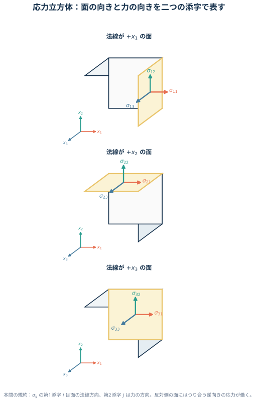{#fig-mech2-stress-cube fig-alt="x1、x2、x3軸に沿う立方体。各正の面には、面法線方向の垂直応力と面内二方向のせん断応力を矢印で示している。反対面にはつり合う逆向きの応力が作用する。" width="88%"}

引張を正、圧縮を負に取ると、全方向から大きさ $p$ の圧縮を受ける静水圧応力は

$$
\boldsymbol{\sigma}_{\mathrm h}
=-p\boldsymbol I
$$

です。一方、複数の応力成分が同時に作用する場合は、対応する行列要素へそのまま配置します。せん断成分は応力テンソルの対称性により対で現れます。

面上の応力ベクトル $\boldsymbol t$ は、面を引っ張る垂直成分と、面内で滑らせる接線成分へ分けられます。

$$
\sigma_n
=\boldsymbol n\vdot\boldsymbol t,
\qquad
\boldsymbol t_{\mathrm{tan}}
=\boldsymbol t-\sigma_n\boldsymbol n.
$$

$\boldsymbol t$ 自体と、スカラーである垂直応力 $\sigma_n$ を区別することが大切です。単軸応力

$$
\boldsymbol{\sigma}
=\sigma
\begin{pmatrix}
1&0&0\\
0&0&0\\
0&0&0
\end{pmatrix}
$$

のもとでは、

$$
\boldsymbol t
=\sigma n_1\boldsymbol e_1,
\qquad
\sigma_n
=\sigma n_1^2.
$$

したがって結晶面の法線が荷重軸から傾くほど、その面を開く垂直応力は小さくなります。へき開問題では、外力と面上の垂直応力はこの関係で比例します。

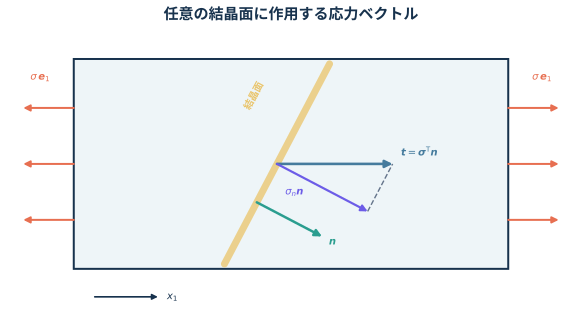{#fig-mech2-cleavage-traction fig-alt="x1方向へ単軸引張される材料の中に斜めの結晶面があり、単位法線n、面上の応力ベクトルt、法線方向成分sigma_nを示す。" width="82%"}

単軸応力 $\sigma_{11}$ を受ける棒は $x_1$ 方向へ伸び、横方向へ縮みます。ポアソン比を

$$
\nu=-\frac{\text{横ひずみ}}{\text{縦ひずみ}}
$$

と定義すれば、

$$
\epsilon_{11}=\frac{\sigma_{11}}{E},
\qquad
\epsilon_{22}=\epsilon_{33}
=-\nu\frac{\sigma_{11}}{E}
$$

です。等方**線形**弾性体では重ね合わせができるため、三方向の単軸応力による寄与を足せます。

せん断では、ひずみテンソル成分 $\epsilon_{12}$ と、直角の変化を表す工学せん断ひずみ $\gamma_{12}$ を混同しないことが重要です。

$$
\gamma_{12}=2\epsilon_{12},
\qquad
\sigma_{12}=\mu\gamma_{12}=2\mu\epsilon_{12}
$$

$E$ と $\mu$ の関係は、純せん断を $45^\circ$ 回転した座標から見ると導けます。せん断応力 $\tau$ の主応力は $\tau$ と $-\tau$ なので、その方向の主ひずみは

$$
\epsilon_{+}=\frac{(1+\nu)\tau}{E},
\qquad
\epsilon_{-}=-\frac{(1+\nu)\tau}{E}.
$$

元の座標での工学せん断ひずみは両者の差だから、

$$
\gamma_{12}
=\epsilon_{+}-\epsilon_{-}
=\frac{2(1+\nu)\tau}{E}.
$$

一方で $\tau=\mu\gamma_{12}$ です。両式を比べれば $E=2\mu(1+\nu)$ が得られます。

この導出は等方・微小変形・線形弾性を仮定しています。異方性結晶や塑性域には、そのまま適用できません。
:::

::: {.callout-tip collapse="true"}
##### 解答A1

1. 正の $x_i$ 面には、垂直応力 $\sigma_{ii}$ と面内せん断応力 $\sigma_{ij},\sigma_{ik}$ を図 @fig-mech2-stress-cube のように描く。反対面には力のつり合いを満たす逆向きの矢印を描く。モーメントのつり合いより $\sigma_{ij}=\sigma_{ji}$ である。

2. 静水圧応力と、引張・せん断の組合せはそれぞれ

   $$
   \boxed{
   \boldsymbol{\sigma}_{\mathrm h}
   =
   \begin{pmatrix}
   -p&0&0\\
   0&-p&0\\
   0&0&-p
   \end{pmatrix}
   },
   \qquad
   \boxed{
   \boldsymbol{\sigma}
   =
   \begin{pmatrix}
   \sigma_0&\tau&0\\
   \tau&0&0\\
   0&0&0
   \end{pmatrix}
   }.
   $$

3. 応力テンソルは対称なので、本問の添字規約でも

   $$
   \boldsymbol t
   =\boldsymbol{\sigma}^{\mathsf T}\boldsymbol n
   =\boldsymbol{\sigma}\boldsymbol n
   $$

   である。したがって、

   $$
   \boxed{
   \boldsymbol t
   =
   \begin{pmatrix}
   6&2\\
   2&3
   \end{pmatrix}
   \begin{pmatrix}
   0.6\\
   0.8
   \end{pmatrix}
   =
   \begin{pmatrix}
   5.2\\
   3.6
   \end{pmatrix}\ \mathrm{MPa}
   }.
   $$

4. 単軸引張応力状態は

   $$
   \boldsymbol{\sigma}
   =
   \begin{pmatrix}
   300&0&0\\
   0&0&0\\
   0&0&0
   \end{pmatrix}\ \mathrm{MPa}
   $$

   だから、面上の応力ベクトルは

   $$
   \boxed{
   \boldsymbol t
   =\boldsymbol{\sigma}\boldsymbol n
   =
   \begin{pmatrix}
   100\sqrt3\\
   0\\
   0
   \end{pmatrix}\ \mathrm{MPa}
   }.
   $$

   垂直応力は

   $$
   \boxed{
   \sigma_n
   =\boldsymbol n\vdot\boldsymbol t
   =100\ \mathrm{MPa}
   }.
   $$

   加えた応力を $k$ 倍すると $\sigma_n$ も $k$ 倍になるため、

   $$
   100k=200
   \quad\Longrightarrow\quad
   \boxed{k=2}.
   $$

5. $\sigma_{11}$ のみが作用するとき、

   $$
   \boxed{
   \epsilon_{11}=\frac{\sigma_{11}}{E},
   \qquad
   \epsilon_{22}=\epsilon_{33}
   =-\frac{\nu\sigma_{11}}{E}
   }
   $$

6. 重ね合わせより、

   $$
   \boxed{
   \epsilon_{11}
   =\frac{1}{E}
   \left\{
   \sigma_{11}-\nu(\sigma_{22}+\sigma_{33})
   \right\}
   }
   $$

7. 純せん断を $45^\circ$ 回転した主軸で考えると、

   $$
   \gamma_{12}
   =\frac{2(1+\nu)\sigma_{12}}{E}.
   $$

   $\sigma_{12}=\mu\gamma_{12}$ と比較して、

   $$
   \boxed{E=2\mu(1+\nu)}
   $$

   を得る。
:::

#### 問題A2 応力テンソルの座標変換とモール円

主応力座標系 $(x_1,x_2,x_3)$ における応力テンソルが

$$
\boldsymbol{\sigma}
=
\begin{pmatrix}
\sigma_1&0&0\\
0&\sigma_2&0\\
0&0&\sigma_3
\end{pmatrix}
$$

である。座標軸を $x_3$ 軸まわりに $45^\circ$ 反時計回りに回して、$(x'_1,x'_2,x'_3)$ を取る。

1. 新しい座標系における応力テンソル $\boldsymbol{\sigma}'$ を求めよ。
2. 二次元応力状態に対するモール（Mohr）の応力円を説明し、主応力と最大面内せん断応力を円から読み取る方法を示せ。

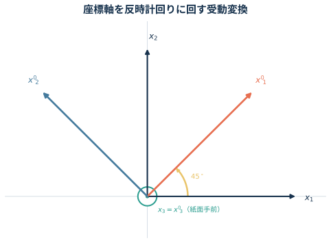{#fig-mech2-stress-rotation fig-alt="x1軸を右、x2軸を上に置き、そこから反時計回り45度回転したx1プライム軸とx2プライム軸を色分けして示す。x3軸は紙面手前向き。" width="72%"}

::: {.callout-note collapse="true"}
##### 理論A2：ベクトルと同じ座標回転を、テンソルの両側へ作用させる

座標軸を回す**受動変換**では、新しい基底ベクトルを古い基底で表した方向余弦を行列の各行へ並べます。図 @fig-mech2-stress-rotation の向きなら、

$$
\boldsymbol R
=
\begin{pmatrix}
\cos\theta&\sin\theta&0\\
-\sin\theta&\cos\theta&0\\
0&0&1
\end{pmatrix}.
$$

ベクトルの成分は $\boldsymbol v'=\boldsymbol R\boldsymbol v$、二階テンソルの成分は

$$
\boxed{
\boldsymbol{\sigma}'
=\boldsymbol R
\boldsymbol{\sigma}
\boldsymbol R^{\mathsf T}
}
$$

と変換します。$\boldsymbol R^{\mathsf T}=\boldsymbol R^{-1}$ なので、トレース、行列式、主応力は座標を回しても変わりません。

二次元応力状態

$$
\boldsymbol{\sigma}
=
\begin{pmatrix}
\sigma_{11}&\sigma_{12}\\
\sigma_{12}&\sigma_{22}
\end{pmatrix}
$$

について、法線を $\theta$ 回した面の垂直応力 $\sigma_n$ とせん断応力 $\tau_n$ は

$$
\begin{aligned}
\sigma_n
&=
\frac{\sigma_{11}+\sigma_{22}}{2}
+
\frac{\sigma_{11}-\sigma_{22}}{2}\cos2\theta
+
\sigma_{12}\sin2\theta,\\
\tau_n
&=
-\frac{\sigma_{11}-\sigma_{22}}{2}\sin2\theta
+
\sigma_{12}\cos2\theta.
\end{aligned}
$$

$2\theta$ を消去すると、

$$
\left(
\sigma_n-\frac{\sigma_{11}+\sigma_{22}}{2}
\right)^2
+\tau_n^2
=
\left(
\frac{\sigma_{11}-\sigma_{22}}{2}
\right)^2
+\sigma_{12}^2
$$

を得ます。これがモール円です。中心と半径は

$$
C=\frac{\sigma_{11}+\sigma_{22}}{2},
\qquad
R=
\sqrt{
\left(
\frac{\sigma_{11}-\sigma_{22}}{2}
\right)^2
+\sigma_{12}^2
}.
$$

横軸との交点 $C\pm R$ が主応力、円の上下端における $|\tau|=R$ が最大面内せん断応力です。実空間で面を $\theta$ 回すと円上では $2\theta$ 動きます。教科書によって $\tau$ 軸の正方向が逆になるため、角度の進む向きは採用した符号規約と一緒に確認します。
:::

::: {.callout-tip collapse="true"}
##### 解答A2

1. $\theta=45^\circ$ では $\cos\theta=\sin\theta=1/\sqrt2$ なので、

   $$
   \boldsymbol R
   =
   \frac{1}{\sqrt2}
   \begin{pmatrix}
   1&1&0\\
   -1&1&0\\
   0&0&\sqrt2
   \end{pmatrix}.
   $$

   よって、

   $$
   \boxed{
   \boldsymbol{\sigma}'
   =
   \boldsymbol R\boldsymbol{\sigma}\boldsymbol R^{\mathsf T}
   =
   \begin{pmatrix}
   \dfrac{\sigma_1+\sigma_2}{2}
   &
   \dfrac{\sigma_2-\sigma_1}{2}
   &0\\[3mm]
   \dfrac{\sigma_2-\sigma_1}{2}
   &
   \dfrac{\sigma_1+\sigma_2}{2}
   &0\\[2mm]
   0&0&\sigma_3
   \end{pmatrix}
   }.
   $$

2. モール円の中心と半径は

   $$
   \boxed{
   C=\frac{\sigma_{11}+\sigma_{22}}{2},
   \qquad
   R=
   \sqrt{
   \left(
   \frac{\sigma_{11}-\sigma_{22}}{2}
   \right)^2+\sigma_{12}^2
   }
   }.
   $$

   したがって主応力と最大面内せん断応力は

   $$
   \boxed{
   \sigma_{1,2}=C\pm R,
   \qquad
   |\tau_{\max}|=R
   }.
   $$
:::

#### 問題A3 変位勾配から求める微小ひずみと剛体回転

座標と変位を基準長さで無次元化した二次元変位場

$$
u_1=k(x_1^2+3x_2),
\qquad
u_2=k(2x_1x_2-x_2^2),
\qquad
k=1.0\times10^{-4}
$$

を考える。点 $\mathrm P(1,2)$ における次の量を求めよ。

1. 微小ひずみテンソル $\boldsymbol{\epsilon}$
2. 剛体回転テンソル $\boldsymbol{\omega}$

::: {.callout-note collapse="true"}
##### 理論A3：変位勾配を対称部分と反対称部分へ分ける

変位勾配を

$$
H_{ij}=\pdv{u_i}{x_j}
$$

と定義すると、微小変形では

$$
\boxed{
\boldsymbol{\epsilon}
=\frac12
\left(
\boldsymbol H+\boldsymbol H^{\mathsf T}
\right)
},
\qquad
\boxed{
\boldsymbol{\omega}
=\frac12
\left(
\boldsymbol H-\boldsymbol H^{\mathsf T}
\right)
}.
$$

対称部分 $\boldsymbol{\epsilon}$ は長さと角度の変化、反対称部分 $\boldsymbol{\omega}$ は形を変えない局所的な剛体回転を表します。したがって、回転成分をひずみとして数えないために対称化が必要です。

本問では

$$
\boldsymbol H
=k
\begin{pmatrix}
2x_1&3\\
2x_2&2x_1-2x_2
\end{pmatrix}.
$$

座標を先に代入してから差分を取るのではなく、まず変位場を微分し、最後に評価点を代入します。
:::

::: {.callout-tip collapse="true"}
##### 解答A3

対称部分と反対称部分は

$$
\boldsymbol{\epsilon}
=\frac{k}{2}
\begin{pmatrix}
4x_1&2x_2+3\\
2x_2+3&4x_1-4x_2
\end{pmatrix},
$$

$$
\boldsymbol{\omega}
=\frac{k}{2}
\begin{pmatrix}
0&3-2x_2\\
2x_2-3&0
\end{pmatrix}.
$$

$\mathrm P(1,2)$ と $k=10^{-4}$ を代入して、

$$
\boxed{
\boldsymbol{\epsilon}
=10^{-4}
\begin{pmatrix}
2&7/2\\
7/2&-2
\end{pmatrix}
},
\qquad
\boxed{
\boldsymbol{\omega}
=10^{-4}
\begin{pmatrix}
0&-1/2\\
1/2&0
\end{pmatrix}
}.
$$
:::

#### 問題A4 熱ひずみと拘束による熱応力

線膨張係数 $\alpha$ の等方線形弾性体を、一様に $\Delta T$ だけ温度上昇させる。

1. 物体が全方向へ自由に膨張できるとき、応力とひずみを求めよ。
2. $x_1$ 方向の伸びだけを完全に拘束し、$x_2,x_3$ 方向の表面は自由であるとき、$\sigma_{11}$ を求めよ。

::: {.callout-note collapse="true"}
##### 理論A4：全ひずみを弾性ひずみと熱ひずみに分ける

等方弾性体の熱ひずみを含む構成式は

$$
\boxed{
\epsilon_{ij}
=
\frac{1+\nu}{E}\sigma_{ij}
-\frac{\nu}{E}\sigma_{kk}\delta_{ij}
+\alpha\Delta T\,\delta_{ij}
}.
$$

右辺の最初の二項が応力による弾性ひずみ、最後の項が自由熱膨張です。温度が上がっただけでは、拘束がなければ応力は生じません。熱応力は、熱膨張しようとする変形を境界条件が妨げたときに生じます。

$x_1$ 方向だけを拘束した場合の条件は

$$
\epsilon_{11}=0,
\qquad
\sigma_{22}=\sigma_{33}=0.
$$

「変形を拘束した方向」と「表面力がゼロの方向」を、ひずみ条件と応力条件へ正しく振り分けます。
:::

::: {.callout-tip collapse="true"}
##### 解答A4

1. 自由膨張では、

   $$
   \boxed{\boldsymbol{\sigma}=\boldsymbol 0},
   \qquad
   \boxed{
   \boldsymbol{\epsilon}
   =\alpha\Delta T\,\boldsymbol I
   }.
   $$

   すなわち $\epsilon_{11}=\epsilon_{22}=\epsilon_{33}=\alpha\Delta T$ で、せん断ひずみはゼロである。

2. $\epsilon_{11}=0$、$\sigma_{22}=\sigma_{33}=0$ より、

   $$
   0
   =\frac{\sigma_{11}}{E}
   +\alpha\Delta T.
   $$

   したがって、

   $$
   \boxed{\sigma_{11}=-E\alpha\Delta T}.
   $$

   $\Delta T>0$ なら圧縮応力である。なお、横方向は自由なので

   $$
   \epsilon_{22}=\epsilon_{33}
   =(1+\nu)\alpha\Delta T
   $$

   となる。
:::

#### 問題A5 平面ひずみの構成式

等方線形弾性体が平面ひずみ状態

$$
\epsilon_{13}=\epsilon_{23}=\epsilon_{33}=0
$$

にあるとする。

1. 有効定数

   $$
   E'=\frac{E}{1-\nu^2},
   \qquad
   \nu'=\frac{\nu}{1-\nu}
   $$

   を用いて、

   $$
   \epsilon_{11}
   =\frac{1}{E'}
   \left(
   \sigma_{11}-\nu'\sigma_{22}
   \right)
   $$

   を導け。

2. $E=200\,\mathrm{GPa}$、$\nu=0.3$ の鋼材について、

   $$
   \epsilon_{11}=4.0\times10^{-4},
   \qquad
   \epsilon_{22}=1.0\times10^{-4}
   $$

   と測定された。$\sigma_{11},\sigma_{22},\sigma_{33}$ を求めよ。

::: {.callout-note collapse="true"}
##### 理論A5：平面ひずみでは面外応力が残る

三次元Hooke則の面外成分は

$$
\epsilon_{33}
=\frac{1}{E}
\left\{
\sigma_{33}
-\nu(\sigma_{11}+\sigma_{22})
\right\}.
$$

平面ひずみでは $\epsilon_{33}=0$ なので、

$$
\boxed{
\sigma_{33}
=\nu(\sigma_{11}+\sigma_{22})
}.
$$

つまり面外**ひずみ**はゼロですが、面外**応力**は一般にゼロではありません。これは薄板の自由表面で用いる平面応力条件 $\sigma_{33}=0$ との重要な違いです。

この $\sigma_{33}$ を面内のHooke則へ戻すと、

$$
\epsilon_{11}
=\frac{1-\nu^2}{E}
\left(
\sigma_{11}
-\frac{\nu}{1-\nu}\sigma_{22}
\right),
$$

となり、設問の $E',\nu'$ が得られます。

測定ひずみから応力を直接求めるときは、逆関係

$$
\boxed{
\begin{pmatrix}
\sigma_{11}\\
\sigma_{22}
\end{pmatrix}
=
\frac{E}{(1+\nu)(1-2\nu)}
\begin{pmatrix}
1-\nu&\nu\\
\nu&1-\nu
\end{pmatrix}
\begin{pmatrix}
\epsilon_{11}\\
\epsilon_{22}
\end{pmatrix}
}
$$

を使うと計算が短くなります。
:::

::: {.callout-tip collapse="true"}
##### 解答A5

1. $\epsilon_{33}=0$ から

   $$
   \sigma_{33}
   =\nu(\sigma_{11}+\sigma_{22})
   $$

   を得る。これを

   $$
   \epsilon_{11}
   =\frac{1}{E}
   \left\{
   \sigma_{11}
   -\nu(\sigma_{22}+\sigma_{33})
   \right\}
   $$

   へ代入すると、

   $$
   \boxed{
   \epsilon_{11}
   =
   \frac{1-\nu^2}{E}
   \left(
   \sigma_{11}
   -\frac{\nu}{1-\nu}\sigma_{22}
   \right)
   =
   \frac{1}{E'}
   \left(
   \sigma_{11}-\nu'\sigma_{22}
   \right)
   }.
   $$

2. $E=2.00\times10^5\,\mathrm{MPa}$ を用いると、

   $$
   \begin{aligned}
   \sigma_{11}
   &=
   \frac{2.00\times10^5}{(1.3)(0.4)}
   \left\{
   0.7(4.0\times10^{-4})
   +0.3(1.0\times10^{-4})
   \right\}\\
   &=119.2\ \mathrm{MPa},\\
   \sigma_{22}
   &=
   \frac{2.00\times10^5}{(1.3)(0.4)}
   \left\{
   0.3(4.0\times10^{-4})
   +0.7(1.0\times10^{-4})
   \right\}\\
   &=73.1\ \mathrm{MPa}.
   \end{aligned}
   $$

   さらに、

   $$
   \sigma_{33}
   =0.3(\sigma_{11}+\sigma_{22})
   =57.7\ \mathrm{MPa}.
   $$

   よって、

   $$
   \boxed{
   \sigma_{11}=119.2\ \mathrm{MPa},
   \quad
   \sigma_{22}=73.1\ \mathrm{MPa},
   \quad
   \sigma_{33}=57.7\ \mathrm{MPa}
   }.
   $$
:::

#### 問題A6 純せん断におけるミーゼス条件とトレスカ条件 {#sec-mech2-mises-tresca}

平面応力状態 $(\sigma_3=0)$ において、主応力が

$$
\sigma_1=\tau,
\qquad
\sigma_2=-\tau,
\qquad
\sigma_3=0
$$

となる純せん断状態を考える。単軸引張の降伏応力を $\sigma_{\mathrm y}$ とする。

1. ミーゼス条件とトレスカ条件について、降伏時の $|\tau|$ をそれぞれ求めよ。
2. ミーゼス条件が許す限界を基準として、トレスカ条件が何 $\%$ 保守的か求めよ。

::: {.callout-note collapse="true"}
##### 理論A6：同じ単軸降伏応力で二つの多軸降伏条件を比較する

ミーゼス相当応力は主応力を用いて

$$
\sigma_{\mathrm{eq}}
=
\sqrt{
\frac{
(\sigma_1-\sigma_2)^2
+(\sigma_2-\sigma_3)^2
+(\sigma_3-\sigma_1)^2
}{2}
}
$$

と表され、$\sigma_{\mathrm{eq}}=\sigma_{\mathrm y}$ で降伏します。

トレスカ条件は最大せん断応力が単軸降伏時と同じ値へ達したとき降伏すると考えます。主応力で書けば、

$$
\boxed{
\max_{i,j}|\sigma_i-\sigma_j|
=\sigma_{\mathrm y}
}.
$$

平面応力の主応力平面では、ミーゼス条件は

$$
\sigma_1^2-\sigma_1\sigma_2+\sigma_2^2
=\sigma_{\mathrm y}^2
$$

という楕円、トレスカ条件は

$$
\max
\left(
|\sigma_1|,
|\sigma_2|,
|\sigma_1-\sigma_2|
\right)
=\sigma_{\mathrm y}
$$

という六角形になります。図 @fig-mech2-yield-loci の純せん断経路 $\sigma_2=-\sigma_1$ と各降伏曲線の交点が、求める $|\tau|$ です。

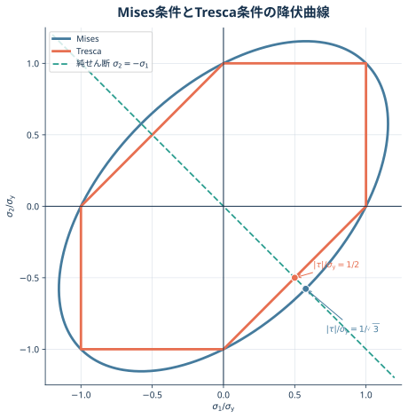{#fig-mech2-yield-loci fig-alt="横軸を主応力sigma1、縦軸をsigma2として単軸降伏応力で規格化した平面。ミーゼスの楕円とトレスカの六角形、sigma2=-sigma1の純せん断経路、および両条件との交点を示す。" width="82%"}

「何 $\%$ 保守的か」は分母の取り方で数値が変わります。本問では「ミーゼス条件が許す限界からどれだけ低いか」を問うため、

$$
\frac{
\tau_{\mathrm{Mises}}-\tau_{\mathrm{Tresca}}
}{
\tau_{\mathrm{Mises}}
}\times100
$$

と定義します。
:::

::: {.callout-tip collapse="true"}
##### 解答A6

1. 純せん断状態をミーゼス相当応力へ代入すると、

   $$
   \sigma_{\mathrm{eq}}
   =
   \sqrt{
   \frac{
   (2\tau)^2+(-\tau)^2+(-\tau)^2
   }{2}
   }
   =\sqrt3|\tau|.
   $$

   よって、

   $$
   \boxed{
   |\tau|_{\mathrm{Mises}}
   =\frac{\sigma_{\mathrm y}}{\sqrt3}
   \simeq0.577\sigma_{\mathrm y}
   }.
   $$

   トレスカ条件では最大主応力差が $2|\tau|$ なので、

   $$
   \boxed{
   |\tau|_{\mathrm{Tresca}}
   =\frac{\sigma_{\mathrm y}}{2}
   =0.500\sigma_{\mathrm y}
   }.
   $$

2. ミーゼス条件を基準とした差は、

   $$
   \begin{aligned}
   \frac{
   \tau_{\mathrm{Mises}}-\tau_{\mathrm{Tresca}}
   }{
   \tau_{\mathrm{Mises}}
   }\times100
   &=
   \left(
   1-\frac{\sqrt3}{2}
   \right)100\\
   &\simeq13.4\%.
   \end{aligned}
   $$

   したがって、

   $$
   \boxed{
   \text{トレスカ条件はミーゼス条件より約 }13.4\%\text{ 保守的}
   }.
   $$
:::

#### 問題A7 塑性・数値解析の基本用語

次の語句を、必要なら図や式を用いて説明せよ。

1. 降伏応力
2. 真応力・真ひずみ
3. 加工硬化指数
4. ミーゼス（von Mises）の降伏条件
5. 有限要素解析

::: {.callout-note collapse="true"}
##### 理論A7：変形段階と計算法の違いを読み分ける

降伏・真応力・加工硬化・ミーゼス条件は**弾性から塑性へ移る材料応答**、有限要素解析は**形の複雑な境界値問題を近似的に解く方法**です。用語を一文で定義したうえで、代表式と成立条件まで示すと、答案の意味が明確になります。

**降伏応力**

除荷しても永久ひずみが残る塑性変形が始まる応力を降伏応力 $\sigma_{\mathrm y}$ と呼びます。比例限度や弾性限度と厳密には同じではありません。明瞭な降伏点を示さない材料では、塑性ひずみ $0.2\%$ に相当する直線と応力--ひずみ曲線の交点、すなわち $0.2\%$ 耐力を用いるのが一般的です。

**真応力・真ひずみ**

公称応力・公称ひずみは変形前の断面積 $A_0$ と標点距離 $l_0$ を使います。

$$
\sigma_{\mathrm e}=\frac{F}{A_0},
\qquad
e=\frac{l-l_0}{l_0}.
$$

真応力・真ひずみは、その瞬間の断面積 $A$ と長さ $l$ を使います。

$$
\sigma_{\mathrm t}=\frac{F}{A},
\qquad
\epsilon_{\mathrm t}
=\int_{l_0}^{l}\frac{\dd l}{l}
=\ln\frac{l}{l_0}.
$$

一様変形かつ塑性変形中の体積一定 $Al=A_0l_0$ を仮定すれば、

$$
\boxed{
\epsilon_{\mathrm t}=\ln(1+e),
\qquad
\sigma_{\mathrm t}=\sigma_{\mathrm e}(1+e)
}
$$

です。くびれ後は断面積とひずみが場所によって異なるため、全体伸びだけを使ったこの換算は局所値を与えません。

**加工硬化指数**

一様塑性変形域を Hollomon 則

$$
\sigma_{\mathrm t}=K\epsilon_{\mathrm p}^{\,n}
$$

で近似したときの指数 $n$ が加工硬化指数です。両辺の対数を取ると、

$$
\ln\sigma_{\mathrm t}
=\ln K+n\ln\epsilon_{\mathrm p},
\qquad
n=\dv{\ln\sigma_{\mathrm t}}{\ln\epsilon_{\mathrm p}},
$$

なので、両対数グラフの傾きとして求められます。$n$ が大きいほど、塑性ひずみの増加に対して流動応力が強く上昇し、局所的に薄くなった部分へ追加変形が集中しにくくなります。Hollomon 則と一様変形を仮定すると、Considère 条件よりくびれ開始時の一様真ひずみは概ね $n$ です。

**ミーゼスの降伏条件**

主応力表示による計算とトレスカ条件との比較は[問題A6](#sec-mech2-mises-tresca)で扱いました。ここでは条件の物理的な意味を、偏差応力から整理します。

応力を平均垂直応力と、形を変える偏差応力へ分けると、

$$
\sigma_{\mathrm m}=\frac{\sigma_{kk}}{3},
\qquad
s_{ij}=\sigma_{ij}-\sigma_{\mathrm m}\delta_{ij}.
$$

偏差応力による相当応力

$$
\sigma_{\mathrm{eq}}
=\sqrt{\frac{3}{2}s_{ij}s_{ij}}
$$

が単軸引張の降伏応力 $\sigma_{\mathrm y}$ に達したとき降伏する、というのがミーゼス条件です。平均垂直応力は $\boldsymbol s$ に含まれないため、静水圧だけではミーゼス条件による降伏は起こりません。

**有限要素解析**

連続体を有限個の小領域である**要素**へ分割し、要素内の変位を節点値と形状関数で近似します。各要素の剛性行列を全体系へ組み立て、境界条件を課した連立方程式

$$
\boldsymbol K\boldsymbol u=\boldsymbol f
$$

を解きます。得られた節点変位 $\boldsymbol u$ から、ひずみと応力を計算します。

有限要素解は、メッシュ、要素形式、材料モデル、境界条件に依存する近似解です。細かいメッシュを一度使うだけで正解になるわけではありません。要素寸法を変えて注目量が収束するか確認し、点荷重・鋭い角・拘束端に現れる応力特異性を最大応力の数値だけで評価しないことが重要です。
:::

::: {.callout-tip collapse="true"}
##### 解答A7

1. **降伏応力**は、除荷後に永久ひずみが残る塑性変形の開始応力である。明瞭な降伏点がない材料では、通常は $0.2\%$ 耐力を用いる。

2. **真応力・真ひずみ**は瞬間断面積 $A$、瞬間長さ $l$ を用いて

   $$
   \sigma_{\mathrm t}=\frac{F}{A},
   \qquad
   \epsilon_{\mathrm t}=\ln\frac{l}{l_0}
   $$

   と定義する。一様変形かつ体積一定なら

   $$
   \epsilon_{\mathrm t}=\ln(1+e),
   \qquad
   \sigma_{\mathrm t}=\sigma_{\mathrm e}(1+e)
   $$

   である。

3. **加工硬化指数** $n$ は Hollomon 則

   $$
   \sigma_{\mathrm t}=K\epsilon_{\mathrm p}^{\,n}
   $$

   の指数であり、$n=\dv*{\ln\sigma_{\mathrm t}}{\ln\epsilon_{\mathrm p}}$ である。$n$ が大きいほど加工硬化が強く、くびれが遅れやすい。

4. **ミーゼスの降伏条件**は

   $$
   \sigma_{\mathrm{eq}}
   =
   \sqrt{
   \frac{
   (\sigma_1-\sigma_2)^2+
   (\sigma_2-\sigma_3)^2+
   (\sigma_3-\sigma_1)^2
   }{2}
   }
   =\sigma_{\mathrm y}
   $$

   となると降伏するという条件である。静水圧応力だけでは降伏しない。

5. **有限要素解析**は、連続体を要素へ分割し、要素内の変位を形状関数で近似して

   $$
   \boldsymbol K\boldsymbol u=\boldsymbol f
   $$

   を解く数値解析法である。変位からひずみ・応力を求め、メッシュ収束を確認する必要がある。
:::

## 第2部 構造の静定判定と梁の曲げ

#### 問題B1 平面トラスの静定・不静定

図 @fig-mech2-truss-determinacy の4種類の平面トラスについて、静定か不静定かを判定し、不静定なら不静定次数を求めよ。対角材が交差していても、節点記号がない交差部は接合されていないものとする。

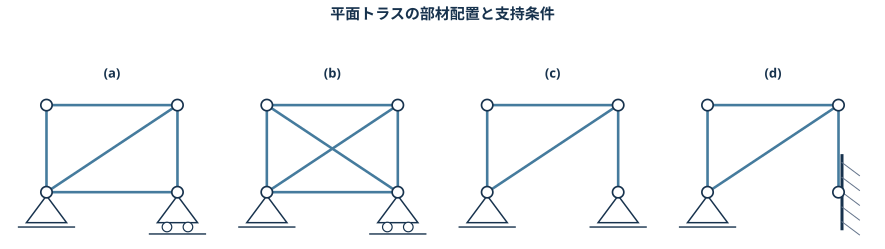{#fig-mech2-truss-determinacy fig-alt="四角形を基本とする四つの平面トラス。(a)は対角材一本で左ピン右ローラー、(b)は交差部を接合しない対角材二本で左ピン右ローラー、(c)は下辺なしで左右ピン、(d)は下辺なしで左ピン右固定。" width="100%"}

::: {.callout-note collapse="true"}
##### 理論B1：未知力の数と節点のつり合い式の数を比較する

平面のピン接合トラスでは、各節点について $x,y$ 方向のつり合い式が2本あります。部材数を $m$、節点数を $n$、支点反力成分数を $r$ とすると、安定なトラスの静的不静定次数は

$$
\boxed{D_{\mathrm s}=m+r-2n}
$$

です。

- $D_{\mathrm s}=0$：静定
- $D_{\mathrm s}>0$：$D_{\mathrm s}$ 次不静定
- $D_{\mathrm s}<0$：一般に機構となり、不安定

支持条件ごとの反力成分数は、平面問題ではピン支点が2、ローラー支点が1、固定端が3です。

ただし $D_{\mathrm s}=0$ は、未知数と式の**個数**が一致することを示すだけです。全部材が一直線に並ぶなど、配置によって独立なつり合い式が不足する機構もあり得ます。そのため、部材数の判定に加えて幾何学的な安定性も確認します。

図 (b) の二本の対角材は交差していますが、中央に節点がありません。したがって中央を節点として数えず、各対角材を1本ずつ数えます。
:::

::: {.callout-tip collapse="true"}
##### 解答B1

各構造について数えると、

| 構造 | 部材数 $m$ | 節点数 $n$ | 反力成分数 $r$ | $D_{\mathrm s}=m+r-2n$ | 判定 |
|---|---:|---:|---:|---:|---|
| (a) | 5 | 4 | 3 | 0 | 静定 |
| (b) | 6 | 4 | 3 | 1 | 1次不静定 |
| (c) | 4 | 4 | 4 | 0 | 静定 |
| (d) | 4 | 4 | 5 | 1 | 1次不静定 |

したがって、

$$
\boxed{
\text{(a), (c) は静定、(b), (d) は1次不静定}
}.
$$

いずれも図示された部材配置について機構を生じないことを併せて確認する。
:::

#### 問題B2 先端荷重を受ける片持ち梁

長さ $L$、断面二次モーメント $I$、ヤング率 $E$ の片持ち梁がある。固定端を $x=0$、自由端を $x=L$ とし、自由端へ下向きの集中荷重 $P$ を加える。

1. せん断力分布を描け。
2. 曲げモーメント分布を描け。
3. 先端のたわみ $\delta$ を求めよ。
4. この式を、原子間力顕微鏡（AFM）のカンチレバーへ適用する。荷重方向の高さ $h=5\,\mu\mathrm m$、幅 $b=50\,\mu\mathrm m$、長さ $L=200\,\mu\mathrm m$、ヤング率 $E=200\,\mathrm{GPa}$ の長方形断面梁の先端へ、下向き荷重 $P=100\,\mu\mathrm N$ を加えた。先端たわみを求めよ。

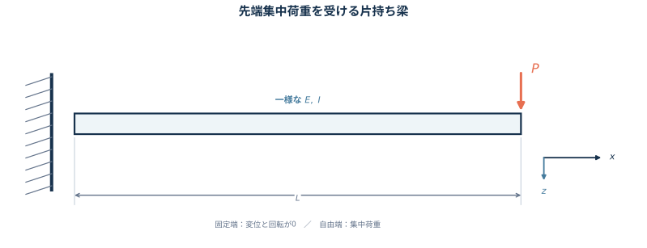{#fig-mech2-cantilever-setup fig-alt="左端を固定された水平な梁。右端に下向き集中荷重Pが作用し、梁長をL、固定端からの座標をxとする。" width="92%"}

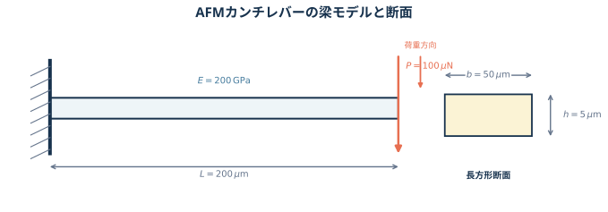{#fig-mech2-afm-cantilever fig-alt="左端固定のAFMカンチレバー。長さ200マイクロメートル、自由端の下向き荷重100マイクロニュートンを示し、挿入断面図には荷重方向の高さ5マイクロメートル、幅50マイクロメートルを示す。" width="92%"}

::: {.callout-note collapse="true"}
##### 理論B2：切断面のつり合いから内力を決め、曲率を二回積分する

梁の途中 $x$ で切り、右側だけを取り出すと、外力は自由端の $P$ だけです。切断面に現れるせん断力 $V$ と曲げモーメント $M$ が、この力とモーメントを打ち消します。

ここでは、上向き外力を正、梁を下に凸にする正曲げを正とします。下向き荷重 $P$ による片持ち梁の曲げは負なので、

$$
V(x)=-P,
\qquad
M(x)=-P(L-x)
\qquad(0<x<L)
$$

です。したがって $V$ は一定の長方形、$M$ は固定端で $-PL$、自由端で0となる三角形です。分布荷重 $q(x)$ との一般関係

$$
\dv{V}{x}=-q(x),
\qquad
\dv{M}{x}=V(x)
$$

からも、区間内に分布荷重がないので $V$ が一定、$M$ が一次関数になると分かります。

Euler--Bernoulli 梁では、断面は変形後も中立軸に垂直な平面を保つと近似します。下向きたわみ $v$ を正に選ぶと、本問の符号規約では

$$
EI\dv[2]{v}{x}=-M(x)=P(L-x).
$$

これを二回積分し、固定端の境界条件

$$
v(0)=0,
\qquad
\left.\dv{v}{x}\right|_{x=0}=0
$$

を使えば、

$$
v(x)=\frac{Px^2(3L-x)}{6EI}
$$

となります。

符号規約を変えれば $V,M,v$ の符号は変わりますが、大きさ、境界値、図形の形は変わりません。答案では採用した正方向を図へ書くことが大切です。

長方形断面では、荷重による曲げ軸まわりの断面二次モーメントは

$$
I=\frac{bh^3}{12}
$$

です。3乗される $h$ は**荷重方向の断面寸法**です。幅と高さを取り違えると剛性を大きく誤るため、図 @fig-mech2-afm-cantilever の断面と曲げ方向を先に確認します。
:::

::: {.callout-tip collapse="true"}
##### 解答B2

**せん断力**　上向き外力と正曲げを正とすると、

$$
\boxed{V(x)=-P}
$$

であり、全区間で一定の長方形となる。

**曲げモーメント**

$$
\boxed{M(x)=-P(L-x)}
$$

であり、$M(0)=-PL$、$M(L)=0$ の三角形となる。

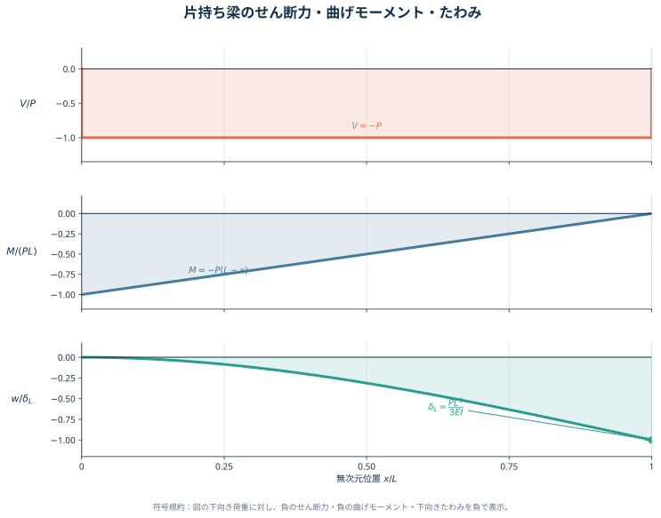{#fig-mech2-cantilever-diagrams fig-alt="上段は全区間でマイナスP一定のせん断力図、中段は固定端でマイナスPLから自由端でゼロへ直線的に変化する曲げモーメント図、下段は固定端で変位と傾きがゼロ、自由端で最大となる下向きたわみ曲線。" width="100%"}

**たわみ**　下向きたわみを正とすれば、

$$
v(x)=\frac{Px^2(3L-x)}{6EI}.
$$

したがって自由端では

$$
\boxed{\delta=v(L)=\frac{PL^3}{3EI}}
$$

となり、向きは下向きである。

**AFMカンチレバーへの適用**

断面二次モーメントは

$$
\begin{aligned}
I
&=\frac{bh^3}{12}\\
&=
\frac{
(50\times10^{-6})
(5\times10^{-6})^3
}{12}\\
&=5.2083\times10^{-22}\ \mathrm{m^4}.
\end{aligned}
$$

よって、

$$
\begin{aligned}
\delta
&=
\frac{PL^3}{3EI}\\
&=
\frac{
(100\times10^{-6})
(200\times10^{-6})^3
}{
3(200\times10^9)
(5.2083\times10^{-22})
}\\
&=2.56\times10^{-6}\ \mathrm m.
\end{aligned}
$$

したがって、

$$
\boxed{\delta=2.56\,\mu\mathrm m}
$$

で、向きは荷重方向である。
:::

#### 問題B3 中央部に等分布荷重を受ける圧延ロール

直径 $d$、支点間長さ $l$、ヤング率 $E$ の円柱形圧延ロールを、両端単純支持梁として近似する。ロール中央の幅 $a$ に、下向きの等分布線荷重 $q$ が作用する。

1. $y$ 軸まわりの断面二次モーメント $I$ を求めよ。
2. せん断力分布を描け。
3. 曲げモーメント分布を描け。
4. 最大たわみを求めよ。
5. ロールのたわみを小さくする方法を述べよ。

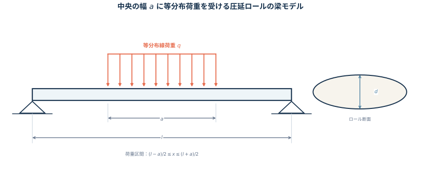{#fig-mech2-rolling-setup fig-alt="長さlの水平梁を両端で単純支持し、中央の幅aに下向き等分布荷重qが作用する。荷重区間の左端をc=(l-a)/2、右端をe=(l+a)/2とする。" width="96%"}

::: {.callout-note collapse="true"}
##### 理論B3：対称性で反力を決め、区間ごとに荷重を積み上げる

三次元の接触圧力は $\mathrm{Pa}=\mathrm{N\,m^{-2}}$ ですが、一次元梁へ入力する $q$ は単位長さ当たりの荷重 $\mathrm{N\,m^{-1}}$ です。元の接触圧力を $p$、梁モデルへ集約する奥行き幅を $w$ とすれば $q=pw$ です。本問では $q$ を線荷重として扱います。

円形断面の図心を通る直径軸まわりの断面二次モーメントは、

$$
I=\int_A z^2\,\dd A
=\frac{\pi d^4}{64}.
$$

荷重区間の左右端を

$$
c=\frac{l-a}{2},
\qquad
e=\frac{l+a}{2}
$$

と置きます。全荷重は $qa$ で左右対称なので、支点反力は

$$
R_A=R_B=\frac{qa}{2}
$$

です。

左端から切断面までにある外力を数えれば、せん断力は

$$
V(x)=
\begin{cases}
\dfrac{qa}{2},
&0<x<c,\\[4pt]
\dfrac{qa}{2}-q(x-c)
=q\left(\dfrac{l}{2}-x\right),
&c<x<e,\\[4pt]
-\dfrac{qa}{2},
&e<x<l.
\end{cases}
$$

曲げモーメントは $\dv*{M}{x}=V$ と $M(0)=M(l)=0$ から、

$$
M(x)=
\begin{cases}
\dfrac{qa}{2}x,
&0\le x\le c,\\[4pt]
\dfrac{qa}{2}x-\dfrac{q}{2}(x-c)^2,
&c\le x\le e,\\[4pt]
\dfrac{qa}{2}(l-x),
&e\le x\le l.
\end{cases}
$$

となります。中央で $V=0$ なので、最大曲げモーメントは

$$
M_{\max}=M\left(\frac{l}{2}\right)
=\frac{qa(2l-a)}{8}.
$$

最大たわみは対称軸 $x=l/2$ に生じます。中央に下向き単位荷重を置いたときの仮想曲げモーメントを $m(x)$ とすると、左半分では $m=x/2$ です。単位荷重法と対称性より、

$$
\begin{aligned}
\delta_{\max}
&=\frac{1}{EI}\int_0^l M(x)m(x)\,\dd x\\
&=\frac{1}{EI}\int_0^{l/2}M(x)x\,\dd x\\
&=\frac{1}{EI}
\left[
\int_0^c \frac{qa}{2}x^2\,\dd x
+
\int_c^{l/2}
\left\{
\frac{qa}{2}x-\frac{q}{2}(x-c)^2
\right\}x\,\dd x
\right]\\
&=
\frac{qa(8l^3-4la^2+a^3)}{384EI}.
\end{aligned}
$$

$I=\pi d^4/64$ を代入すると、

$$
\delta_{\max}
=
\frac{qa(8l^3-4la^2+a^3)}
{6\pi Ed^4}.
$$

検算として、$a=l$ なら全長等分布荷重の $5ql^4/(384EI)$、$a\to0$ かつ $P=qa$ を一定に保てば中央集中荷重の $Pl^3/(48EI)$ へ一致します。
:::

::: {.callout-tip collapse="true"}
##### 解答B3

1. 円形断面より、

   $$
   \boxed{I=\frac{\pi d^4}{64}}
   $$

2. $c=(l-a)/2,\ e=(l+a)/2$ と置くと、支点反力は $R_A=R_B=qa/2$ であり、

   $$
   \boxed{
   V(x)=
   \begin{cases}
   \dfrac{qa}{2},&0<x<c,\\[3pt]
   q\left(\dfrac{l}{2}-x\right),&c<x<e,\\[3pt]
   -\dfrac{qa}{2},&e<x<l.
   \end{cases}
   }
   $$

3. 曲げモーメントは、

   $$
   \boxed{
   M(x)=
   \begin{cases}
   \dfrac{qa}{2}x,&0\le x\le c,\\[3pt]
   \dfrac{qa}{2}x-\dfrac{q}{2}(x-c)^2,&c\le x\le e,\\[3pt]
   \dfrac{qa}{2}(l-x),&e\le x\le l.
   \end{cases}
   }
   $$

   中央の最大値は $M_{\max}=qa(2l-a)/8$ である。

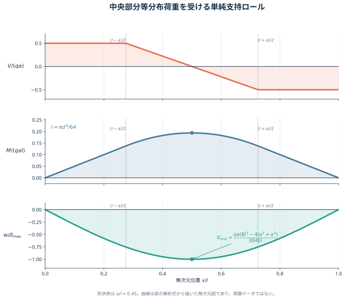{#fig-mech2-rolling-diagrams fig-alt="上段は左右の無荷重区間で一定、中央荷重区間で直線的に減るせん断力図。中段は支点でゼロ、中央で最大となり、荷重区間で放物線となる曲げモーメント図。下段は左右対称で中央が最大の下向きたわみ模式曲線。" width="100%"}

4. 最大たわみは中央に生じ、

   $$
   \boxed{
   \delta_{\max}
   =
   \frac{qa(8l^3-4la^2+a^3)}{384EI}
   =
   \frac{qa(8l^3-4la^2+a^3)}{6\pi Ed^4}
   }
   $$

   で、向きは下向きである。

5. たわみを小さくするには、特に $I\propto d^4$ を利用してロール径 $d$ を大きくするのが有効である。ほかに、ヤング率 $E$ の大きいロール材を用いる、支点間距離 $l$ を短くする、バックアップロールで支える、必要荷重を下げる、ロールクラウンでたわみを補償する方法がある。
:::

## 第3部 転位の弾性場と相互作用

#### 問題C1 らせん転位の変位・ひずみ・応力・エネルギー

転位線が $x_3$ 軸上にある、十分に長いらせん転位を考える。$x_1$ 軸から $x_3$ 軸のまわりを図の時計回りに1回転 $(2\pi)$ するとき、$x_1,x_2$ 方向のずれはなく、$x_3$ 方向にだけ $b$ の変位が生じる。材料の剛性率を $\mu$ とする。

1. 弾性ひずみの全成分 $\epsilon_{ij}$ を求めよ。
2. 弾性応力の全成分 $\sigma_{ij}$ を求めよ。
3. 単位体積当たりの弾性ひずみエネルギーを求めよ。ただし、転位芯寸法 $r_0$ から結晶粒半径 $R$ までの弾性変形を考える。

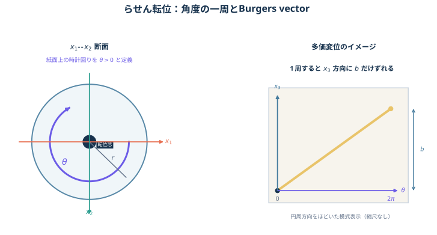{#fig-mech2-screw-setup fig-alt="円柱の軸がx3方向のらせん転位。断面上にx1、x2、半径r、x1からx2への時計回り角θを示し、円柱軸と平行にバーガースベクトルbを示す。" width="82%"}

::: {.callout-note collapse="true"}
##### 理論C1：一周で増える軸方向変位を角度に比例させる

**問いの正体**は、「一周すると $b$ だけ進む」という幾何を変位場へ直し、その空間微分からひずみと応力を得ることです。

図 @fig-mech2-screw-setup に合わせ、$x_1$ から $x_2$ へ進む向きを正の $\theta$ とし、

$$
x_1=r\cos\theta,
\qquad
x_2=r\sin\theta,
\qquad
r^2=x_1^2+x_2^2
$$

と定義します。図を紙面上で見ると、この正方向は時計回りです。一周 $\Delta\theta=2\pi$ で $\Delta u_3=b$ となる最も単純な変位場は

$$
u_1=u_2=0,
\qquad
u_3=\frac{b}{2\pi}\theta
$$

です。角度の微分は

$$
\pdv{\theta}{x_1}=-\frac{x_2}{r^2},
\qquad
\pdv{\theta}{x_2}=\frac{x_1}{r^2}
$$

なので、

$$
\pdv{u_3}{x_1}
=-\frac{b x_2}{2\pi r^2},
\qquad
\pdv{u_3}{x_2}
=\frac{b x_1}{2\pi r^2}.
$$

微小ひずみテンソルは

$$
\epsilon_{ij}
=\frac{1}{2}
\left(
\pdv{u_i}{x_j}
+
\pdv{u_j}{x_i}
\right)
$$

です。$u_3$ だけが位置によって変わるので、非零成分は $\epsilon_{13}=\epsilon_{31}$ と $\epsilon_{23}=\epsilon_{32}$ だけです。

この変形には体積変化がなく、せん断だけが生じます。等方線形弾性体のせん断則

$$
\sigma_{ij}=2\mu\epsilon_{ij}\qquad(i\neq j)
$$

を使えば応力が得られます。

局所的な単位体積当たりひずみエネルギー密度は

$$
w
=\frac{1}{2}\sigma_{ij}\epsilon_{ij}.
$$

総和では対称な成分 $13,31,23,32$ をすべて数えることに注意すると、

$$
w(r)=\frac{\mu b^2}{8\pi^2r^2}.
$$

これは転位線に近いほど $1/r^2$ で大きくなり、$r=0$ では発散します。線形弾性論を原子スケールまで使えないため、芯半径 $r_0$ で打ち切ります。転位線の単位長さ当たりのエネルギーは、円環の面積要素 $2\pi r\,\dd r$ を掛けて

$$
\frac{U}{\ell}
=
\int_{r_0}^{R}
w(r)\,2\pi r\,\dd r
=
\frac{\mu b^2}{4\pi}
\ln\frac{R}{r_0}.
$$

設問の「単位体積当たり」なら答えは局所密度 $w(r)$ であり、$r_0,R$ は不要です。一方、$r_0$ から $R$ まで積分する標準的な問いは「転位線の単位長さ当たり」です。両方を区別して答えるのが安全です。

角度の正方向を反転する、または符号付きバーガースベクトル $b$ を反転すると、ひずみと応力の符号は一斉に反転します。エネルギーは $b^2$ に比例するため変わりません。
:::

::: {.callout-tip collapse="true"}
##### 解答C1

$r^2=x_1^2+x_2^2$ とし、図の時計回りを正の $\theta$ として

$$
u_1=u_2=0,
\qquad
u_3=\frac{b}{2\pi}\theta
$$

と置く。

1. ひずみテンソルは

   $$
   \boxed{
   \boldsymbol{\epsilon}
   =
   \frac{b}{4\pi r^2}
   \begin{pmatrix}
   0&0&-x_2\\
   0&0&x_1\\
   -x_2&x_1&0
   \end{pmatrix}
   }
   $$

   である。すなわち、

   $$
   \epsilon_{13}=\epsilon_{31}
   =-\frac{b x_2}{4\pi r^2},
   \qquad
   \epsilon_{23}=\epsilon_{32}
   =\frac{b x_1}{4\pi r^2}
   $$

   だけが非零である。

2. 応力テンソルは

   $$
   \boxed{
   \boldsymbol{\sigma}
   =
   \frac{\mu b}{2\pi r^2}
   \begin{pmatrix}
   0&0&-x_2\\
   0&0&x_1\\
   -x_2&x_1&0
   \end{pmatrix}
   }
   $$

   である。

3. 局所的な単位体積当たりひずみエネルギーは

   $$
   \boxed{
   w(r)=\frac{1}{2}\sigma_{ij}\epsilon_{ij}
   =\frac{\mu b^2}{8\pi^2r^2}
   }.
   $$

   $r_0$ から $R$ まで積分した転位線の単位長さ当たりエネルギーは

   $$
   \boxed{
   \frac{U}{\ell}
   =
   \frac{\mu b^2}{4\pi}
   \ln\frac{R}{r_0}
   }.
   $$

   問題文を「領域全体で平均した単位体積当たり」と解釈する場合は、

   $$
   \boxed{
   \overline w
   =
   \frac{\mu b^2}
   {4\pi^2(R^2-r_0^2)}
   \ln\frac{R}{r_0}
   }
   $$

   である。
:::

#### 問題C2 平行ならせん転位の相互作用

無限に長い2本の平行ならせん転位が、距離

$$
r=15\,\mathrm{nm}
$$

だけ離れている。両転位のバーガースベクトルは転位線と同じ向きで、大きさは

$$
b_{\mathrm I}=b_{\mathrm{II}}=0.25\,\mathrm{nm}
$$

である。材料の剛性率を $\mu=45\,\mathrm{GPa}$ とする。

1. 一方の転位が他方へ及ぼす単位長さ当たりの力の大きさを求めよ。
2. この力が引力か斥力かを、バーガースベクトルの符号とともに説明せよ。

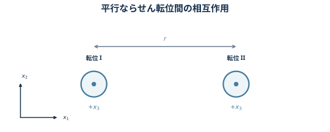{#fig-mech2-screw-pair fig-alt="x1 x2断面上に、どちらもx3正方向を向くらせん転位IとIIを二つの点付き円で示し、その間隔rを寸法線で表す。" width="76%"}

::: {.callout-note collapse="true"}
##### 理論C2：一方のせん断応力場へ、もう一方の転位を置く

転位Iを原点、転位IIを $(x_1,x_2)=(r,0)$ に置き、両転位線を $+x_3$ 方向とします。問題C1で求めたらせん転位の応力場より、転位IIの位置では

$$
\sigma_{23}^{\mathrm I}
=\frac{\mu b_{\mathrm I}}{2\pi r},
\qquad
\sigma_{13}^{\mathrm I}=0.
$$

転位IIに働く単位長さ当たりの Peach--Koehler 力は

$$
\boldsymbol f
=
\left(
\boldsymbol{\sigma}^{\mathrm I}
\boldsymbol b_{\mathrm{II}}
\right)
\times
\boldsymbol t_{\mathrm{II}}.
$$

ここで

$$
\boldsymbol b_{\mathrm{II}}
=b_{\mathrm{II}}\boldsymbol e_3,
\qquad
\boldsymbol t_{\mathrm{II}}
=\boldsymbol e_3
$$

なので、

$$
\boxed{
\boldsymbol f
=
\frac{\mu b_{\mathrm I}b_{\mathrm{II}}}{2\pi r}
\boldsymbol e_1
}.
$$

$b_{\mathrm I}b_{\mathrm{II}}>0$ なら、$+x_1$ 側にある転位IIへ $+x_1$ 向きの力が働くため、両転位は互いに遠ざかります。積が負なら力の向きが逆転します。

したがって、力の大きさだけを書く場合は

$$
f
=
\frac{\mu|b_{\mathrm I}b_{\mathrm{II}}|}{2\pi r}
$$

とし、引力・斥力は $b_{\mathrm I}b_{\mathrm{II}}$ の符号から判定します。
:::

::: {.callout-tip collapse="true"}
##### 解答C2

1. 数値をSI単位へ直して、

   $$
   \begin{aligned}
   f
   &=
   \frac{
   \mu b_{\mathrm I}b_{\mathrm{II}}
   }{2\pi r}\\
   &=
   \frac{
   (45\times10^9)
   (0.25\times10^{-9})^2
   }{
   2\pi(15\times10^{-9})
   }\\
   &=2.984\times10^{-2}\ \mathrm{N\,m^{-1}}.
   \end{aligned}
   $$

   よって、

   $$
   \boxed{
   f\simeq0.030\ \mathrm{N\,m^{-1}}
   }.
   $$

2. 本問では $b_{\mathrm I}b_{\mathrm{II}}>0$ なので、力は各転位を互いから遠ざける向きに働く。

   $$
   \boxed{\text{同符号のらせん転位間には斥力が働く}}
   $$

   バーガースベクトルが異符号なら $b_{\mathrm I}b_{\mathrm{II}}<0$ となり、力の向きが反転して引力となる。
:::

#### 問題C3 平行な2本の刃状転位に働く力

互いに平行な刃状転位IとIIを考える。転位Iは原点に固定され、転位IIは $x_2=d$ の点線上を摩擦なく $x_1$ 方向へ滑るものとする。

$$
\begin{aligned}
\boldsymbol b_{\mathrm I}&=(b_{\mathrm I},0,0),
&
\boldsymbol t_{\mathrm I}&=(0,0,1),\\
\boldsymbol b_{\mathrm{II}}&=(b_{\mathrm{II}},0,0),
&
\boldsymbol t_{\mathrm{II}}&=(0,0,1).
\end{aligned}
$$

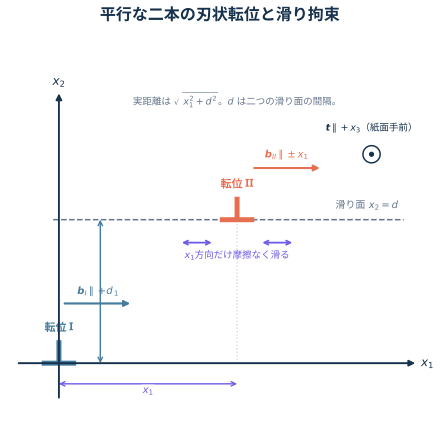{#fig-mech2-edge-pair fig-alt="x1横軸、x2縦軸。転位Iは原点、転位IIはx2=dの点線上の座標x1=xにあり、転位線方向はx3、バーガースベクトルはx1方向。" width="78%"}

転位Iのまわりの応力場を考える。$r^2=x_1^2+x_2^2$ とし、

$$
D=\frac{\mu b_{\mathrm I}}{2\pi(1-\nu)}
$$

と置けば、必要な成分は

$$
\begin{aligned}
\sigma_{11}
&=-D
\frac{x_2(3x_1^2+x_2^2)}{r^4},\\
\sigma_{12}=\sigma_{21}
&=D
\frac{x_1(x_1^2-x_2^2)}{r^4},\\
\sigma_{22}
&=D
\frac{x_2(x_1^2-x_2^2)}{r^4},\\
\sigma_{33}
&=-2\nu D\frac{x_2}{r^2},
\end{aligned}
$$

であり、$\sigma_{13}=\sigma_{31}=\sigma_{23}=\sigma_{32}=0$ とする。

1. 転位Iの応力場が転位IIに及ぼす力 $\boldsymbol F$ を求めよ。
2. $\boldsymbol F$ の $x_1$ 方向成分 $f_1$ を $x_1$ の関数として図示し、2本の転位が安定して存在する位置を示せ。

::: {.callout-note collapse="true"}
##### 理論C3：応力そのものではなく、転位を滑らせる成分を取り出す

転位線の長さが指定されていないため、$\boldsymbol F$ の単位長さ当たりの値を $\boldsymbol f=\boldsymbol F/\ell$ として求めます。応力場の中に置かれた転位が受ける Peach--Koehler 力は

$$
\boldsymbol f
=
(\boldsymbol{\sigma}^{\mathrm I}\boldsymbol b_{\mathrm{II}})
\times
\boldsymbol t_{\mathrm{II}}
$$

です。ここで $\boldsymbol{\sigma}^{\mathrm I}$ は転位Iが転位IIの位置へ作る応力です。

本問では

$$
\boldsymbol{\sigma}^{\mathrm I}\boldsymbol b_{\mathrm{II}}
=
b_{\mathrm{II}}
\begin{pmatrix}
\sigma_{11}\\
\sigma_{21}\\
0
\end{pmatrix},
\qquad
\boldsymbol t_{\mathrm{II}}
=
\begin{pmatrix}0\\0\\1\end{pmatrix}
$$

なので、外積から

$$
\boldsymbol f
=b_{\mathrm{II}}
\begin{pmatrix}
\sigma_{12}\\
-\sigma_{11}\\
0
\end{pmatrix}
$$

となります。転位IIの位置 $(x_1,x_2)=(x,d)$ を代入し、

$$
K=
\frac{\mu b_{\mathrm I}b_{\mathrm{II}}}
{2\pi(1-\nu)}
$$

と置けば、

$$
\boldsymbol f(x)
=
\frac{K}{(x^2+d^2)^2}
\begin{pmatrix}
x(x^2-d^2)\\
d(3x^2+d^2)\\
0
\end{pmatrix}.
$$

$f_1$ はすべり面内の **glide** 力、$f_2$ はすべり面を越える **climb** 方向の力です。設問では転位IIが $x_2=d$ に拘束されるため、$x_1$ 方向の安定性は $f_1$ だけで判定します。$f_2$ は拘束反力とつり合うと考えます。

$X=x/d$ と無次元化すると、

$$
\frac{d f_1}{K}
=
\frac{X(X^2-1)}{(X^2+1)^2}.
$$

平衡点は $X=-1,0,1$ です。微分すると、

$$
\left.\dv{f_1}{x}\right|_{x=0}
=-\frac{K}{d^2},
\qquad
\left.\dv{f_1}{x}\right|_{x=\pm d}
=\frac{K}{2d^2}.
$$

わずかにずらしたとき元へ戻す力となる条件は $\dv*{f_1}{x}<0$ です。したがって安定点は $b_{\mathrm I}b_{\mathrm{II}}$ の符号で入れ替わります。

ここで $d$ は二つのすべり面の間隔 $x_2=d$ です。転位IIが $x_1=x$ にあるとき、実際の転位間距離は $\sqrt{x^2+d^2}$ となります。
:::

::: {.callout-tip collapse="true"}
##### 解答C3

転位線の単位長さ当たりの Peach--Koehler 力は

$$
\boldsymbol f
=
(\boldsymbol{\sigma}^{\mathrm I}\boldsymbol b_{\mathrm{II}})
\times\boldsymbol t_{\mathrm{II}}
=b_{\mathrm{II}}(\sigma_{12},-\sigma_{11},0).
$$

したがって、$K=\mu b_{\mathrm I}b_{\mathrm{II}}/[2\pi(1-\nu)]$ と置けば、

$$
\boxed{
\boldsymbol f(x)
=
\frac{K}{(x^2+d^2)^2}
\begin{pmatrix}
x(x^2-d^2)\\
d(3x^2+d^2)\\
0
\end{pmatrix}
}.
$$

特に滑り方向成分は

$$
\boxed{
f_1(x)
=K\frac{x(x^2-d^2)}{(x^2+d^2)^2}
}.
$$

転位の長さが $\ell$ なら、全力は $\boldsymbol F=\ell\boldsymbol f$ である。

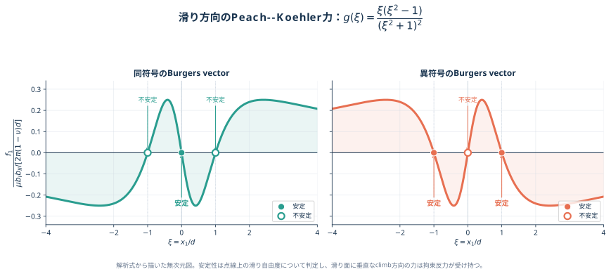{#fig-mech2-edge-force fig-alt="横軸x1/d、縦軸を規格化した滑り力。奇関数でx1/d=-1、0、1を横切る。同符号では0が安定で±1が不安定、異符号ではその逆。" width="96%"}

平衡点は

$$
x=-d,\qquad 0,\qquad d.
$$

- $b_{\mathrm I}b_{\mathrm{II}}>0$ の同符号転位では、

  $$
  \boxed{x=0\text{ が安定},\qquad x=\pm d\text{ が不安定}}
  $$

- $b_{\mathrm I}b_{\mathrm{II}}<0$ の異符号転位では、

  $$
  \boxed{x=\pm d\text{ が安定},\qquad x=0\text{ が不安定}}
  $$

である。これは $x_2=d$ 上の滑り運動だけに関する安定性である。
:::

## 第4部 結晶すべりと多結晶

#### 問題D1 シュミット因子と臨界分解せん断応力 {#sec-mech2-schmid}

単軸引張を受ける単結晶のすべりを考える。

1. BCC単結晶を $[100]$ 方向へ引張り、すべり系 $(110)[1\bar11]$ を考える。

   a. このすべり系のシュミット因子を求めよ。
   b. 単軸引張応力 $150\,\mathrm{MPa}$ で降伏したとき、臨界分解せん断応力 $\tau_{\mathrm{CRSS}}$ を求めよ。

2. FCC単結晶を $[123]$ 方向へ引張る。次の二つのすべり系についてシュミット因子の絶対値を求め、どちらが活動しやすいか判定せよ。

   a. $(111)[1\bar10]$
   b. $(\bar11\bar1)[10\bar1]$

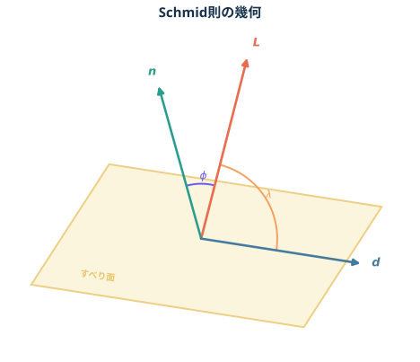{#fig-mech2-schmid-geometry fig-alt="半透明のすべり面に面内すべり方向dを描き、面法線nと引張軸Lを示す。引張軸と法線の角をphi、引張軸とすべり方向の角をlambdaと示す。" width="78%"}

::: {.callout-note collapse="true"}
##### 理論D1：面法線とすべり方向への射影を掛ける

単軸引張応力 $\sigma$ が、あるすべり系へ作る分解せん断応力は Schmid 則

$$
\boxed{
\tau_{\mathrm R}
=\sigma\cos\phi\cos\lambda
=\sigma\widetilde m
}
$$

で与えられます。$\phi$ は引張軸 $\boldsymbol L$ とすべり面法線 $\boldsymbol n$ の角、$\lambda$ は引張軸とすべり方向 $\boldsymbol d$ の角です。

結晶指数をベクトルとして扱えば、

$$
\cos\phi
=
\frac{
\boldsymbol L\vdot\boldsymbol n
}{
|\boldsymbol L||\boldsymbol n|
},
\qquad
\cos\lambda
=
\frac{
\boldsymbol L\vdot\boldsymbol d
}{
|\boldsymbol L||\boldsymbol d|
}.
$$

符号付きシュミット因子 $\widetilde m=\cos\phi\cos\lambda$ の符号は、分解せん断応力の向きを表します。どのすべり系が先に活動するかを比較するときは

$$
\boxed{m=|\widetilde m|}
$$

を用います。面法線またはすべり方向の向きを反転すると符号は変わりますが、同じ物理的なすべり系です。

計算前に、候補のすべり方向が本当にすべり面内にあることを

$$
\boxed{
\boldsymbol n\vdot\boldsymbol d=0
}
$$

で確認します。

結晶が塑性変形を始める条件は、最も有利なすべり系の $|\tau_{\mathrm R}|$ が材料固有の臨界分解せん断応力 $\tau_{\mathrm{CRSS}}$ に達することです。したがって降伏時には

$$
\boxed{
\tau_{\mathrm{CRSS}}
=\sigma_{\mathrm y}m_{\max}
}.
$$
:::

::: {.callout-tip collapse="true"}
##### 解答D1

1. $(110)[1\bar11]$ について、まず

   $$
   [110]\vdot[1\bar11]=1-1+0=0
   $$

   なので、方向は面内にある。引張軸を $\boldsymbol L=[100]$ とすると、

   $$
   \cos\phi
   =\frac{[100]\vdot[110]}{|[100]||[110]|}
   =\frac{1}{\sqrt2},
   $$

   $$
   \cos\lambda
   =\frac{[100]\vdot[1\bar11]}{|[100]||[1\bar11]|}
   =\frac{1}{\sqrt3}.
   $$

   よって、

   $$
   \boxed{
   m=\frac{1}{\sqrt6}\simeq0.408
   }.
   $$

   単軸引張応力 $150\,\mathrm{MPa}$ で降伏したから、

   $$
   \boxed{
   \tau_{\mathrm{CRSS}}
   =150\frac{1}{\sqrt6}
   =25\sqrt6
   \simeq61.2\ \mathrm{MPa}
   }.
   $$

2. 引張軸を $\boldsymbol L=[123]$ とする。二つの方向はいずれも

   $$
   [111]\vdot[1\bar10]=0,
   \qquad
   [\bar11\bar1]\vdot[10\bar1]=0
   $$

   を満たす。

   a. $(111)[1\bar10]$ では、

   $$
   \widetilde m_a
   =
   \frac{6}{\sqrt{42}}
   \frac{-1}{\sqrt{28}}
   =-\frac{\sqrt6}{14},
   $$

   したがって

   $$
   \boxed{
   m_a=\frac{\sqrt6}{14}\simeq0.175
   }.
   $$

   b. $(\bar11\bar1)[10\bar1]$ では、

   $$
   \widetilde m_b
   =
   \frac{-2}{\sqrt{42}}
   \frac{-2}{\sqrt{28}}
   =\frac{\sqrt6}{21},
   $$

   したがって

   $$
   \boxed{
   m_b=\frac{\sqrt6}{21}\simeq0.117
   }.
   $$

   $m_a>m_b$ なので、

   $$
   \boxed{
   \text{a. }(111)[1\bar10]\text{ の方が活動しやすい}
   }.
   $$

   $\widetilde m_a<0$ は分解せん断応力の向きが逆であることを示すだけで、活動しないことを意味しない。
:::

#### 問題D2 $[123]$ 引張における主すべり系とすべり線

FCC単結晶の試験片を $[123]$ 方向へ引張る。FCCのすべり系を $\{111\}\langle 1\bar10\rangle$ とする。

1. シュミット因子が最大となる主すべり面と主すべり方向を求めよ。
2. 試験中に $(\bar301)$ 面を観察したところ、すべり線が見えた。すべり線と引張方向のなす鋭角 $\theta$ を求めよ。
3. 同じ形状の単結晶試験片と無配向多結晶試験片について、典型的な応力--ひずみ曲線の違いを説明せよ。

![引張軸を[123]、観察面を(バー301)とする単結晶試験片、および観察面上のすべり線の模式図。](images/材料力学II/fcc-123-specimen.svg){#fig-mech2-fcc-specimen fig-alt="単結晶の引張試験片。上下の引張軸は[123]、前面の観察面はバー301、表面上に主すべり面との交線としてすべり線が描かれる。" width="72%"}

::: {.callout-note collapse="true"}
##### 理論D2：全すべり系を比較し、二平面の交線を外積で求める

Schmid 則、符号の扱い、面内条件は[問題D1](#sec-mech2-schmid)で整理しました。ここでは引張軸を

$$
\hat{\boldsymbol L}
=\frac{[123]}{\sqrt{14}}
$$

とし、各FCCすべり系について

$$
m
=
\left|
\hat{\boldsymbol L}\vdot\hat{\boldsymbol n}
\right|
\left|
\hat{\boldsymbol L}\vdot\hat{\boldsymbol d}
\right|,
$$

を比較します。独立な4種類の $\{111\}$ 面について、面内条件を満たす $\langle110\rangle$ 方向を調べると次のようになります。

| すべり面 | 面内で $m$ が最大の方向 | 最大 $m$ |
|---|---:|---:|
| $(111)$ | $[10\bar1]$ | $\dfrac{6}{7\sqrt6}$ |
| $(\bar111)$ | $[101]$ | $\dfrac{8}{7\sqrt6}$ |
| $(1\bar11)$ | $[011]$ | $\dfrac{5}{7\sqrt6}$ |
| $(11\bar1)$ | 任意 | $0$ |

したがって主すべり系は $(\bar111)[101]$ です。

表面に見えるすべり線は、すべり方向そのものとは限りません。これは**すべり面と観察面の交線**です。二平面の法線をそれぞれ $\boldsymbol n_{\mathrm s},\boldsymbol n_{\mathrm o}$ とすれば、交線方向は

$$
\boldsymbol l
\parallel
\boldsymbol n_{\mathrm s}\times\boldsymbol n_{\mathrm o}.
$$

本問では、

$$
\boldsymbol n_{\mathrm s}=[\bar111],
\qquad
\boldsymbol n_{\mathrm o}=[\bar301]
$$

なので、

$$
\boldsymbol l
\parallel
[\bar111]\times[\bar301]
=[1\bar23].
$$

また

$$
[\bar301]\vdot[123]=-3+3=0
$$

より、引張軸 $[123]$ は観察面内にあります。したがって、観察面上で二本の線の普通の角度を内積から計算できます。

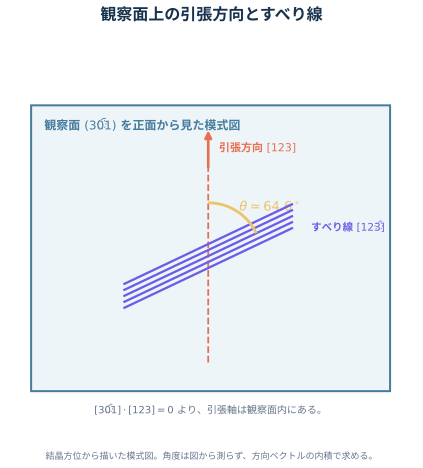{#fig-mech2-fcc-slip-trace fig-alt="観察面バー301を正面から見た図。縦の引張方向[123]と、斜めのすべり線[1バー23]のなす鋭角をθ約64.6度と示す。結晶方位関係を表す模式図。" width="78%"}

単結晶と多結晶の比較では、曲線の厳密な上下関係を材料名だけで決めないことが重要です。典型的な無配向FCC多結晶では、隣接粒との変形適合のため一つのすべり系だけでは変形できず、複数すべりが必要です。粒界は転位運動を妨げ、Hall--Petch 効果も加わるため、同じ組成・熱処理なら多結晶の降伏応力は高くなりやすく、曲線は多数の方位を平均して滑らかになります。

単結晶では特定の主すべり系から降伏し、単一すべり、多重すべりへ移るにつれて加工硬化率が段階的に変わり得ます。ただし弾性率、降伏応力、加工硬化、破断伸びは結晶方位、粒径、集合組織、初期転位密度、熱処理に依存します。図は傾向を説明する模式図であり、普遍的な実験曲線ではありません。
:::

::: {.callout-tip collapse="true"}
##### 解答D2

1. 引張軸を $\hat{\boldsymbol s}=[123]/\sqrt{14}$ とし、

   $$
   m
   =
   \left|\hat{\boldsymbol s}\vdot\hat{\boldsymbol n}\right|
   \left|\hat{\boldsymbol s}\vdot\hat{\boldsymbol d}\right|
   $$

   を全すべり系について比較する。最大となるのは

   $$
   \hat{\boldsymbol n}
   =\frac{[\bar111]}{\sqrt3},
   \qquad
   \hat{\boldsymbol d}
   =\frac{[101]}{\sqrt2}
   $$

   であり、

   $$
   \boxed{
   m_{\max}
   =
   \frac{4}{\sqrt{42}}
   \frac{4}{\sqrt{28}}
   =
   \frac{8}{7\sqrt6}
   \simeq0.4666
   }.
   $$

   よって主すべり系は

   $$
   \boxed{(\bar111)[101]}
   $$

   である。方向を同一直線上で反転した表記も同値である。

2. すべり線は主すべり面と観察面の交線なので、

   $$
   \boldsymbol l
   \parallel
   [\bar111]\times[\bar301]
   =[1\bar23].
   $$

   $[123]$ も観察面内にあるから、

   $$
   \cos\theta
   =
   \frac{|[1\bar23]\vdot[123]|}
   {|[1\bar23]||[123]|}
   =
   \frac{|1-4+9|}{\sqrt{14}\sqrt{14}}
   =
   \boxed{\frac{3}{7}}.
   $$

   したがって、

   $$
   \boxed{\theta=\cos^{-1}\frac37\simeq64.6^\circ}
   $$

   である。

3. 典型的な無配向FCC多結晶では、隣接粒との変形適合と粒界による転位運動の妨害のため、同じ組成・熱処理の単結晶より高い応力で降伏しやすい。多数の結晶方位が平均されるので、降伏後の曲線は滑らかで、複数すべりによる加工硬化を示す。単結晶は主すべり系から降伏し、単一すべりから多重すべりへの移行に伴う段階的な加工硬化を示しやすい。

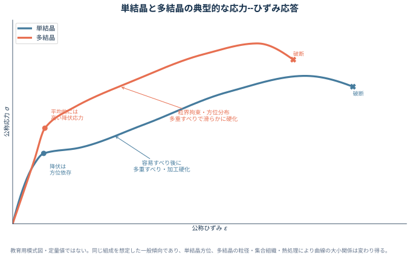{#fig-mech2-single-poly fig-alt="縦軸公称応力、横軸公称ひずみ。単結晶は低めの降伏後に加工硬化率が段階的に変わる線、多結晶は高めの降伏から滑らかに加工硬化する線。定量データではない。" width="92%"}

粒径、集合組織、熱処理が指定されていないため、破断伸びや曲線の厳密な位置関係までは一意に決まらない。
:::

## 答案直前チェック

| 話題 | 最小限覚える式・判断 | 典型的な落とし穴 |
|---|---|---|
| 面上の応力 | $\boldsymbol t=\boldsymbol{\sigma}^{\mathsf T}\boldsymbol n$、$\sigma_n=\boldsymbol n\vdot\boldsymbol t$ | 応力ベクトル $\boldsymbol t$ と垂直応力 $\sigma_n$ を混同する |
| 座標変換 | $\boldsymbol{\sigma}'=\boldsymbol R\boldsymbol{\sigma}\boldsymbol R^{\mathsf T}$ | 座標軸の回転と物体の回転を混同する |
| 変位勾配 | $\boldsymbol{\epsilon}=\operatorname{sym}\boldsymbol H$、$\boldsymbol{\omega}=\operatorname{skw}\boldsymbol H$ | 先に評価点を代入する、回転をひずみに含める |
| 等方弾性 | $\epsilon_{11}=\{\sigma_{11}-\nu(\sigma_{22}+\sigma_{33})\}/E$、$E=2\mu(1+\nu)$ | $\gamma_{12}=2\epsilon_{12}$ を忘れる |
| 熱ひずみ | 自由膨張なら $\boldsymbol{\sigma}=0$、$\boldsymbol{\epsilon}=\alpha\Delta T\boldsymbol I$ | 温度変化だけで必ず熱応力が生じると考える |
| 平面ひずみ | $\epsilon_{33}=0$、$\sigma_{33}=\nu(\sigma_{11}+\sigma_{22})$ | $\sigma_{33}=0$ と置く |
| 純せん断降伏 | $|\tau|_{\mathrm M}=\sigma_{\mathrm y}/\sqrt3$、$|\tau|_{\mathrm T}=\sigma_{\mathrm y}/2$ | 保守率の分母を明記しない |
| 平面トラス | $D_{\mathrm s}=m+r-2n$ と幾何学的安定性を確認 | 交差するだけの部材を節点として数える |
| 片持ち梁 | $V=-P$、$M=-P(L-x)$、$\delta=PL^3/(3EI)$ | 符号規約を書かない |
| 長方形断面梁 | $I=bh^3/12$ | 荷重方向の高さ $h$ と幅 $b$ を逆にする |
| 圧延ロール | $I=\pi d^4/64$、対称反力 $qa/2$ | 圧力と線荷重を混同する |
| らせん転位 | $u_3=b\theta/(2\pi)$、$U/\ell=\mu b^2\ln(R/r_0)/(4\pi)$ | $\theta$ と $b$ の符号、局所密度と積分値 |
| らせん転位対 | $f=\mu|b_{\mathrm I}b_{\mathrm{II}}|/(2\pi r)$ | 同符号は斥力、異符号は引力 |
| 刃状転位対 | $\boldsymbol f=(\boldsymbol\sigma\boldsymbol b)\times\boldsymbol t$ | 力は単位長さ当たり、安定点は $b_{\mathrm I}b_{\mathrm{II}}$ 依存 |
| 結晶すべり | $m=|\hat{\boldsymbol L}\vdot\hat{\boldsymbol n}|\,|\hat{\boldsymbol L}\vdot\hat{\boldsymbol d}|$、$\tau_{\mathrm{CRSS}}=\sigma_{\mathrm y}m_{\max}$ | すべり方向が面内か確認しない、符号付き $m$ の負を不活動とみなす |
