$$
\require{physics}
\require{mhchem}
$$

## このノートの読み方 {#metal-materials-reading-guide}

このノートは、複数年度の過去問を年度順に並べ直したものではない。重複する問題を統合し、**変形の素過程から合金設計と熱処理へ進む順**に組み直した学習用ノートである。

各問題は、次の順に読む。

1. 問題文と資料図だけを見て、まず白紙に式・組織・温度履歴を描く。
2. 詰まったら「理論」を開き、現象を支配する保存則、自由エネルギー、転位運動、拡散のどれを使うか確認する。
3. 理論を閉じてもう一度解く。
4. 最後に「解答」を開き、採点に必要な語句・式・単位・結論が揃っているか比べる。

理論欄は初学者が「なぜそうなるか」を追える長さにし、解答欄は答案の骨格へそのまま縮約できる長さにした。

::: {.callout-warning title="資料図とOCRの扱い"}
手元にある一次資料は、文字起こしされた過去問と三枚の切り抜き図である。元の試験PDFそのものではないため、判読できない数値や相境界を推測で補っていない。

- Cu二元状態図とCCT図は、添付図の**読み取り目的を保った模式図**としてSVGで再作図した。曲線位置から定量値を読んではならない。
- Al--4 wt% Cuの148 ℃時効曲線は、添付図と同じ図を掲載する文献系列を確認したが、生の測定値表は得られなかった。曲線の中間点は教育用の平滑補間である。
- CCT図は同じ0.15 wt% Cでも、Mn、Si、Ni、旧オーステナイト粒径、オーステナイト化温度・保持時間で変化する。
:::

::: {.callout-important}
### 組織問題を解く一本の手順

1. **平衡なら何相か**を状態図で読む。
2. その温度へ到達するまでに、**拡散する時間があるか**を判断する。
3. 第二相が粒内、粒界、転位上のどこに出るかを考える。
4. その空間分布が、転位・電子・き裂のどれを妨げるかへつなぐ。

「元素の性質」だけで答えず、**相平衡 → 速度論 → ミクロ組織 → 巨視的特性**の順に書く。
:::

## 出題の全体地図 {#metal-materials-exam-map}

| 部 | 中心となる問い | 主な道具 |
|---|---|---|
| 第1部 変形と破壊 | 金属はなぜ変形し、どのように壊れるか | 靭性、疲労、クリープ、理想せん断、転位、Hall--Petch |
| 第2部 粒子分散強化 | 第二相はどのように転位を止めるか | Orowan機構、Taylor因子、時効析出、粗大化 |
| 第3部 Cu希薄合金 | 同じ微量添加でも、なぜ物性が逆になるか | 固溶、析出、粒界偏析、磁性、電子散乱 |
| 第4部 規則合金と超合金 | 原子の規則配列は転位をどう変えるか | $L1_2$、APB、Kear--Wilsdorf lock、$\gamma/\gamma'$ |
| 第5部 Mgと金属間化合物 | 結晶構造と原子寸法は何を決めるか | すべり系、CRSS、双晶、Laves相、水素吸蔵 |
| 第6部 材料選択 | 軽さ・剛性・希少性・用途をどう結ぶか | 密度、Young率、比剛性、金属分類 |
| 第7部 鉄鋼の組織制御 | 冷却経路で同じ鋼をどう作り分けるか | CCT、焼なまし、焼入れ、DP、TRIP、TMCP |
| 第8部 実用鋼 | 必要特性から組織と工程を逆算できるか | 工具鋼、耐熱鋼、ステンレス鋼、IF鋼 |
| 第9部 技術者倫理 | 現実・不確かさ・責任をどう扱うか | 再現性、説明責任、安全文化、知性の定義 |

## 第1部 変形・強化・破壊の基礎

### 強さと壊れにくさを区別する

#### 問題A1 靭性・疲労・クリープ・低温脆性

次の問いに答えよ。

1. 靭性を定義し、金属が構造材料に適する理由を靭性の観点から述べよ。
2. 疲労、クリープ、低温脆性を、それぞれ荷重・時間・温度・破壊機構と結び付けて説明せよ。

::: {.callout-note collapse="true"}
##### 理論A1：強度だけでは「壊れにくい」を表せない

**靭性**は、材料が破断までに単位体積当たり吸収できるエネルギーである。単軸引張試験なら、

$$
U_\mathrm{T}
=
\int_0^{\varepsilon_f}
\sigma\,\dd\varepsilon
$$

であり、応力--ひずみ曲線の破断までの面積に等しい。単位は $\mathrm{J\,m^{-3}}=\mathrm{Pa}$ である。高強度でも破断ひずみがほぼゼロなら靭性は小さく、よく伸びても応力が極端に小さければやはり靭性は小さい。

き裂材に対する抵抗を表す**破壊靭性**

$$
K_\mathrm{IC}\ [\mathrm{MPa\sqrt{m}}]
$$

は別の物理量である。「靭性」と「破壊靭性」を同じ単位で書かない。

金属では転位が動いて塑性変形できる。き裂先端が塑性変形すると先端半径が大きくなり、弾性論的な応力集中が緩和される。また、局所的に荷重を負担できなくなっても周囲へ応力を再配分できる。これが金属を構造材料として使いやすい理由の一つである。

三つの損傷現象は、時間軸が異なる。

| 現象 | 典型的な負荷 | ミクロ過程 | 答案で外せない点 |
|---|---|---|---|
| 疲労 | 繰返し応力・ひずみ | 局所すべり帯や介在物からき裂が発生し、サイクルごとに進展 | 公称応力が降伏応力未満でも起こり得る |
| クリープ | 一定応力、高い相同温度 | 転位上昇、拡散、粒界すべり | 一次・定常二次・加速三次の三領域 |
| 低温脆性 | 低温・高速負荷で顕著 | 塑性緩和よりへき開が先行 | bccフェライト鋼で明瞭、fcc金属では一般に鋭い遷移が出にくい |

クリープで重要なのは絶対温度ではなく相同温度 $T/T_\mathrm{m}$ であり、多くの金属では概ね $T/T_\mathrm{m}\gtrsim0.4$ で無視しにくくなる。ただし材料・応力・時間尺度で境界は変わる。
:::

::: {.callout-tip collapse="true"}
##### 解答A1

靭性は破断までに単位体積当たり吸収できるエネルギーであり、

$$
U_\mathrm{T}=\int_0^{\varepsilon_f}\sigma\,\dd\varepsilon
$$

で表される。金属は転位運動による塑性変形で、き裂先端を鈍化させ応力を再配分できるため、強度と靭性を両立しやすい。

疲労は繰返し負荷によるき裂の発生・進展、クリープは高温で一定応力を受けたときの時間依存変形、低温脆性は低温で塑性変形が困難となりへき開破壊が先行する現象である。
:::

### 完全結晶と実在結晶の強さ

#### 問題A2 理想せん断強度・転位応力場・変形素過程

次の問いに答えよ。

1. 金属結晶の塑性変形を担う代表的なミクロ素過程を三つ挙げよ。
2. 原子面を一様にせん断するときの理想せん断強度を、剛性率 $G$ を用いて導け。
3. 刃状転位の応力場が長距離に及ぶ理由を説明せよ。

::: {.callout-note collapse="true"}
##### 理論A2：結合を一斉に切る代わりに、線欠陥を一列ずつ動かす

このノートでは、標準的な三分類として

1. 転位のすべり
2. 変形双晶
3. 粒界すべり

を採る。高温変形まで細分する授業では、粒界拡散・格子拡散を独立に扱う場合がある。配布資料で別の三分類が定義されている場合は、その定義を優先する。

完全結晶の二つの原子面を相対変位 $x$ だけずらす。結晶は格子周期 $b$ だけずらすと等価な配置へ戻るので、せん断応力を

$$
\tau(x)
=
\tau_{\max}
\sin\left(\frac{2\pi x}{b}\right)
$$

と近似する。面間隔を $h$ とすると、微小変位では

$$
\gamma=\frac{x}{h},
\qquad
\tau=G\gamma=G\frac{x}{h}.
$$

一方、正弦関数を $x=0$ の近くで展開すれば、

$$
\tau
\simeq
\tau_{\max}\frac{2\pi x}{b}.
$$

両式の傾きを一致させると、

$$
\tau_{\max}
=
\frac{Gb}{2\pi h}
\simeq
\frac{G}{2\pi}
$$

となる。最後の近似は $b\simeq h$ を用いた。この値は実在金属の降伏応力より桁違いに大きい。完全結晶なら一面の結合を同時に組み替える必要があるのに対し、転位があれば転位芯付近の結合だけを順次組み替えればよいからである。

等方弾性体中の刃状転位では、代表的な応力成分は

$$
\sigma_{ij}
\sim
\frac{Gb}{2\pi(1-\nu)r}
$$

のように転位芯からの距離 $r$ に対して $1/r$ で減衰する。指数関数的に消えず、離れた転位・溶質原子・粒界とも相互作用するため「長距離応力場」と呼ぶ。芯のごく近傍では連続体弾性論は使えない。
:::

::: {.callout-tip collapse="true"}
##### 解答A2

代表的な塑性変形素過程は、転位すべり、変形双晶、粒界すべりである。

原子面間の応力を周期関数

$$
\tau=\tau_{\max}\sin\left(\frac{2\pi x}{b}\right)
$$

で近似し、微小変位で $\tau=Gx/h$ と一致させると、

$$
\tau_{\max}=\frac{Gb}{2\pi h}\simeq\frac{G}{2\pi}
$$

を得る。実在結晶は転位が局所的に移動するため、これより低い応力で変形する。

刃状転位の弾性応力場は遠方で $\sigma_{ij}\propto Gb/r$ と減衰する。$1/r$ は緩やかな減衰なので、転位の影響は長距離に及ぶ。
:::

### 粒界を増やすと強くなる理由

#### 問題A3 Hall--Petch機構と粒径設計

1. Hall--Petch効果の微視的機構を説明せよ。
2. 平均粒径 $d_1=100\,\mu\mathrm{m}$ の多結晶材料について、粒径微細化による降伏強度の利得分を現在の10倍にする粒径 $d_2$ を求めよ。

::: {.callout-note collapse="true"}
##### 理論A3：粒界は壁であり、隣の粒へすべりを渡す関門でもある

Hall--Petch則は、

$$
\sigma_y
=
\sigma_0+k_y d^{-1/2}
$$

である。$\sigma_0$ は粒径に依存しない抵抗、$k_y$ はHall--Petch係数、$d$ は平均粒径である。

古典的な転位堆積モデルでは、一つの粒内を動いた転位が粒界で止まり、後続転位が堆積する。堆積先頭には外力より大きな局所応力が生じ、その応力が十分になると隣接粒で新しいすべりが始まる。大きい粒では長い堆積列を作れるため、比較的小さな外力で先頭応力を高められる。小さい粒では堆積できる転位数が少ないため、隣の粒へすべりを伝えるのに大きな外力が必要になる。

実材料では、粒界からの転位放出、すべり帯先端の応力集中、粒内転位密度なども寄与する。堆積モデルだけが唯一の説明ではないが、$d^{-1/2}$ の直感を与える。

設問は降伏応力全体ではなく、粒径効果の**利得分**

$$
\Delta\sigma_y=k_y d^{-1/2}
$$

を10倍にせよと言っている。したがって、

$$
\frac{\Delta\sigma_{y,2}}{\Delta\sigma_{y,1}}
=
\left(\frac{d_1}{d_2}\right)^{1/2}
=10
$$

より、

$$
d_2=\frac{d_1}{100}=1\,\mu\mathrm{m}.
$$

もし「降伏応力全体を10倍」と問われたなら、$\sigma_0$ と $k_y$ がなければ一意に解けない。
:::

::: {.callout-tip collapse="true"}
##### 解答A3

粒界は転位運動を止め、転位堆積を生じさせる。粒径が小さいほど一粒内に堆積できる転位数が減り、隣接粒へすべりを伝えるために大きい外力が必要になる。このため

$$
\sigma_y=\sigma_0+k_y d^{-1/2}
$$

となる。

粒径による利得は $\Delta\sigma_y=k_y d^{-1/2}$ なので、

$$
10=\sqrt{\frac{d_1}{d_2}},
\qquad
d_2=\frac{100\,\mu\mathrm{m}}{10^2}
=1\,\mu\mathrm{m}.
$$
:::

## 第2部 粒子分散とAl--Cu時効硬化

### 切れない粒子を転位が迂回する

#### 問題B1 Orowan応力と多結晶降伏応力

十分に硬質で転位が切断できない粒子を、平均自由間隔 $\lambda=0.50\,\mu\mathrm{m}$ でAl中に分散させた。剛性率を $G=27\,\mathrm{GPa}$、Burgers vectorの大きさを $b=0.28\,\mathrm{nm}$ とする。

1. 転位が粒子間を通過するための臨界せん断応力を概算せよ。
2. fcc多結晶のTaylor因子を $M=3.0$ として、引張降伏応力の利得分を求めよ。

::: {.callout-note collapse="true"}
##### 理論B1：線張力と外力の釣り合い

転位には、長さを短くしようとする線張力

$$
T\simeq\frac{Gb^2}{2}
$$

がある。せん断応力 $\tau$ が転位へ及ぼす単位長さ当たりの力は $\tau b$ である。粒子間で半円状に張り出す直前を $R\simeq\lambda/2$ と近似すると、

$$
\tau b\simeq\frac{T}{R}
$$

より、

$$
\tau_\mathrm{Or}
\simeq
\frac{Gb}{\lambda}
$$

を得る。

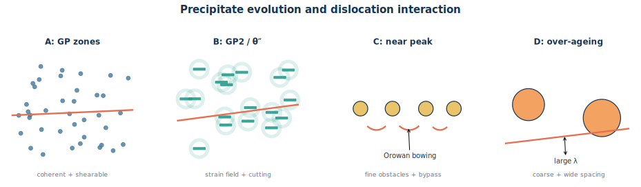{#fig-alcu-precipitation-stages fig-alt="Aは微細なGPゾーンを転位が切断し、Bは整合ひずみ場を持つ板状析出物、Cは非切断粒子の間で転位が弓状に張り出すOrowan機構、Dは粗大化して粒子間隔が広がった状態を並べた模式図。" width="100%"}

数値を代入すると、

$$
\tau_\mathrm{Or}
=
\frac{
(27\times10^9\,\mathrm{Pa})
(0.28\times10^{-9}\,\mathrm{m})
}{
0.50\times10^{-6}\,\mathrm{m}
}
=
1.512\times10^7\,\mathrm{Pa}
=
15.1\,\mathrm{MPa}.
$$

多結晶の引張降伏応力とCRSSの関係は、

$$
\sigma_y=M\tau_\mathrm{CRSS}
$$

なので、

$$
\Delta\sigma_y
\simeq
3.0\times15.1
=
45.4\,\mathrm{MPa}.
$$

これは粒子分散による利得分の概算であり、母相摩擦応力、固溶強化、加工硬化、Hall--Petch項を含む全降伏応力ではない。精密なOrowan式ではPoisson比、粒子径、対数項が入り、$\lambda$ も中心間隔ではなく粒子表面間の自由間隔を使う。
:::

::: {.callout-tip collapse="true"}
##### 解答B1

Orowan応力を

$$
\tau_\mathrm{Or}\simeq\frac{Gb}{\lambda}
$$

と近似すると、

$$
\tau_\mathrm{Or}
=
\frac{27\times10^9\times0.28\times10^{-9}}
{0.50\times10^{-6}}
=15.1\,\mathrm{MPa}.
$$

したがってTaylor因子 $M=3.0$ のfcc多結晶における降伏応力の利得は、

$$
\Delta\sigma_y=M\tau_\mathrm{Or}
=45.4\,\mathrm{MPa}
$$

である。
:::

### 時間とともに硬くなり、その後軟らかくなる

#### 問題B2 Al--4 wt% Cuの時効硬化

Al--4 wt% Cu合金を溶体化・焼入れ後、約148 ℃で時効したときの硬さ変化を @fig-alcu-age-question に示す。

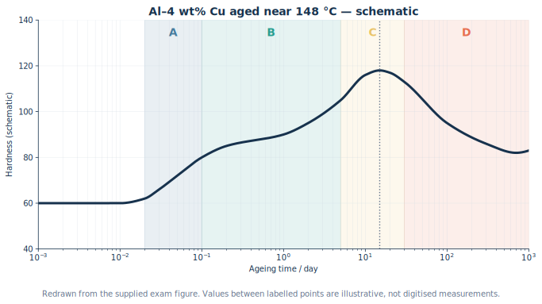{#fig-alcu-age-question fig-alt="横軸を10のマイナス3乗日から10の3乗日までの対数時効時間、縦軸を硬さとし、Aで急増、Bで緩やかに増加、Cで約15日付近の最大、Dで低下する曲線。" width="100%"}

1. A、B、C、Dの各段階におけるミクロ組織を説明せよ。
2. A、Bの強化機構を、転位が析出物を切断する過程から説明せよ。
3. Cの強化機構をOrowan機構から説明せよ。
4. Dは何と呼ばれるか。硬さが低下する理由を述べよ。

::: {.callout-note collapse="true"}
##### 理論B2：析出物は「小さければ強い」だけではない

Al--Cu合金の代表的な析出系列は、

$$
\text{過飽和 }\alpha
\rightarrow
\text{GP(I) zone}
\rightarrow
\text{GP(II)}/\theta''
\rightarrow
\theta'
\rightarrow
\theta\ (\mathrm{Al_2Cu})
$$

である。GP(II)と $\theta''$ の呼び方や各時点の共存相には文献差があるため、A--Dを単一相へ厳密に一対一対応させない。

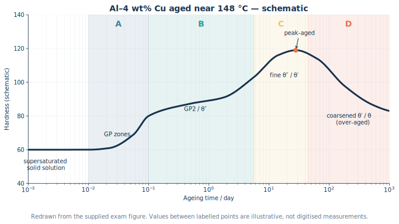{#fig-alcu-age-annotated fig-alt="問題用の時効曲線に、AはGPゾーン、BはGP2またはシータ二重プライム、Cは微細なシータ二重プライムまたはシータプライム、Dは粗大化したシータプライムまたは平衡シータと注記した図。" width="100%"}

**A段階**では、焼入れで凍結された空孔の助けを借りてCu原子が急速に集合し、Al母相の $\{100\}$ 面上へ微細なGPゾーンを作る。母相と整合で、周囲に整合ひずみ場を持つ。転位はまだ粒子を切断できるが、整合ひずみ、弾性率差、化学的相互作用を越える仕事が必要になる。

**B段階**では、GPゾーンが高密度化・成長し、GP(II)/$\theta''$ などの板状準安定析出物へ発達する。切断時には、新しい界面や逆位相を作るエネルギー、整合ひずみ場を横切る仕事が増える。Aより硬さの増加は緩やかでも、障害強度は上がり続ける。

**C段階**はピーク時効付近である。設問がOrowan機構を指定しているため、答案では「難切断となった微細析出物が高密度に分散し、転位が粒子間で張り出してループを残す」と書く。粒子表面間隔 $\lambda$ が小さいほど

$$
\tau_\mathrm{Or}\propto\frac{1}{\lambda}
$$

が大きい。実際のピーク近傍では、$\theta''$ の切断と $\theta'$ の迂回が混在し得る。

**D段階**は**過時効**である。界面エネルギーを減らすため、小粒子が溶けて大粒子が成長するOstwald成長が進む。体積率が同程度でも粒子数密度が下がり、平均粒子間隔が広がるのでOrowan応力が低下する。さらに半整合 $\theta'$ から粗大な平衡 $\theta$ への変化も進む。
:::

::: {.callout-tip collapse="true"}
##### 解答B2

Aでは微細で整合なGPゾーンが形成し、BではGP(II)/$\theta''$ などの板状準安定析出物へ発達する。転位はこれらを切断するが、整合ひずみ、化学的相互作用、切断で増える界面・規則化エネルギーが抵抗となる。

Cでは微細で高密度な難切断析出物の間を転位が張り出し、Orowanループを残して通過する。粒子間隔が小さいため

$$
\tau_\mathrm{Or}\simeq\frac{Gb}{\lambda}
$$

が大きく、硬さが最大となる。

Dは過時効域である。析出物が粗大化して数密度が減り、粒子間隔 $\lambda$ が広がるためOrowan応力が低下し、軟化する。
:::

### 微細分散を作る温度と、複合材料との違い

#### 問題B3 最適時効温度と材料設計思想

1. 過飽和固溶体から、微細・高密度・均一な第二相分散を得る時効温度を、核生成頻度と成長速度の競合から定性的に説明せよ。
2. 析出硬化型Al合金と、一般的な複合材料の設計思想の根本的な違いを述べよ。

::: {.callout-note collapse="true"}
##### 理論B3：核生成の駆動力と原子の移動度は逆方向に変わる

析出には、少なくとも二つの条件が要る。

- 過飽和固溶体と析出相の自由エネルギー差が大きく、核生成する熱力学的駆動力があること。
- 原子が核まで移動し、核を成長させる拡散速度があること。

低温では過飽和度が大きくても拡散が遅い。高温では拡散と成長は速いが、過飽和度が小さく、少数の核が急速に成長・粗大化しやすい。したがって実用上は、十分な核生成数と実用的な成長速度を両立する**中間温度域**を選ぶ。

「低温ほど核生成頻度が必ず高い」とは限らない。核生成率には、核生成障壁だけでなく原子移動度も掛かるためである。

一般的な複合材料では、繊維・粒子・母材を別々に用意し、外部から混合・積層・含浸して配置する。析出硬化材では、いったん均一な単相過飽和固溶体を作り、固相内の拡散と相変態で第二相を**内部生成**する。析出物の組成、体積率、整合性、形状は相平衡と熱処理履歴に制約される。

析出硬化材も広い意味ではナノ複合組織である。「二相なら複合材料、二相でなければ析出材」という区別ではない。
:::

::: {.callout-tip collapse="true"}
##### 解答B3

低温では核生成の駆動力は大きいが拡散が遅く、高温では拡散・成長は速いが過飽和度が小さく、少数粒子の粗大化が進みやすい。したがって、十分な核生成頻度と成長速度を両立し、微細・高密度分散を得られる中間の時効温度を選ぶ。

一般的な複合材料は別に作った母材と強化材を外部から組み合わせる。一方、析出硬化材は均一な過飽和固溶体から拡散・相変態によって第二相を内部生成し、その分散状態を熱処理で制御する。
:::

## 第3部 Cuへの微量添加と局所組織

### 状態図は「原子が最終的にどこへ行くか」を示す

#### 問題C1 Cu--NiとCu--Feの磁性

@fig-cu-binary を参照し、次の問いに答えよ。

1. NiとFeはともに単体では強磁性元素である。微量Niを添加したCu合金が常磁性的である一方、適切に熱処理した微量Fe添加Cu合金が強磁性的応答を示し得る理由を、ミクロ組織と交換相互作用から説明せよ。
2. 予想するミクロ組織を模式的に描け。

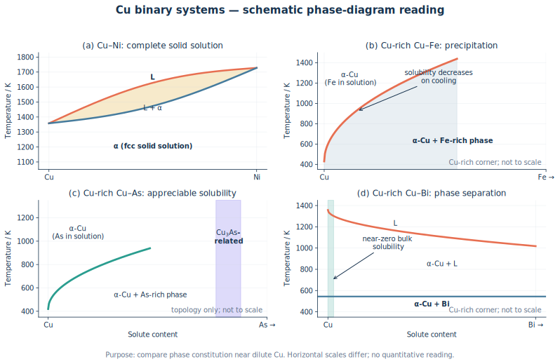{#fig-cu-binary fig-alt="二行二列の図。Cu-Niは全率固溶型の液相線と固相線、Cu-Feは冷却でCu中Fe固溶度が低下するCu側拡大、Cu-Asは有限のCu側固溶域とCu3As関連相、Cu-Biはほぼ固溶しない共晶型のCu側拡大を示す。各横軸尺度は異なり定量読取り不可。" width="100%"}

::: {.callout-note collapse="true"}
##### 理論C1：磁性元素が「いる」だけでは強磁性にならない

強磁性には、磁気モーメントを持つ原子が存在するだけでなく、そのモーメントが交換相互作用によって長距離に整列できる空間的なつながりが必要である。

Cu--Niは古典的には広い組成範囲でfcc固溶体を作る。微量NiはCu格子の置換位置へ原子的に分散し、Ni原子同士の距離が大きい。磁気モーメントが局所的にあっても、Ni--Ni交換相互作用が試料全体へ連結しないため、巨視的な自発磁化を持たず常磁性的となる。

Cu--Feでは、高温で固溶したFeの固溶限が冷却時に急減する。十分な拡散時間があればFe富化クラスタ・析出物が生成し、最終的にbcc $\alpha$-Feに近い粒子ができる。粒子内ではFe原子が隣接し、交換相互作用が働くため強磁性的応答を示し得る。

ただし、極小粒子は熱揺らぎで磁化方向が反転する超常磁性を示し得る。したがって「Feを入れれば直ちに必ず強磁性」ではなく、**析出状態・粒径・温度に依存する**。

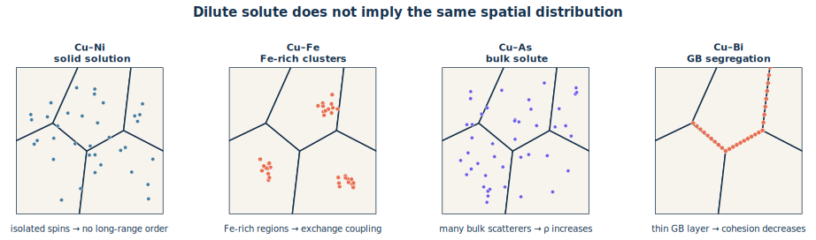{#fig-cu-microstructures fig-alt="四つの多結晶模式図。Cu-Niは青い溶質点が粒内へ孤立分散、Cu-Feは赤い点が粒内にクラスタ化、Cu-Asは紫の点が粒内全体へ分散、Cu-Biは赤い点が粒界に沿って並ぶ。" width="100%"}

Cu--Niには低温での相分離を予測する現代的評価もあるが、拡散が非常に遅く、今回の試験図が意図する希薄合金の比較では「Niは固溶、Feは析出」という古典的読みを用いる。
:::

::: {.callout-tip collapse="true"}
##### 解答C1

微量NiはCuのfcc格子へ置換固溶し、Ni原子が互いに孤立する。Ni--Ni交換相互作用が長距離に連結しないため、自発磁化を持たず常磁性的となる。

一方、Feは低温でCuへの固溶度が小さいため、熱処理によりFe富化析出物を作る。析出物内でFe原子が隣接し、bcc $\alpha$-Feに近い強磁性秩序を形成できるため、合金全体も強磁性的応答を示し得る。
:::

#### 問題C2 Cu--AsとCu--Biの抵抗・脆化

Cuへ微量Asを添加すると電気抵抗が大きく増えるが、著しい粒界脆化は生じにくい。一方、微量Biを添加すると電気抵抗の増加は比較的小さいのに、著しく脆くなる。Cu母相の平均粒径 $d$ は電子の平均自由行程 $\ell_e$ より十分大きいとする。

1. AsとBiの空間分布を模式的に示せ。
2. 電気抵抗と粒界凝集力への影響が逆になる理由を説明せよ。

::: {.callout-note collapse="true"}
##### 理論C2：総量より「電子とき裂の通り道のどこにいるか」

AsはCu-rich fcc相へ比較的固溶しやすい。粒内へ置換固溶したAs原子は、Cuとの原子寸法・原子ポテンシャル・価電子状態の差により伝導電子を散乱する。Matthiessen則の考え方では、

$$
\rho
\simeq
\rho_\mathrm{phonon}
+\Delta\rho_\mathrm{solute}
+\Delta\rho_\mathrm{GB}
+\cdots
$$

であり、粒内全体へ存在するAsは $\Delta\rho_\mathrm{solute}$ を大きくする。

BiはCuへの平衡固溶度が極めて小さく、粒界へ偏析するかBi-rich第二相となる。大きなBi原子は粒界構造を押し広げ、粒界凝集力を低下させる。き裂はBiで弱化した粒界を連続的に進めるため、微量でも粒界破壊が支配的になる。

Biも電子を散乱しないわけではない。しかし、

$$
d\gg\ell_e
$$

なら、電子は一つの粒内で多数回散乱してから粒界へ達する。Biが存在する領域の体積分率は小さく、粒内へ広く分散したAsより体積抵抗への寄与が小さい。設問の粒径条件は、この幾何学的な違いを使わせるためにある。
:::

::: {.callout-tip collapse="true"}
##### 解答C2

Asは主としてCu粒内へ置換固溶し、粒内全体で伝導電子の散乱中心となるため抵抗率を大きく増加させる。一方、粒界へ連続偏析しにくいため、Biほど粒界を脆化させない。

BiはCuへほとんど固溶せず粒界へ偏析または第二相化し、粒界構造を乱して凝集力を下げるため、微量でも粒界破壊を生じる。$d\gg\ell_e$ では電子が粒界へ達する頻度は粒内散乱より小さいため、粒界Biによる体積抵抗の増加は粒内Asより小さい。
:::

## 第4部 規則合金とNi基超合金

### 規則構造では「同じ場所まで戻る並進」が長くなる

#### 問題D1 $L1_2$構造、規則格子転位、APB

通常のfcc結晶の完全転位は $\boldsymbol{b}=a/2\langle110\rangle$ である。Ni$_3$Al型の$L1_2$規則構造について、次の空欄を埋め、APBを説明せよ。

$$
\boxed{\text{①}}
=
\frac{a}{2}[1\bar10]
+\mathrm{APB}
+\boxed{\text{③}}
$$

①は規則格子転位のバーガース・ベクトル、左辺全体を②とみなす。

::: {.callout-note collapse="true"}
##### 理論D1：格子点の一致と「原子種まで含む一致」を区別する

fccの幾何学だけなら $a/2\langle110\rangle$ の並進で等価な格子点へ移る。しかし$L1_2$構造では、立方体頂点をAl、面心をNiのように異なる原子が規則的に占める。$a/2\langle110\rangle$だけずらすと格子点は重なるが、NiサイトとAlサイトの対応は元に戻らず、規則性が反転した面が残る。

この面欠陥を**逆位相境界**（antiphase boundary; APB）という。規則性を完全に回復する最小の並進は二倍の

$$
\boldsymbol{b}=a\langle110\rangle
$$

であり、規則格子転位（超格子転位）は二本の $a/2\langle110\rangle$ 転位と、その間のAPBへ分解して存在できる。

$$
a[1\bar10]
=
\frac{a}{2}[1\bar10]
+\mathrm{APB}
+\frac{a}{2}[1\bar10]
$$

先行転位が規則配列を乱してAPBを作り、後続転位が通過すると規則配列が回復する。二本を離すほどAPB面積が増えるため、APBエネルギーが二本を束縛する。

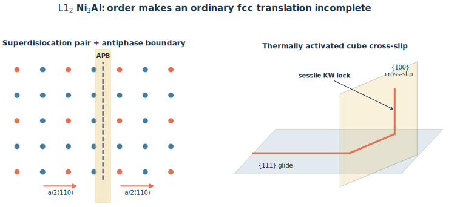{#fig-l12-apb fig-alt="左は二種類の原子が規則配列した格子と、配列の位相がずれた逆位相境界。右は111面上の規則格子転位が100面へ交差すべりし、非すべり面上に固定されるKear-Wilsdorfロックの模式図。" width="100%"}
:::

::: {.callout-tip collapse="true"}
##### 解答D1

- ①：$a\langle110\rangle$
- ②：$a[1\bar10]$（等価な$a\langle110\rangle$を選んでもよい）
- ③：$a/2[1\bar10]$

APBは、規則合金中で原子配列の位相がずれ、正しい異種原子間結合の一部が同種原子間結合へ置き換わった面欠陥である。規則格子転位は二本の $a/2\langle110\rangle$ 転位へ分解し、その間にAPBを挟む。APBエネルギーが転位間の束縛力を与える。
:::

#### 問題D2 Kear--Wilsdorf機構と逆温度依存性

$L1_2$型Ni$_3$Alでは、ある温度範囲で温度上昇とともに降伏強度が増加する。この逆温度依存性を「規則格子転位」「転位の拡張」「APB」「交差すべり」をすべて用いて説明せよ。

::: {.callout-note collapse="true"}
##### 理論D2：熱活性化された交差すべりが、転位を動きにくくする

Ni$_3$Alの主すべり面はfccと同じ$\{111\}$である。ところがAPBエネルギーには面方位依存性があり、$\{100\}$面上のAPBは$\{111\}$面上より低エネルギーになり得る。温度が上がると、ねじ成分を持つ規則格子転位が熱活性化により$\{111\}$から$\{100\}$へ**交差すべり**する確率が増える。

交差すべりした区間では、規則格子転位の転位芯または部分転位への**拡張**状態が変化し、低エネルギーな$\{100\}$面上のAPBを伴う形へ移る。しかし$\{100\}$はこの転位にとって容易すべり面ではない。その区間はKear--Wilsdorfロックとなり、残りの$\{111\}$面上の転位運動をピン止めする。

したがって、温度上昇

$$
\longrightarrow
\text{交差すべりの増加}
\longrightarrow
\text{ロック密度の増加}
\longrightarrow
\text{転位移動に必要な応力の増加}
$$

となり、通常の熱軟化に逆らって強度が上がる。さらに高温では拡散・上昇運動やロック解除が優勢となるため、強度は再び低下する。逆温度依存性は無限に続くわけではない。
:::

::: {.callout-tip collapse="true"}
##### 解答D2

$\{111\}$面上でAPBを挟んで拡張した規則格子転位のねじ成分は、昇温により$\{100\}$面へ交差すべりしやすくなる。$\{100\}$面ではAPBエネルギーを下げられる一方、その面は容易すべり面ではないため、交差すべり区間がKear--Wilsdorfロックとなる。温度上昇に伴ってこのロックが増え、規則格子転位の移動抵抗が増すため、一定温度域で降伏強度が上昇する。
:::

#### 問題D3 Ni基超合金のミクロ組織とB添加

1. Ni基超合金の高温強度を支えるミクロ組織を説明せよ。
2. Ni$_3$Al多結晶へ微量Bを添加すると室温延性が改善する理由について、提案されている機構を述べよ。

::: {.callout-note collapse="true"}
##### 理論D3：$\gamma/\gamma'$の整合組織と粒界設計

Ni基超合金の基本は、fcc Ni固溶体の$\gamma$母相中へ、$L1_2$型Ni$_3$(Al,Ti,Ta)の$\gamma'$相を高体積率で整合析出させた二相組織である。

- **$\gamma$母相**：Co、Cr、Mo、W、Reなどによる固溶強化と耐酸化・耐食性を担う。
- **$\gamma'$析出物**：規則構造、APB、Kear--Wilsdorf機構により高温でも転位が通過しにくい。
- **整合界面**：$\gamma$と$\gamma'$の格子定数が近く、界面エネルギーが低いので、微細析出物を高密度に保ちやすい。格子ミスフィット応力も転位運動を妨げる。
- **高温組織安定性**：高い$\gamma'$固溶温度、遅い拡散元素、単結晶化または一方向凝固により、粗大化・クリープ・粒界破壊を抑える。

B添加によるNi$_3$Al多結晶の延性改善には、粒界偏析したBが粒界凝集力を高めるというモデル、粒界での転位放出・すべり伝達を容易にするというモデル、環境脆化に関わるOやHの作用を抑えるというモデルなどが提案されている。組成・粒界性格・試験環境に依存し、単一機構だけで全条件を説明するのは難しい。
:::

::: {.callout-tip collapse="true"}
##### 解答D3

Ni基超合金は、fcc $\gamma$母相中に整合な$L1_2$型$\gamma'$析出物を高体積率・微細に分散させた組織を持つ。固溶強化、整合ひずみ、APBを伴う規則相の切断抵抗、Kear--Wilsdorfロックが転位運動を妨げ、高温強度とクリープ抵抗を与える。

Bは粒界へ偏析し、粒界凝集力の増加、粒界からの転位放出・すべり伝達の改善、環境脆化の抑制などを通じて粒界破壊を抑えると考えられる。ただし機構には複数の提案があり、条件依存性を明記する。
:::

## 第5部 Mg合金・金属間化合物・階層性

### 「すべり系の数」だけでなく、室温で動けるかを見る

#### 問題E1 AlとMgの塑性変形

Al多結晶が変形しやすい一方、Mg多結晶が室温で変形しにくい理由を、結晶構造、すべり系、CRSSから説明せよ。

::: {.callout-note collapse="true"}
##### 理論E1：独立すべり系とvon Mises条件

多結晶粒が任意形状変化へ追随するには、一般に五つの独立なすべり系が必要である。

Alはfccで、主すべり系は

$$
\{111\}\langle110\rangle
$$

である。四つの$\{111\}$面と各面三方向から形式上12すべり系を持ち、室温でのCRSSも比較的小さい。各結晶粒が方位に応じて多重すべりしやすい。

Mgはhcpで、室温では底面すべり

$$
\{0001\}\langle11\bar20\rangle
$$

のCRSSが最も小さい。しかし独立な変形自由度が不足する。柱面・錐面の非底面すべり、とくに$c+a$転位は室温でCRSSが高く、容易には作動しない。その不足を双晶が補うが、双晶は極性を持ち、変形方向の制約も大きい。
:::

::: {.callout-tip collapse="true"}
##### 解答E1

Alはfccの$\{111\}\langle110\rangle$すべり系を12個持ち、複数の独立すべり系のCRSSが低いため、多結晶でも粒界の変位適合を保ちながら変形できる。Mgはhcpで、室温では底面$\langle a\rangle$すべりだけが著しく容易であり、独立すべり系が不足する。非底面すべりのCRSSは高いため、室温多結晶Mgは変形しにくい。
:::

#### 問題E2 Mgのすべり・双晶と引張圧縮非対称性

Mg合金のすべり変形と双晶変形をCRSSの観点から整理し、引張りと圧縮で変形挙動が異なる理由を説明せよ。

::: {.callout-note collapse="true"}
##### 理論E2：Schmid因子と変形モードの極性

ある変形モードが作動する条件は、

$$
\tau_\mathrm{RSS}=m\sigma\ge\tau_\mathrm{CRSS}
$$

で表せる。$m$はSchmid因子、$\tau_\mathrm{CRSS}$はそのすべり系または双晶系の臨界分解せん断応力である。

底面$\langle a\rangle$すべりは低CRSSだが$c$軸方向ひずみを十分に担えない。そこで$\{10\bar12\}$引張双晶などが結晶方位を大きく回転させ、以後の底面すべりに有利な方位を作る。双晶は単純なせん断方向を反転しても同じようには作動しない**極性**を持つ。圧延材のように強い底面集合組織があると、引張りと圧縮で、双晶に働く分解せん断応力の向きと大きさが変わる。

その結果、片方では低応力で双晶が大量に発生し、もう片方では非底面すべりなど高CRSSのモードが必要になり、降伏応力、加工硬化、伸びが非対称になる。
:::

::: {.callout-tip collapse="true"}
##### 解答E2

Mgでは底面すべりのCRSSが最小で、非底面すべりのCRSSは大きい。底面すべりだけで不足する$c$軸方向の変形を双晶が補い、双晶による結晶回転後には新たなすべりが作動する。双晶には作動方向の極性があり、集合組織を持つ材料では引張りと圧縮でSchmid因子および作動する双晶系が異なる。このため降伏応力と加工硬化に引張圧縮非対称性が生じる。
:::

#### 問題E3 Mgをfccにできるか

Mgが常温常圧でhcpを選ぶ理由を考察し、fcc構造を安定化する方策を述べよ。

::: {.callout-note collapse="true"}
##### 理論E3：最密充填だけでは結晶構造を一意に決められない

hcpとfccはどちらも配位数12、充填率0.74の最密充填構造であり、違いは積層順序がhcpのABAB、fccのABCABCとなる点にある。したがって、単純な「原子が球だから」という幾何学だけではMgがhcpを選ぶ理由にならない。電子構造、バンドエネルギー、格子振動、温度・圧力・組成を含むGibbs自由エネルギーのわずかな差で安定相が決まる。

fcc Mgを得る方策としては、fccを安定化する元素との合金化、fcc基板上へのエピタキシャル薄膜成長、ナノ粒子・多層膜による界面エネルギーの利用、高圧などが考えられる。ただし得られたfcc相がバルク常温常圧で平衡相とは限らず、準安定相として保持される場合が多い。
:::

::: {.callout-tip collapse="true"}
##### 解答E3

hcpとfccはいずれも最密充填であり、安定性の差は積層順序に伴う電子・振動・界面などの自由エネルギー差で決まる。Mgは常温常圧ではhcpの自由エネルギーが低い。fcc安定化元素との合金化、fcc基板上のエピタキシャル拘束、ナノサイズ化・多層化、高圧などでfcc Mgを準安定化できる可能性がある。
:::

#### 問題E4 Laves相と水素貯蔵

Laves相の結晶構造上の特徴と、Laves相合金を水素貯蔵へ使う利点を説明せよ。

::: {.callout-note collapse="true"}
##### 理論E4：稠密な金属格子の隙間へ水素を可逆に収容する

Laves相は概ね$AB_2$組成を持つ金属間化合物群で、代表構造は六方晶C14、立方晶C15、六方晶C36である。大きいA原子と小さいB原子が高配位の稠密構造を作り、理想的な硬球半径比は

$$
\frac{r_A}{r_B}\simeq\sqrt{\frac32}\simeq1.225
$$

である。ただし実在相は化学結合と電子構造の影響も大きく、この値は幾何学的目安にすぎない。

水素は金属格子の四面体・八面体型の侵入位置へ入り、金属水素化物を形成する。温度と水素圧を変えれば吸蔵・放出を可逆に制御できる。気体を高圧だけで保持する方式に比べ、比較的低圧で体積密度の高い貯蔵が可能で、漏洩時にも水素が直ちに全量気体化しにくい利点がある。一方、重量密度、反応熱、粉化、活性化、劣化、希少元素コストは設計課題である。
:::

::: {.callout-tip collapse="true"}
##### 解答E4

Laves相は主に$AB_2$組成で、C14・C15・C36型の稠密な構造を持ち、大小原子の半径比は理想的には約1.225である。水素は結晶中の侵入型空隙へ入り金属水素化物を作る。温度・圧力で可逆に吸放出でき、高圧ガスより低圧で高い体積貯蔵密度と安全性を得やすい。ただし重量、熱管理、反応速度、粉化、材料コストを考慮する必要がある。
:::

#### 問題E5 短論述：階層構造と発見

次の問いから二つを選び、物質科学の言葉を使って論じよ。

1. ヘモグロビン中のFe原子の役割
2. 生体分子に5回回転対称性が現れやすい理由
3. “More is different”の意味
4. セレンディピティが研究姿勢へ与える示唆

::: {.callout-note collapse="true"}
##### 理論E5：短論述も「主張→機構→限界」で書く

**ヘモグロビン**では、ヘムのポルフィリン環に配位したFe$^{2+}$がO$_2$を可逆結合する。O$_2$結合に伴うFe位置の変化がタンパク質全体の構造変化へ伝わり、サブユニット間協同性を生む。Fe原子単独ではなく、配位子場とタンパク質階層構造が機能を作る。

**5回対称性**は、無限周期結晶を並進充填できないため通常のブラベー格子には許されない。しかし有限サイズのタンパク質複合体やウイルス殻では並進周期性が不要であり、五量体や正二十面体対称性は同一部品で閉殻を効率よく構成できる。なお生体系すべてに5回対称性が多い、と一般化しすぎない。

**“More is different”**は、構成要素の基本法則を知っても、多数要素の協同現象、対称性の破れ、相転移、創発則をそのまま置き換えられないという主張である。上位階層は下位法則に反しないが、独自の概念と有効理論を必要とする。

**セレンディピティ**は単なる幸運ではない。異常データを捨てず、仮説と測定系の両方を疑い、隣接分野の知識を持ち、再現実験で偶然を検証可能な発見へ変える姿勢である。
:::

::: {.callout-tip collapse="true"}
##### 解答E5

- ヘモグロビンのFe$^{2+}$はO$_2$を可逆配位し、その局所構造変化をタンパク質全体へ伝えて協同的酸素結合を可能にする。
- 5回対称性は周期空間を埋められないが、有限の生体集合体ではその制約がなく、同一サブユニットから閉じた殻を効率よく作れる。
- “More is different”とは、多数要素から創発する秩序には、構成要素の法則だけでは実用上完結しない上位階層の概念が必要だという意味である。
- セレンディピティを成果へ変えるには、異常を観察する準備、既成仮説への批判性、追試と再現性が必要である。
:::

## 第6部 材料選択と非鉄金属

### 強さだけでなく、質量・たわみ・温度・環境から選ぶ

#### 問題F1 密度とヤング率

Fe、Al、Mg、Ti、Niの室温における密度とヤング率を、単位付きで示せ。また軽量構造でヤング率を比較するときの注意を述べよ。

::: {.callout-note collapse="true"}
##### 理論F1：まず桁を覚え、合金・方位・温度による幅を認める

代表的な純金属の概略値を @tbl-density-young に示す。試験では最後の一桁より、単位と相対関係を外さないことが重要である。

| 金属 | 密度 $\rho$ / $\mathrm{Mg\,m^{-3}}$（$=\mathrm{g\,cm^{-3}}$） | ヤング率 $E$ / $\mathrm{GPa}$ |
|---|---:|---:|
| Mg | 1.74 | 45 |
| Al | 2.70 | 69 |
| Ti | 4.51 | 116 |
| Fe | 7.87 | 210 |
| Ni | 8.90 | 200 |

: 代表的な純金属の室温物性の概略値。多結晶平均を想定し、合金組成・集合組織・測定条件で変動する。 {#tbl-density-young}

引張部材の質量当たり剛性を粗く比較するなら比ヤング率 $E/\rho$ が一つの指標になる。ただし、曲げ剛性は $EI$ で断面二次モーメント$I$に強く依存し、座屈、接合、腐食、価格、製造性まで含めなければ材料選択は完結しない。
:::

::: {.callout-tip collapse="true"}
##### 解答F1

概略値はFe：$7.87\ \mathrm{Mg\,m^{-3}}$, $210\ \mathrm{GPa}$、Al：$2.70$, $69$、Mg：$1.74$, $45$、Ti：$4.51$, $116$、Ni：$8.90$, $200$である。軽量化では$E$単独でなく$E/\rho$や断面形状を含む部材剛性を比較する。
:::

#### 問題F2 ベース・レア・プレシャスメタル

ベースメタル、レアメタル、プレシャスメタルについて、それぞれ代表元素と用途を挙げよ。

::: {.callout-note collapse="true"}
##### 理論F2：分類軸は完全には一意でない

| 分類 | おおまかな意味 | 代表例 | 主な用途例 |
|---|---|---|---|
| ベースメタル | 生産量が大きく産業基盤となる普通金属 | Fe、Al、Cu、Zn、Pb | 鉄鋼構造物、輸送機、電線、めっき、蓄電池 |
| レアメタル | 地殻存在量だけでなく、採掘・精製・供給が限定され政策上重要な金属 | Li、Co、Ti、W、In、希土類 | 電池、耐熱合金、超硬工具、透明電極、磁石 |
| プレシャスメタル | 化学的安定性が高く希少で、単価の高い貴金属 | Au、Ag、Pt、Pd | 電子接点、宝飾、触媒、燃料電池 |

「レア」の定義は国・制度・時代で変わり、Tiのように地殻中には比較的多いが精錬困難性から政策上レアメタルに分類される例もある。答案では代表例を挙げた後、**希少性・供給制約・機能性**のどの意味で使ったかを一言添えるとよい。
:::

::: {.callout-tip collapse="true"}
##### 解答F2

- ベースメタル：Fe（構造用鋼）、Al（軽量輸送機）、Cu（電線）。
- レアメタル：Li（二次電池）、Co（正極・耐熱合金）、W（超硬工具）。
- プレシャスメタル：Au（耐食電子接点）、Ag（導電材料）、Pt（触媒）。

分類には政策的・経済的な揺れがあるため、元素名だけでなく用途まで示す。
:::

#### 問題F3 Co、Zr、Sn合金

Co合金、Zr合金、Sn合金について、代表用途とその用途に適する理由を述べよ。

::: {.callout-note collapse="true"}
##### 理論F3：性質から用途へ一方向の因果で結ぶ

- **Co基合金**：高温での強度、耐酸化性、耐摩耗性、耐食性に優れるため、ガスタービン高温部材、耐摩耗盛金、人工関節などに使われる。Co--Cr系は不働態皮膜による耐食性も高い。
- **Zr合金**：熱中性子吸収断面積が小さく、水・蒸気中の耐食性が良いため、原子炉の燃料被覆管に用いられる。H吸収による水素化物脆化や高温酸化には注意が必要である。
- **Sn合金**：低融点、濡れ性、適度な導電性を活かし、Sn--Ag--Cuなどの鉛フリーはんだに使われる。Sn基軸受合金では軟らかい母相と硬質相の組合せがなじみ性・耐焼付き性を与える。
:::

::: {.callout-tip collapse="true"}
##### 解答F3

Co合金は高温強度・耐摩耗・耐食性からタービン部材や人工関節、Zr合金は低い中性子吸収と耐食性から原子炉燃料被覆管、Sn合金は低融点と良好な濡れ性からはんだに用いられる。各用途で必要な性質と材料特性を対応させて書く。
:::

## 第7部 鉄鋼の相変態と熱処理

### 時間―温度履歴を、組織の順番へ翻訳する

#### 問題G1 Fe--0.15 mass%C鋼のCCT図

@fig-cct-question は、オーステナイト化したFe--0.15 mass%C鋼を連続冷却したときの模式的CCT図である。

1. ①〜⑤の組織名を答えよ。
2. 冷却曲線A、Bに沿う組織変化を説明せよ。
3. 約5 mass% Niを添加した場合、およびオーステナイト化温度を1300 ℃へ高めた場合の変化を説明せよ。

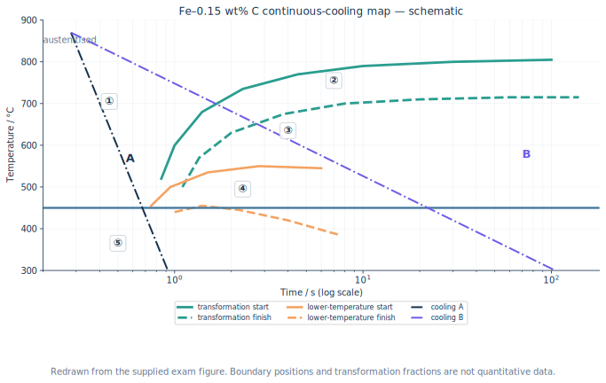{#fig-cct-question fig-alt="縦軸温度、横軸対数時間。フェライト、パーライト、ベイナイトの開始・終了を表すC曲線は無記名で、領域に①から⑤、急冷側にA、緩冷側にBの冷却曲線がある。" width="100%"}

::: {.callout-note collapse="true"}
##### 理論G1：冷却曲線が境界を横切る順に読む

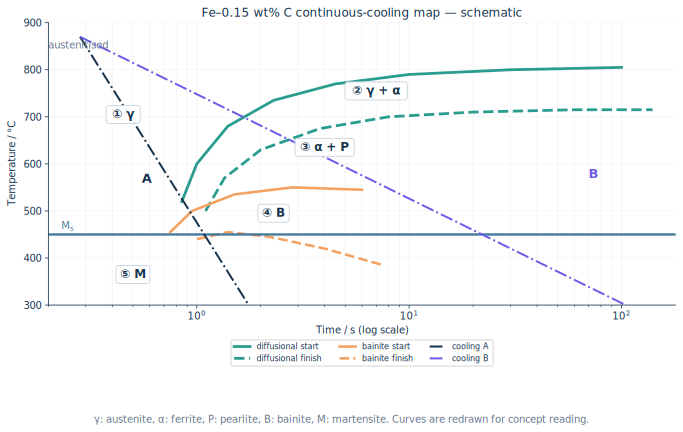{#fig-cct-answer fig-alt="CCT問題図にオーステナイト、フェライト、パーライト、ベイナイト、マルテンサイトの名称、Ms線、Aではガンマからマルテンサイト、Bではガンマからフェライトとガンマを経てフェライトとパーライトになる経路を加えた解答図。" width="100%"}

0.15 mass%Cは亜共析鋼なので、遅い冷却ではまず初析フェライト$\alpha$が生成し、残った$\gamma$へCが濃化する。その後、残留$\gamma$がパーライトPへ変態し、最終組織は$\alpha+\mathrm{P}$となる。より低温で拡散変態すればベイナイトB、拡散変態を回避して$M_\mathrm{s}$以下へ達すればマルテンサイトMとなる。

図の番号は領域を表し、

$$
\text{① }\gamma,\qquad
\text{② }\alpha\;(\text{変態途中は }\alpha+\gamma),\qquad
\text{③ P}\;(\text{最終的には }\alpha+\mathrm{P}),\qquad
\text{④ B},\qquad
\text{⑤ M}
$$

と読む。

**冷却A**は拡散変態の開始曲線を避けて$M_\mathrm{s}$以下へ達するため、$\gamma\rightarrow\mathrm{M}$となる。**冷却B**はフェライト開始・終了域とパーライト域を横切り、$\gamma\rightarrow\alpha+\gamma\rightarrow\alpha+\mathrm{P}$となる。

Niはオーステナイト安定化元素で、フェライト・パーライト・ベイナイト変態を遅らせる。したがってC曲線は概ね**長時間側（右）かつ低温側**へ移り、焼入れ性が増す。$M_\mathrm{s}$も低下する。5 mass%という値から境界温度を精密計算する問題ではなく、方向を描ければよい。

1300 ℃から冷却すると、通常は高温保持により旧$\gamma$粒が粗大化し、粒界核生成サイト密度が減る。そのため初析フェライト・パーライト開始は遅れ、C曲線は主に右へ移る。一方、同一組成なら$M_\mathrm{s}$は主としてC・合金元素量で決まり、粒径だけでは大きく動かない。ただし保持時間、溶解析出物、実粒径が未指定なので定量位置は一意でない。
:::

::: {.callout-tip collapse="true"}
##### 解答G1

①$\gamma$、②$\alpha$、③P、④B、⑤M。Aでは拡散変態を回避して$\gamma\rightarrow\mathrm{M}$、Bでは$\gamma\rightarrow\alpha+\gamma\rightarrow\alpha+\mathrm{P}$となる。

約5 mass% Ni添加では拡散変態曲線が右・低温側へ移り、$M_\mathrm{s}$も低下する。1300 ℃オーステナイト化では旧$\gamma$粒粗大化により粒界核生成が減り、主にフェライト・パーライト開始が長時間側へ移るが、同じ組成なら$M_\mathrm{s}$は概ね不変である。
:::

#### 問題G2 焼なまし・焼ならし・焼入れ・焼戻し

四つの熱処理について温度―時間線図を描き、経路、組織、目的を説明せよ。

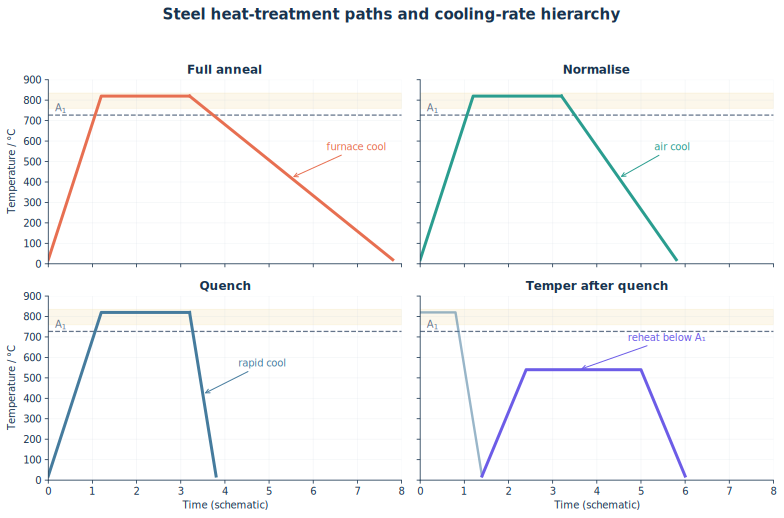{#fig-steel-heat-treatments fig-alt="Ac1とAc3、Msを横線で示し、オーステナイト化後に炉冷する焼なまし、空冷する焼ならし、急冷する焼入れ、および焼入れ後Ac1未満へ再加熱して冷却する焼戻しの四経路。" width="100%"}

::: {.callout-note collapse="true"}
##### 理論G2：冷却速度と再加熱温度が組織を決める

- **完全焼なまし**：亜共析鋼なら$A_\mathrm{c3}$以上で$\gamma$化し、炉中でゆっくり冷却する。粗い$\alpha+\mathrm{P}$を得て、軟化、内部応力除去、被削性改善、組織均質化を図る。
- **焼ならし**：$A_\mathrm{c3}$以上で$\gamma$化後、空冷する。焼なましより冷却が速いため、細かい$\alpha+\mathrm{P}$となり、結晶粒微細化と組織・機械特性の均一化を図る。
- **焼入れ**：$\gamma$化後、臨界冷却速度以上で急冷して拡散変態を回避し、$M_\mathrm{s}$以下でマルテンサイトを得る。高硬度・高強度となるが、残留応力と脆さが大きい。
- **焼戻し**：焼入れ材を$A_\mathrm{c1}$未満へ再加熱し保持する。過飽和Cの放出、炭化物析出、転位回復、残留$\gamma$の分解を進め、硬さを調整しながら靭性と寸法安定性を回復する。

「焼なまし」と「焼ならし」の差は冷却媒体名だけでなく、その結果としての変態温度、核生成数、パーライト間隔、粒径までつなげる。
:::

::: {.callout-tip collapse="true"}
##### 解答G2

焼なましは$\gamma$化後に炉冷し、粗い$\alpha+\mathrm{P}$として軟化・応力除去する。焼ならしは$\gamma$化後に空冷し、より微細な$\alpha+\mathrm{P}$として組織を均一・微細化する。焼入れは$\gamma$化後に急冷し、拡散変態を避けてマルテンサイト化する。焼戻しは焼入れ材を$A_\mathrm{c1}$未満で再加熱し、炭化物析出と回復によって強度と靭性を調整する。
:::

#### 問題G3 マルテンサイトの高強度

鋼のマルテンサイトが高強度となる組織上の理由と、その熱処理中に起きる現象を述べよ。

::: {.callout-note collapse="true"}
##### 理論G3：拡散させずにCを閉じ込める

オーステナイトを十分速く冷却すると、Cの長距離拡散より先に、原子が協調的にわずかに移動する無拡散・せん断型変態が起こる。fcc $\gamma$から体心正方晶（bct）に近いマルテンサイトへ変わり、Cは過飽和に侵入位置へ閉じ込められる。

高強度の主因は、Cによる大きな正方ひずみと固溶強化、高い転位密度、微細なラスまたはプレート、パケット・ブロック境界によるすべり距離の短縮である。高炭素鋼では双晶も寄与し得る。変態には体積変化と形状ひずみが伴うため、残留応力、反り、焼割れが生じやすい。

変態は温度依存であり、冷却時間だけで平衡的に進むわけではない。$M_\mathrm{s}$以下で生成が始まり、さらに低温へ下げるほど割合が増える。室温で未変態の$\gamma$は残留オーステナイトとなる。
:::

::: {.callout-tip collapse="true"}
##### 解答G3

$\gamma$化後に急冷し、フェライト・パーライト・ベイナイトの拡散変態を回避して$M_\mathrm{s}$以下へ冷やすと、無拡散せん断変態でマルテンサイトが生じる。Cが過飽和に閉じ込められたbct格子のひずみ、高転位密度、微細ラス・パケット境界が転位運動を妨げるため高強度となる。一方で残留応力と脆さが大きく、通常は焼戻して用いる。
:::

#### 問題G4 DP鋼の熱処理

初期組織が（a）フェライト＋パーライト、（b）マルテンサイト単相の場合について、DP鋼を得る熱処理と組織変化を説明せよ。

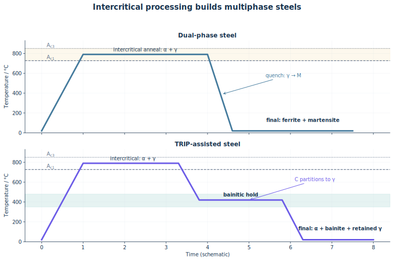{#fig-dp-trip fig-alt="左はAc1とAc3の二相域へ加熱してフェライトとオーステナイトを作り、急冷してフェライトとマルテンサイトのDP組織を得る経路。右は二相域からベイナイト域へ冷却保持し、炭素濃化した残留オーステナイトを含むTRIP組織を得る経路。" width="100%"}

::: {.callout-note collapse="true"}
##### 理論G4：二相域で作った$\gamma$だけをMにする

DP（dual phase）鋼は、軟らかいフェライト$\alpha$母相中に硬いマルテンサイトMを島状に分散させる。フェライトが低降伏応力と延性を、Mとその周囲の高転位密度が高い加工硬化・引張強さを担う。

初期組織が$\alpha+\mathrm{P}$なら、$A_\mathrm{c1}$と$A_\mathrm{c3}$の間へ加熱・保持する。パーライトが溶解し、一部フェライトが$\gamma$へ逆変態して$\alpha+\gamma$となる。そこから急冷すれば、$\alpha$は残り、Cの濃い$\gamma$だけがMへ変わって$\alpha+\mathrm{M}$を得る。

初期組織がMなら、二相域へ再加熱する過程でMが焼戻され、Cの分配と逆変態によって$\alpha+\gamma$となる。適切な保持後に急冷すれば、やはり$\alpha+\mathrm{M}$となる。最終相名が同じでも、初期組織は核生成位置、粒径、M島の連結性へ影響する。
:::

::: {.callout-tip collapse="true"}
##### 解答G4

$A_\mathrm{c1}<T<A_\mathrm{c3}$の二相域で$\alpha+\gamma$を作り、急冷して$\gamma$のみをMへ変態させる。初期$\alpha+\mathrm{P}$ではPの溶解と一部$\alpha$の逆変態、初期Mでは焼戻し・C再分配と一部の$\gamma$逆変態を経る。最終組織は軟質$\alpha$母相＋硬質M島である。
:::

#### 問題G5 TRIP鋼と残留オーステナイト

TRIP鋼で残留オーステナイトを得る熱処理と、残留オーステナイトが延性を高める機構を説明せよ。

::: {.callout-note collapse="true"}
##### 理論G5：Cを残留$\gamma$へ集め、変形中に使う

代表的な低合金TRIP鋼では、まず二相域焼なましで$\alpha+\gamma$を作る。次にベイナイト変態温度域へ急冷して保持すると、一部$\gamma$がベイニティックフェライトへ変態し、その際にCが未変態$\gamma$へ排出される。SiやAlを加えてセメンタイト析出を抑えると、Cが炭化物へ奪われず残留$\gamma$へ濃化し、室温まで安定化できる。

最終組織はフェライト、ベイナイト、残留$\gamma$を主体とし、条件によって少量Mを含む。塑性変形中、適度に準安定な残留$\gamma$がひずみ誘起マルテンサイトへ段階的に変態する。硬いMの生成と変態ひずみによって局所ひずみが分散し、加工硬化率が維持され、Considère条件に達するまでの一様伸びが増す。

残留$\gamma$が不安定すぎると変形初期に全てMとなり、安定すぎると最後まで変態せず、TRIP効果を十分に使えない。量だけでなく安定性の分布が重要である。
:::

::: {.callout-tip collapse="true"}
##### 解答G5

二相域焼なましで$\alpha+\gamma$を作り、ベイナイト域で保持する。ベイニティックフェライト生成時に排出されたCを未変態$\gamma$へ濃化し、Si・Alなどで炭化物生成を抑えて室温まで残留させる。変形中に残留$\gamma$がMへ段階的に変態して加工硬化を維持し、ひずみの局在とくびれを遅らせるため延性が向上する。
:::

#### 問題G6 TMCP

TMCPの目的、加工・冷却プロセス、組織変化を、通常の熱間圧延後放冷と比較して説明せよ。

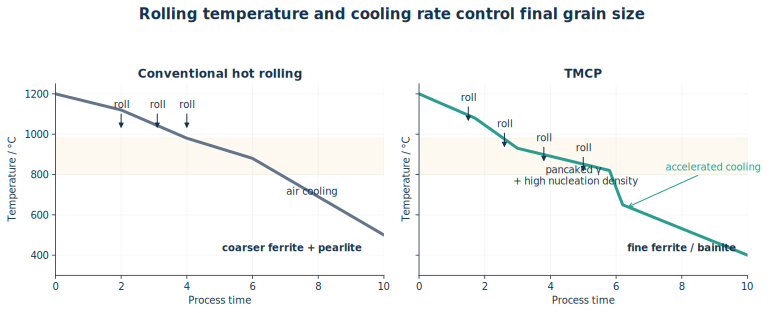{#fig-tmcp fig-alt="通常圧延では高温再結晶域で圧延後に放冷して比較的粗いフェライトになる。TMCPでは再結晶域と未再結晶域で制御圧延し、扁平なオーステナイトに変形帯を導入した後、加速冷却して微細フェライトやベイナイトを得る。" width="100%"}

::: {.callout-note collapse="true"}
##### 理論G6：加工で核生成サイトを作り、冷却で成長時間を奪う

TMCP（thermo-mechanical control process）は、熱間加工と相変態を独立に扱わず、温度・圧下率・パス間時間・冷却速度を組み合わせて最終組織を作る。

1. 高温再結晶域の圧延で粗大$\gamma$を繰り返し再結晶させ、細粒化する。
2. より低温の未再結晶域で圧延し、$\gamma$粒を扁平化して転位・変形帯を蓄積する。
3. 粒界と変形帯をフェライト核生成サイトとして利用し、加速冷却で成長時間を短くする。
4. 微細フェライト、ベイナイトなど目的組織を得る。

通常の高温圧延＋放冷では、圧延後に再結晶・粒成長しやすく、変態温度も高いため組織が粗くなりやすい。TMCPはHall--Petch強化により、C・合金元素を過度に増やさず高強度と靭性・溶接性を両立しやすい。Nb、Ti、Vの微量炭窒化物は再結晶と粒成長を抑え、析出強化にも寄与する。
:::

::: {.callout-tip collapse="true"}
##### 解答G6

TMCPは、再結晶域での圧延による$\gamma$細粒化、未再結晶域での制御圧延による扁平粒・変形帯形成、直後の加速冷却を組み合わせる。増えた核生成サイトから微細$\alpha$またはBを生成し、粒成長を抑える。通常圧延＋放冷より微細組織となるため、低合金量でも高強度・高靭性・良好な溶接性を両立できる。
:::
